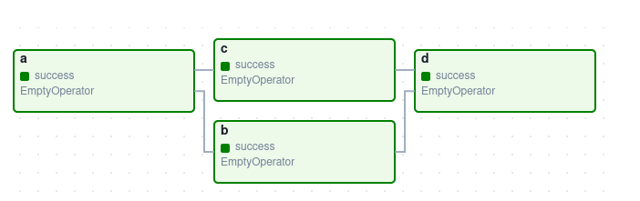
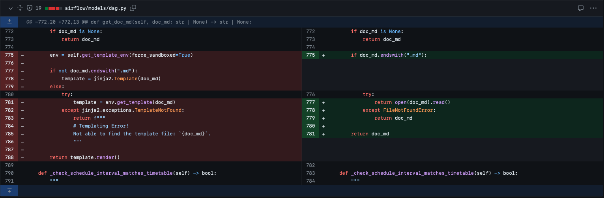

## URL

https://blog.securelayer7.net/arbitrary-code-execution-in-apache-airflow/

## Target

- Apache Airflow 2.4.0 ~ 2.9.2

## Explain

workflow 작성, 스케줄링 및 모니터링 플랫폼인 Apache Airflow에서 발견된 SSTI 취약점의 세부 정보가 공개되었습니다.

Apache Airflow는 관계성 및 의존성을 포함하는 작업 컬렉션을 DAG(Directed Acyclic Graph) 그래프로 구성합니다.



DAG는 기본적으로 python 스크립트에서 정의되며, 유저가 DAG를 설명하는 [markdown 문서](https://www.astronomer.io/docs/learn/custom-airflow-ui-docs-tutorial?tab=TaskFlowAPI#step-2-create-a-new-dag)를 추가할수도 있습니다. markdown 문서는 DAG의 세부 정보에서 Airflow 웹 인터페이스에 렌더링되어 출력됩니다.

취약점은 유저가 추가한 markdown을 Airflow 웹 인터페이스에 렌더링할때 호출되는 `get_doc_md` 메서드에서 발생합니다.

```python
def get_doc_md(self, doc_md: str | None) -> str | None:
    if doc_md is None:
        return doc_md
    env = self.get_template_env(force_sandboxed=True)
    if not doc_md.endswith(".md"):
        template = jinja2.Template(doc_md)
    else:
        try:
            template = env.get_template(doc_md)
        except jinja2.exceptions.TemplateNotFound:
            return f"""
            # Templating Error!
            Not able to find the template file: `{doc_md}`.
            """
    return template.render()
```

해당 메서드는 `doc_md` 매개변수로 전달되는 markdown 문서를 처리합니다. `doc_md` 확장명이 `.md` 로 끝나지 않으면 python의 웹 템플릿 엔진인 `jinja2`를 사용해 템플릿을 만들고, `template.render()`를 통해 렌더링한 결과를 리턴합니다. 

이 때 `doc_md`에 markdown 문법 대신 임의의 jinja2 expression 또는 python 코드를 삽입하면 렌더링 과정에서 어떠한 검증도 존재하지 않아 `template.render()`의 렌더링 과정에서 SSTI를 통한 임의 코드 실행이 가능합니다.



취약점의 패치는 `doc_md`를 raw data로 읽는 것으로 makrdown 내 포함된 코드를 렌더링하지 않도록 이루어졌습니다.