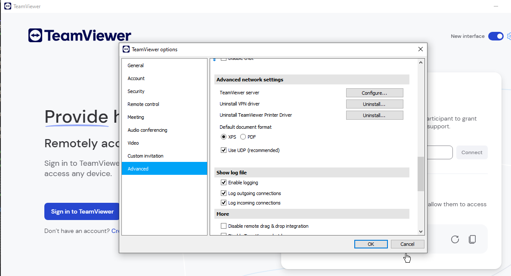

## URL

https://github.com/PeterGabaldon/CVE-2024-7479_CVE-2024-7481

## Target

- affected from **15.0.0** before **15.58.4**
- affected from **14.0.0** before **14.7.48796**
- affected from **13.0.0** before **13.2.36225**
- affected from **12.0.0** before **12.0.259312**
- affected from **11.0.0** before **11.0.259311**

## Explain

TeamViewer는 Windows, MacOS, Linux, iOS, 안드로이드 등 대부분의 플랫폼을 지원하는 원격 제어 소프트웨어로, 전 세계의 많은 기업 및 개인이 사용하는 인기있는 소프트웨어입니다.

Windows 플랫폼의 TeamViewer에서 발견된 권한 상승이 가능한 취약점 CVE-2024-4749, CVE-2024-7481의 세부 정보가 공개되었습니다.

두 취약점 모두 TeamViewer의 장치 드라이버 설치 기능에서 발생합니다. TeamViewer 클라이언트에는 VPN/프린터 장치 드라이버를 설치할 수 있는 기능이 존재합니다. 설치되는 장치 드라이버의 IPC 메서드 ID에 따라 CVE가 할당되었으며, VPN 드라이버는 설치 기능에는 CVE-2024-7479가, 프린터 드라이버 설치 기능에는 CVE-2024-7481이 각각 할당되었습니다.



> 출처: https://pgj11.com/posts/Finding-TeamViewer-0days-Part-1/

드라이버 설치 권한이 없는 TeamViewer 클라이언트는 5939/tcp 소켓에 바인딩된 IPC를 통해 SYSTEM 계정으로 실행되는  `TeamViewer_service.exe` 서비스 프로세스에 드라이버 설치 요청을 보냅니다.`TeamViewer_service.exe`는 클라이언트에게 전달받은 매개변수와 함께 `tv_x64.exe` 를 실행해 드라이버를 설치하고 커널에 로드합니다. 다음은 VPN 장치 드라이버를 설치할 때 `tv_x64.exe`로 전달되는 매개변수입니다.

```powershell
"C:\Program Files\TeamViewer\tv_x64.exe" --action install --verbose --log C:\Program Files\TeamViewer\TeamViewer15_Logfile.log  --event Local\DriverInstallFinishEvent_VPN --inf C:\Program Files\TeamViewer\x64\TeamViewerVPN.inf --id TEAMVIEWERVPN
```

이 과정에서 클라이언트의 드라이버 설치 요청 매개변수를 필터링하지 않아 공격자는 임의의 드라이버 패키지 정보가 포함된 INF 경로를 전달할 수 있습니다. TeamViewer 서비스는 유효하지 않은 클라이언트 요청을 방지하기 위해 요청에 대해 MD5 해시를 이용한 인증 챌린지가 존재하지만 약한 인증 수준으로 인해 인증 과정을 정상적으로 수행하고 임의의 요청을 보낼 수 있습니다.

따라서 TeamViewer 클라이언트를 스푸핑하고 공격자가 임의의 INF 드라이버 설정 파일을 매개변수로 전달하면 임의의 드라이버를 타겟 시스템에 설치할 수 있습니다. 이를 이용하면 취약한 드라이버를 설치하는 BYOVD 기법을 통해 시스템 권한으로 권한 상승이 가능합니다.

> **BYOVD(Bring Your Own Vulnerable Driver)**
알려진 1-day 취약점이 존재하는 디바이스 드라이버로, 정상적인 MS 서명이 있어 [드라이버 서명](https://learn.microsoft.com/en-us/windows-hardware/drivers/install/kernel-mode-code-signing-policy--windows-vista-and-later-) 정책을 우회하고 시스템에 설치 가능한 드라이버임.
관리자 수준의 코드 실행이 가능한 공격자가 커널 권한을 획득하기 위해 널리 사용되는 기법임.
> 

## Reference

https://pgj11.com/posts/Finding-TeamViewer-0days-Part-1/

https://pgj11.com/posts/Finding-TeamViewer-0days-Part-2/

https://pgj11.com/posts/Finding-TeamViewer-0days-Part-3/