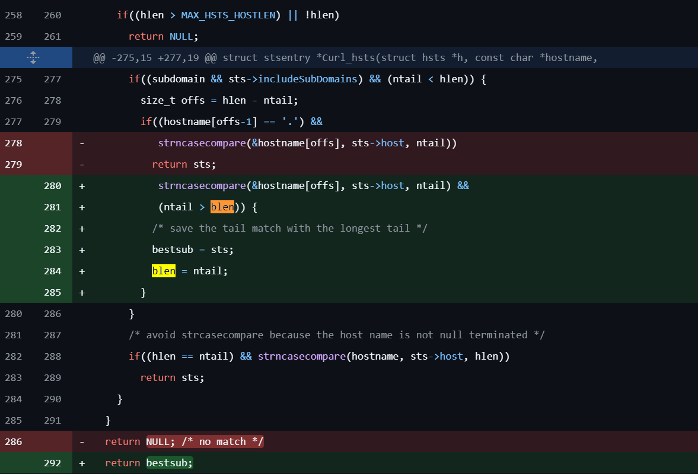

## URL

https://hackerone.com/reports/2764830
https://curl.se/docs/CVE-2024-9681.html

## Target

- 7.74.0 ≤ curl ≤ 8.10.1

## Explain

curl은 널리 사용되는 통신 프로토콜을 이용한 data transfer tool로, HTTP, HTTPS, SCP, SFTP 및 FTP와 같은 다양한 프로토콜을 지원하며 Proxy, Header, Cookie 등 요청 세부 옵션까지 설정할 수 있는 commandline 기반 툴입니다. 이러한 curl의 취약점 CVE-2024-9681이 발견되어 관련 세부 정보가 공개되었습니다.

curl은 안전하지 않은 HTTP 프로토콜 대신 HTTPS 프로토콜을 사용해 접속하도록 강제하는 [HSTS(HTTP Strict Transport Security)](https://everything.curl.dev/http/https/hsts.html) 옵션을 지원합니다. HSTS가 활성화된 도메인은 응답 시 `Strict-Transport-Security`  헤더에 해당 HSTS 정책 만료 기간을 포함하는데, curl은 이러한 응답을 HSTS 캐시 파일에 저장합니다.

이러한 HSTS는 아래와 같은 이점이 존재합니다.

- 일반적으로 클라이언트가 HTTP 요청을 보내는 경우 서버 레벨에서 301/032 리디렉션을 통해 HTTPS로 넘어가나, HSTS 캐시가 존재하면 캐시에 지정된 만료 기간 동안 해당 도메인에 대한 HTTP 요청은 클라이언트 레벨에서 HTTPS로 변경되기 때문에 불필요한 네트워크 트래픽을 줄일 수 있음.
- MITM과 같은 HTTP 프로토콜을 통한 공격을 사전에 방지할 수 있음.

HSTS는 첫 요청 시 Strict-Transport-Seuciry 응답 헤더를 확인하기 전 공격을 통해 무력화될 수 있다는 단점이 있으나, 이는 HSTS 정책을 사전 등록하는 HSTS Preload으로 해결할 수 있습니다.

일반적으로 서브도메인은 부모 도메인의 HSTS 만료 시간을 늘릴 수만 있고 줄일 수 없어 악성 서브도메인에 의해 부모 도메인이 받는 영향을 제한합니다. 그러나 8.10.1 버전 이하의 curl은 서브도메인이 부모도메인 HSTS 캐시를 덮어써 만료 시간을 줄일 수 있는 취약점이 존재합니다.

부모도메인 domain.com 및 서브도메인 sub.domain.com의 HSTS 캐시 예시는 아래와 같습니다.

```c
.domain.com "20241107 01:02:03"
.sub.domain.com "unlimited"
```

일정 기간이 지나면 HSTS 정책이 새로 업데이트되는데, sub.domain.com의 응답이 `Strict-Transport-Security: max-age=15768000 ; includeSubDomains` 인 경우 cache는 다음과 같이 업데이트됩니다.

```c
.domain.com "unlimited"
.sub.domain.com "20250408 00:26:19"
```

서브도메인은 정상적인 만료 기간으로 설정되었으나 부모도메인은 이전 서브도메인의 만료 기간으로 overwrite 됩니다. 이는 curl이 HSTS 캐시를 업데이트하는 과정에서 도메인 매칭을 느슨하게 구현해서 발생했으며, 취약점을 악용하는 경우 HSTS가 예상보다 빨리 만료되어 민감한 정보가 HTTP를 통해 전송되거나 리디렉션 요청량이 증가해 발생하는 DoS의 원인이 될  수 있습니다.

curl은 해당 취약점에 대한 [패치](https://github.com/curl/curl/commit/a94973805df96269bf#diff-92cb51f57e15a16ca654bafdae501a978fb94cdf4aab06ea5cb1e95395044693R281)로 전체 도메인이 일치하는 경우에만 기존 HSTS 캐시 항목을 교체하는 코드를 추가했습니다.

