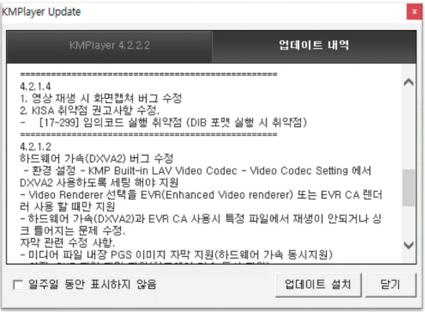
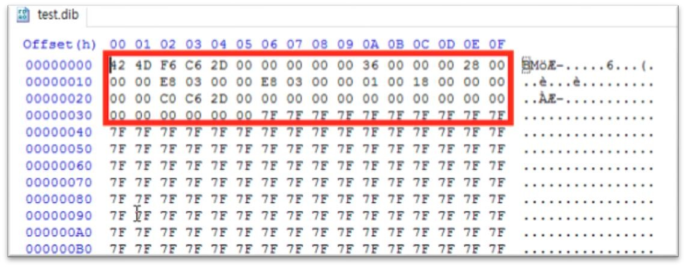
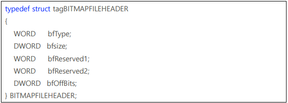
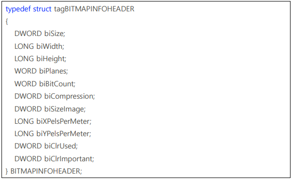

[버그헌팅 튜토리얼 Part 1 보러가기](https://hackyboiz.github.io/2021/03/07/l0ch/bughunting-tutorial/)

지난 Part 1에 이어 타깃 프로그램 선정과 취약점이 발생한 파일 포맷을 분석해보도록 하겠습니다!

# 버그바운티 - KMPlayer

제가 예시로 들 프로그램은 KMPlayer입니다. 다들 KMPlayer 아시죠?? 쓰시는 분들도 있을 거고

> 출처 : 네이버 소프트웨어 자료실

KMPlayer의 경우 원래는 동영상 플레이어이지만 음악도 플레이해주고 사진도 볼 수 있습니다. 제가 찾았던 취약점은 사진 포맷 중 하나인 .dib 포맷에서 발생한 힙 오버플로우 취약점입니다. 올해(2017년) 4 월인가 제보하고 7 월에 패치가 되었네요.

이 취약점으로 설명을 하는 이유는 다음과 같습니다.

1. dib 포맷은 압축하지 않고 그냥 비트맵 정보를 raw 하게 저장할 수 있기 때문에 분석을 할 때나 익스를 할 때나 아주 편합니다. 따라서 입문자분들이 처음 공부를 할 때 매우 쉽게 접근할 수 있다고 생각했습니다.
2. 분석할 코드 커버리지가 작고 취약점이 단순합니다. 그리고 뮤테이트 해야 할 바이트도 적고요. 말 그대로 쉬워서??
3. KMPlayer는 예전 버전을 다운 받을 수 있습니다. 다른 건 취약점을 찾아도 환경 구성이 안되면 이런 글을 쓸 수가 없어요 ㅠㅠ 

그래서 이제 시작해보죠 ㅋㅋㅋ 일단 먼저 취약점이 존재하는 버전을 다운 받아 보죠.

제가 익스플로잇을 진행했던 버전은 4.1.5.8입니다. 사실 4.2.1.4 이전 버전 아무거나 다운 받으셔도 되는 데 제가 찾아 놓은 가젯이나 정보들이 다 저 버전이어서 익스 다시 짜기 귀찮기 때문에 그냥 이 버전으로 진행하겠습니다 ㅋㅋㅋ

그리고 이제 시드 파일을 만들 건데 만든 파일을 뜯어보면서 dib 파일 포맷에 대해서 간단히 알아보도록 할게요. 

앞서 말했다시피 dib 포맷은 무압축 비트맵 이미지 포맷입니다. 구조가 매우 간단하고 비트맵 정보들이 어떠한 가공도 되지 않고 바로 저장되어 있죠. (압축하는 것도 있기는 해요 하지만 그냥 넘어갈게여) 

포맷은 두 개의 구조체와 비트맵 정보로 이루어져 있습니다. 일단 파일을 만들어볼게요. 개꿀인 게 윈도우에 기본으로 있는 그림판을 사용해서 dib 파일을 만들 수 있습니다.

여기에서는 24 비트 비트맵의 dib 포맷을 사용할 겁니다. 24 비트인 이유는 RGB를 표현하기 위해서 한 픽셀을 표현하는 데 3 바이트를 사용하기 때문입니다.

이렇게 먼저 저장을 하고 아무 색이나 넣어볼게요. 그런 다음 저장하고 hxd로 봅니다. 저는 그냥 회색으로 칠해보았는 데 헥스로 보니까 아래처럼 나오네요.

음 딱 봐도 위에 빨간 부분이 헤더 정보이고 뒤에서 비트맵 정보인 거 같죠?? 이렇게
간단한 포맷 처음 보는 거 같죠?? ㅇㅈ? ㅇㅇㅈ

그럼 이제 빨간색 박스 부분의 정보가 뭔지 간단하게만 알아볼게요. 참고로 다른 포맷으로 진행할 때에도 포맷을 알고 리버싱을 진행하는 게 좀 더 편합니다. 특히 리버싱을 진행할 때에는 해당 부분이 어떤 역할을 하는 지 그래서 우리가 익스플로잇에 어떻게 활용을 할 수 있는지 알 수 있죠. 확실히 리버싱 속도를 향상시켜 주기는 합니다.

일단 첫 번째 구조체를 보면

이렇게 되어 있습니다.

첫 번째는 당연히 헤더가 들어가 있고 뒤에 파일의 전체 사이즈 그리고 마지막은 비트맵 정보가 시작되는 오프셋을 저장하고 있습니다.

그리고 두 번째 오프셋을 볼게여

이미지의 가로 세로 길이, 해상도, 압축 여부 등등이 저장되어 있습니다. 이 구조체는 좀 더 많네요? 위 구조체는 저장하는 데만 쓰이고 실제 출력할 때에는 아래 구조체의 정보를 사용한다고 합니다. 하지만 딱히 익스에는 도움이 안 되니 그냥 이정도만 알고 필요한 거는 뒤에서 진행하면서 알아보도록 할게요. 더 알고 싶은 분은 아래 링크를 참고하시면 될 거 같습니다.

[http://www.soulfree.net/186](http://www.soulfree.net/186)

이제 헤더 정보들도 알았고 퍼저에 돌려볼 건데 퍼저를 돌리기 전에 분석을 좀 더 편하게 하기 위해서 저만의 데이터를 넣을 겁니다.

비트맵 정보가 들어있는 부분의 앞부분을 제 닉네임으로 바꾸었는데요. 이렇게 하면 나중에 크래시 분석을 할 때 내 파일이 어디에 로드되었는지 확인하기 편합니다. 따라서 다른 메모리에는 없을 법한 문자열로 채워주는 게 좋죠. AAAA 나 BBBB 이런 거는 단순해서 다른 쓰레기 데이터에도 존재하기 때문에 저는 제 닉네임을 주로 사용하는 편입니다. 추가적으로 파일 맨 뒤에도 비슷하게 넣어주면 끝까지 다 로드되었는 지도 알 수 있겠죠? 이렇게 시드 파일을 만들고 퍼저를 돌리면 됩니다. 

두 파트에 거쳐 워밍업이 마무리 됐네요..! 네 이제 시작이라는 뜻입니다 ㅋㅋㅋㅋㅋㅋㅋㅋ

다음 글에서는 본격적으로 퍼저의 크래시 정보를 통해 취약점을 분석하고 익스플로잇을 해볼 건데요. 본격적인 삽질에 주의해주시기 바랍니다 ㅎㅎ 그럼 Part 3로 돌아오겠습니다!

## Part 3 예고

> 고생은 이제부터 시작..