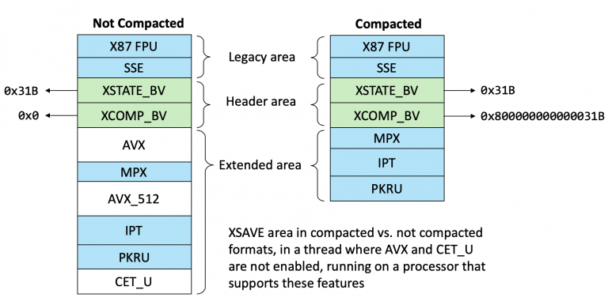
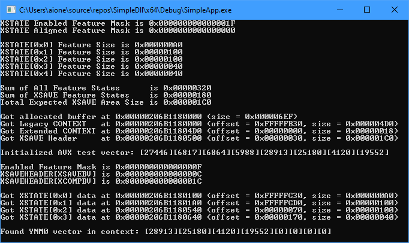
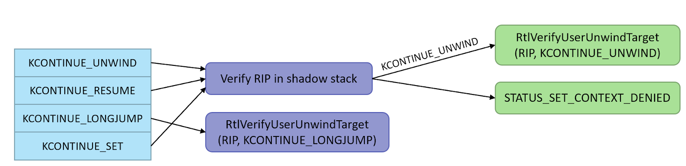
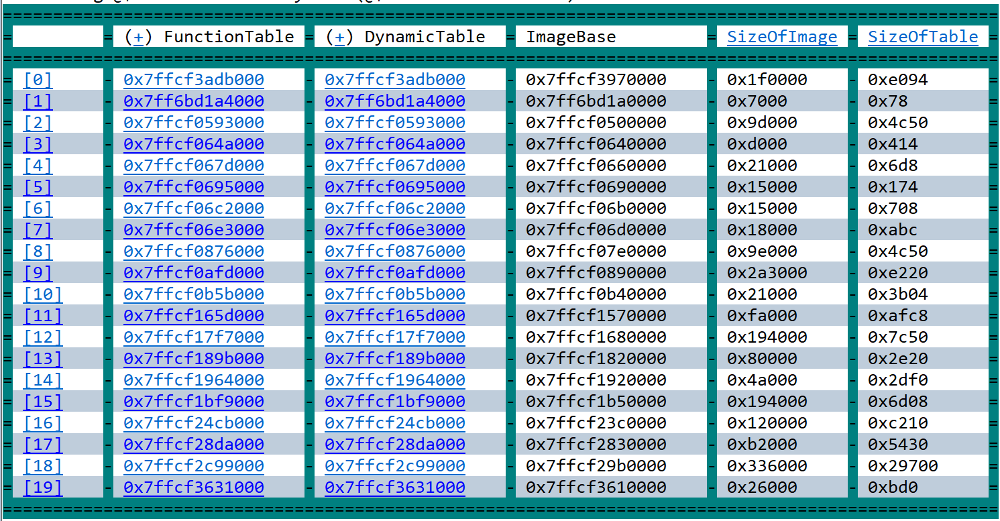

안녕하세요 L0ch입니다! 지난번 Windows Patch Diffing에 이어 이번엔 번역글로 돌아왔습니다.

오늘 번역글의 주제는 인텔이 도입한 새로운 미티게이션인 CET입니다. CET는 이전에 우리 막내인 Fabu1ous의 [x64 stack alignment](https://hackyboiz.github.io/2020/12/06/fabu1ous/x64-stack-alignment/) 글의 마지막에 잠깐 언급되기도 했었죠? 인텔에선 이미 차세대 모바일 플랫폼인 Tiger Lake에 이 기능을 내장했으니 곧 상용화가 머지않았네요.

첫 번역글이라 오역과 오타가 난무할 수 있습니다.. ㅠㅠ 발견하신다면 가차 없이 지적해주시면 감사하겠습니다.

원문 : [R.I.P ROP: CET Internals in Windows 20H1](https://windows-internals.com/cet-on-windows/) 


## 들어가며

최근 Windows 10의 19H1(Version 1903) 릴리즈 버전에 매우 흥미로운 일이 발생했다. 인텔 [CET(Control-flow Enforcement Technology)](https://software.intel.com/sites/default/files/managed/4d/2a/control-flow-enforcement-technology-preview.pdf) 구현이 수년간의 논의 끝에 시작된 것이다.

이러한 CET 적용은 모든 버전의 Windows 릴리즈에 추가되고 있으며, 작년(2020) 릴리스인 20H1 (버전 2004)은 Intel Tiger Lake CPU에서 릴리즈 될 CET의 user mode shadow stack 기능에 대한 지원을 완료했다.

인텔 CET는 익스플로잇에서 일반적으로 사용되는 두 가지 유형의 제어 흐름 무결성 위반인 forward-edge 위반 (indirect CALL 및 JMP)과 backward-edge 위반 (RET)을 해결하는 하드웨어 기반 mitigation이다.

forward-edge 구현은 새롭지 않지만 (기본적으로 Microsoft의 [Control Flow Guard](https://docs.microsoft.com/en-us/windows/win32/secbp/control-flow-guard)와 유사한 형태의 [clang-cfi](https://clang.llvm.org/docs/ControlFlowIntegrity.html)이기 때문이다.) backward-edge 구현은 ISA의 근본적인 변화에 의존한다. Shadow Stack 은 CALL 명령어에 의해 스택에 푸시된 반환 주소를 복제하며, RET 명령어 실행 시 스택 및 섀도우 스택 값을 모두 확인하고 불일치 시 INT #21 (제어 흐름 보호 오류)를 생성한다.

운영 체제 및 컴파일러는 CALL과 RET 이외의 제어 흐름 시퀀스(예 : 예외 해제 및 [longjmp](https://en.cppreference.com/w/cpp/utility/program/longjmp))를 지원해야 하기 때문에 시스템 수준에서 필요한 동작과 일치하도록 `Shadow Stack Pointer(SSP)` 를 조작해야 하며, 이 조작 자체가 잠재적인 우회가 되지 않도록 검증해야 한다. 이 게시물에서는 Windows가 이를 달성하는 방법에 대해 설명한다.

Windows가 스레드에 대한 shadow stack을 조작하고 유효성을 검사하는 방법에 대해 자세히 알아보기 전에 먼저 두 가지를 이해해야 한다. 첫 번째는 SSP의 실제 위치 및 권한이고 두 번째는 SSP스레드 간 컨텍스트 전환 시 저장/복원하는 데 사용되는 메커니즘과 필요한 경우 (예 : 예외 해제 중)  SSP 수정이 수행되는 방법이다.

이러한 메커니즘을 설명하려면 [AVX(Advanced Vector eXtensions)](https://en.wikipedia.org/wiki/Advanced_Vector_Extensions) 명령을 지원하기 위해 Intel에서 도입하고 Windows 7부터 Microsoft가 지원한 Intel CPU 기능을 알아봐야 한다. 또한 이 기능을 사용하기 위해 기존 CONTEXT구조를 문서화되지 않은 CONTEXT_EX구조로 재구성하고 이를 처리하기 위한 native API를 추가하는 것에 대해서도 이야기해야 한다!

마지막으로 Windows의 CET 기능에 대한 추가적인 요구사항을 다루기 위해 일부 컴파일러 및 PE 파일 포맷의 내부와 새로운 프로세스 정보 클래스를 살펴봐야 한다. 이 글의 목차가 이러한 기능에 대한 전체적인 내용을 탐색하는 데 도움이되기를 바란다. 또한 [관련 GitHub 저장소](https://github.com/yardenshafir/cet-research)를 기반으로 함수 이름을 클릭하면 새로 도입된 다양한 함수에 대한 주석이 달린 소스 코드를 사용할 수 있다.


# XState 내부

x86-x64 아키텍처 클래스 프로세서는 범용 레지스터(RAX, RCX), 제어 레지스터 (RIP, RSP...), 부동 소수점 레지스터 (XMM, YMM, ZMM)와 일부 제어, 디버그 및 테스트 레지스터 등 대부분의 보안 연구자들에게 익숙한 레지스터 세트로 구성되었다. 그러나 더 많은 프로세서 기능이 추가됨에 따라 새 레지스터 및 이러한 기능과 관련된 특정 프로세서 상태를 정의해야 했다. 그리고 이러한 기능 중 많은 부분이 스레드 내부에서 사용하므로 컨텍스트 전환 중에 저장하고 복원해야 한다.

이에 대한 해결책으로 인텔은 다양한 프로세서 상태를 `상태 마스크`의 비트와 연결하고 `XSAVE` 영역에서 요청된 상태를 읽고 쓰기 위한 `XSAVE` 및 `XRSTOR`와 같은 명령어를 도입하는 `XState(eXtended State)` [표준](https://www.intel.com/content/dam/www/public/us/en/documents/manuals/64-ia-32-architectures-software-developers-manual.pdf)을 정의했다. 이 영역은 각 스레드에 대한 CET 레지스터 저장소의 중요한 부분이지만 대부분의 사람들은 기존 부동 소수점, AVX 및 [메모리 보호 확장(Memory Protection eXtensions, MPX)](https://software.intel.com/en-us/articles/introduction-to-intel-memory-protection-extensions)기능에 초점을 두었기 때문에 XSAVE 지원을 대부분 무시하고 있다. 기능 및 메모리 레이아웃에 대한 개요는 독자에게 도움이 될 것이다.


## XSAVE 영역

앞서 언급했듯이 XSAVE 영역은 원래 Intel에서 프로세서에 추가 한 AVX와 같은 새로운 부동 소수점 기능 중 일부를 저장하고 이전에 `FXSTOR` 및 `FXRSTR` 명령을 통해 저장되는 기존 x86 FPU 및 SSE 상태를 통합하는 데 사용되었다. 이 처음 두 개의 레거시 상태는 `레거시 XSAVE 영역`의 일부로 정의되었으며 추가 프로세서 레지스터 (예 : AVX)는 `확장된 XSAVE 영역`에 추가되었다. 그 사이에 `XSAVE 영역 헤더` 는 `XSTATE_BV`라는 상태 마스크를 통해 어떤 확장 기능이 있는지 설명하는 데 사용된다.

동시에 XSAVE 기능의 일부로 운영체제에서 지원하는 상태를 정의하는 새로운 `XCR0(eXtended Control Register)`가 추가되었으며 XCR0을 구성하기 위해 `XGETBV` 및 `XSETBV` 명령이 추가되었다. (이후에 추가될 `XCR`도 마찬가지이다.) 예를 들어 운영체제는 x87 FPU 및 SSE에 대한 기능 상태 비트를 포함하지 않도록, 즉 레거시 `FXSTOR` 명령을 사용하여 수동으로 저장하고 확장된 기능의 상태만 XSAVE 영역에 저장하도록 XCR0을 프로그래밍해 선택할 수 있다.

`PKRU(Protection Key Register User State)`를 추가한  [MPK(Memory Protection Key)](https://www.kernel.org/doc/html/latest/core-api/protection-keys.html)와 같은 고급 레지스터 세트 및 기능의 수가 증가함에 따라 최신 프로세서는 `XSAVES` 및 `XRSRTORS`를 사용하는 CPL0 코드로만 수정할 수 있는 슈퍼바이저 상태와 압축 및 최적화 버전 (`XSAVEC` / `XSAVEOPT`)으로 구분해 인텔만의 방식으로 복잡하게 만들었다. 슈퍼바이저 전용 상태를 정의하기 위해 `IA32_XSS`라는 새로운 `MSR(Model Specific Register)`이 추가되었다.


> optimized XSAVE 영역 vs not optimized XSAVE 영역 
> (VX 및 CET_U가 노트 활성화되고 IPT 및 PKRU가 활성화되었지만 마지막 컨텍스트 전환 이후에 사용되지 않은 스레드)

`Optimized XSAVE` 메커니즘은 마지막 컨텍스트 스위치 (있는 경우) 이후 다른 스레드에 의해 실제로 수정된 프로세서 상태만 XSAVE영역에 기록할 수 있게 해 주며 내부 프로세서 레지스터는 `XINUSE`이 정보를 추적할 수 있게 해 준다. `XSAVEOPT`를 사용할 때 `XSTATE_BV` 마스크는 요청된 모든 상태가 아니라 실제로 저장된 상태에 해당하는 비트만 포함된다.

반면 `Compacted XSAVE` 메커니즘은 기존 XState 디자인의 결함을 수정했다. `AVX512` 및 [IPT(Intel Processor Trace)](https://software.intel.com/content/www/us/en/develop/blogs/processor-tracing.html) 와 같은 더 많은 확장 기능이 추가됨에 따라 이러한 기능을 사용하지 않으면 큰 XSAVE영역을 할당하고 0으로 기록해야 한다. `Optimized XSAVE`는 이러한 낭비를 피할 수 있지만 여전히 사용되지 않는 확장 기능은 기본 XSAVE 영역 버퍼로부터 큰 오프셋에 있음을 의미한다 .

`XSAVEC`를 사용하면 현재 스레드에 의해 실제로 활성화된 XState 기능을 저장하기 위한 공간만 사용하고 저장된 각 상태를 순차적으로 메모리에 배치함으로써 문제를 해결할 수 있다. (CPUID를 통해 `정렬 마스크`의 일부로 제공되는 고정 64-byte 정렬을 사용할 수 있다.)

이전에 표시된 XSAVE 영역 헤더는 두 번째 상태 마스크인 `XCOMP_BV`로 확장되어 요청된 상태 비트 중 어느 것이 비교 영역에 있을 수 있는지 나타낸다. `XSTATE_BV`와 달리 이 마스크는 `XINUSE`의 일부가 아닌 상태 비트를 생략하지 않아 압축될 수 있는 모든 가능한 비트를 포함하므로 `XSTATE_BV`를 통해 실제로 어떤 상태 영역이 있는지 확인해야 한다. 마지막으로, 압축된 명령어가 사용될 때 비트 63은 항상 `XCOMP_BV`에서 XSAVE 영역에 대한 지시자로 설정된다.

따라서 압축된 포맷인지에 따라 XSAVE 영역의 내부 레이아웃과 크기가 결정된다. 압축된 포맷은 스레드에서 사용하는 프로세서 기능에 대해서만 XSAVE 영역의 메모리를 할당하고, 압축되지 않은 포맷은 프로세서가 지원하는 모든 프로세서 기능에 대해 메모리를 할당하고 스레드에서 사용하는 기능만 사용한다. 아래 다이어그램은 동일한 스레드에 대해 XSAVE 영역이 어떻게 보이는지, 각각의 포맷을 사용할 때의 예를 보여준다.




> Compacted XSAVE vs not Compacted XSAVE AVX 및 CET_U가 활성화되지 않은 스레드, 이러한 기능을 지원하는 프로세서에서 실행됨

요약하자면,  `XSAVE`와 `XRSTOR` 명령어 집합은 다음과 같은 조합과 함께 사용된다.

1. OS가 XCR0을 지원할 때 설정되는 상태 비트 (`XSETBV` 명령어를 사용하여 설정)
2. `XSAVE` 명령을 사용할 때 호출자가 EDX : EAX에 저장하는 상태 비트 (인텔에서는 이를 `instruction mask`라고 함)
3. 권한이 없는 명령어를 사용하는 경우 `IA32_XSS`에 설정되지 않은 상태 비트
4. `XINUSE`에 설정된 상태 비트인 `최적화된 XSAVE`를 지원하는 프로세서에서 마지막 전환 이후 현재 스레드에서 사용된 실제 XState 관련 레지스터를 추적하는 내부 레지스터

이러한 비트가 함께 마스킹되면 `XSAVE` 명령에 의해 `XSTATE_BV` 필드의 XSAVE 영역의 헤더에 최종 상태 비트가 기록된다. `Compacted XSAVE`를 사용하는 경우 `XINUSE`를 생략한 결과 상태 비트가  `XCOMP_BV` 필드에 XSAVE 영역의 헤더에 기록된다. 아래 다이어그램은 결과 마스크를 보여준다.


## XState 구성

각 프로세서에는 자체적인 XState 활성화 기능, 예상되는 크기, 기능 및 메커니즘 세트를 가지고 있어 Intel은 운영 체제가 XState를 처리 할 때 쿼리해야하는 다양한 CPUID 클래스를 통해 정보를 노출한다 . Windows는 부팅시 이러한 쿼리를 수행하고 `XSTATE_CONFIGURATION` 아래에 표시된 구조에 정보를 저장한다. (Winnt.h에 문서화 됨)

```c
typedef struct _XSTATE_CONFIGURATION
{
    ULONG64 EnabledFeatures;
    ULONG64 EnabledVolatileFeatures;
    ULONG Size;
    union
    {
        ULONG ControlFlags;
        struct
        {
            ULONG OptimizedSave:1;
            ULONG CompactionEnabled:1;
        };
    };
    XSTATE_FEATURE Features[MAXIMUM_XSTATE_FEATURES];
    ULONG64 EnabledSupervisorFeatures;
    ULONG64 AlignedFeatures;
    ULONG AllFeatureSize;
    ULONG AllFeatures[MAXIMUM_XSTATE_FEATURES];
    ULONG64 EnabledUserVisibleSupervisorFeatures;
} XSTATE_CONFIGURATION, *PXSTATE_CONFIGURATION;
```

이 데이터들을 보관한 후 커널은 `KUSER_SHARED_DATA` 구조체에 저장한다. 이 구조체는 `SharedUserData` 변수를 통해 액세스 할 수 있으며 모든 Windows 플랫폼의 `0x7FFE0000` 주소에 존재한다.

Optimized, Compacted XSAVE를 모두 지원하고 x87 FPU(0), SSE(1), AVX(2) 및 MPX(3, 4) 기능 비트를 지원하는 테스트 `19H1` 시스템의 출력을 예로 들 수 있다.

```c
dx ((nt!_KUSER_SHARED_DATA*)0x7ffe0000)->XState
    [+0x000] EnabledFeatures  : 0x1f [Type: unsigned __int64]
    [+0x008] EnabledVolatileFeatures : 0xf [Type: unsigned __int64]
    [+0x010] Size             : 0x3c0 [Type: unsigned long]
    [+0x014] ControlFlags     : 0x3 [Type: unsigned long]
    [+0x014 ( 0: 0)] OptimizedSave    : 0x1 [Type: unsigned long]
    [+0x014 ( 1: 1)] CompactionEnabled : 0x1 [Type: unsigned long]
    [+0x018] Features         [Type: _XSTATE_FEATURE [64]]
    [+0x218] EnabledSupervisorFeatures : 0x0 [Type: unsigned __int64]
    [+0x220] AlignedFeatures  : 0x0 [Type: unsigned __int64]
    [+0x228] AllFeatureSize   : 0x3c0 [Type: unsigned long]
    [+0x22c] AllFeatures      [Type: unsigned long [64]]
    [+0x330] EnabledUserVisibleSupervisorFeatures : 0x0 [Type: unsigned __int64]
```

Features 배열에서 다음 5가지 기능의 크기와 오프셋을 확인할 수 있다.

```c
dx -r2 (((nt!_KUSER_SHARED_DATA*)0x7ffe0000)->XState)->Features.Take(5)
    [0]              [Type: _XSTATE_FEATURE]
        [+0x000] Offset           : 0x0 [Type: unsigned long]
        [+0x004] Size             : 0xa0 [Type: unsigned long]
    [1]              [Type: _XSTATE_FEATURE]
        [+0x000] Offset           : 0xa0 [Type: unsigned long]
        [+0x004] Size             : 0x100 [Type: unsigned long]
    [2]              [Type: _XSTATE_FEATURE]
        [+0x000] Offset           : 0x240 [Type: unsigned long]
        [+0x004] Size             : 0x100 [Type: unsigned long]
    [3]              [Type: _XSTATE_FEATURE]
        [+0x000] Offset           : 0x340 [Type: unsigned long]
        [+0x004] Size             : 0x40 [Type: unsigned long]
    [4]              [Type: _XSTATE_FEATURE]
        [+0x000] Offset           : 0x380 [Type: unsigned long]
        [+0x004] Size             : 0x40 [Type: unsigned long]
```

이 크기를 합하면 위의 `FeatureSize` 필드에 표시된 값인 `0x3C0`이 된다. 그러나 이 시스템은 `Compacted XSAVE` 기능을 지원하므로 여기에 표시된 오프셋은 관련이 없으며 모든 기능의 크기를 포함하지만 오프셋은 포함하지 않는 커널에만 유용하게 사용 가능하다.(`XCOMP_BV`에서 사용되는 압축 마스크를 기반으로 결정되기 때문)


## XState 정책

프로세서가 XState을 지원하지만 다양한 하드웨어 오류 때문에 특정 프로세서가 이 기능을 제대로 지원하지 못하는 경우가 종종 발생한다. 이 문제를 처리하기 위해 Windows는 일반적으로  라고 하는 하드웨어 정책 드라이버인 `HwPolicy.sys` 의 리소스 섹션에 저장된 XState 정책을 사용한다.

Intel x86 아키텍처는 여러 프로세서 벤더 중 하나이므로 커널은 XState 정책을 구문 분석하고 현재 프로세서의 벤더 문자열 및 마이크로코드 버전뿐만 아니라 시그니처, 기능 및 확장 기능을 비교하고 (즉, CPUID 01h 쿼리의 RAX, RDX 및 RCX), 정책에서 일치하는 항목을 찾는다.

이 작업은 부팅 시에 `KiInitializeXSave`가 호출하는 `KiIntersectFeaturesWithPolicy` 함수에서 수행된다. 이 함수는 `KiLoadPolicyFromImage` 를 호출하여 적절한 XState 정책을 로드하고 `KiGetProcessorInformation`을 호출하여 CPU의 데이터를 가져온 다음 XState 구성에서 현재 활성화된 각 기능 비트의 유효성을 `KiIsXSaveFeatureAllowed` 호출을 통해 확인한다.

이러한 기능은 `HwPolicy.sys` 드라이버의 리소스 101에서 작동하며 구조는 다음과 같다.

```c
typedef struct _XSAVE_POLICY
{
    ULONG Version;
    ULONG Size;
    ULONG Flags;
    ULONG MaxSaveAreaLength;
    ULONGLONG FeatureBitmask;
    ULONG NumberOfFeatures;
    XSAVE_FEATURE Features[1];
} XSAVE_POLICY, *PXSAVE_POLICY;
```

예를 들어,  `19H1` 시스템에서 리소스 해커로 추출한 내용은 다음과 같다.

```c
dx @$policy = (_XSAVE_POLICY*)0x253d0e90000
[+0x000] Version       : 0x3 [Type: unsigned long]
[+0x004] Size          : 0x2fd8 [Type: unsigned long]
[+0x008] Flags         : 0x9 [Type: unsigned long]
[+0x00c] MaxSaveAreaLength : 0x2000 [Type: unsigned long]
[+0x010] FeatureBitmask   : 0x7fffffffffffffff [Type: unsigned __int64]
[+0x018] NumberOfFeatures : 0x3f [Type: unsigned long]
[+0x020] Features      [Type: _XSAVE_FEATURE [1]]
```


각 `XSAVE_FEATURE`에 대해 각각 CPU 공급 업체 문자열이 있는 `XSAVE_VENDOR` 구조의 배열을 포함하는 `XSAVE_VENDORS` 구조에 대한 오프셋과 (지금은 각각 "GenuineIntel", "AuthenticAMD" 또는 "CentaurHauls") `XSAVE_CPU_ERRATA` 구조에 대한 오프셋을 확인할 수 있다. 예를 들어, `19H1` 테스트 시스템에는 기능 0에 대한 다음 정보가 존재한다.

```c
dx -r4 @$vendor = (XSAVE_VENDORS*)((int)@$policy->Features[0].Vendors + 0x253d0e90000)
[+0x000] NumberOfVendors  : 0x3 [Type: unsigned long]
[+0x008] Vendor        [Type: _XSAVE_VENDOR [1]]
    [0]           [Type: _XSAVE_VENDOR]
        [+0x000] VendorId      [Type: unsigned long [3]]
            [0]           : 0x756e6547 [Type: unsigned long]
            [1]           : 0x49656e69 [Type: unsigned long]
            [2]           : 0x6c65746e [Type: unsigned long]
[+0x010] SupportedCpu  [Type: _XSAVE_SUPPORTED_CPU]
[+0x000] CpuInfo       [Type: XSAVE_CPU_INFO]
[+0x020] CpuErrata     : 0x4c0 [Type: XSAVE_CPU_ERRATA *]
[+0x020] Unused        : 0x4c0 [Type: unsigned __int64]
```


마지막으로, 각 `XSAVE_CPU_ERRATA` 구조체는 지정된 XState 지원에 대한 오류 정보와 일치하는 프로세서 정보 데이터를 포함한다. 예를 들어, 테스트 시스템에서 위의 오프셋에서 첫 번째 에라타는 다음과 같다.

```c
dx -r3 @$errata = (XSAVE_CPU_ERRATA*)((int)@$vendor->Vendor[0].SupportedCpu.CpuErrata + 0x253d0e90000)
    [+0x000] NumberOfErrata   : 0x1 [Type: unsigned long]
    [+0x008] Errata           [Type: XSAVE_CPU_INFO [1]]
        [0]              [Type: XSAVE_CPU_INFO]
            [+0x000] Processor        : 0x0 [Type: unsigned char]
            [+0x002] Family           : 0x6 [Type: unsigned short]
            [+0x004] Model            : 0xf [Type: unsigned short]
            [+0x006] Stepping         : 0xb [Type: unsigned short]
            [+0x008] ExtendedModel    : 0x0 [Type: unsigned short]
            [+0x00c] ExtendedFamily   : 0x0 [Type: unsigned long]
            [+0x010] MicrocodeVersion : 0x0 [Type: unsigned __int64]
            [+0x018] Reserved         : 0x0 [Type: unsigned long]
```

모든 XState 기능에 대한 시스템의 하드웨어 정책 덤프 툴은 [여기](https://github.com/yardenshafir/cet-research/tree/master/Xpolicy)에서 사용할 수 있다. 지금은 전체 정책(위에 표시된 것)에 하나의 에라타만 나타난다.

마지막으로 다음 옵션 로더 명령줄 옵션(및 각 BCD 설정)을 사용하여 XState 기능을 추가로 커스터마이징이 가능하다.

1. `XSAVEPOLICY = n` 로드 옵션은 `xsavepolicy` BCD 옵션을 통해 설정되며 `KeXSavePolicyId`를 설정하여 로드할 XState 정책을 나타낸다.
2. `XSAVEREMOVEFEATURE = n`로드 옵션은 `xsaveremovefeature` BCD옵션을 통해 설정되며 `KeTestRemovedFeatureMask` 를 설정한다. 이는 나중에 `KiInitializeXSave`에 의해 구문 분석되고 지정된 상태 비트를 제거한다. 상태 0 (x87 FPU) 및 상태 1 (SSE)은 이 방법으로 제거할 수 없다.
3. `XSAVEDISABLE` 로드 옵션은 `xsavedisable` BCD 옵션을 통해 설정되어 `KeTestDisableXsave`를 설정하고 `KiInitializeXSave`가 모든 XState 구성 데이터를 0으로 설정하여 전체 XState 기능을 비활성화한다.

## CET XSAVE 영역 포맷

CET 구현의 일환으로 Intel은 `XSTATE_CET_U(11)`와 `XSTATE_CET_S(12)`라고 하는 두 개의 새로운 비트를 사용자 및 슈퍼바이저 상태에 각각 대응하도록 정의했다. 첫 번째 상태는 `XSAVE_CET_U_FORMAT`으로 문서화된 16바이트 데이터 구조로, `IA32_U_CET` MSR(`Shadow Stack Enable` 플래그가 구성된 경우) 및 `IA32_PL3_SSPMSR` (Privile 3 수준)을 포함한다. 아직 MSDN 정의가 없는 두 번째 방법은 `IA32_PL0/1/2_SSP` MSR을 포함한다.


```c
typedef struct _XSAVE_CET_U_FORMAT
{
    ULONG64 Ia32CetUMsr;
    ULONG64 Ia32Pl3SspMsr;
} XSAVE_CET_U_FORMAT, *PXSAVE_CET_U_FORMAT;

typedef struct _XSAVE_CET_S_FORMAT
{
    ULONG64 Ia32Pl0SspMsr;
    ULONG64 Ia32Pl1SspMsr;
    ULONG64 Ia32Pl2SspMsr;
} XSAVE_CET_S_FORMAT, *PXSAVE_CET_S_FORMAT;
```

필드 이름에서 알 수 있듯이 CET 관련 레지스터는 실제로 각 MSR에 저장된 값이며, 일반적으로 Ring 0의 RDMSR 및 WRMSR 권한이 있는 명령을 통해서만 액세스 할 수 있다. 그러나 프로세서 전역 데이터를 저장하는 대부분의 MSR과 달리 CET는 스레드 단위로 활성화할 수 있으며 Shadow stack pointer도 스레드 단위로 사용할 수 있다. 이러한 이유로 CET 관련 데이터는 운영 체제가 스레드 스위치를 올바르게 처리할 수 있도록 XState 기능의 일부로 구현되어야 한다.

CET 레지스터는 기본적으로 커널 코드로만 수정 가능한 MSR이기 때문에 `CPL3 XSAVE/XRSTOR` 명령을 통해 접근할 수 없으며 각각의 상태 비트는 `IA32_XSS` MSR에서 항상 1로 설정된다. 그러나 운영체제가 유저 모드의 코드가 SSP를 수정하는 것을 완전히 차단할 수는 없다. 유저 모드의 코드는 예외 처리, unwinding, jmp/longjmp 또는 Windows의 `Fiber` 메커니즘과 같은 특정 기능을 사용해 SSP를 업데이트할 수 있다.

따라서 Windows가 CS 및 DR7과 같은 특정 보호된 CPU 레지스터를 업데이트하는 메커니즘으로 [SetThreadContext](https://docs.microsoft.com/en-us/windows/win32/api/processthreadsapi/nf-processthreadsapi-setthreadcontext)를 제공하는 것처럼 운영 체제는 스레드가 시스템 호출을 통해 XSate에서 CET 상태를 수정할 수 있는 방법을 제공해야 한다. 따라서 다음 섹션에서는 XState 관련 정보를 지원하기 위해 현대의 Windows 버전에서 [CONTEXT](https://docs.microsoft.com/en-us/windows/win32/api/winnt/ns-winnt-wow64_context) 구조가 CONTEXT_EX 구조로 어떻게 발전했는지, 그리고 예외 관련 시나리오에 대해 CET 관련 처리를 추가하는 동시에 손상된 CONTEXT를 통한 악의적인 제어 흐름 공격을 방지하는 방법에 대해서 알아본다.


# CONTEXT_EX 내부

컨텍스트 스위치를 할 때 저장해야 하는 레지스터의 수가 점점 늘어나고, 이를 지원하기 위해 새로운 버전의 Windows는 레거시 CONTEXT 구조 외에도 CONTEXT_EX 구조를 도입했다. CONTEXT_EX는 레거시 CONTEXT가 고정 크기인 반면 XSAVE는 스레드, 프로세서 및 시스템 구성 정책에 따라 동적으로 크기가 조정되는 프로세서 상태 구조가 필요하기 때문에 도입되었다.


## CONTEXT_EX 구조

CONTEXT_EX는 현재 커널 및 유저 모드 예외 처리 기능 전체에서 사용되지만 CONTEXT_EX 구조의 대부분은 문서화되지 않았다. Windows 7 헤더 파일 및 일부 intel의 reference code에 존재하는 일부 정보가 실수로 공개되지 않도록 했음을 알 수 있다. 다음 코드의 주석을 보고 이해할 수 있는 것이 있으면 알려주었으면 한다.

```c
//
// 이 구조체는 CONTEXT_EX의 단일 청크 크기와 오프셋(CONTEXT_EX 구조 시작부터)을 지정한다.
// N.B. 오프셋은 음수일 수 있다.
//
typedef struct _CONTEXT_CHUNK
{
    LONG Offset;
    DWORD Length;
} CONTEXT_CHUNK, *PCONTEXT_CHUNK;

// CONTEXT_EX 구조체는 는 CONTEXT 구조체의의 확장이다. 
// 컨텍스트 레코드를 프로세서 상태의 일부를 포함하는 분리된 가변크기 버퍼(청크) 세트로 
// 정의한다. 현재 두 개의 버퍼(청크)만 정의된다:
//
// - 기존 CONTEXT 구조를 저장하는 레거시
// - XSAVE 저장 영역 버퍼를 저장하는 XState
// XSAVE_AREA_HEADER, i.e. without the first 512 bytes.
//
// PCONTEXT 포인터를 PCONTEXT_EX 포인터로 변환하는 몇 가지 가정이 있다.
//
// 1. PCONTEXT 포인터와 함께 작동하는 API는 CONTEXT_EX가 CONTEXT 구조 바로 뒤에 저장된다고 가정
//    또한 CONTEXT_EX는 해당 CONTEXT_XXX 플래그가 CONTEXT.ContextFlags에 설정된 경우에만 존재한다고 가정
//
// 2. CONTEXT_EX 구조가 있으면 레거시가 항상 존재
//
// 3. CONTEXT.ContextFlags는 존재하는 청크를 정의
//    즉 CONTEXT_XSTATE가 설정된 경우 CONTEXT_EX.XState가 유효하다.
//
typedef struct _CONTEXT_EX
{
    //
    // 오프셋이 가장 작은 청크에서 시작하는 구조체의 총 크기
    // N.B. 오프셋은 음수일 수 있다.
    //
    CONTEXT_CHUNK All;

    // 
    // 기존의 CONTEXT 구조 wrapper
    // N.B. 청크의 크기는 sizeof(CONTEXT)보다 작을 수 있다.
    // (CONTEXT_EXTENDED_REGISTERS가 x86에 설정되지 않은 경우).    
		// CONTEXT_CHUNK Legacy;
    //

	  // CONTEXT_XSTATE : 확장 된 프로세서 상태 청크. 상태 저장은 동일한 형식 
	  // XSAVE 작업은 처음 512 바이트를 제외하고 XSAVE_AREA_HEADER에서 시작한다. 
		// FP 및 SSE 상태에 해당하는 하위 2 비트는 0이어야 한다.
    // CONTEXT_CHUNK XState;
} CONTEXT_EX, *PCONTEXT_EX;

#define CONTEXT_EX_LENGTH ALIGN_UP_BY(sizeof(CONTEXT_EX), STACK_ALIGN)

//
// 이 매크로를 사용해 컨텍스트 청크를 더 쉽게 조작 가능
//
```


따라서 이 헤더로 CONTEXT_EX 구조의 레이아웃을 이해하고 시각화 할 수있을 때까지 여러 차례 시도를 했고 다음 다이어그램이 도움이 될 수 있다고 느꼈다.


다이어그램에서 CONTEXT_EX 구조는 항상 CONTEXT 구조의 끝에 있으며 레거시 및 XState라는 `CONTEXT_CHUNK` 유형의 3개 필드가 있다. 이들은 오프셋과 데이터의 크기를 정의하고 적절한 데이터 포인터를 검색하기 위한 다양한 `RTL_` 매크로가 존재한다.

Legacy 필드는 기존 CONTEXT 구조의 시작을 참조한다. (`CONTEXT_EXTENDED_REGISTERS`가 제공되지 않으면 x86에서 크기가 더 작을 수 있음) `All` 필드는 기존 CONTEXT 구조의 시작을 참조하지만 Length는 CONTEXT_EX와 XSAVE 영역에 필요한 패딩/정렬 공간을 포함하여 모든 데이터의 크기를 나타낸다. 마지막으로 `XState` 필드는 `XSAVE_AREA_HEADER` 구조 (상태 비트가 활성화되어 데이터가 있는 상태 마스크를 정의함)와 전체 XSAVE 영역의 크기를 참조한다. 이 레이아웃으로 인해 All 및 Legacy에는 음수 오프셋이 적용된다는 점에 유의해야 한다.

기능이 매우 복잡하기 때문에 `Ntdll.dll`은 CONTEXT_EX에 저장된 다양한 데이터의 빌드, 읽기, 복사 및 조작을 단순화하기 위해 다양한 API를 export 한다. (이러한 API 중 일부는 `Ntoskrn.exe` 에서 내부적으로 사용되지만 export 되지는 않는다.) 또한 `KernelBase.dll`은 이러한 기능을 내부적으로 사용하는 문서화된 Win32 함수를 export 한다.


## CONTEXT_EX 초기화

먼저 호출자는 CONTEXT_EX를 저장하기 위해 할당할 메모리 크기를 파악해야 하는데, 이는 다음 API를 사용하여 수행할 수 있다.

```c
NTSYSAPI
ULONG
NTAPI
RtlGetExtendedContextLength (
    _In_ ULONG ContextFlags,
    _Out_ PULONG ContextLength
);
```

호출자는 저장할 레지스터를 지정하기 위해 적절한 `CONTEXT_XXX` 플래그를 제공해야 한다. 그런 다음이 API는 `SharedUserData.XState.EnabledFeatures` 및 `SharedUserData.XState.EnabledUserVisibleSupervisorFeatures` 를 읽고 모든 비트를 통합해 아래의 확장 함수로 전달한다.


```c
NTSYSAPI
ULONG
NTAPI
RtlGetExtendedContextLength2 (
    _In_ ULONG ContextFlags,
    _Out_ PULONG ContextLength,
    _In_ ULONG64 XStateCompactionMask
);
```

이 최신 API를 사용하면 공유 사용자 데이터의 XState 구성에서 모든 활성화된 기능을 가져오는 대신 실제로 저장할 XState 상태를 수동으로 지정할 수 있다. 이로 인해 CONTNENT_EX 구조의 크기가 작아져 모든 XState 데이터를 저장할 공간이 충분하지 않게 되므로 이 CONTNT_EX를 나중에 사용하면 지정된 마스크 외부에서 XState Bits를 사용하지 않아야 한다.

다음으로 호출자는 CONTEXT_EX에 메모리를 할당하고 (대부분의 경우 Windows는 예외 경로에서 메모리 할당 실패를 방지하기 위해 `alloca`를 사용한다.) 다음 두 API 중 하나를 사용한다.

```c
NTSYSAPI
ULONG
NTAPI
RtlInitializeExtendedContext (
    _Out_ PVOID Context,
    _In_ ULONG ContextFlags,
    _Out_ PCONTEXT_EX* ContextEx
);

NTSYSAPI
ULONG
NTAPI
RtlInitializeExtendedContext2 (
    _Out_ PVOID Context,
    _In_ ULONG ContextFlags,
    _Out_ PCONTEXT_EX* ContextEx,
    _In_ ULONG64 XStateCompactionMask
);
```

이전과 마찬가지로 최신 API에서는 압축된 형식으로 저장할 XState 상태를 수동으로 지정할 수 있다. 지정하지 않으면 사용 가능한 모든 기능 (`SharedUserData` 기반)이 있는 것으로 간주된다.  호출자는 `RtlGetExtendedContextLength(2)`에 대한 호출과 동일한 `ContextFlags`를 지정해 컨텍스트 구조가 올바른 크기로 할당되었는지 확인해야 한다. 이후 호출자는 입력 CONTEXT 버퍼를 따라갈 것으로 예상되는 CONTEXT_EX 구조의 포인터를 받는다.

CONTEXT_EX가 존재하면 호출자는 먼저 레거시 CONTEXT 구조를 가져올 수 있다. (크기에 대한 가정 없이). 다음 API로 수행할 수 있다.

```c
NTSYSAPI
PCONTEXT
NTAPI
RtlLocateLegacyContext (
    _In_ PCONTEXT_EX ContextEx,
    _Out_opt_ PULONG Length,
);
```

그러나 이전에 언급했듯이 이들은 Windows의 NT 계층에 의해 노출되는 문서화되지 않은 내부 API다. 일반적인 Win32 응용 프로그램은 다음 함수를 사용하여 XState 호환 CONTEXT 구조의 사용을 단순화한다.

```c
WINBASEAPI
BOOL
WINAPI
InitializeContext (
    _Out_writes_bytes_opt_(*ContextLength) PVOID Context,
    _In_ DWORD ContextFlags,
    _Out_ PCONTEXT_EX Context,
    _Inout_ PDWORD ContextFlags
);

WINBASEAPI
BOOL
WINAPI
InitializeContext2 (
    _Out_writes_bytes_opt_(*ContextLength) PVOID Context,
    _In_ DWORD ContextFlags,
    _Out_ PCONTEXT_EX Context,
    _Inout_ PDWORD ContextFlags,
    _In_ ULONG64 XStateCompactionMask
);
```

이 두 API는 문서화되지 않은 API와 비슷하게 작동한다. 호출자가 Buffer 및 Context 매개 변수로 처음 NULL을 전달하면 함수는 `ContextLength`에 필요한 길이를 반환하며 호출자는 메모리에 할당한다. 두 번째 시도에서 호출자는 할당된 포인터를 Buffer에 전달하고 기본 CONTEXT_EX 구조에 대한 정보 없이 Context의 CONTEXT 구조에 대한 포인터를 받는다.


## CONTEXT_EX에서 XState 기능 마스크 제어

CONTEXT_EX의 `XSAVE_AREA_HEADER`의 Mask 필드에 포함된 `XSTATE_BV` (확장 기능 마스크)에 액세스 하기 위해 시스템은  XState 마스크를 수정하기 위한 API와 함께 CONTEXT_EX에서 어떤 XState 기능이 활성화되어 있는지 쉽게 확인할 수 있도록 두 개의 API를 export 한다.

그러나 Windows는 XSAVE 영역에 x87 FPU (0) 및 SSE (1) 상태를 저장하지 않고 대신 `FXSAVE` 명령을 사용한다. 즉, XSAVE 영역에 레거시 영역이 포함되지 않고 즉시 `XSAVE_AREA_HEADER`로 시작된다. 이로 인해 Get API는 항상 하위 2 비트를 마스킹한다. 또한 Set API는 지정된 기능이 XState 구성의 `EnabledFeatures`에 있는지 확인한다.

`InitializeContext2`(또는 내부 네이티브 APIs)에서 하드 코딩된 압축 마스크가 지정된 경우 Set API를 사용하여 기존 상태 비트를 생략해서는 안된다. (새 비트를 추가하면 CONTEXT_EX에 초기화되지 않은 추가 상태 데이터가 포함되므로 이 데이터 없이 이미 사전 할당되었을 것이다.)

```c
NTSYSAPI
ULONG64
NTAPI
RtlGetExtendedFeaturesMask (
    _In_ PCONTEXT_EX ContextEx
);

NTSYSAPI
ULONG64
NTAPI
RtlSetExtendedFeaturesMask (
    _In_ PCONTEXT_EX ContextEx,
    _In_ ULONG64 FeatureMask
);
```

위 API의 문서화된 형식은 다음과 같다.

```c
WINBASEAPI
BOOL
WINAPI
GetXStateFeaturesMask (
    _In_ PCONTEXT Context
    _Out_ PDWORD64 FeatureMask
);

NTSYSAPI
ULONG64
NTAPI
SetXStateFeaturesMask (
    _In_ PCONTEXT Context,
    _In_ DWORD64 FeatureMask
);
```


## CONTEXT_EX에서 XState 기능 찾기

CONTEXT_EX 구조의 복잡성과 XState 기능이 압축되거나 압축되지 않은 형태로 존재할 수 있고 존재 여부도 앞서 설명한 다양한 상태 마스크에 의존한다는 사실 (특히 최적화된 XSAVE가 지원되는 경우)로 인해, 호출자는 CONTEXT_EX 내의 XSAVE 영역에서 관련 상태 데이터에 대한 포인터를 쉽고 빠르게 얻기 위한 라이브러리 함수가 필요하다.

현재 다음과 같은 두 가지 함수가 존재한다. `RtlLocateExtendedFeature`는 `RtlLocateExtendedFeature2`의 wrapper이며 구성 매개 변수로 `SharedUserData.XState`에 대한 포인터를 제공한다. 두 함수 모두 export 할 때 호출자가 선택한 경우 후자의 API에서 자체 사용자 지정 XState 구성을 수동으로 지정할 수도 있다.


```c
NTSYSAPI
PVOID
NTAPI
RtlLocateExtendedFeature (
    _In_ CONTEXT_EX ContextEx,
    _In_ ULONG FeatureId,
    _Out_opt_ PULONG Length
);

NTSYSAPI
PVOID
NTAPI
RtlLocateExtendedFeature2 (
    _In_ CONTEXT_EX ContextEx,
    _In_ ULONG FeatureId,
    _In_ PXSTATE_CONFIGURATION Configuration,
    _Out_opt_ PULONG Length
);
```

두 함수 모두 CONTEXT_EX 구조와 요청 된 기능의 ID를 수신하고 기능이 XSAVE 영역에 저장된 위치에 대한 포인터를 반환하기 위해 XState 구성 데이터를 구문 분석한다. 지정된 기능에 대한 실제 값을 확인하거나 반환하지 않으며 이는 호출자에게 달려 있다.

포인터를 찾기 위해 `RtlLocateExtendedFeature2`는 다음을 수행한다:

- 기능 ID가 2 이상 (x87 FPU 및 SSE 상태는 Windows의 XSAVE를 통해 저장되지 않으므로) 및 64 (가능한 가장 높은 XState 기능 비트) 미만인지 확인한다.
- CONTEXT_EX + `CONTEXT_EX.XState.Offset`에서 `XSAVE_AREA_HEADER`를 가져온다.
- `Configuration`-> `ControlFlags.CompactionEnabled` 플래그에서 압축을 사용하는지 여부를 알 수 있다.
- 압축되지 않은 형식을 사용하는 경우 :
  - `Configuration`-> `Features[n].Offset` 및 `.Size`를 읽고 XSAVE 영역에서 요청된 기능의 오프셋 및 크기를 저장한다.
- 압축된 형식을 사용하는 경우 :
  - `XSAVE_AREA_HEADER` (`XCOMP_BV`에 해당)에서 `CompactionMask`를 읽고 요청된 기능이 포함되어 있는지 확인한다.
  - `Configuration`-> `AllFeatures`를 읽고 상태 비트가 요청된 기능 ID 앞에 오는 모든 활성화된 상태의 크기를 저장하고 이러한 크기를 더하여 요청된 형식의 오프셋을 계산한 뒤 각 이전 상태 영역의 시작 부분을 64byte로 정렬한다. 해당 비트가 `Configuration`-> `AlignedFeatures`에 설정된 경우 마지막으로 필요한 경우 지정된 기능 ID에 대한 영역의 시작을 정렬한다.
  - `Configuration.AllFeatures[n]`에서 요청 된 기능의 크기를 읽는다.
- 위에서 계산된 오프셋을 기반으로 XSAVE 영역에서 기능을 찾고 선택적으로 출력 길이 변수의 해당 크기와 함께 해당 크기에 대한 포인터를 반환한다.

즉, 압축되지 않은 형식으로 특정 기능의 주소를 찾으려면 `SharedUserData`에서 프로세서에서 지원하는 기능을 확인하는 것으로 충분하다. 그러나 압축 된 형식에서는 `SharedUserData`의 오프셋에 의존할 수 없으므로 스레드에서 활성화된 기능을 확인하고 이전 기능의 모든 크기를 기반으로 오프셋을 계산해야 한다.

일반적인 Win32 응용 프로그램에서는 내부적으로 위의 기본 API를 호출하지만 일부 사전 처리가 있는 다른 API가 사용되기도 한다. 상태 비트 0과 1은 CONTEXT_EX에서 XSAVE 영역의 일부로 저장되지 않으므로 Win32 API는 적절한 레거시 CONTEXT 필드 (즉, `XSTATE_LEGACY_FLOATING_POINT`의 경우 FltSave, `XSTATE_LEGACY_SSE`의 경우 Xmm0)에서 이러한 두 기능 비트를 가져와 처리한다.

```c
WINBASEAPI
PVOID
WINAPI
LocateXStateFeature (
    _In_ CONTEXT_EX Context,
    _In_ DWORD FeatureId,
    _Out_opt_ PDWORD Length
);
```


## 예제 사용과 출력

CONTEXT_EX 데이터 구조와 결합된 경우 XState 내부를 이해하기 위해 간단한 [테스트 프로그램](https://github.com/yardenshafir/cet-research/tree/master/Xpolicy)을 작성했다. 이 유틸리티는 일부 API 사용과 관련된 다양한 오프셋, 크기 및 동작을 보여준다. 다음은 AVX, MPX 및 Intel PT가 있는 시스템에서 프로그램 (AVX 레지스터 사용)의 출력이다.



무엇보다도 레거시 CONTEXT가 음수인 오프셋에 있는 경우 예상대로 시스템이 x87 FPU 상태(1) 및 GSE 상태(2)를 지원하더라도 `XSAVEBV`에는 이러한 비트가 포함되어 있지 않으므로 레거시 컨텍스트 영역에 저장된다. (따라서 관련 상태 데이터의 음수 오프셋에 유의해야 함) `0x40` 바이트 크기인 XSAVE 헤더 (오프셋 `0x30`에서 시작) 다음에 AVX 상태(2)는 오프셋 `0x70`에서 시작한다.


# CONTEXT_EX 유효성 검사

유저 모드 API는 결국 커널에 의해 처리되고 XSAVE 영역의 권한 있는 부분 (즉, CET 상태 데이터)을 수정하는 CONTEXT_EX를 구성할 수 있으므로 Windows는 CONTEXT_EX를 허용하는 API를 통한 바람직하지 않은 수정을 방지해야 한다. 예를 들어 :

- `NtContinue` : 예외 후 재개하는 데 사용되며 longjmp CRT 기능을 처리하고 스택 해제를 수행한다.
- `NtRaiseException` : 기존 스레드에 예외를 삽입하는 데 사용됨
- `NtQueueUserApc` : 기존 스레드의 실행 흐름을 가로채는 데 사용됨
- `NtSetContextThread` : 기존 스레드의 프로세서 레지스터 / 상태를 수정하는 데 사용됨

이러한 시스템 호출로 인해 커널이 `IA32_PL3_SSP` 또는 `IA32_CET_U` MSR을 수정하고 RIP를 조작할 수 있으므로 Windows는 전달된 CONTEXT_EX가 CET 보증을 위반하지 않는지 확인해야 한다.

`19H1`에 SSP를 검증하고 `20H1`에 RIP 검증을 추가하는 방법을 곧 다룰 예정이다. 하지만 먼저 `NtContinue`의 오용 가능성을 줄이기 위해 작은 리팩터링을 수행해야 했다. 바로 `NtContinueEx` 함수의 도입이다.


## NtContinueEX 및 KCONTINUE_ARGUMENT

위에서 설명한 대로 `NtContinue`의 기능은 여러 상황에서 사용되며, CET가 프로세서 상태에 대한 임의 변경을 허용하는 API에서 기존 상태를 복원할 수 있으려면 인터페이스에 더 세밀한 제어가 추가되어야 했다. 이 작업은 `KCONTINUE_TYPE`이라는 새 enumeration의 생성을 통해 수행되었으며, `KCONTINUE_ARGUMENT` 데이터 구조에 현재 `NtContinue`에서 `NtContinueEx`로 향상된 버전으로 전달되어야 한다.

이 데이터 구조에는  `ContinueFlags` 필드가 추가되었다. 이 필드는  `NtContinue`의 원래 `TestAlert` 인수를 `CONTINUE_FLAG_RAISE_ALERT (0x1)` 플래그로 대체하는 동시에 새로운 TrapFrame으로 APC를 직접 전달하는`CONTINUE_FLAG_BYPASS_CONTEXT_COPY (0x2)` 플래그도 도입되었다. 이것은 CONTEXT 레코드 포인터가 사용자 스택의 특정 위치에 있는지 확인하여 이전에 구현된 최적화로, 함수가 사용자 모드 APC 전달의 일부로 사용되고 있다고 가정할 수 있다.  이 동작을 원하는 호출자는 `ContinueFlags`에서 플래그를 명시적으로 설정해야 한다.

이전 인터페이스는 레거시로 계속 지원되지만 내부적으로는 입력 매개 변수를 `KCONTINUE_ARGUMENT`가 아닌 `BOOLEAN TestAlert` 매개 변수로 인식하는 `NtContinueEx`를 호출한다. 이러한 경우는 새 인터페이스에서 `KCONTINUE_UNWIND`로 처리된다.

위 리팩터링의 일부로 다음 네 가지 가능한 유형이 있다.

- `KCONTINUE_UNWIND` – 예외에서 해제할 때 사용되는 `RtlRestoreContext` 및 `LdrInitializeThunk`와 같은 `NtContinue`의 레거시 호출자가 사용
- `KCONTINUE_RESUME` – `NtContinueEx`를 다시 호출하기 전에 `KiUserApcDispatcher`가 실행할 유저 모드 스택에 `KCONTINUE_ARGUMENT` 구조를 빌드할 때 `KiInitializeUserApc`가 사용
- `KCONTINUE_LONGJUMP` – 예외 레코드의 예외 코드가 `STATUS_LONGJUMP` 인 경우 `RtlRestoreContext`에서 호출하는 `RtlContinueLongJump`에서 사용됨
- `KCONTINUE_SET` – `NtContinueEx`에 직접 전달되지 않고 `NtSetContextThread` API에 대한 응답으로 `PspGetSetContextInternal` 내에서 [KeVerifyContextIpForUserCet](https://github.com/yardenshafir/cet-research/blob/master/src/KeVerifyContextIpForUserCet.c)을 호출할 때 사용됨


## SSP(Shadow Stack Pointer) 유효성 검사

앞서 언급했듯이 예외 해제, APC, longjmp 등과 같이 유저 모드 코드가 SSP를 변경해야 하는 경우가 있다. 그러나 운영 체제는 CET 우회 방지를 위해 SSP에 요청된 새 값을 검증해야 한다. 이는 `19H1`에서 새로운 [KeVerifyContextXStateCetU](https://github.com/yardenshafir/cet-research/blob/master/src/KeVerifyContextXStateCetU.c) 함수에 의해 구현되었다. 이 함수는 컨텍스트가 수정되는 스레드와 스레드의 새 컨텍스트를 수신하고 다음을 수행한다.

- CONTEXT_EX에 XState 데이터가 포함되어 있지 않거나 XState 데이터에 CET 레지스터가 포함되지 않은 경우 (`XSTATE_CET_U` 상태 비트로 `RtlLocateExtendedFeature2`를 호출하여 확인) 유효성 검사가 필요하지 않다.
- 대상 스레드에서 CET가 활성화된 경우 :
  - 호출자가 `XSAVEBV`에서 `XSTATE_MASK_CET_U`를 마스킹하여 이 스레드에서 CET를 비활성화하는지 확인한다. 이 경우 함수는 상태 비트를 다시 활성화하고 `MSR_IA32_CET_SHSTK_EN` (CET의 섀도우 스택 기능을 활성화하는 플래그)을 `Ia32CetUMsr`에 설정하고 현재 섀도우 스택을 `Ia32Pl3SspMsr`로 설정한다.
  - 반면에 [KiVerifyContextXStateCetUEnabled](https://github.com/yardenshafir/cet-research/blob/master/src/KiVerifyContextXStateCetUEnabled.c)를 호출하면 CET 섀도우 스택이 활성화되었는지, (`MSR_IA32_CET_SHSTK_EN` 활성화 여부) 새 SSP가 8byte로 정렬되었는지, 현재 SSP 값과 섀도우 스택 영역의 VAD 끝 사이에 있는지 확인한다. 스택이 거꾸로 성장하기 때문에 영역의 "끝"이 실제로 스택의 시작 주소이다. 따라서 스레드에 대한 새 컨텍스트를 설정할 때 모든 SSP 값은 스레드에서 지금까지 사용된 섀도우 스택 내에 있는 한 유효하다. 또한 스레드가 섀도우 스택 내부로 이동할 수 있는 범위에는 제한이 없다.
- CET가 대상 스레드에서 비활성화되고 호출자가 CONTEXT_EX의 `XSAVEBV`에 `XSTATE_CET_U` 마스크를 포함하여 활성화를 시도하는 경우 두 MSR 값이 모두 0으로 설정되도록 허용한다. (섀도우 스택 X, SSP X)

위 유효성 검사에 실패하면 `STATUS_SET_CONTEXT_DENIED`가 반환되고 성공하면 `STATUS_SUCCESS`가 반환된다.

CET를 활성화하면 기존 Windows 8.1에서 CFG와 함께 구현된 Check Stack Extents도 암시적으로 활성화된다. 이것은 KPROCESS의 `ProcessFlags` 필드에 있는 `CheckStackExtents` 비트를 통해 확인할 수 있다. 즉, 대상 SSP가 유효성을 검사할 때마다 [KeVerifyContextRecord](https://github.com/yardenshafir/cet-research/blob/master/src/KeVerifyContextRecord.c) 또한 호출되고 대상 RSP가 현재 스레드의 TEB 사용자 스택 제한 (또는 이것이 WOW64 프로세스인 경우 TEB32의 사용자 스택 제한)의 일부인지 확인한다. `RtlGuardIsValidStackPointer` (및 `RtlGuardIsValidWow64StackPointer`)에 의해 구현된 이러한 검사는 이전에 [Tenable](https://medium.com/tenable-techblog/api-series-setthreadcontext-d08c9f84458d) 및 [enSilo](https://blog.ensilo.com/atombombing-cfg-protected-processes)의 연구원에 의해 문서화되었다.


## RIP(Instruction Pointer) 유효성 검사

`19030` 빌드 버전에 Intel CET를 사용하는 또 다른 기능인 호출자가 프로세스에 대해 설정하려는 새 RIP가 유효한지 확인하는 기능이 추가되었다. SSP 유효성 검사와 마찬가지로 이는 스레드에 대해 CET이 활성화된 경우에만 적용된다. 그러나 RIP 유효성 검사는 기본적으로 활성화되어 있지 않으며 프로세스에 대해 활성화되어야 한다. (EPROCESS의 `MitigationFlags2Values` 필드에 있는 `UserCetSetContextIpValidation` 비트로 표시됨).

즉, 현재 빌드의 경우 `CreateProcess`를 호출하고 `PROC_THREAD_ATTRIBUTE_MITIGATION_POLICY` 속성을 사용할 때 `PROCESS_CREATION_MITIGATION_POLICY2_CET_USER_SHADOW_STACKS_ALWAYS_ON` 플래그가 활성화되면 옵션이 설정되는 것으로 보인다. (CET는 프로세스 생성 시에만 활성화될 수 있으므로 `ProcessUserShadowStackPolicy` 값으로 `SetProcessMitgationPolicy` API를 호출하는 것은 유효하지 않다.)


그러나 흥미롭게도 새로운 mitigation 옵션인 `PS_MITIGATION_OPTION_USER_CET_SET_CONTEXT_IP_VALIDATION (32)` 이 mitigation map에 추가되었다. 문서화되지 않은 이 mitigation을 토글 하면 `MitigationFlags2Values` 필드에서 `AuditUserCetSetContextIpValidation` 비트를 활성화한다. 또한 이것은 이제 32 번째 mitigation 옵션 (각각 DEFERRED / OFF / ON / RESERVED에 대해 4 비트를 차지함)이므로 132개의 mitigation 비트가 필요하며 `PS_MITIGATION_OPTIONS_MAP`는 Map 필드의 3개의 64 비트 배열 요소로 확장되었다.  (`PS_SYSTEM_DLL_INIT_BLOCK`의 크기에 대한 후속 효과가 있음)

새로운 [KeVerifyContextIpForUserCet](https://github.com/yardenshafir/cet-research/blob/master/src/KeVerifyContextIpForUserCet.c) 함수는 스레드의 컨텍스트가 변경될 때마다 호출된다. 스레드에 대해 CET 및 RIP mitigation이 모두 활성화되어 있는지 확인하고 컨텍스트 매개 변수에 `CONTEXT_CONTROL` 플래그가 설정되어 있는지 확인한다. 즉, 이 새 컨텍스트에 의해 RIP가 변경됨을 의미한다. 모든 검사가 통과되면 내부 [KiVerifyContextIpForUserCet](https://github.com/yardenshafir/cet-research/blob/master/src/KiVerifyContextIpForUserCet.c) 함수를 호출한다. 이 함수의 목적은 대상 RIP가 유효한 값이고 익스플로잇이 임의 코드를 실행하는 데 사용하는 값이 아닌지 확인하는 것이다.

먼저 대상 RIP 주소가 커널 주소가 아니며 매핑되어서는 안 되는 하위 0x10000 바이트의 주소가 아닌지 확인한다. 그런 다음 대상 RIP가 유저 모드의 이전 주소인 경우를 허용하기 위해서 해당 기본 트랩 프레임을 검색하고 대상 RIP가 해당 트랩 프레임의 RIP인지 확인한다. 일반적으로 스레드에 대해 `NtSetThreadContext`가 처음 호출되고 RIP가 스레드의 초기 시작 주소로 설정될 때 발생하지만 일반적이지 않은 다른 경우에도 발생할 수 있다.

이 함수는 `KCONTINUE_TYPE`을 수신하고 해당 값에 따라 다양한 방식으로 대상 RIP를 처리한다. 대부분의 경우 섀도우 스택을 반복하고 대상 RIP를 검색하는데, 찾지 못하면 예외가 발생하며 예외 핸들러에 도달할 때까지 계속 실행된다. 예외 핸들러는 제공된 `KCONTINUE_TYPE`이 `KCONTINUE_UNWIND`인지 확인하고 `KCONTINUE_UNWIND` 플래그와 함께 [RtlVerifyUserUnwindTarget](https://github.com/yardenshafir/cet-research/blob/master/src/RtlVerifyUserUnwindTarget.c)을 호출하는지 확인한다. 이 기능은 다음 섹션에서 설명하는 더 복잡한 검사를 사용하여 RIP를 다시 확인한다.

다른 경우에는 `STATUS_SET_CONTEXT_DENIED`를 반환하여 EPROCESS에 `AuditUserCetSetContextIpValidation` 플래그가 설정된 경우 실패 검사를 위해 [KeVerifyContextIpForUserCet](https://github.com/yardenshafir/cet-research/blob/master/src/KeVerifyContextIpForUserCet.c)이 `KiLogUserCetSetContextIpValidationAudit`함수를 호출한다. 이 검사(auditing)는 일반적인 프로세스 mitigation ETW 채널을 통해 수행되는 대신 WER (Windows 오류보고) 서비스를 통해 빠른 실패 예외를 직접 발생시키는 방식으로 수행된다. (`FAST_FAIL_SET_CONTEXT_DENIED`로 설정된 정보로 `0xC000409` 예외를 전송). WER 스팸을 방지하기 위해 `AuditUserCetSetContextIpValidationLogged`라는 또 다른 EPROCESS 비트가 사용된다.

스레드가 종료되고 현재 섀도우 스택 주소가 페이지로 정렬된 경우 함수가 대상 RIP를 찾기 전에 섀도우 스택에 대한 루프를 중지하는 경우가 있다. 즉, 스레드를 종료할 때 함수는 최우선적으로 섀도우 스택의 현재 페이지에서만 대상 RIP를 확인한다. 해당 페이지에서 대상 RIP를 찾지 못하면 `STATUS_THREAD_IS_TERMINATING`을 반환한다.

함수는 `KCONTINUE_TYPE` 이 `KCONTINUE_LONGJUMP` 인 경우 대상 RIP가 섀도우 스택에 대해 검증되지 않지만 대신 [RtlVerifyUserUnwindTarget](https://github.com/yardenshafir/cet-research/blob/master/src/RtlVerifyUserUnwindTarget.c)이 `KCONTINUE_LONGJUMP` 플래그와 함께 호출되어 PE Image Load Configuration Directory의 `longjmp` 테이블에서 RIP를 확인한다. 이 글의 다음 섹션에서 이 표와 검사에 대해 설명한다.




[KeVerifyContextIpForUserCet](https://github.com/yardenshafir/cet-research/blob/master/src/KeVerifyContextIpForUserCet.c)은 다음 두 함수 중 하나에 의해 호출된다.

- `PspGetSetContextInternal` – `NtSetContextThread API`에 대한 응답으로 호출된다
- [KiVerifyContextRecord](https://github.com/yardenshafir/cet-research/blob/master/src/KiVerifyContextRecord.c) – `NtContinueEx`, `NtRaiseException` 및 일부 경우 `NtSetContextThread` API에 대한 응답으로 호출된다. [KeVerifyContextIpForUserCet](<https://github.com/yardenshafir/cet-research/blob/master/src/KeVerifyContextIpForUserCet.c)을 호출하기 전에 (수신된 `ContinueArgument`가 NULL이 아닌 경우에만)이 함수는 호출자가 CS 레지스터를 수정하려고 하는지, 새 값이 유효한 값인지를 확인한다. WOW64가 아닌 프로세스는 피코 프로세스이며, 이 경우 CS를 `KGDT64_R3_CODE` 또는 `KGDT64_R3_CMCODE`로 설정할 수 있다. 다른 값은 [KiVerifyContextRecord](https://github.com/yardenshafir/cet-research/blob/master/src/KiVerifyContextRecord.c)가 새 CS 값을 `KGDT64_R3_CODE`로 강제한다. `KiVerifyContextRecord`는 `KiContinuePreviousModeUser` 또는 `KeVerifyContextRecord`에 의해 호출되며 두 번째의 경우, 함수는 RSP가 프로세스 스택 (native 또는 wow64) 중 하나에 있고 64 비트 프로세스가 CS를 `KGDT64_R3_CODE`로만 설정하는지 확인한다.

`KeVerifyContextIpForUserCet`을 호출하여 대상 RIP의 유효성을 검사하는 모든 경로는 먼저 `KeVerifyContextXStateCetU`를 호출하여 대상 SSP의 유효성을 검사하고 SSP가 유효할 때만 RIP 검사를 수행한다.


# 예외 해제 및 longjmp 유효성 검사

위에서 설명한 대로 `KCONTEXT_SET` 및 `KCONTEXT_RESUME`에 대한 처리는 대상 RIP가 섀도우 스택의 일부인지 확인하는 것과 관련이 있지만 `KCONTEXT_UNWIND` 및 `KCONTEXT_LONGJMP` 경우에는 `RtlVerifyUserUnwindTarget`을 통한 확장된 유효성 검사가 필요하다. 이 두 번째 유효성 검사를 위해서는 PE 파일 형식 (및 컴파일러 지원)을 변경해야 하며 JIT 컴파일러 지원을 위해 [NtSetInformationProcess](https://github.com/yardenshafir/cet-research/blob/master/src/NtSetInformationProcess.c)에 추가된 새로운 OS 수준의 정보 클래스가 포함되어 있다.

CFG (Control Flow Guard) 지원으로 인해 이미 추가된 PE 파일 내부의 `Image Load Configuration Directory`에는 현재 설정된 `jmp/longjmp` 쌍의 일부로 사용되는 분기 유효 대상에 대한 정보가 포함되어 있으며, 이 정보를 컴파일러가 식별해 링커에 전달하도록 되어 있다. CET를 사용하면 이 기존 데이터가 재사용되지만 연속 예외 핸들러 지원을 위해 또 다른 테이블과 크기가 추가된다. Visual Studio 2017은 `longjmp` 테이블을 생성하지만 Visual Studio 2019부터 위와 같은 정보가 포함된 테이블을 생성한다.

이 마지막 섹션에서는 이러한 테이블의 형식과 커널이 마지막 두 가지 유형의 `KCONTINUE_TYPE` 제어 흐름을 검증하는 방법을 살펴보겠다.


## PE 메타 데이터 테이블

Windows 10은 Control Flow Guard 이미지에 있는 표준 GFIDS 테이블 외에도  RVA가 저장되는 `.gljmp`라는 PE Image Load Configuration의 `Guard Long Jump Target Table` 필드에 저장된 PE 섹션의 Long Jump Target Table을 포함하여 longjump 대상의 유효성 검사에 대한 지원을 추가했다.

`setjmp`에 대한 호출이 코드에서 수행될 때마다 반환 주소 (longjmp가 분기되는 위치)의 RVA가 이 테이블에 추가된다. 이 테이블의 존재 여부는 Image Load Configuration Directory의 `GuardFlags`에 있는 `IMAGE_GUARD_CF_LONGJUMP_TABLE_PRESENT` 플래그에 의해 결정되며 `GuardLongJumpTargetCount` 필드에 표시된 만큼의 항목을 포함한다.

각 항목은 4 바이트 RVA와 n 바이트의 메타 데이터이다. 여기서 n은 `(GuardFlags & IMAGE_GUARD_CF_FUNCTION_TABLE_SIZE_MASK) >> IMAGE_GUARD_CF_FUNCTION_TABLE_SIZE_SHIFT`의 결과에서 가져온다. 이 테이블의 경우 메타 데이터가 정의되지 않았으므로 메타 데이터 바이트는 항상 0이 될 것으로 예상된다. 이 계산은 `GFIDS` 테이블 (`export suppression`가 활성화된 경우 잠재적으로 메타 데이터가 있음)에 사용된 계산과 동일하기 때문에 하나 이상의 CFG 대상을 억제하면 1 바이트의 빈 메타데이터가 Long Jump Target Target Table의 모든 항목에 추가된다.

예를 들어 다음은 두 개의 `longjmp` 대상이 있는 PE 파일이다.


이 이미지도 CFG 내보내기 억제를 사용하므로 `GuardFlags`의 상위 니블 (`IMAGE_GUARD_CF_FUNCTION_TABLE_SIZE_MASK`에 해당)에 있는 값 1에 유의하자. 이는 아래에서 볼 수 있는 Long Jump Target Table에 1 바이트의 추가 메타 데이터가 있음을 알려준다.


`Windows 10 20H1`에서 이러한 유형의 메타 데이터는 연속 대상에 대한 예외 핸들러가 바이너리의 제어 흐름의 일부로 존재하는 경우에 포함된다. 두 개의 새로운 필드 `GuardEHContinuationTable` 및 `GuardEHContinuationCount`가 Image Load Configuration Directory 끝에 추가되고 `IMAGE_GUARD_EH_CONTINUATION_TABLE_PRESENT` 플래그가 `GuardFlags`에 포함된다. 이 테이블의 레이아웃은 `GuardFlags`의 상위 니블을 기반으로 한 메타 데이터 바이트 추가를 포함하여 Long Jump Target Table에 대해 표시된 것과 동일하다.

안타깝게도 Visual Studio 2019 버전에서도 이 데이터를 생성하지 않으므로 현재 예제를 보여줄 수 없다. 이 분석은 나중에 설명하는 유효성 검사 코드와 20H1 SDK의 `Ntimage.h` 헤더 파일을 리버스 엔지니어링 한 기반으로 한다.


## 사용자 반전 기능 테이블

이제 longjmp 대상 또는 연속 대상에 대한 예외 핸들러로 분기하기 위해 제어 흐름 변경이 발생할 수 있음을 알고 있으므로 CONTEXT_EX에 있는 RIP 주소를 기반으로 이 두 테이블을 어떻게 얻을 수 있을까? NtContinueEx 전화? 이런 작업은 특정 프로그램 실행에서 자주 발생할 수 있으므로 커널은 이 문제를 해결하기 위한 효율적인 방법이 필요하다.

`Inverted Function Table`의 개념에 이미 익숙할 것이다. 이러한 테이블은 `Ntdll.dll (LdrpInvertedFunctionTable)` 에서 유저 모드 예외 처리 중 해제 opcode 및 예외 데이터를 찾는 데 사용된다. (`.pdata` 섹션을 찾아서) `Ntoskrnl.exe (PsInvertedFunctionTable)`에 또 다른 테이블이 있으며 커널 모드 예외 처리 및 PatchGuard 검사의 일부에 사용된다.

간단히 말해 `Inverted Function Table`은 로드된 모든 유저/커널 모듈 크기와 가상 주소별로 정렬된 PE 예외 디렉터리에 대한 포인터를 포함하는 배열이다. 이 배열을 검색하는 것이 PE 헤더를 구문 분석한 뒤 로드된 모듈 연결 목록을 검색하는 것보다 훨씬 빠르기 때문에 역함수 테이블의 binary search는 로그(n) 조회에서만 해당 모듈의 가상 주소를 빠르게 찾는다. 현재 Microsoft의 명성을 얻고 있는 Ken Johnson과 Matt Miller는 이전에 Uninformed Magazine에 [커널 모드 후킹 기술](http://uninformed.org/index.cgi?v=8&a=2&p=20)에 대한 기사의 일부로 개요를 게시했다.

그러나 이전에는 `Ntdll.dll`은 테이블에서 유저 모드 예외만, `Ntoskrnl.exe`는 커널 모드 예외만 검사했다. `20H1`의 변경 사항은 커널도 사용자 테이블을 검사해야 한다는 것이다. `longjmp` 및 예외 연속을 처리하는 데 필요한 새로운 로직을 지원하기 위해 새로운 `RtlpLookupUserFunctionTableInverted` 함수가 추가되어 `KeUserInvertedFunctionTable` 변수를 스캔하고 `Ntdll.dll`에서 현재 내보낸 `LdrpInvertedFunctionTable` 심볼에 매핑된다.

이것은 흥미로운 포렌식 기능으로, 커널에서 PEB의 로더 데이터를 구문 분석하거나 VAD를 열거할 필요 없이 현재 프로세스 내에 로드된 유저 모드 모듈을 쉽게 찾을 수 있다. 예를 들어 다음은 `Csrss.exe`에서 현재 로드된 이미지를 보는 방법이다.

```c
dx @$cursession.Processes.Where(p => p.Name == "csrss.exe").First().SwitchTo()
dx -r0 @$table = *(nt!_INVERTED_FUNCTION_TABLE**)&nt!KeUserInvertedFunctionTable
dx -g @$table->TableEntry.Take(@$table->CurrentSize)
```

즉, 원격에서도 특히 `unwind opcode` 가없는 x86 시스템에서는 이미지가 예외 디렉터리를 포함되지 않을 가능성이 있으며, `.pdata`는 `/SAFESEH`를 사용하고 적어도 하나의 예외 핸들러가 있는 경우에만 생성된다.

이러한 상황에서는 `RtlpLookupUserFunctionTableInverted`가 실패할 수 있으며 대신 `MmGetImageBase`를 사용해야 한다. 이것은 입력 RIP에 해당하는 영역을 매핑하는 VAD를 조회하고 이미지 VAD 인 경우 해당 영역의 기본 주소와 크기 (모듈의 크기와 일치해야 함)를 반환한다.




## 연속된 대상에 대한 동적 예외 핸들러

`KCONTINUE_UNWIND` 요청을 처리하는데 마지막 장애물이 하나 있다. 정규 프로세스에는 코드의 `__try /__except /__finally` 절을 기반으로 하는 연속된 대상에 대한 정적 예외 핸들러가 있지만 Windows에서는 JIT 엔진이 실행 가능한 코드를 동적으로 즉시 생성할 수 있을 뿐만 아니라 `RtlAddFunctionTable` API 등을 통해 런타임에 예외 핸들러를 등록하고 opcode를 해제할 수 있다. 이러한 예외 핸들러는 이전에는 사용자 모드 stack walking 및 예외 해제에만 필요했지만 이제는 연속 핸들러가 커널이 RIP에 대해 잠재적으로 유효한 값으로 처리해야 하는 제어 흐름 대상이 된다. `RtlpFindDynamicEHContinuationTarget`이 처리하는 것이 마지막 가능성이다.

CET 지원 및 `NtContinueEx` 도입의 일부로 EPROCESS 구조는 `DynamicEHContinuationTargetsLock` 및 `DynamicEHContinuationTargetsTree`라는 두 개의 새로운 필드로 향상되었다. 첫 번째는 `EX_PUSH_LOCK`이고 두 번째는 모든 유효한 예외 핸들러 주소를 포함하는 `RTL_RB_TREE`입니다. 이 트리는 `PROCESS_DYNAMIC_EH_CONTINUATION_TARGETS_INFORMATION` 유형의 데이터 구조와 함께 새로운 프로세스 정보 클래스 인 `ProcessDynamicEHContinuationTargets`를 사용하여 `NtSetInformationProcess`에 대한 호출을 통해 관리된다. 더 쉽게 이해하려면 이러한 구조 및 플래그에 대한 아래 정의를 참조하면 된다.

```c
#define DYNAMIC_EH_CONTINUATION_TARGET_ADD          0x01
#define DYNAMIC_EH_CONTINUATION_TARGET_PROCESSED    0x02

typedef struct _PROCESS_DYNAMIC_EH_CONTINUATION_TARGET
{ 
    ULONG_PTR TargetAddress;
    ULONGLONG Flags;
} PROCESS_DYNAMIC_EH_CONTINUATION_TARGET, *PPROCESS_DYNAMIC_EH_CONTINUATION_TARGET;

typedef struct _PROCESS_DYNAMIC_EH_CONTINUATION_TARGETS_INFORMATION
{
    USHORT NumberOfTargets;
    USHORT Reserved;
    ULONG Reserved2;
    PPROCESS_DYNAMIC_EH_CONTINUATION_TARGET* Targets;
} PROCESS_DYNAMIC_EH_CONTINUATION_TARGETS_INFORMATION, *PPROCESS_DYNAMIC_EH_CONTINUATION_TARGETS_INFORMATION;
```

`PspProcessDynamicEHContinuationTargets` 함수가 이 데이터를 반복하기 위해 호출되며, 이 시점에서 `RtlAddDynamicEHContinuationTarget`은 대상 주소를 저장하는 데이터 구조를 할당하고 `ETL_RB_TREE_BPROCESS.NODE`에 `RTL_RB_NODE` 링크를 연결하는 `DYNAMIC_EH_CONTINUATION_TARGET_ADD` 플래그 세트를 포함하는 항목에 대해 호출되며 반대로 플래그가 없으면 대상을 조회하고 실제로 존재하는 경우 제거되고 노드가 해제된다. 각 항목이 처리될 때 `DYNAMIC_EH_CONTINUATION_TARGET_PROCESSED` 플래그가 원래 입력 버퍼에 OR 처리되므로 호출자는 어떤 항목이 작동하고 작동하지 않았는지 알 수 있다.

가능한 모든 ROP 가젯이 단순히 '동적 연속 목표'로 추가될 수 있으므로이 기능의 존재는 CET/CFG와 유사한 기능의 보편적인 우회로 보인다. 그러나 Microsoft는 브라우저와 Flash에 대한 `out-of-process JIT` 컴파일만 공식적으로 지원하므로 이 API는 원격 프로세스에서만 작동한다는 점에 유의해야 한다. 따라서 현재 프로세스에서 호출하면 항상 `STATUS_ACCESS_DENIED`로 실패한다.


## 타겟 검증

이 모든 지식을 통합하면 `RtlVerifyUserUnwindTarget` 함수를 설명하기 쉬워진다.

1. CONTEXT_EX 구조에서 대상 RIP와 연관된 로드된 PE 모듈을 조회한다. 먼저 `RtlpLookupUserFunctionTableInverted`를 사용하고 실패하면 대신 `MmGetImageBase`를 사용하여 모듈이 4GB 미만인지 확인한다.
2. 모듈이 발견되면 `LdrImageDirectoryEntryToLoadConfig` 함수를 호출하여 Image Load Configuration Directory를 가져온다. 그런 다음 Long Jump 또는 연속 대상에 대한 동적 예외 핸들러 테이블을 포함할 수 있을 만큼 충분히 큰지와 `guardflags`에 `IMAGE_GUARD_CF_LONGJUMP_TABLE_PRESENT` 또는 `IMAGE_GUARD_EH_CONTINUATION_TABLE_PRESENT`가 포함되어 있는지 확인한다. 디렉터리가 없거나 너무 작은 경우 혹은 일치하는 테이블이 없는 경우 호환성을 위해 `STATUS_SUCCESS`를 반환한다.
3. Image Load Configuration Directory에서 `GuardLongJumpTargetTable` 또는 `GuardEHContinuationTable`을 가져오고 `GuardLongJumpTargetCount` 또는 `GuardEHContinuationCount`의 유효성을 검사한다. 항목이 40억 개 이상이면 `STATUS_INTEGER_OVERFLOW`를 반환한다. 0 개 이상의 항목이 있는 경우 테이블을 통해 bsearch_s (대조자로 `RtlpTarget Compare` 를 전달)를 사용하여 binary search를 통해 RVA로 변환한 후 대상 RIP를 찾는다. 발견되면 `STATUS_SUCCESS`를 반환합니다.
4. 대상 RIP를 찾을 수 없거나 (또는 테이블에 시작할 항목이 0인 경우) 처음부터 대상 RIP에서 로드된 모듈이 발견되지 않은 경우 `STATUS_SET_CONTEXT_DENIED`를 반환해  `longjmp` 유효성을 검증한다.(`KCONTINUE_LONGJUMP`)
5. 예외 해제 유효성 검사 (`KCONTINUE_UNWIND`)의 경우 `RtlpFindDynamicEHContinuationTarget`을 호출하여 등록된 연속 대상에 대한 동적 예외 핸들러인지 확인한다. 맞으면 `STATUS_SUCCESS`를 반환하고, 그렇지 않으면 `STATUS_SET_CONTEXT_DENIED`를 반환한다.


# 결론

CET의 구현과 관련 mitigation은 ROP 및 기타 제어 흐름 하이재킹 기술의 사용을 방지하기 위한 주요 단계이다. 제어 흐름 무결성은 분명 복잡한 주제이며, 향후 추가적인 mitigation이 추가됨에 따라 더욱 복잡해질 것이다. 추가적인 호환성 문제와 일회성 시나리오로 인해 특정 처리를 필요로 하는 사례가 점점 더 많이 발견될 수 있다. 그러나 완화 기술, 특히 많은 새로운 기능을 포함하는 기술의 발전단계에는 문제가 발생하기 마련이고, 우리는 이 분야에서 더 많은 연구가 이루어짐에 따라 미래에 흥미로운 것들이 발견될 것이라고 확신한다.