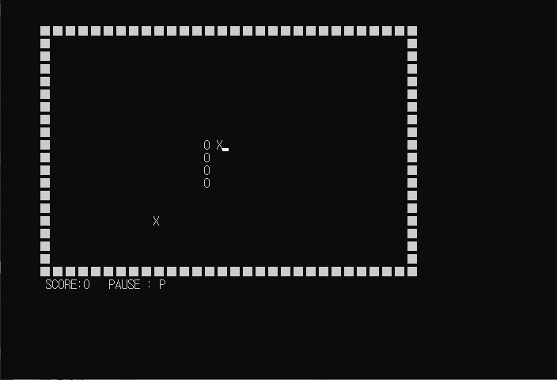
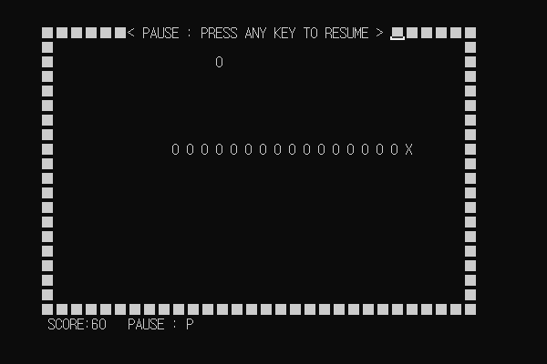
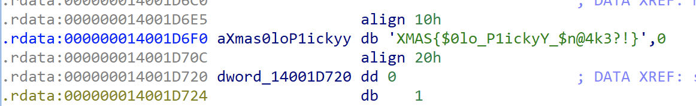
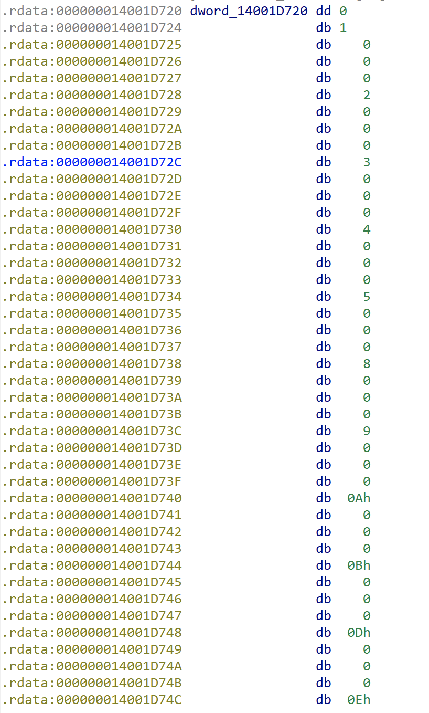

picky_eater는 snake game을 윈도우 콘솔로 구현한 미스크 문제입니다.

> 옛날옛날에 먹고싶은 것만 먹는 편식쟁이 뱀이 있었어요 편식쟁이 뱀은 먹기 싫은걸 먹으면 티를 낸답니다!

위와 같은 문제의 디스크립션과 함께 바이너리가 주어집니다.

바이너리를 실행하면 위와 같은 화면이 나오는데, 아무키나 누르면 snake 게임이 시작됩니다.

snake 게임의 룰은 간단합니다! 처음엔 짧은 길이의 뱀이 나오는데, 이 뱀을 컨트롤해 화면상에 나오는 먹이를 먹으면 뱀 길이가 길어지고 뱀의 속도가 빨라지는 간단한 룰이죠

뱀의 먹이로는 문자가 하나씩 나옵니다. 문자들을 하나씩 모아보면`XMAS{$0lo_P1ickyY_$n@4k3?!}` 라는 플래그가 나오는데, 이 플래그를 인증하면 인증에 실패하게 됩니다.

진짜 플래그는 게임의 규칙을 통해 얻을 수 있는데, 문제의 디스크립션을 다시 한 번 볼까요?

> 옛날옛날에 먹고싶은 것만 먹는 편식쟁이 뱀이 있었어요 편식쟁이 뱀은 먹기 싫은걸 먹으면 티를 낸답니다!

먹이를 먹으면 다음과 같은 변화가 발생합니다.

1. 길이가 길어짐
2. 속도가 빨라짐

속도는 육안으로 확인하기 어려울 것 같으니, 길이와 관련된 규칙을 생각하며 플레이해봅시다.

처음 길이는 머리를 제외하고 4칸입니다.

첫 번째 먹이인 `X` 를 먹고 P로 일시정지를 해보겠습니다.

뱀의 길이가 6으로 두 칸 길어졌네요. 이렇게 `XMAS{$` 까지 먹어보겠습니다.

길이가 16이니까 XMAS{$ 를 먹었을땐 모두 길이가 길어진 것을 확인이 가능합니다. 

그러나 `0` 을 먹었을때는 길이가 16 그대로군요. 이렇게  `XMAS{$0lo_P1ickyY_$n@4k3?!}` 중 먹었을 때 길이가 늘어나지 않는 문자를 빼면 `XMAS{$o_P1cky_$n4k3!}` 라는 진짜 플래그가 나오게 됩니다!

참고로 IDA에서 분석해보면 fake flag가 있고

플래그 index 가 있는 배열이 있어 이걸 보고 풀어도 됩니다.

여담으로.. fake flag를 너무 진짜처럼 넣어놓는 바람에.. picky_eater가 공개되자마자 플래그 인증요청과 문의가 폭주해서 정신을 못차렸었네요 하하..

> 간단요약짤 - picky_eater 공개 10분 뒤 문제 별 플래그 인증요청횟수(태그 클라우드)

플래그 인증 관련해서 문제가 없다는 공지를 올린 이후 많은 팀들이 풀어주셨지만, 문제 출제 중 미처 생각 못한 점 때문에 참가자분들께 혼란을 드려 반성하고 있습니다 ㅠㅠㅠ