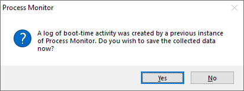

안녕하세요 L0ch입니다! 오늘 들고온 번역글은 복잡한 분석 없이 Process Monitor로만 찾을 수 있는 Windows의 간단한 권한 상승 취약점인데요, 쉬운 내용이라 부담없이 읽기 좋을 것 같아 슬쩍 번역해왔습니다 ㅎㅎ

> 원문 : [Finding Privilege Escalation Vulnerabilities in Windows using Process Monitor](https://vuls.cert.org/confluence/display/Wiki/2021/06/21/Finding+Privilege+Escalation+Vulnerabilities+in+Windows+using+Process+Monitor#FindingPrivilegeEscalationVulnerabilitiesinWindowsusingProcessMonitor-Useofalibrarythatloadsfromanunexpectedpath)

---


# 개요

이 게시물은 찾는 사람이 드문 Windows의 권한 상승 취약점을 찾는 방법에 대해 설명한다. 그리고 해당 취약점을 부분적으로 완화할 수 있는 몇 가지 방법을 소개한다. 그러나 내가 보고싶어하는 변화는 개발자가 처음부터 이러한 취약점을 인지하는 것이다.


[CERT BFF](https://vuls.cert.org/confluence/display/tools/CERT+BFF+-+Basic+Fuzzing+Framework)를 처음 출시했을 때 메모리 커럽션 취약점에 대한 개념 증명 익스플로잇을 구성하는 일반적인 프로세스는 다음과 같다.

1. 타겟의 instruction pointer를 제어할 수 있을때까지 퍼징한다.
2. [BFF string minimization](https://insights.sei.cmu.edu/blog/visualizing-cert-bff-string-minimization/)을 사용해 쉘코드를 저장하는데 사용할 수 있는 공간을 찾는다.
3. 필요에 따라 [ROP](https://en.wikipedia.org/wiki/Return-oriented_programming)를 사용해 쉘코드를 실행할 수 있도록 프로그램 흐름을 수정한다.

CERT BFF를 사용해 PoC까지 도달하는 것은 비교적 간단했다. 그러나 시간이 지남에 따라 메모리 커럽션 취약점을 악용하는 기준이 높아졌는데, 이것은 수년에 걸쳐 일어난 두 가지 일 때문일 수 있다.

1. 소프트웨어 공급 업체의 퍼징테스트 증가
2. 소프트웨어 및 플랫폼 모두에서의 익스플로잇 미티게이션 존재 증가

최근 BFF 초기를 생각나게 하는 취약점 발견 기술에 대해 작업했다. 취약점을 찾는 것과 악용하는 것이 얼마나 쉬운지에 대해 느꼈으며 개념이 너무 사소해서 취약점을 찾는 데 성공했다는 사실에 놀랐다. BFF를 사용한 퍼징에서 익스플로잇까지의 아이디어가 시간이 지남에 따라 점점 어려워진 것처럼 이 기술로 쉽게 찾을 수 있는 취약점이 훨씬 줄어들었으면 한다.

이 게시물에서는 [Sysinternals Process Monitor](https://docs.microsoft.com/en-us/sysinternals/downloads/procmon) (Procmon)를 사용하여 발견한 권한 상승 취약점 중 일부를 공유할 것이다.

# 개념

소프트웨어가 Windows 플랫폼에 설치되면 현재 시스템에 로그온한 사용자 권한에 관계없이 일부 구성 요소가 높은 권한으로 실행될 수 있다. 이러한 권한 있는 구성 요소에는 일반적으로 두 가지 형식이 있다.

1. 설치된 서비스
2. 예약된 작업(Task)

권한이 없는 사용자가 영향을 줄 수 있는 리소스와 권한있는 프로세스가 상호작용할 때마다 권한 상승 취약성의 가능성이 높아진다.

# 찾아야 하는 것

권한이 없는 사용자의 영향을 받을 수 있는 권한 있는 프로세스를 확인하는 가장 쉬운 방법은 다음 조건을 만족하는 프로세스 모니터 필터를 사용하는 것이다.

1. 존재하지 않는 파일 또는 디렉토리
2. 상승된 권한이 있는 프로세스
3. 권한이 없는 사용자가 쓸 수 있는 위치

1과 2는 프로세스 모니터에서 간단하게 구현할 수 있으나 검사 3은 좀 더 복잡하며 프로세스 모니터 필터로 수행할 때 일부 오탐지가 발생할 수 있다. 그래서 권한 상승 취약점을 찾는 데 좋은 역할을 하는 [필터](https://github.com/certcc/privesc)를 만들었다 .

# 필터 사용

Privesc.PMF 프로세스 모니터 필터를 사용하는 것은 비교적 간단하다.

1. 프로세스 모니터 부팅 로깅 활성화(옵션 → 부팅 로깅 활성화)
2. 재부팅 및 로그인
3. 프로세스 모니터 실행
4. 메시지가 표시되면 부팅 로그를 저장한다.

    

5. Privesc 필터 가져오기(필터 → 필터 구성 → 가져오기...)
6. Privesc 필터 적용(Filter → Load Filter → Privesc)
7. 예기치 않은 파일 액세스를 찾아 조사

# 조사 결과

VMware Tools가 설치된 64비트 Windows 10 2004 시스템에서의 부트 로그부터 살펴본다.


VM에 소프트웨어가 거의 설치되어 있지 않아도 이미 의심스러운 것을 볼 수 있다.

```c
C:\Program%20Files\
```

Windows 사용자는 `C:\Program Files\` 경로에 익숙하지만 위 결과에 포함된 `%20`은 일반적인 문자는 아닌 것 같다. 왜 이러한 결과가 나타나는지는 아래 섹션에서 다루도록 한다.

# 개발자의 실수

권한이 있는 프로세스가 권한이 없는 사용자의 영향을 받을 수 있도록 하는 개발자의 많은 실수가 존재한다. Windows 응용 프로그램의 단순 권한 상승 취약점과 관련하여 내가 발견한 실수는 두 가지 주요 범주로 나뉜다.

1. 예기치 않은 경로에 액세스함
2. 사용 중인 경로에 예상치 못한 ACL(액세스 제어 목록)이 적용됨

## 예기치 않은 경로 액세스

경우에 따라 프로그램 실행 중에 예기치 않은 경로에 액세스한다. 즉, 개발자는 이러한 경로에 액세스하고 있다는 사실을 알게 되면 아마 놀랄 것이다. 이러한 예기치 않은 경로 액세스는 여러 가지 이유로 인해 발생할 수 있다.

### URL 인코딩 경로

위의 스크린샷에서 알 수 있듯이 VMware Tools 프로세스 `VGAuthService.exe`는 `C:\Program%20Files\VMware\VMware%20Tools\VMware%20VGAuth\schemas\xmldsig-core-schema.xsd` 경로에 액세스를 시도한다. 공백이 포함된 경로가 URL로 인코딩된 경우 해당 공백이 `%20`으로 대체된 것이다.

이러한 결과는 요청된 경로가 기본적으로 적절한 ACL이 있는 `C:\Program Files\`의 하위 디렉토리가 아니라 루트 디렉토리를 보기 시작한다는 것이다. Windows 시스템은 권한이 없는 사용자도 시스템 루트 디렉토리에서 하위 디렉토리를 만들 수 있으며 이것은 반복해서 나오는 주요 개념이 될 것이므로 이것을 기억하자.

권한이 없는 명령 프롬프트에서 무엇을 할 수 있는지 보자:


> 루트 디렉토리 `C:\` 에서 하위 디렉토리를 생성할 수 있다. 따라서 `C:\` 에서 `Program%20Files` 디렉토리도 생성할 수 있다.

파일 액세스를 선택하고 Ctrl-K를 눌러 콜스택을 가져옴으로써 Process Explorer에서 조금 더 깊이 파고들 수 있다.


파일 액세스가 `VGAuthService.exe + 0x110d9`에 의해 트리거되고 그 과정에서 `xmlLoadExternalEntity()`에 대한 호출이 있음을 알 수 있다.

경로가 URL로 인코딩되어 있기 때문에  권한 있는 프로세스는 존재하지 않는 경로의 파일을 로드하려고 시도하게 된다. 권한이 없는 사용자가 이 경로를 생성할 수 있으므로 권한이 없는 사용자가 권한이 있는 프로세스에 영향을 줄 수 있는 경우가 된다. 이 경우 결과는 XXE(XML External Entity) 취약점뿐이지만 이는 단지 워밍업에 불과하다.

### POSIX 경로

응용 프로그램이 Windows 시스템에서 POSIX 스타일 경로를 사용하는 경우 이 경로는 Windows 스타일 경로로 정규화된다. 예를 들어, Windows 응용 프로그램이 `/usr/local/` 디렉토리에 액세스하려고 하면 경로는 `C:\usr\local\`로 해석되며 위에서 설명한 것과 마찬가지로 Windows에서 권한이 없는 사용자가 만들 수 있는 경로이다.

다음은 패치된 보안 제품이 설치된 시스템의 프로세스 모니터 로그다.


`openssl.cnf`를 통해 코드를 실행하기 위해 공개적으로 알려진 기술을 사용하여 제한된 사용자 계정에서 SYSTEM 권한으로 `calc.exe`를 실행하여 code execution을 시연할 수 있다.


### 예상치 못한 경로에서 로드되는 라이브러리 사용

경우에 따라 개발자가 권한이 없는 Windows 사용자의 영향을 받을 수 있는 위치에서 로드된 라이브러리를 사용할 수 도 있다. 예를 들어 다음은 `C:\CMU\bin\sasl2` 경로에 액세스를 시도하는 애플리케이션의 프로세스 모니터 로그이다.


콜스택을 보면 이 액세스가 `libsasl.dll` 라이브러리에 의해 트리거되는 것을 알 수 있다.


`libsasl.dll`에 대한 코드를 보면 **[C:\CMU\bin\sasl2** 경로에 대한 하드 코딩된 참조를](https://github.com/cyrusimap/cyrus-sasl/blob/eeb935a9198172aede242c77b0e0dafe9312db10/win32/include/config.h#L117)  볼 수 있다.

권한이 없는 사용자는 디렉토리를 만들고 거기에 원하는 코드를 배치할 수 있으며 모든 권한이 없는 사용자 계정에서 SYSTEM 권한으로 `calc.exe`를 실행할 수 있다.


### 개발자 시스템에만 존재하는 경로 사용

프로그램은 개발자의 시스템에만 존재하는 경로에 대한 참조를 포함할 수 있다. 해당 디렉토리가 없는 시스템에서 소프트웨어가 제대로 작동하고 누군가가 찾지 않는 한 이 속성은 발견되지 않을 수 있다. 예를 들어, 이 소프트웨어는 `C:\Qt\` 디렉토리 에서 `plugins` 하위 디렉토리를 찾는다.


몇 가지 단계를 건너뛸 것이지만 적절한 디렉토리에 라이브러리를 배치해 code execution을 달성할 수 있음을 알 수 있다.


Qt 개발 플랫폼을 자세히 살펴보면 이러한 유형의 취약점은 잘 알려진 문제다. 이 취약점은 5년 전에 패치되었지만 CVE를 받지 못했으며 해당 패치가 도입되기 이전의 Qt 버전으로 구축되었거나 개발자가 `Qt5core.dll`에 저장된 `qt_prfxpath` 값을 패치하기 위해 `windeployqt`를 사용하지 않은 경우 소프트웨어가 권한 상승에 취약할 수 있다.

## 사용 중인 경로에 예기치 않은 ACL이 적용됨

응용 프로그램에서 예기치 않은 경로에 액세스하는 대부분의 경우는 사실 단순한 곳에 원인이 있다. 권한이 없는 사용자는 Windows 시스템 루트 디렉토리에서 하위 디렉토리를 만들 수 있다. ACL을 적절하게 설정하지 못하는 소프트웨어를 찾으려면 조금 더 조사해야 한다.

Windows 소프트웨어와 관련된 대부분의 ACL 문제는 한 가지 개념과 관련이 있다.
`C:\Program Files\` 또는 `C:\Program Files (x86)\`의 하위 디렉토리에서 실행되는 소프트웨어는 상속을 통해 기본적으로 보안 ACL을 갖는다. 예를 들어 소프트웨어를 `C:\Program Files\WD\`에 설치하는 경우, 권한이 없는 사용자는 `C:\Program Files\`의 상위 디렉토리에 권한이 없는 프로세스가 쓸 수 없고 기본적으로 `WD` 하위 디렉토리가 상위 권한을 상속하므로 권한이 없는 사용자는 `WD` 하위 디렉토리의 내용을 수정할 수 없다.

### ACL을 명시적으로 설정하지 않고 C:\ProgramData\ 디렉토리 사용

`ProgramData` 디렉토리는 의도적으로 상승된 권한 없이 쓸 수 있다. 따라서 `ProgramData` 디렉토리에 생성된 모든 하위 디렉토리는 기본적으로 권한이 없는 사용자가 쓸 수 있다. 응용 프로그램이 `ProgramData` 하위 디렉토리를 사용하는 방법에 따라 하위 디렉토리에 대한 ACL이 명시적으로 설정되지 않은 경우 권한 상승이 가능할 수 있다.

다음은 `C:\ProgramData\` 디렉토리에서 실행되며 예약된 업데이트 구성 요소가 있는 응용 프로그램이다.


이것은 소프트웨어가 실행되는 디렉토리의 느슨한 ACL로 인해 가능한 DLL hijacking의 직접적인 사례이다. 


이제 직접 제작한 `calc.exe`를 실행하는 `msi.dll`을 배치하면 성공적으로 SYSTEM 권한의 `calc.exe` 가 실행된다. 이러한 문제는 만연하며 악용하기가 쉽다.

DLL hijacking이 권한 상승을 위한 유일한 옵션이 아니라는 점은 주목할 만 하다. 권한 있는 프로세스에서 사용하는 모든 사용자 쓰기 가능 파일은 권한 상승 취약점에 취약할 가능성이 있다. 예를 들어, 다음은 권한 있는 자동 업데이트 메커니즘을 지시하기 위해 사용자가 생성할 수 있는 텍스트 파일을 확인하는 프로그램이다. 아래에서 볼 수 있듯이 조작된 텍스트 파일이 있으면 임의의 명령이 실행될 수 있고 사진의 경우 `calc.exe`를 시작한다.


### 시스템 루트의 하위 디렉토리에 설치

기본적으로 응용 프로그램을 시스템 루트의 다른 디렉토리에 배치하는 설치 프로그램은 보안을 유지하기 위해 적절한 ACL을 설정해야 한다. 예를 들어 Python 2.7은 기본적으로 `C:\python27\`에 설치된다.


이 디렉토리의 기본 ACL을 사용하면 권한이 없는 사용자가 이 디렉토리의 내용을 수정할 수 있다. 이제 이것으로 DLL hijacking 기술을 시도해 볼 수 있다.


이는 어렵게 생각할 필요도 없다. 권한이 없는 사용자로 `C:\python27\` 디렉토리의 모든 파일을 간단히 바꿀 수 있다.


### ACL 설정 없이 사용자 지정 설치 디렉토리 허용

많은 설치 프로그램은 `C:\Program Files\`의 기본적인 보안 ACL 상속으로 인해 안전하다. 그러나 사용자가 자신의 설치 디렉토리를 선택할 수 있도록 하는 설치 프로그램은 대상 위치에 ACL을 명시적으로 설정해야 한다. 그러나 테스트에서 설치 프로그램이 ACL을 명시적으로 설정하는 경우는 매우 드물다는 것을 발견했다. 예를 들어 Microsoft SQL Server 2019 설치 프로그램을 살펴보도록 한다.


> "고급" 또는 "사용자 지정" 설치를 수행할 필요도 없이 설치 과정에서 원하는 경로를 설정할 수 있다.

설치 프로그램이 ACL을 소프트웨어를 설치하는 디렉토리로 설정하는지 확인한다.


> SQL Express 2019가 설치된 위치를 수정할 수 있다.


Microsoft SQL Server 2019와 같이 설치할 위치를 선택할 수 있는 거의 모든 Windows 응용 프로그램은 단순히 설치된 디렉토리에 따라 권한 상승에 취약할 수 있음을 보여준다.

# 권한 상승 취약점 방어

## 권한 없는 사용자의 시스템 루트에서 "폴더 만들기" 권한 제거

위에 설명된 공격에 대한 가장 간단한 방어는 시스템 루트 디렉토리에서 폴더를 만들 수 있는 권한을 제거하는 것이다.


## C:\Program Files\ 외부에 소프트웨어 설치하지 않기

소프트웨어가 `C:\Program Files\` 또는 `C:\Program Files (x86)\` 이외의 위치에 설치된 경우  ACL을 명시적으로 설정하기 때문에 안전하다. 권장되는 프로그램 위치에만 소프트웨어를 설치하면 위와 같은 취약점을 피할 수 있다.

## 시스템 테스트 및 강화

위에서 설명한 프로세스 모니터 필터 및 기술을 사용하여 권한 상승 취약성에 대해 자체 플랫폼을 테스트할 수 있다. 안전하지 않은 것으로 확인된 파일 위치의 경우 권한이 없는 사용자가 해당 위치를 수정할 수 없도록 해당 디렉토리를 수동으로 잠글 수 있으며 발견한 취약점의 경우 해당 공급업체에 연락해 취약점을 알리는 것이 좋다. 공급업체와의 커뮤니케이션의 경우 CERT/CC가 지원을 제공 할 수 있다.