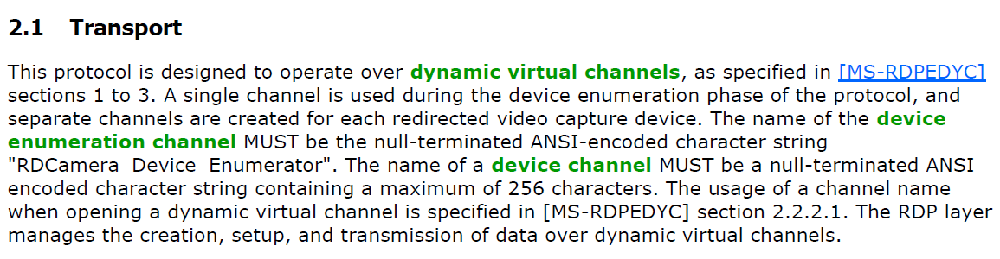

원문 링크 : [https://www.cyberark.com/resources/threat-research-blog/fuzzing-rdp-holding-the-stick-at-both-ends](https://www.cyberark.com/resources/threat-research-blog/fuzzing-rdp-holding-the-stick-at-both-ends)

이전 글 바로가기 :  [[Translation] Fuzzing RDP: Holding the Stick at Both Ends (1)](https://hackyboiz.github.io/2021/10/17/j0ker/rdp_fuzzing1/)

---

# [Technical Details: The Challenges and How to Overcome Them - 2]

## Statefulness

첫 번째 채널을 실행했을 때, 클라이언트 측에서 잘못된 메시지 두 개가 감지되자마자 연결이 바로 종료되는 문제가 발생했습니다. 해당 문제를 해결하기 위해 에이전트 로직에 몇 가지 **protocol grammer** 시행을 도입했습니다. 즉, 허용된 인풋 공간을 제한하는 것으로 다음과 같이 구현했습니다.

- 메시지 크기 제한
    - 최대값 및 최소값
    - 나눌 수 있음(예: 메시지에 4byte 요소의 가변 길이 배열이 포함된 경우 4로 나눌 수 있어야 함)
- 값 제한
    - 특정 값만 허용
    - 최소값과 최대값
    - PDU 사이즈와 같은 값
    - 값은 각 PDU마다 달라야 함

[MS의 RDP 및 확장 문서](https://docs.microsoft.com/en-us/openspecs/windows_protocols/ms-rdpbcgr/5073f4ed-1e93-45e1-b039-6e30c385867c) 에서 RDP 문법 일부를 추출하고 관련 바이너리를 리버스 엔지니어링 한 뒤 나머지는 실패한 타겟 실행을 트레이싱해 추출했습니다.

예를 들어, 해당 로직은 지원되는 `msgType` 중 하나로 시작하는 메시지만 허용하고 그 뒤 PDU 크기와 고유 식별자가 와야 하며 총 크기는 22~122, 나머지는 2 modulo 4를 남기는 메시지만 허용합니다.

이 과정에서 원하는 대로 테스트 케이스를 변경하는 mutation engine의 성능을 제한하면 흥미로운 mutation을 놓칠 수 있다는 것이 중요합니다. 이러한 이유 때문에 연결이 너무 자주 닫히지 않도록 하면서 가능한 한 적은 횟수로 시행하려고 했습니다.

또 다른 중요한 점은 이러한 문제를 해결할 때 위 방법이 유일한 선택지는 아니라는 것입니다. 특정 채널(GFX)의 경우, 퍼징하는 타겟을 패치해 잘못된 메시지 세트의 경우에도 연결을 닫지 않도록 했습니다. 이와 같이 잘못된 메시지를 계속 퍼징하며 연결을 열어둘 수 있었으나 패치 이전 원래 코드에서는 재현되지 않는 크래시를 발견할 문제도 있습니다. 이는 타겟 프로그램의 원래 기능을 유지하면서 충분한 실행 속도를 확보하는 것과 mutation engine의 성능 사이 균형의 필요성을 의미합니다.

## Multi-input Fuzzing

우리가 발견한 대부분의 버그가 적어도 두 개의 메시지와 관련된 것처럼 대부분의 로직에서 발견되는 버그는 단일 메시지가 아닌 메시지 시퀀스에 의해 발견됩니다. 

이러한 버그를 발견하기 위해 다중 인풋 퍼징을 도입했습니다. 새 메시지의 시작과 그 유형을 식별하는 fuzzer dictionary를 사용했으며 에이전트는 해당 dictionary word에 따라 인풋을 여러 PDU로 분할하고 차례로 보냅니다.

따라서 다중 인풋은 다음과 같이 나타낼 수 있습니다.

```cpp
___cmd07 <1st PDU data>
___cmd02 <2nd PDU data>
___cmd03 <3rd PDU data>
```

에이전트는 `msgType`이 7, 2, 3인 3개의 메시지와 각각의 내용으로 변환합니다.

퍼저가 생성한 인풋과 이들이 트리거한 코드 범위의 일대일 대응을 유지하기 위해 시퀀스의 마지막 메시지를 식별하는 두 번째 마커를 도입했습니다. WinAFL이 시퀀스의 마지막 마커를 식별하면 호출이 종료되었음을 알고 주기를 마무리한 뒤 다음 인풋을 생성합니다.

*다중 인풋 퍼징이 결정적인 결과룰 냈고, 또한 각 테스트 케이스에 대한 PDU의 수를 제한할 필요가 있음을 발견했습니다. 이는 퍼저가 다른 코드 시퀀스로 이어지는 입력에 영향을 받기 때문입니다. 동일한 메시지를 100번 반복하면 한 번 보내는 것과 다른 코드 시퀀스가 생성됩니다.*

## Reproduction Issues

약 1주일간의 퍼징 후 첫 번째 크래시가 나타났습니다. 그러나 동일한 입력을 다시 실행했을 때에는 크래시가 재현되지 않았습니다. 이 문제는 꽤 자주 발생했으며 프로토콜의 상태 저장 특성 때문인 것으로 예측했습니다. 다시 말해, 하나의 테스트 케이스가 클라이언트를 특정 상태로 만들면 후속 테스트 케이스에서 크래시를 발생시킬 때 영향을 준다는 것입니다.

재현할 수 없는 크래시를 이해하기 위해 크래시가 감지될 때마다 대상 프로세스의 메모리 덤프를 생성하도록 WinAFL을 수정했습니다.

## Crash Analysis Automation

크래시 발생 시 덤프를 생성하는 것으로 문제를 해결했지만 또 다른 문제가 발생했습니다. 크래시가 한번 발견되면 반복적으로 발생할 가능성이 매우 높습니다. 일반적으로 WinAFL은 동일한 크래시를 감지하고 “고유한 크래시”에 대해서만 알리지만 다중 메시지 퍼징으로 인해 이를 감지하기가 어렵습니다.

하나의 메시지로 인해 크래시가 발생하는 경우 퍼저는 이를 기반으로 모든 메시지 세트를 생성할 수 있습니다. 각 메시지 세트는 크래시를 발생시키고 메시지마다 처리 방식이 다르기 때문에 다른 커버리지의 비트맵을 생성합니다. 이로 인해 WinAFL은 매번 고유한 크래시를 보고합니다.

두 가지 이유로 충돌 분석을 자동화해야만 했는데 첫번째는 각 충돌을 수동으로 분석하는 것은 비효율적인 작업이며 둘째로는 디스크가 메모리 덤프로 빠르게 채워진다는 것입니다.

이 문제를 해결하기 위해 크래시를 분석하고 스택을 추출하는 WinDBG 스크립트를 작성했습니다. 그런 다음 주기적으로 크래시를 분석하고 새로운 스택이 포함된 스택만 유지하는 PowerShell 스크립트를 실행했습니다.

## Long Startup Time

클라이언트 퍼징 설정에서는 퍼저에 의해 타겟(`mstsc.exe`)이 생성된 순간부터 연결이 설정되어 첫 번째 메시지를 보낼 수 있는 순간까지 10초 이상 걸려 타겟을 다시 시작하지 않고 가능한 한 많은 iteration을 수행하는 것이 중요했습니다. AFL-Fuzz의 `-fuzz_iterations` 매개변수를 사용하고 많은 iteration을 제공하는 것으로 해결했습니다.

## Multi-channel Fuzzing

다중 인풋 퍼징과 마찬가지로 일부 로직에는 서로 다른 채널에서의 메시지 시퀀스가 필요합니다. 예를 들어 [문서](https://docs.microsoft.com/en-us/openspecs/windows_protocols/ms-rdpecam/92af6790-b79c-4813-9c07-7c545bed0242)에 설명된 대로 클라이언트에서 서버로 카메라 데이터를 보내는 것은 여러 채널을 사용합니다.



> *출처: [[MS-RDPECAM](https://docs.microsoft.com/en-us/openspecs/windows_protocols/ms-rdpecam/92af6790-b79c-4813-9c07-7c545bed0242)]*
> 

따라서 카메라 입력을 전송하여 서버를 퍼징하려면 최소 두 개의 다른 채널에서 수행해야 했으며 fuzzer dictionary가 메시지가 전송될 채널을 결정했습니다.

## Locating relevant code

RDP는 복잡하고 다양한 구성 요소를 가지고 있기 때문에 퍼징해야 하는 타겟 함수를 찾는 것조차 어려울 수 있습니다.

```cpp
PS C:\> gci -Include *.exe, *.dll, *.sys -Recurse C:\Windows\ -ErrorAction SilentlyContinue | ?{[System.Diagnostics.FileVersionInfo]::GetVersionInfo($_).FileDescription -match "RDP|Remote Desktop"} | Measure-Object | select count

Count
-----
  191
```

이를 해결하기 위해 프로젝트와 관련된 모든 심볼을 포함하는 데이터베이스를 만들었습니다.

Windows 버전과 관련된 모든 PDB를 다운로드하고 함수 이름을 추출한 다음 파일에 덤프(exe/sys/dll에 다시 연결)하여 함수 이름을 빠르게 검색하고 현재 타겟 채널과 관련된 함수를 찾습니다.

거의 모든 dynamic channel 수신 기능이 `C<class-name>::OnDataReceived` 패턴과 일치하기 때문에 이러한 함수 목록을 빠르게 살펴보고 우리가 목표로 하는 채널과 관련이 있는 것이 무엇인지 파악할 수 있습니다.

# **Bug Case Studies**

이 섹션에서는 이 프로젝트에서 발견한 두 가지 버그에 대한 기술적인 세부 정보를 공유합니다.

## AUDIO_PLAYBACK Channel (Server → Client)

`AUDIO_PLAYBACK_DVC` 가상 채널은 클라이언트가 서버에서 나오는 사운드를 재생하는 데 사용됩니다. 정상적인 흐름은 초기화와 데이터 전송의 두 가지 시퀀스로 구성됩니다. 초기화 시퀀스는 처음에 한 번 발생하고 그 다음에는 여러 데이터 전송 시퀀스가 발생합니다.

- **Initialization Sequence** - 데이터 시퀀스에서 사용할 버전 및 포맷을 설정하는 데 사용됩니다.


> *출처: [[MS-RDPEA](https://www.notion.so/16b2c1acde034f6cac0caf42b6ca6e97)]*
> 

- **Data Transfer Sequence** - 클라이언트에서 재생할 서버의 사운드 데이터


> *출처: [[MS-RDPEA](https://docs.microsoft.com/en-us/openspecs/windows_protocols/ms-rdpea/bea2d5cf-e3b9-4419-92e5-0e074ff9bc5b)]*
> 

Wave 및 WaveInfo PDU에는 전송된 데이터의 포맷을 결정하는 초기화 시퀀스에서 교환되는 포맷 배열에 대한 인덱스가 포함되어 있습니다.


> *출처: [[MS-RDPEA](https://docs.microsoft.com/en-us/openspecs/windows_protocols/ms-rdpea/bea2d5cf-e3b9-4419-92e5-0e074ff9bc5b)]*
> 

포맷 변경이 발생하면(즉, Wave 또는 WaveInfo PDU에 포함된 인덱스가 마지막으로 사용한 인덱스와 다르면) 클라이언트는 새 인덱스가 유효한지 확인합니다.

```cpp
// in mstscax!CRdpAudioController::OnNewFormat
if ( (unsigned int)new_format_index >= this->formatArray_size )
```

그러나 포맷 인덱스가 동일하게 유지되면 이 과정을 건너뛰는 과정에서 `OnNewFormat()`  함수가 호출되지 않으며 인증 코드가 포함되어 있습니다. 다음은 관련 부분의 의사 코드입니다.

```cpp
// in mstscax!CRdpAudioController::OnWaveData
last_format_index = this->last_format_index;
format_index_from_pdu = *((_WORD *)pdu + 3); //pdu is controlled by the server
if ( last_format_index != format_index_from_pdu )
{
    CRdpAudioController::OnNewFormat(this, (__int64 *)format_index_from_pdu); // this is where the bound check is being made
                                                                              // but only if the format index is different than the last index
    last_format_index = *((unsigned __int16 *)pdu + 3);
    this->last_format_index = last_format_index;
}
formats_array = (AUDIO_FORMAT **)this->formatArray;
current_format = formats_array[last_format_index]->wFormatTag; // crashes here
```

클라이언트에서 이 버그를 유발하는 취약한 흐름은 다음과 같습니다.


- 서버는 클라이언트에 `0x1A` 포맷의 서버 오디오 포맷 PDU를 전송하여 클라이언트가 이 크기의 포맷 배열을 할당하도록 합니다.
- 서버는 사운드 데이터가 있는 배열에서 포맷 `0x5`를 사용하는 Wave2 PDU를 클라이언트에 보냅니다.
    - 클라이언트는 이 포맷이 마지막으로 보낸 것과 동일한지 확인합니다.
    - 동일하면 마지막 디코더(formats 배열의 포맷 항목에서 역참조)를 사용하고 동일하지 않다면포맷 배열에서 새 디코더 함수 포인터를 로드합니다.
- 서버는 클라이언트에게 서버 오디오 포맷 PDU를 다시 보냅니다. 이번에는 `0x2` 포맷만 사용해 클라이언트가 이전 포맷 배열을 해제하고 새 크기로 새 배열을 할당하도록 합니다.
- 서버는 마지막으로 사용된 포맷 `0x5`를 사용하여 마지막으로 다른 Wave2 PDU를 보냅니다.
    - 포맷이 변경되지 않았으므로 클라이언트는 유효성 검사를 수행하지 않습니다.
    - 클라이언트는 2-format array 배열에서 여섯 번째 포맷을 읽으려고 하는 out-of-bound read를 수행하고 크래시가 발생합니다.
    

이를 통해 공격자는 추가 서버 오디오 포맷 PDU를 사용하여 배열을 재할당한 뒤 이전에 사용했던 잘못된 인덱스를 지정하여 클라이언트가 포맷 배열의 범위를 벗어나 읽게 하고 크래시를 발생시킬 수 있습니다.

이 버그는 다중 인풋 퍼징을 사용했기 때문에 발견할 수 있었습니다.

## AUDIO_INPUT Channel (Client → Server)

`AUDIO_INPUT` 가상 채널은 클라이언트에서 서버로 사운드 입력을 보내는 데 사용됩니다. 서버 측에서 오디오 입력 데이터는 높은 권한의 `audiodg.exe` 프로세스에서 처리됩니다.

`AUDIO_PLAYBACK_DVC` 채널에서와 같이 클라이언트와 서버는 먼저 지원하는 사운드 포맷 배열을 교환합니다.


> *출처: [[MS-RDPEAI](https://docs.microsoft.com/en-us/openspecs/windows_protocols/ms-rdpeai/)]*
> 

사운드 포맷 PDU는 command, 포맷 수 및 패킷 크기를 포함하는 9 byte 헤더로 시작하고 그 뒤에 각각 가변 길이(추가 데이터의 선택적 필드 포함) 형식의 배열이 옵니다.


> *출처: [[MS-RDPEAI](https://docs.microsoft.com/en-us/openspecs/windows_protocols/ms-rdpeai/)]*
> 

사운드 포맷 PDU를 처리하는 코드는 `rdpendp.dll`에 있습니다. 먼저 패킷 크기가 9 bytes 이상인지 확인한 다음 헤더를 읽고 헤더의 크기가 패킷 크기보다 크지 않은지 확인합니다.

```cpp
// in rdpendp!CAudioInputHandler::OnFormatsReceived
  if ( size < 9 )
  {
    // ...
  }
  // ...
  size_from_msg = *(_DWORD *)(data + 5);
  if ( size_from_msg > size )
  {
    // ...
  }
```

동일한 함수에서 헤더에서 읽은 크기인 9를 빼고 헤더에 지정된 포맷 수를 읽습니다.

헤더의 크기는 interger underflow를 검증하지 않습니다. 이로 인해 위 연산의 결과로 언더플로우되면 프로그램이 패킷 끝 이후부터 포맷을 읽을 수 있습니다.

```cpp
// in rdpendp!CAudioInputHandler::OnFormatsReceived
underflowed_size = size_from_pdu - 9;
format_definition_offset = (unsigned __int16 *)(pdu + 9);
if ( num_formats )
{
    while ( underflowed_size >= 0x12 )
    {
        format_definition_size = format_definition_offset[8];
        total_format_size = format_definition_size + 18;
        if ( underflowed_size < (unsigned __int64)(format_definition_size + 18) )
            break;
        (*class_fomats_array)[format_index] = (struct SNDFORMATITEM *)operator new[](total_format_size);
        local_format = (*class_fomats_array)[format_index];
        if ( !local_format )
        {
            status = E_OUTOFMEMORY;
            goto CLEAN_AND_RETURN;
        }
        memcpy_0(local_format, format_definition_offset, total_format_size);
        format_definition_offset = (unsigned __int16 *)((char *)format_definition_offset + total_format_size);
        underflowed_size -= total_format_size;
        if ( ++format_index >= num_formats )
            goto LABEL_50;
    }
    goto INVALID_ARG_EXIT;
}
```

우리는 `audiodg` 프로세스의 초기화를 제어할 수 없으므로 DynamoRIO 연결 기능을 사용해 이 버그를 찾을 수 있었습니다.

## Summary

이 블로그 포스트에서 퍼징 타겟인 Windows의 RDP 클라이언트와 서버 퍼징 위한 프로세스를 소개하고 과정을 공유했습니다.

첫째, 원래 목표(예: RCE)에 도달할 수 없는 경우에도 프로세스를 공유하는 것이 중요하다고 생각합니다. 이는 자신의 프로세스, 즉 잘 작동하는 것처럼 보였던 것과 개선할 수 있었던 점을 반영하는 데 도움이 될 수 있습니다. 이는 보안 커뮤니티가 과거 경험에서 배우는 데 도움이 될 수 있습니다.

둘째, 퍼징 환경을 설정하는 것은 복잡한 과정일 수 있지만 추구할 가치가 있는 목표라고 생각합니다. RDP는 많은 구성 요소와 다양한 코드 기반으로 구성된 매우 복잡한 프로토콜입니다. 인기가 높다는 사실과 결합하면 공격자에게 좋은 표적이 됩니다. 이는 보안 커뮤니티로서 보안을 강화하기 위해 많은 노력을 기울여야 함을 의미합니다.


> *인터넷 연결 RDP 서버. 출처 : [shodan.io](https://www.shodan.io/search?query=port%3A%223389%22)*
> 

Microsoft는 최근 몇 년 동안 제품 보안에 상당한 노력을 기울였지만 RDP 구성 요소에 더 많은 취약점이 있다고 생각합니다. 이 과정에서 얻은 지식과 여기에 공유된 정보를 바탕으로 향후 연구를 추진할 수 있습니다. 추구할 가치가 있는 프로젝트의 예로는 퍼징 성능 개선, 퍼징 기회가 없었던 다른 채널로 확장, 에뮬레이터 기반 퍼저 사용 또는 코드에 대한 수동 분석 수행 등이 있습니다.

마지막으로 퍼징 솔루션의 결과를 보여주기 위해 여러 RPC 서버에 퍼징 솔루션을 적용했습니다. 앞으로 더 많은 결과를 볼 수 있을 것이라 기대합니다.