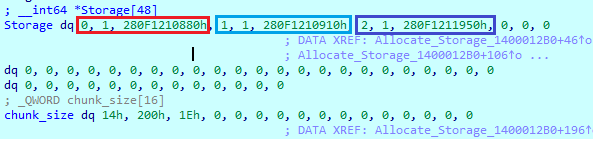

# 시리즈 바로가기
[Hip하게 Heap 정복하기 Part 1 - Segment Heap(1)](https://hackyboiz.github.io/2021/09/19/l0ch/segment-heap-part1/)
[Hip하게 Heap 정복하기 Part 2 - Segment Heap(2)](https://hackyboiz.github.io/2021/10/10/l0ch/segment-heap-part2/)
Hip하게 Heap 정복하기 Part 3 - HITCON 2020 Michael's Storage ← Now!
[Hip하게 Heap 정복하기 Part 4 - HITCON 2020 Michael's Storage(2)](https://hackyboiz.github.io/2021/12/19/l0ch/segment-heap-part4/)
[Hip하게 Heap 정복하기 Part 5 - HITCON 2020 Michael's Storage(3)](https://hackyboiz.github.io/2022/01/09/l0ch/segment-heap-part5/)


안녕하세요! L0ch입니다. 정말 오랜만에 올리는 연구글이네요 ㅠㅠ 연말에 일복터지는건 작년 크리스마스 CTF에 이어 올해도 똑같다니 ㅠㅠㅠㅠㅠㅠ 이번 크리스마스도 여유롭게 보내기는 틀린거겠죠,, 

정신이 없을수록 귀여운거 보면서 힐링을 해야 해요.. 그래서 요즘 인기있는 CPU 사용률을 알려주는 고양이 RunCat을 사용해봤습니다ㅎㅎ 이름부터 고양이 달린다라니.. 귀여워


CPU을 얼마나 쓰느냐에 따라서 고양이가 달리는 속도가 달라지는데요, 풀로드하면 호다다닥 뛰는게 귀여워서 그만 집 데스크탑이랑 맥북에 전부 깔아버렸지 뭐예요..


> 집사가 vm 4개를 동시에 돌리기 시작했다.
> 

나만 고양이 없어서 이렇게라도 대리만족 하고 있습니다


윈도우용 주인님은 [https://github.com/Kyome22/RunCat_for_windows/releases](https://github.com/Kyome22/RunCat_for_windows/releases) 에서 모셔오시면 됩니다!

고양이 없는 슬픔을 뒤로하고ㅠ 이번 파트에서는 Segment Heap의 나머지 메모리 할당 매커니즘과 구조체를 살펴보고, HITCON 2020에 나온 Segment Heap 익스플로잇 문제도 슬쩍 건드려보도록 할게요! 


# Low Fragmentation Heap

LFH(Low Fragmentation Hip)는 바이트 크기가 1~16,368(0x3FF0)인 할당에 사용됩니다. 예전에 NT 힙에서 나왔던 LFH와 마찬가지로 세그먼트 힙의 LFH도 단편화를 방지하기 위해 버킷 방식으로 존재합니다.

> [NT Heap의 Low Fragmentation Heap 보러가기](https://hackyboiz.github.io/2021/02/28/l0ch/pwncoolsexy-part2/#Low-Fragmentation-Heap)
> 

LFH 구성 요소는 LFH 블록이 할당되는 LFH subsegment를 생성할 때 백엔드를 사용합니다.
LFH subsegment는 첫 번째  page rnage descriptor의 `RangeFlags` 필드에 `PAGE_RANGE_FLAGS_LFH_SUBSEGMENT(0x01)` 비트 세트가 있는 특수한 백엔드 블록 유형이라고 볼 수 있습니다.


## _HEAP_LFH_CONTEXT

`_HEAP_LFH_CONTEXT`에는 LFH 버킷, 사용중인 LFH 버킷 카운터, LFH 상태와 관련된 정보를 나타내는 필드가 존재합니다. HeapBase의 `LfhContext` 필드에 저장되며 다음 필드가 있습니다.

```c
0:043> dt ntdll!_HEAP_LFH_CONTEXT -r
   +0x000 BackendCtx       : Ptr64 Void
   +0x008 Callbacks        : _HEAP_SUBALLOCATOR_CALLBACKS
   +0x030 AffinityModArray : Ptr64 UChar
   +0x038 MaxAffinity      : UChar
   +0x048 SubsegmentCreationLock : Uint8B
   +0x080 Buckets          : [129] Ptr64 _HEAP_LFH_BUCKET

```

- `BackenCtx` : `_SEGMENT_HEAP`(HeapBase)에 대한 포인터
- `Callbacks` : LFH subsegment 및 LFH 컨텍스트를 관리하기 위한 콜백(인코딩됨)
- `MaxAffinity` : 만들 수 있는 affinity 슬롯의 최대 수
- `Buckets` : LFH 버킷에 대한 포인터 배열
    - 버킷이 활성화되면 포인터가 `_HEAP_LFH_BUCKET` 구조체를 가리킴. 그렇지 않은 경우 LFH 버킷 사용을 추적할 때 사용되는 `_HEAP_LFH_ONDEMAND_POINTER` 구조체를 가리킴
    


## _HEAP_LFH_ONDEMAND_POINTER

언급했듯이 LFH 버킷이 비활성화된 경우 `LfhContext.Buckets` 이 사용량 카운터가 되며 필드 정보는 다음과 같습니다.

```c
0:029> dt ntdll!_HEAP_LFH_ONDEMAND_POINTER
   +0x000 Invalid          : Pos 0, 1 Bit
   +0x000 AllocationInProgress : Pos 1, 1 Bit
   +0x000 Spare0           : Pos 2, 14 Bits
   +0x002 UsageData        : Uint2B
   +0x000 AllBits          : Ptr64 Void
```

- `Invalid` : 해당 구조체가 버킷 사용 카운터인지 확인하기 위한 마커
- `UsageData` : LFH 버킷 사용량을 설명하는 WORD 크기의 값
    - 비트 0~4는 버킷 할당시 증가하고, 여유 공간이 생기면 감소하는 값
    - 비트 5~15는 할당 요청 수로, 할당 시 증가
    


## _HEAP_LFH_BUCKET

버킷이 활성화된 경우 `LfhContext.Bucket`는 `_HEAP_LFH_BUCKET` 구조체를 가리킵니다.

```c
0:029> dt ntdll!_HEAP_LFH_BUCKET
   +0x000 State            : _HEAP_LFH_SUBSEGMENT_OWNER
   +0x038 TotalBlockCount  : Uint8B
   +0x040 TotalSubsegmentCount : Uint8B
   +0x048 ReciprocalBlockSize : Uint4B
   +0x04c Shift            : UChar
   +0x04d ContentionCount  : UChar
   +0x050 AffinityMappingLock : Uint8B
   +0x058 ProcAffinityMapping : Ptr64 UChar
   +0x060 AffinitySlots    : Ptr64 Ptr64 _HEAP_LFH_AFFINITY_SLOT
```

- `TotalBlockCount` : 버킷과 관련된 모든 LFH subsegment의 총 LFH 블록 수
- `TotalSubsegmentCount` : 버킷과 관련된 모든 LFH subsegment의 수
- `ContentionCount` : LFH subsegment에서 블록을 할당할 때 식별된 contentions(경합) 수
    - 이 필드가 `RtlpHpLfhContentionLimit`만큼 커질 때마다 요청하는 스레드의 프로세서에 대해 새로운 Affinity Slot이 생성됨
- `ProcAffinityMapping` : AffinitySlots에 대한 index 배열
- `AffinitySlots` : Affinity slot 포인터 배열에 대한 포인터(`_HEAP_LFH_AFFINITY_SLOT`)
    - 첫 버킷이 활성화되면 처음엔 하나의 슬롯만 생성되지만, contentions이 감지될수록 새로운 affinity slot이 생성됨


## _HEAP_LFH_AFFINITY_SLOT

Affinity 슬롯에는 LFH 블록이 할당되는 LFH subsegment가 있습니다. 처음에는 버킷이 활성화되고  하나의 Affinity 슬롯만 생성되지만 모든 프로세서가 동일한 LFH subsegment 집합을 사용하며 일정 수 이상의 경합이 감지되면 새 Affinity 슬롯이 생성되고 요청 스레드의 프로세서가 버킷의 `ProcAffinityMapping` 필드를 통해 새 Affinity 슬롯에 재할당합니다.

```c
0:029> dt ntdll!_HEAP_LFH_AFFINITY_SLOT
   +0x000 State            : _HEAP_LFH_SUBSEGMENT_OWNER
```


## _HEAP_LFH_SUBSEGMENT_OWNER

`LfhAffinitySlot.State` 의 LFH subsegment 추적하는데 사용되며 다음 필드가 있습니다.

```c
0:029> dt ntdll!_HEAP_LFH_SUBSEGMENT_OWNER
   +0x000 IsBucket         : Pos 0, 1 Bit
   +0x000 Spare0           : Pos 1, 7 Bits
   +0x001 BucketIndex      : UChar
   +0x002 SlotCount        : UChar
   +0x002 SlotIndex        : UChar
   +0x003 Spare1           : UChar
   +0x008 AvailableSubsegmentCount : Uint8B
   +0x010 Lock             : Uint8B
   +0x018 AvailableSubsegmentList : _LIST_ENTRY
   +0x028 FullSubsegmentList : _LIST_ENTRY
```

- `AvailableSubsegmentCount` : `AvailableSubsegmentList`에 있는 LFH subsegment의 수
- `AvailableSubsegmentList` : 사용 가능한 LFH 블록이 있는 LFH subsegment의 linked list
- `FullSubsegmentList` : 사용 가능한 LFH 블록이 없는, 모두 찬 상태의 LFH subsegment의 linked list


## _HEAP_LFH_SUBSEGMENT

LFH subsegment는 LFH 블록이 할당되는 곳이며 `RtlpHpLfhSubsegmentCreate()`를 통해 생성 및 초기화됩니다.  LFH subsegment는 해당 구조체를 헤더로 사용합니다.

```c
0:029> dt ntdll!_HEAP_LFH_SUBSEGMENT -r
   +0x000 ListEntry        : _LIST_ENTRY
   +0x010 Owner            : Ptr64 _HEAP_LFH_SUBSEGMENT_OWNER
   +0x010 DelayFree        : _HEAP_LFH_SUBSEGMENT_DELAY_FREE
      +0x000 DelayFree        : Pos 0, 1 Bit
      +0x000 Count            : Pos 1, 63 Bits
      +0x000 AllBits          : Ptr64 Void
   +0x018 CommitLock       : Uint8B
   +0x020 FreeCount        : Uint2B
   +0x022 BlockCount       : Uint2B
   +0x020 InterlockedShort : Int2B
   +0x020 InterlockedLong  : Int4B
   +0x024 FreeHint         : Uint2B
   +0x026 Location         : UChar
   +0x027 WitheldBlockCount : UChar
   +0x028 BlockOffsets     : _HEAP_LFH_SUBSEGMENT_ENCODED_OFFSETS
      +0x000 BlockSize        : Uint2B
      +0x002 FirstBlockOffset : Uint2B
      +0x000 EncodedData      : Uint4B
   +0x02c CommitUnitShift  : UChar
   +0x02d CommitUnitCount  : UChar
   +0x02e CommitStateOffset : Uint2B
   +0x030 BlockBitmap      : [1] Uint8B
```

- `Listentry` : 각 LFH subsegment는 Affinity 슬롯의 LFH subsegment 목록(`LfhAffinitySlot.AvailableSubsegmentList` 또는 `LfhAffinitySlot.FullSubsegmentList`) 중 하나의 노드
- `owner` : 이 LFH subsegment를 소유하는 Affinity 슬롯에 대한 포인터
- `FreeHint` : 최근에 할당되거나 해제된 LFH 블록의 블록 인덱스. 사용 가능한 LFH 블록을 검색할 때 할당 알고리즘에 사용됨
- `Location` : Affiniy 슬롯의 LFH subsegment 목록에서 이 LFH subsegment 위치: 0 - AvailableSubsegmentList, 1 -  FullSubsegmentList
- `FreeCount` : LFH subsegment의 사용 가능한 블록 수
- `BlockCount` : LFH subsegment의 총 블록 수
- `BlockOffsets` : 인코딩된 각 LFH 블록의 크기와 LFH subsegment에서 첫 번째 LFH 블록의 오프셋을 포함하는 DWORD 크기의 하위 구조체
- `BlockSize` : LFH subsegment에 있는 각 LFH 블록의 크기
- `FirstBlockOffset` : LFH subsegment에서 첫 번째 LFH 블록의 오프셋
- `CommitStateOffset` : LFH subsegment에서 커밋 상태 배열의 오프셋.
    - LFH subsegment는 여러 커밋으로 나뉘는데, 커밋 상태는 이러한 각 커밋 상태를 나타내는 WORD 크기 값의 배열
- `BlockBitmap` : 각 LFH 블록은 이 블록 비트맵에서 2비트로 표시됨


# Large Blocks Allocation

large block 할당은 크기가 520,193 bytes 이상(>= 0x7F001)인 할당에 사용됩니다. large block은 시작 부분에 헤더가 없으며 NT memory allocator의 가상 메모리 기능을 사용하여 할당 및 해제됩니다.


## _HEAP_LARGE_ALLOC_DATA

각 large block에는 아래 구조체의 메타데이터가 있으며 이 메타데이터는 특이하게도 다른 블록과 다르게 메타데이터 주소가 전역 변수 `RtlpHpMetadataHeap`에 저장되는 별도의 힙에 저장됩니다.

```c
0:029> dt ntdll!_HEAP_LARGE_ALLOC_DATA
   +0x000 TreeNode         : _RTL_BALANCED_NODE
   +0x018 VirtualAddress   : Uint8B
   +0x018 UnusedBytes      : Pos 0, 16 Bits
   +0x020 ExtraPresent     : Pos 0, 1 Bit
   +0x020 GuardPageCount   : Pos 1, 1 Bit
   +0x020 GuardPageAlignment : Pos 2, 6 Bits
   +0x020 Spare            : Pos 8, 4 Bits
   +0x020 AllocatedPages   : Pos 12, 52 Bits
```

- `TreeNode` : 각 large block 메타데이터는 `HeapBase.LargeAllocMetadata`의 노드
- `VirtualAddress` : 블록의 주소. 처음 16비트는 `UnusedBytes` 필드에 사용됨
- `UnusedBytes` : `UserSize`와 블록의 커밋된 크기 간의 차이
- `AllocatedPages` : 페이지에서 블록의 커밋된 크기

드디어 Segment Heap 관련 구조체들을 대략적으로나마 모두 살펴봤습니다! 사실 Segment Heap을 공부할 때 지금까지 설명한 구조체들을 모두 알아야 하는건 아니지만..ㅎㅎ 구조체들을 정리하고, 필드들이 할당과 할당해제에서 어떤 역할들을 하는지 찾다보면 이해가 되기에 일단 냅다 정리해버리는거죠. 


# HITCON CTF 2020 - **Archangel Michael's Storage**

이제는 문제를 풀어볼 시간이군요! 세그먼트 힙의 메커니즘을 이용한 익스플로잇 예시를 HITCON CTF 2020에 나온 Michael's Storage라는 문제를 풀어보면서 알아보도록 하겠습니다. 예전에 NT Heap 문제도 그렇고, 이 문제도 angelboy라는 분이 만드신 문제인데 공부하기 좋은 문제들인 것 같네요. [https://github.com/scwuaptx/CTF](https://github.com/scwuaptx/CTF) 에 windows exploit에 관련한 다른 문제들도 있으니 궁금하신 분들은 한번쯤 보셔도 좋을 것 같습니다!

일단 환경은 아래와 같은데요, 기본적으로 보호기법이 모두 걸려있고 세그먼트 힙이 활성화되어 있습니다.


## Environment

- Windows x64 20H@
- DEP
- ASLR
- CFG
- Private Heap
    - 독립적인 메모리 풀
- Segment Heap

```c
reg add "HKLM\SOFTWARE\Microsoft\Windows NT\CurrentVersion\Image File Execution Options\MichaelStorage.exe" /v FrontEndHeapDebugOptions /t REG_DWORD /d 0x8 /f
AppJailLauncher.exe ./MichaelStorage.exe /timeout:12000000 /key:flag.txt /port:56746
```

문제파일 환경을 설정하는 배치파일에서 레지스트리 키를 수정하는 내용을 볼 수 있는데, `0x8`로 bit 3의 Enable Segment Heap을 설정함으로써 세그먼트 힙이 적용되었다는 걸 알 수 있습니다.


## Analysis

이제 어떤 기능을 하는 녀석인지 보도록 하죠! 


바이너리를 실행하면 종료하기를 제외한 네개의 메뉴가 보이네요. 메뉴별로 각각 분석해보도록 하겠습니다.

먼저 1번 메뉴는 타입과 사이즈를 입력받고 새로운 저장소를 할당합니다. 최대 16개의 스토리지를 생성할 수 있습니다.

```c
for ( i = 0; i < 16; ++i )
  {
    if ( !Storage[i].is_allocated )
    {
      sub_7FF6203D1060("Type of storage:");
      storage_type = sub_7FF6203D1210();
      sub_7FF6203D1060("Size:");
      size = sub_7FF6203D1210();
...
```


16개의 스토리지를 관리하는 48 bytes 크기의 Stroage 구조체가 있습니다.

스토리지는 0부터 3까지 네 가지 타입이 있고, 입력받은 타입별로 메타데이터에 각 정보를 저장합니다.

```c
for ( i = 0; i < 16; ++i ){
...
	if ( storage_type == 1 )
  {
      sub_7FF6203D1060("The size of secret is %u\n", 512i64);
      Storage.heap_ptr = HeapAlloc_1400010C0(0x1010, v1);
      if ( !Storage.heap_ptr )
      {
        puts("allocate error");
        exit(-1);
      }
      Storage[i].heap_ptr->size = 512;
      chunk_size[i] = 512;
      Storage[i].is_allocated = 1;
      Storage[i].type = storage_type;
  }
```

타입 1의 경우 힙에 `0x1010` 만큼 할당을 하네요. 나머지 타입도 같은 방식으로 타입 0은 `size * 4 + 16`만큼, 타입 2는 `size + 16`, 타입 3는 `size`만큼 할당합니다. 

저장되는 데이터로 유추해보면, 구조체에 저장되는 메타데이터 필드는 다음과 같습니다.

```c
// 스토리지를 관리하는 메타데이터 구조체
struct Storage {
    int64_t type; //스토리지 타입
    int64_t is_allocated; // 할당여부
    LPVOID heap_ptr; // 할당된 힙 포인터
};
```




차례대로 타입, 할당여부, 할당된 힙 주소까지 저장되는걸 볼 수 있습니다. 아래 chunk_size 구조체에는 인덱스별 할당된 size가 저장이 되네요.

2번 메뉴는 할당한 스토리지에 값을 설정합니다. 이 때 타입별로 저장하는 값 유형이 다른데,  분석해 각각의 구조체를 유추해보면 아래와 같이 나타낼 수 있습니다.

```c
struct int_storage { //type 0
    size_t size;
    int32 uintarray[1];
};

struct secret_storage { //type 1
    int32 size;
    uint64 uintarray[1];
};
struct binary_storage { //type 2
    size_t size;
    char content[1];
};

struct string_storage { //type 3
	size_t size;
	char* string;
};
```

3번 메뉴인 Get value from storage은 스토리지의 값을 출력해주는데, 3번 타입의 문자열 스토리지만 출력할 수 있습니다. 마지막으로 4번 Destory storage는 입력한 인덱스의 스토리지에 할당된 메모리를 해제하고 삭제합니다.


## Vulnerability

취약점은 2번 메뉴의 타입 1 값을 설정하는 곳에 있습니다.

```c
__int64 input_value;

sub_7FF6203D1060("Index:");
index = sub_7FF6203D1210();
if ( index >= 512 )
{
	puts("Out of bound");
	exit(-1);
}
sub_7FF6203D1060("Value:");
input_value = sub_7FF6203D1210();
*(Storage[storage_index].heap_ptr->uintarray[index+1]) = input_value;
```

index가 할당된 크기인 512보다 큰지 검사하고 크면 종료하는 OOB 검사가 있네요. 그런데 index가 음수인지 확인하지 않아 할당된 힙보다 낮은 메모리에 임의의 입력값을 쓸 수 있어 OOB Write 취약점이 발생하게 됩니다.


실제로 타입 1로 할당한 스토리지의 -17 인덱스에 0xDEADBEEF의 정수값인 3735927559를 넣으면?


이렇게, 할당된 힙이 아닌 공간에 임의의 값을 쓸 수 있게 됩니다.

다음 파트에서는 OOB write 취약점으로 세그먼테이션의 힙 메커니즘을 이용해서 메모리를 릭하고 익스플로잇을 해보도록 하겠습니다!

# Reference

[https://www.blackhat.com/docs/us-16/materials/us-16-Yason-Windows-10-Segment-Heap-Internals-wp.pdf](https://www.blackhat.com/docs/us-16/materials/us-16-Yason-Windows-10-Segment-Heap-Internals-wp.pdf)

[https://www.blackhat.com/docs/us-16/materials/us-16-Yason-Windows-10-Segment-Heap-Internals.pdf](https://www.blackhat.com/docs/us-16/materials/us-16-Yason-Windows-10-Segment-Heap-Internals.pdf)

[https://speakerdeck.com/scwuaptx/windows-kernel-heap-segment-heap-in-windows-kernel-part-1?slide=207

