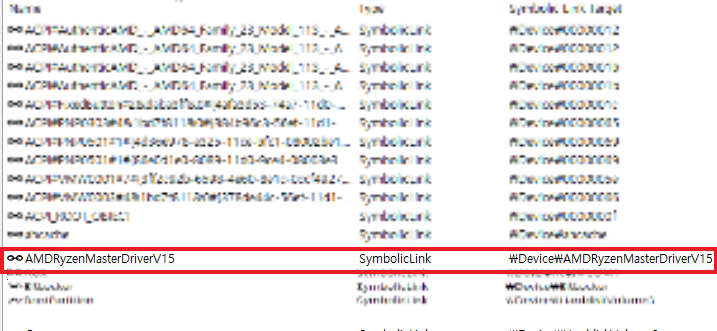

# 시리즈 바로가기

[공대오빠가 알려주는 Windows Driver Part 1 - Setting Up Kernel Debugging](https://hackyboiz.github.io/2021/05/30/l0ch/windows-driver/)

공대오빠가 알려주는 Windows Driver Part 2 - CVE-2020-12928: AMD Ryzen Master 분석(1) ← Now!

[공대오빠가 알려주는 Windows Driver Part 3 - CVE-2020-12928: AMD Ryzen Master 분석(2)](http://localhost:4000/2021/07/28/l0ch/windows-driver-part3/)

[공대오빠가 알려주는 Windows Driver Part 4 - CVE-2020-12928: AMD Ryzen Master 분석(3)](http://hackyboiz.github.io/2021/08/11/l0ch/windows-driver-part4/)

------


안녕하세요! 한 달 만에 돌아온 윈도우 드라이버 시리즈입니다. 지난번 커널 디버깅 세팅에 이어 본격적으로 윈도우 third-party 드라이버 원데이를 분석해볼 건데요, 이제 보니까 시리즈 제목을 뭐같이 짓긴 했네요. 내가 왜 저랬을까..? 


> 다음 파트는 공대 "아저씨"가 알려주는 드라이버 취약점으로 돌아오겠습니다...

# AMD Ryzen Master


오늘 분석할 AMD Ryzen Master는 라이젠 CPU를 사용하시는 분들 중 오버클럭에 관심이 있다면 들어보셨을 익숙한 유틸리티입니다! 저도 작년에 라이젠 CPU를 처음 사서 인생 첫 오버클럭을 하려고 했는데, 바이오스 메뉴에서 뭘 어떻게 해야 할지 몰라서 얼타다가 마우스 클릭 몇 번에 오버클럭이 짠 하고 된다길래 유용하게 썼었죠. 물론 재부팅할 때마다 설정 적용해줘야 하는 게 귀찮아서 결국 바이오스에서 설정했습니다 ㅋㅋ!


> 오버클럭도 못하는 컴알못ㅜ

이건 여담인데, 지금 쓰는 CPU가 오버클럭 안한 순정상태에서는 블루스크린 뜨는데 오버클럭 하면 멀쩡하더라구요. 수율이 좋길래 그냥 쓰고 있는데.. 뭔가 찝찝한 건 기분 탓일 거야 아마

> 본인(새컴 맞춰서 신남) : 님들 시퓨 순정은 블루스크린 뜨는데 오버클럭 하면 잘 돌아감 ㅋㅋ 신기하죠
??? : 우린 그걸 초기 불량이라고 부르기로 했어요.

...? 


> 그래도 1년째 잘 쓰고 있습니다..

아무튼 오늘은 작년에 공개된 AMD Ryzen Master의 권한상승 취약점 CVE-2020-12928 을 분석해보도록 하겠습니다! OS환경은 Windows 10 빌드 19043.1083에서, 타겟인 AMD Ryzen Master는 취약한 AMDRyzenMasterDriverV15 버전의 드라이버가 포함된  2.1.1.1472 버전에서 진행했습니다. 

구버전 찾는데 하루 종일 걸려버림 ㅎㅎ. .


> 아 구버전 구하기 진짜 너무 어려웠다 ㅁㄴㅇㄹㄴㅇㅁㄹㅇㅁ

이제.. 설치하고 설치 경로를 찾아가보면


오늘의 주인공 드라이버는 위 경로에서 찾을 수 있습니다.

# Kernel Driver / Driver Exploit

본격적으로 분석을 하기 전에 드라이버가 어떤 것인지, 취약점에는 어떤 것이 있는지부터 알아봐야 합니다.

Windows Kernel은 모듈화가 되어 있으며 Core Kernel(Microkernel)과 Device Driver 두 가지로 나눌 수 있습니다. Core 모듈에는 Kernel의 핵심적인 기능이 구현되어 있고 대부분의 커널 기능은 driver 형태로 모듈화 되어 구현됩니다. 이러한 모듈화의 장점은 확장성과 유지보수가 용이하다는 점이 있겠네요!


> Windows NT 계열의 커널 아키텍처

Windows에서 드라이버는 특정 이벤트가 발생할 때 커널 컨텍스트에서 실행되는 코드를 포함하는 모듈로 정의할 수 있습니다. 정리하면 커널 권한이 필요한 작업이 필요할 때 실행되는 코드를 모듈화 한 것입니다.  

위 사진에서 볼 수 있듯이 Windows는 User mode와 Kernel mode로 권한이 나뉘어 있습니다. User mode에서 실행되는 어플리케이션이 커널 권한이 필요한 작업을 요구할 때 커널 권한에 직접적으로 접근하는 것이 아닌 커널 권한으로 실행되는 드라이버에게 요청을 보내 간접적으로 수행하는 것이죠. 이때 User mode 어플리케이션은 I/O Manager를 통해 드라이버에게 요청을 보내는데, IOCTL(I/O Control) 코드로 드라이버가 어떤 기능을 수행할지를 결정합니다.

그렇다면, 이런 드라이버에서 찾을 수 있는 취약점은 어떤 것이 있을지 감이 오지 않나요?

드라이버의 취약점 공격에 성공하면 유저 권한의 어플리케이션으로는 할 수 없는 높은 권한에서의 임의 명령어 실행이 가능하고 타겟에게 더 큰 피해를 끼칠 수 있습니다. 이를 권한 상승 취약점(Privilege Escalation)이라고 부릅니다.

그런데 Microsoft가 바보도 아니고 커널 권한으로 돌아가는 드라이버는 좀 더 보안에 신경을 써서 개발했을 거 같지 않나요? 문제는 이 드라이버는 MS가 아닌 제삼자(third-party)도 개발하고 배포할 수 있어 발생합니다. 

third-party driver는 보통 커널 레벨의 높은 권한을 요구하는 백신이나 하드웨어를 직접 제어하는 마우스, 모니터 드라이버, 하드웨어 모니터링 등의 제조사 유틸리티에서 많이 사용합니다. Microsoft가 Windows 커널과 자기네 드라이버를 아무리 심혈을 기울여 버그 없이 내놓는다고 해도 이런 third-party driver들이 있는 한 권한 상승 취약점은 팡팡 터질 것 같네요!


> 요즘 핫한 PrintNightmare같은 프린터 스풀러 취약점이 터지는 거 보면 마소도 뭐.. 갈 길이 먼 것 같지만요 ㅎㅎ;;

오늘 글을 보기 전 드라이버 익스플로잇에 대한 아래 번역글을 읽어보면 도움이 됩니다!

[[Translation] Exploiting System Mechanic Driver Part 1](https://hackyboiz.github.io/2021/04/21/l0ch/exploiting-driver/)

[[Translation] Exploiting System Mechanic Driver Part 2](https://hackyboiz.github.io/2021/04/28/l0ch/exploiting-driver-part2/)

# Vulnerability Analysis

## Overview

이제 본격적으로 취약점을 분석해볼 차례입니다! 먼저 드라이버 서비스가 동작중인지 확인부터 해보겠습니다.



WinObj로 확인해보면 AMDRyzenMasterDriverV15 디바이스가 올라온 것을 볼 수 있네요. 

`AMDRyzenMasterDriverV15.sys` 를 IDA로 열자마자 바로 `DriverEntry` 부터 찾아보죠


`sub_140008A5C`로 가볼까요?


`DriverEntry`에서 첫 번째 매개변수로 `PDRIVER_OBJECT` 를 줬으니 매개변수 `a1`의 type을 `PDRIVER_OBJECT`로 변환합니다. 여기선 dispatch routine을 찾을 수 없네요.  `PDRIVER_OBJECT`를 매개변수로 전달하는 함수를 더 찾아보겠습니다. `sub_1400046AC`를 볼까요? 


이번에는 `DRIVER_OBJECT->MajorFunction[14]`에 dispatch routine을 할당하는 코드를 찾을 수 있습니다! 장치명도 보이네요. 


dispatch routine에는 IOCTL 코드와 코드 별 루틴을 볼 수 있습니다.

## MmMapIoSpace

이제 함수 하나를 중점적으로 보면서 취약점을 찾아볼 텐데요, 타겟은 `MmMapIoSpace`로 정하겠습니다! `MmMapIoSpace`는 물리 주소를 가상 페이지 주소에 매핑하는 함수로, 함수 원형은 다음과 같습니다.

```c
PVOID MmMapIoSpace(
  PHYSICAL_ADDRESS    PhysicalAddress,  // 매핑할 물리적 주소
  SIZE_T              NumberOfBytes,   //매핑할 바이트 수
  MEMORY_CACHING_TYPE CacheType       //매핑하는 데 사용할 캐시 속성을 나타내는 MEMORY_CACHING_TYPE 값
);   
```

왠지 이 함수 매개변수를 제어할 수 있으면 아주 좋은 공격 벡터가 될 것 같죠? 

`MmMapIoSpace` 관련 취약점은 MSI Dragon Center 권한상승을 다루는 하루한줄([CVE-2021-29337: MSI Dragon Center의 로컬 권한 상승 취약점](https://hackyboiz.github.io/2021/06/22/l0ch/2021-06-22/)) 에서도 언급된 적이 있었습니다. 


> 이때 오늘 글 예고를 하기도 했었죠 ㅎㅎ


cross reference view로 본 `MmMapIoSpace`를 호출하는 함수 리스트입니다. `sub_140007278` 함수를 보도록 할게요.


코드를 보고 분석해보면 간단하게 다음과 같이 정리가 가능합니다.

- `MmMapIoSpace` 함수에 매개변수 `a1`와 `a2`를 각각 매핑하길 원하는 물리 주소와 길이를 전달합니다.
- `BaseAddress`에는 `MmMapIoSpace`의 반환 값인 물리 주소가 매핑된 가상 페이지 주소가 들어갑니다.
- `BaseAddress`가 NULL인지 확인하고 아니면 `NumberOfBytes`만큼 `a3` 버퍼의 값을 복사합니다.
- 복사가 완료되면 매핑된 주소를 매핑 해제하고 정상적으로 종료됩니다.

해당 함수는 커널 메모리에 바이트 단위로 무언가를 쓰는 루틴으로 보입니다. 함수를 호출하는 dispatch routine으로 올라가 볼게요.


IOCTL 코드가 `0x81112F0C`일때 함수를 호출하네요. 

`MmMapIoSpace`를 호출하는 다른 함수인 `sub_1400063D0`을 보겠습니다.  


위 함수는 비슷해 보이긴 하지만 한 가지가 다르네요?  `sub_140007278` 함수와 반대로 커널 메모리를 바이트 단위로 쓰는 루틴인 것 같습니다.


IOCTL `0x81112F08`일 때 해당 함수 루틴을 수행합니다.

 

위 두 함수의 `MmMapIoSpace` 로 전달되는 매개변수와 복사할 메모리 주소를 제어할 수 있으면 임의 쓰기 및 임의 읽기가 가능할 것 같다는 느낌적인 느낌이 오지 않나요?! 바로 테스트를 해볼게요.

```c
#include <Windows.h>
#include <stdio.h>

int main(void)
{
    HANDLE dHandle;
    WCHAR DeviceLink[] = L"\\\\.\\AMDRyzenMasterDriverV15";
    DWORD dwRet = 0;
    LPVOID output_buff = VirtualAlloc(NULL,
        0x100c,
        MEM_COMMIT | MEM_RESERVE,
        PAGE_EXECUTE_READWRITE);

    dHandle = CreateFileW(
        DeviceLink,
        GENERIC_READ | GENERIC_WRITE,
        0,
        NULL,
        OPEN_EXISTING,
        FILE_ATTRIBUTE_NORMAL,
        NULL
    );

    if (dHandle == INVALID_HANDLE_VALUE)
    {
        printf("Get Device Handle Fail! : 0x%X \n", GetLastError());
        return 1;
    }
    
    BYTE input_buff[0x100] = { 0, };
    if (!DeviceIoControl(dHandle, 0x81112F0C, input_buff, 0x40, output_buff, 0x100c, &dwRet, 0))
    {
        printf("DeviceIOControl Fail : 0x%X \n", GetLastError());
        CloseHandle(dHandle);
        return 1;
    }

    CloseHandle(dHandle);

    return 0;
}
```

위 코드에 대해서는 다음 파트에서 자세하게 설명하기로 하고, 지금은 [DeviceIoControl](https://docs.microsoft.com/en-us/windows/win32/api/ioapiset/nf-ioapiset-deviceiocontrol) 를 호출하는 부분만 보면 됩니다.

```c
DeviceIoControl(dHandle, 0x81112F0C, input_buff, 0x40, output_buff, 0x100c, &dwRet, 0)
```

IOCTL code `0x81112F0C` 로 요청을 보내는데 input buffer와 output buffer를 사이즈와 함께 전달합니다. 여기서는 input buffer 내용을 모두 NULL로 채워서 전달했습니다.  


> 블루스크린 겟!  : )

다음 파트에서는 파트 1의 커널 디버깅으로 크래시를 동적 분석한 뒤 익스플로잇까지 해보도록 하겠습니다. 다음에 만나요 안녕!