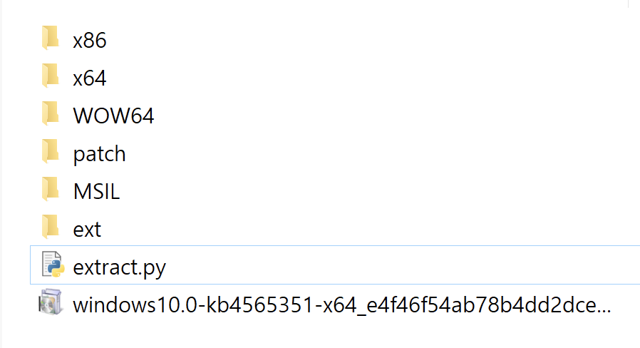

안녕하세요! L0ch입니다. 저번 GlueBall 취약점 글 썼을 때 디핑 할 버전별 바이너리를 구하다가 멘탈이 파쇄기에 갈린 종이마냥 갈릴 뻔했죠?

생각해보니까 괜히 Diffing 하겠다고 건드렸다가 X고생했는데 이대로 가만히 있으면 왠지 억울하자나여. 그래서 이 참에 좀 쉽게 쉽게 갈 수 있는 방법을 찾느라 방황하던 중 엄청난 글을 발견하게 되는데..

[Extracting and Diffing Windows Patches in 2020](https://wumb0.in/extracting-and-diffing-ms-patches-in-2020.html)

이거 완전 나를 위한 글이잖아??ㅎ


그래서! 바로 정리에 들어갔죠. 앞으로 할 삽질은 꿈에도 모른 채 ㅋㅋ 아


# Diffing 이 뭔데?

간단하게 Binary Diffing이 뭔지 짚고 넘어가 봅시다!

> Diffing 은 일반적으로 컴퓨터에서 두 개 파일의 차이를 보여주는 용어다. (Ex : git diff - Git의 소스코드 difference 확인) 바이너리 분석 기법(Binary Diffing)으로도 쓰이는데, 패치 또는 업데이트된 바이너리와 기존 바이너리를 비교해서 어떤 코드가 변경되었는지, 어떤 함수가 추가되고 제거되었는지 등 버전 별 바이너리의 차이점을 알 수 있는 분석 기법이다.

한마디로 얘네가 뭐를 어떻게 패치했나~ 바뀐 부분만 쓱 둘러보는 분석 기법입니다. 별 거 없어 보이지만 Diffing을 하면서 패치로 인해 발생한 새로운 취약점이나, 기존 취약점에 대해 적용한 패치를 우회하는 새로운 방법 등을 효율적으로 찾을 수 있습니다. 오늘은 앞서 말한 것처럼 Windows Update 패치를 추출하고 추출한 업데이트 파일을 이용해 Diffing을 진행해 볼게요.


# Windows Update Package


## Microsoft Update Catalog

윈도우는 업데이트 패키지를 배포해 실행하는 방식으로 패치를 합니다.

Windows 10 기준으로 버전 별로 나누어 배포하고 있으며 오늘은 다음 환경에서 진행합니다.

```markdown
Windows 10 ver1903, 64bit
```

버전에 따라 받아야 하는 업데이트 파일이 다르니 참고하시면 됩니다!

기본적으로 윈도우는 자동 업데이트 방식을 사용하지만 윈도우 카탈로그에서 독립 실행형 패치 패키지를 받아 수동 설치할 수도 있습니다.

윈도우 카탈로그 : https://www.catalog.update.microsoft.com/Home.aspx

Windows 카탈로그는 다음과 같은 형식의 검색 기능을 제공합니다.

```
YYYY-MM release-number (x86|x64|ARM64) cumulative
```

제 윈도우는 1903, 64bit 이므로 8월 업데이트를 찾기 위해 아래 키워드로 검색을 해볼게요.

```
2020-08 1903 x64 cumulative
```


검색을 하면 이렇게 업데이트 목록들이 주르륵 뜨는데, Diffing 하길 원하는 파일이 패치된 업데이트 항목을 받으면 됩니다. 전 `KB4565351` 을 받도록 할게요.


# Extract Update Package

업데이트 파일을 다운로드하면 `msu` 확장명의 업데이트 패키지를 받을 수 있습니다.

이 패키지에서 파일들을 추출해내면 됩니다.

## Extract msi

PowerShell에서 `expand.exe -F:* "[msu file name]" .\\ext\\` 명령어로 패치 컨텐츠들을 추출하면 아래 사진과 같이 ext 폴더 안에 추출된 파일들이 있는 걸 볼 수 있습니다~


cab파일이 보이는군요, 이것도  역시 expand로 쓱싹 추출하도록 하죠!


..?? 왜 아무 반응이 없지..?

아 왜 안되나 했더니 좀 오래 걸리나 보군요 기다려 봅시다 ㅎ


그렇게 ~~2000년 같은~~ 한 시간이 지나고.. 한 20분 정도 기다리다가 포기하고 저녁 먹고 오니까 끝나 있네요?

아니 뭐 추출 얼마나 한다고 이렇게 오래 걸리냐 하고 추출한 파일 개수를 세 봤는데


?? 3만개요?


_아니 미친 ㅎㅎ_

누적 업데이트 패키지라 지금까지의 업데이트들이 모두 포함되어 있어 이렇게 많다고 하네요...? 추출은 밥때 맞춰서 돌려놓고 밥 먹고 오면 될 것 같습니다ㅋㅋ;


## Extracted files

`tree /F >> extract.txt` 명령어로 어떤 파일들이 추출 되었는지 트리 구조로 확인해 보도록 하죠!


다양한 형식의 파일, 폴더들이 추출된 것을 볼 수 있네요.

1. 폴더 유형

   접두어로 아키텍처가 붙음

   - amd64, x86, wow64, msil

2. 파일 유형

   - manie
   - cat : 보안 카탈로그
   - mum : 카탈로그 파일과 쌍을 이루며 메타 데이터가 포함됨

그런데.. 각 패치 폴더 안에 f랑 r 폴더가 있고, 이 안에 각각 같은 이름의 바이너리가 보이는데, 이게 뭘까요..?


f, r 각 폴더는 Differential 폴더로, 세 가지 유형이 있습니다.

- f: forward differential
- r: reverse differential
- n: null differential

이들은 기본 버전에서 변경될 업데이트 파일과의 차이만큼의 내용을 담고 있는 파일입니다. 이 부분은 중요한 내용이라 나중에 다시 짚어 보도록 할 테니, 꼭 기억해 두세요!


## WinSxS

Windows는 Windows와 WinSxS를 통해 바이너리뿐만 아니라 모든 종류의 파일을 업데이트할 수 있습니다.

WinSxS는 manifest를 참조해 패치하며 manifest에는 패치 적용 방법, 결과 파일의 권한, 설정할 레지스트리 키 등 업데이트에 대한 전반적인 리스트 정보가 있어요. 간단하게 확인해 볼까요?


Windows-Gaming-XboxLive-Storage-Service-Component에 대한 manifest 정보를 조회한 결과입니다.

differential 폴더인 f, r가 있고, 각각에 패치될 dll과 exe 바이너리가 있는 걸 확인할 수 있어요.


# 추출 자동화

그런데 말입니다. 다 좋은데.. 추출한 파일 리스트를 좀 보려고 했더니 아키텍처 별로 분류도 없고 뒤죽박죽 개판이라 짜증 나려고 하네,,^^

> 날로 먹기 좋아하는 L0ch는 바로 추출/분류 자동화 스크립트를 짜기로 합니다. 역시 원 게시글에도 스크립트가 있군요! 
> 기쁜 표정으로 스크립트를 살펴본 L0ch의 표정이 어두워집니다. 무슨 일이죠? 아 ! 파워쉘로 짠 스크립트네요! 
> 저런... 애석하게도 L0ch는 파워쉘을 해본 적이 없습니다. 눈물을 머금고 파이썬으로 새로 작성하는 방법밖에 없겠군요.

```python
#F**k PowerShell 

import os
import subprocess
import time

ps_path = 'C:/Windows/System32/WindowsPowerShell/v1.0/powershell.exe '

def create_dir(dir):
	try:
		if not(os.path.isdir(dir)):
			os.makedirs(os.path.join(dir))
	except OSError as e:
		if e.errno != errno.EEXIST:
			print("Failed to create directory")
			raise

def extract_msu():
	cmd = 'expand.exe -F:* "*.msu" ./ext/'
	subprocess.run(ps_path + cmd, shell=True)

def extract_cab():
	cmd = 'expand.exe -F:* "./ext/Windows*.cab" ./patch/'
	subprocess.run(ps_path + cmd, shell=True)

def move_files(dir, filename):
	try:
		os.popen('move ./patch/'+filename+' ./'+dir)
	except:
		print("Failed to move file")

def classification():
	output = os.popen('dir /ad /b patch').read()
	patch_list = output.split('\\n')

	print("File classification")
	for idx, patch in enumerate(patch_list):
		if idx + 1 % 5 == 0:
			print("("+str(idx)+"/" + str(len(patch_list))+")")
		time.sleep(0.01)
		platform = patch[:5]
		if 'msil' in platform:
			move_files('MSIL', patch)
		elif 'wow64' in platform:
			move_files('WOW64', patch)
		elif 'amd64' in platform:
			move_files('x64', patch)
		elif 'x86' in platform:
			move_files('x86', patch)

	print("("+str(idx + 1)+"/" + str(len(patch_list))+")")
	# JUNK
	os.popen('move patch JUNK')
	os.popen('cd ext && move *.txt ../')
	os.popen('echo y | rmdir /s ext > nul')

if __name__ == "__main__":

	dir_list = ['ext','patch','MSIL','WOW64','x64','x86']

	for d in dir_list:
		create_dir(d)

	extract_msu()
	extract_cab()

	classification()

	print("Done")
	time.sleep(3)
```

PowerShell 써보려고 했는데 10분만에 때려치고 걍 익숙한 파이썬 썼습니다ㅋㅋ. 익숙한 게 최고야


>파이썬 최고다악!! 



msu에서 cab파일을 추출하고, 위 사진과 같이 cab에서 추출한 파일들을 각 아키텍처 폴더에 분류했습니다. 
.manifest와 .mum, .cat 파일은 들여다볼 일이 거의 없기 때문에 JUNK로 분류를 했구요.


이렇게 분류해서 정리된 모습을 보니 편안하군요. 역시 사람은 정리를 하고 살아야 돼
아 그래서 제 방은 정리하고 사냐구요? 그럴 리가요..?


분량 조절 실패로.. 다음 글에서는 패치 유형을 알아보고, 본격적으로 Diffing을 해볼게요!


안녕히 계세요 여러분! 전 이 세상의 모든 굴레와 속박을 벗어 던지고 제 행복을 찾아 떠납니다! (대충 술 먹으러 간다는 말)

