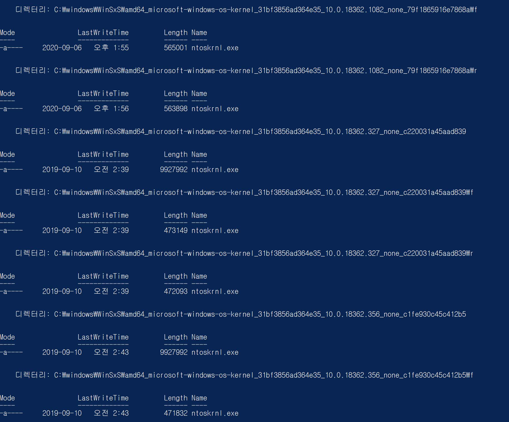
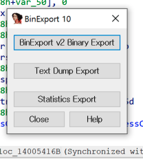
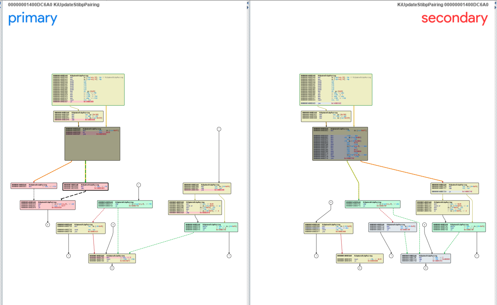

안녕하세요 여러분! L0ch입니다. 지난 Windows Patch Diffing글의 분량 조절 실패로 파트 1에 이어 파트 2로 돌아왔습니다! 

[[Research]WIndows Patch Diffing 맛보기 Part 1](https://hackyboiz.github.io/2020/11/15/l0ch/windows-patch-diffing-part1/)

업데이트 패키지 추출도 했으니 이제 진짜 패치 diffing을 시작...하기 전에! 해야 할게 한 가지 더 남아있습니다.


> 아니 그럼 diffing은 대체 언제 함?

윈도우에서 패치를 할 때 어떤 방식으로 하는지를 먼저 알아봐야 합니다. 그래야 diffing 할 버전 별 바이너리를 생성할 수 있어요 ㅎㅎ


# 패치 파일 유형

이전 글에서 추출한 null, forward, reverse differential에 대해 간단하게 살펴봤었죠. 이 diff 유형의 파일들은 diffing 할 버전별 바이너리를 생성하는 데 아래와 같은 역할을 합니다.

- Forward diff
  
    - 기본 바이너리 (.1)를 특정 패치 수준까지 가져옵니다.
- Reverse diff
  
    - 패치가 적용된 바이너리를 기본 바이너리 (.1)로 롤백합니다.
- NULL diff
    - 패치에서 새 파일이 추가될 경우 사용됩니다.
    
      </br>

diff 파일을 이용한 Windows의 패치 과정입니다. 

1. 기존 바이너리 버전에 맞는 reverse diff 파일로 델타 패치해 기본 버전으로 롤백
2. 패치 패키지에서 추출한 forward diff 파일로 델타 패치
- NULL diff일 경우 패치할 경로에 복사

  </br>

우리가 diffing 할 바이너리를 구하는 과정은 다음과 같습니다.

1. `C:\system32\WinSxS` 에서 diffing 할 바이너리를 찾습니다. WinSxS에는 diff 파일뿐만 아니라 해당 버전의 바이너리도 함께 들어있습니다.
2. 해당 버전의 reverse diff로 델타 패치해 기본 버전 바이너리로 롤백합니다.
3. 추출한 패치 파일에서 패치할 버전의 forward diff로 델타 패치를 합니다.
4. 패치된 바이너리의 hash를 구하고 manifest hash와 비교해 정상적으로 패치되었는지 확인합니다.


# 패치 적용

`ntoskrnl.exe` 의 버전 별 바이너리를 생성해서 diffing 해보도록 하겠습니다!

diffing 대상 선정은 취약점 정보와 해당 취약점의 패치 릴리즈 버전을 보고 판단하면 되겠습니다.

powershell에서 다음 명령어를 입력하면 WinSxS에 업데이트된 버전별 differential 파일들을 확인할 수 있습니다.

`Get-ChildItem -Recurse C:\windows\WinSxS\ | ? {$_.Name -eq "ntoskrnl.exe"}`


환경마다 누적된 업데이트가 달라서 결과는 다를 수 있습니다.  현재 제 윈도우 시스템의 `ntoskrnl.exe` 버전인 10.0.18362.1082를 기준으로 진행해 볼게요.

현재 ntoskrnl.exe 버전 - 10.0.18362.1082

추출한 ntoskrnl.exe 버전 - 10.0.18362.1016

1082 버전은 제 시스템에 이미 있으니 1016 버전을 델타 패치로 생성해보겠습니다!


## Patch Script

diff 패치에는 ms에서 지원하는 patch API인 `msdelta.dll` 를 사용합니다.

Vista 이상 Windows에서는 `msdelta.dll` 이 기본적으로 내장되어 있기 때문에 가져다가 쓰기만 하면 되죠 ㅎㅎ

아래는 파이썬을 사용해 작성한 msdelta 패치 스크립트입니다.

```python
from ctypes import (windll, wintypes, c_uint64, cast, POINTER, Union, c_ubyte, 
						LittleEndianStructure, byref, c_size_t)
import zlib
import sys
import base64
import hashlib
import argparse
import struct

# types and flags
DELTA_FLAG_TYPE             = c_uint64
DELTA_FLAG_NONE             = 0x00000000
DELTA_APPLY_FLAG_ALLOW_PA19 = 0x00000001

# struct
class DELTA_INPUT(LittleEndianStructure):
	class U1(Union):
		_fields_ = [('lpcStart', wintypes.LPVOID),
					('lpStart', wintypes.LPVOID)]
	_anonymous_ = ('u1',)
	_fields_ = [('u1', U1),
				('uSize', c_size_t),
				('Editable', wintypes.BOOL)]

class DELTA_OUTPUT(LittleEndianStructure):
	_fields_ = [('lpStart', wintypes.LPVOID),
				('uSize', c_size_t)]

ApplyDeltaB = windll.msdelta.ApplyDeltaB
ApplyDeltaB.argtypes = [DELTA_FLAG_TYPE, DELTA_INPUT, DELTA_INPUT,
                        POINTER(DELTA_OUTPUT)]
ApplyDeltaB.rettype = wintypes.BOOL
DeltaFree = windll.msdelta.DeltaFree
DeltaFree.argtypes = [wintypes.LPVOID]
DeltaFree.rettype = wintypes.BOOL
gle = windll.kernel32.GetLastError

def apply_patches(buf, buf_len, patch_path):
	with open(patch_path, 'rb') as p:
		patch = p.read()
	if patch[:2] != b"PA":
		patch_offset = patch.find(b"PA")
		if patch_offset != 4:
			raise Exception("Invalid Patch")

		# Check CRC
		crc = int.from_bytes(patch[:4], byteorder = "little")
		patch_contents = patch[4:]
		if zlib.crc32(patch_contents) != crc:
			raise Exception("CRC check failed")
	
	flag = DELTA_FLAG_NONE

	d_dest = DELTA_INPUT()
	d_src = DELTA_INPUT()

	d_out = DELTA_OUTPUT()

	d_src.lpcStart = buf
	d_src.uSize = buf_len
	d_src.Editable = False

	d_dest.lpcStart = cast(patch_contents, wintypes.LPVOID)
	d_dest.uSize = len(patch_contents)
	d_dest.Editable = False

	status = ApplyDeltaB(flag, d_src, d_dest, byref(d_out))

	if status == 0:
		raise Exception("Patch "+ patch_path + " failed with Error code "+str(gle()))

	return (d_out.lpStart, d_out.uSize)

if __name__ == '__main__':
	ap = argparse.ArgumentParser()
	mode = ap.add_mutually_exclusive_group(required=True)

	mode.add_argument("-i", "--input", help="revese/forward diff file path")
	mode.add_argument("-n", "--null", action="store_true", default=False, help="Create file from null diff")

	ap.add_argument("-o", "--output", required=True , help="write patched file")
	ap.add_argument("-p", "--patches", required=True, nargs='+', help="Patches path to apply")

	args = ap.parse_args()

	with open(args.input, 'rb') as r:
		inbuf = r.read()

	buf_len = len(inbuf)
	buf = cast(inbuf, wintypes.LPVOID) # cast to void * pointer
	alloc_list = []

	for patch in args.patches:
		buf, buf_len = apply_patches(buf, buf_len, patch)
		alloc_list.append(buf)

	output_buf = bytes((c_ubyte*buf_len).from_address(buf))

	with open(args.output, 'wb') as w:
		w.write(output_buf)

	for alloc in alloc_list:
		DeltaFree(alloc)

	hash = hashlib.sha256(output_buf)

	print(str(len(args.patches)) + " pathces successfully applied.")
	print("hash : " + base64.b64encode(hash.digest()).decode())
```

옵션 별 기능은 다음과 같습니다.

-i :  reverse 또는 forward differential 패치 할 바이너리 지정

-n : null differential

-o : 패치 된 결과 파일 생성

-p : 패치 diff파일 지정

</br>

```powershell
python delta_patch.py -i C:\\Windows\\WinSxS\\amd64...10.0.18362.1082\\ntoskrnl.exe ^
-o result_ntoskrnl.exe -p C:\\Windows\\WinSxS\\amd64...10.0.18362.1082\\r\\ntoskrnl.exe
```


1082 버전의 `ntoskrnl.exe`를 같은 버전의 reverse diff 파일로 패치해 기본 버전으로 롤백한 결과입니다.

사진과 같이 successfully applied 메시지와 hash 값이 뜨면 패치가 정상적으로 이루어진 것을 확인할 있어요.

</br>


속성에서 확인해 보면 10.0.18362.1 기본 버전으로 롤백이 잘 됐네요!

이제 우리가 업데이트 패키지에서 추출한 `ntoskrnl`의 1016버전 forward diff로 패치를 해보겠습니다

</br>

```powershell
python delta_patch.py -i result_ntoskrnl.exe -o ntoskrnl_1016.exe ^
-p [EXTRACTED PATH]\\amd64_microsoft...10.0.18362.1016...\\f\\ntoskrnl.exe
```


버전은 1016으로 잘 올라간 것 같군요. hash도 비교해보죠.

</br>


JUNK의 ntoskrnl manifest에서 참고한 hash도 일치하네요! 이로써 패치 스크립트로 정상적으로 패치 된 것을 확인할 수 있습니다.


# Binary Diffing


(글을 쓰고 있는 지금 내 상태)

바이너리 패치가 이렇게 힘들 일인가..? 격하게 아무것도 안하고 싶어졌지만 기왕 쓰기 시작한 거 끝은 봐야 하지 않겠습니까 으아악 빨리 끝내고 술 먹으러 가야지

마지막! diffing tool과 분석 방법입니다.

Diffing은 IDA에서 진행하며 BinDiff라는 플러그인을 사용합니다.  BinDiff는 무료로 배포되는 코드 분석 IDA 플러그인입니다. 유명한 만큼 성능 하나는 확실한 친구죠?


BinDiff는 아래 링크에서 설치할 수 있습니다.

[zynamics.com - Software](https://www.zynamics.com/software.html)

> IDA 7.2, BinDiff 5(BinExport 10)에서 진행했습니다.

IDA가 설치된 경로를 입력하고 설치하면 되며 정상적으로 설치가 되었다면 IDA의 Edit → Plugins에서 BinDiff를 보실 수 있습니다.

우선 1016, 1082를 각각 을 열고 Edit→Plugins→BinExport10을 실행합니다.


그리고 BinExport v2 Binary Export로 각각 Export 해주면 준비는 끝!




이제 BinDiff를 실행해서 Workspace를 만들고 Diff→New Diff에서 Export 한 두 바이너리를 선택합니다.

</br>


Export한 파일을 선택하고 Diff하면..!

</br>


이렇게 Overview를 볼 수 있습니다. Similarity는 유사도를 나타내는데, 1에 가까울수록 차이가 없다는 뜻입니다.

</br>

아래로 내려보면 Similarity가 낮은 항목을 볼 수 있는데, 이 중 한 항목을 우클릭→Open Flow Graph를 실행하면


이렇게 그래프로 보여줍니다.  각 노드 색별 의미는 다음과 같습니다.

초록색 - 변경점 없음

노란색 - 변경점 있음

빨간색  - 패치에 의해 제거됨

회색 - 패치에 의해 추가됨

좀 더 자세히 볼까요? 보려는 노드를 선택해보겠습니다.

</br>



이렇게 어셈블리 코드까지 볼 수 있습니다. 이런 방식으로 변경점을 트레이싱하면 어떤 부분이 패치되었는지 자세히 볼 수 있겠죠!


# 마치며..

패치 스크립트를 만들어 뒀으니 원데이 분석할 때 유용하게 쓸 수 있을 것 같네요 ㅎㅎ 이제 취약점.. 취약점만 찾으면 되는데....


> 아마 안될거야..

다음엔 다른 주제로 찾아오겠습니다. 조금만 놀구요 ㅎ (*망할 코로나 얼른 꺼져줬으면 ^^!)*


# Reference

[Extracting and Diffing Windows Patches in 2020](https://wumb0.in/extracting-and-diffing-ms-patches-in-2020.html)

