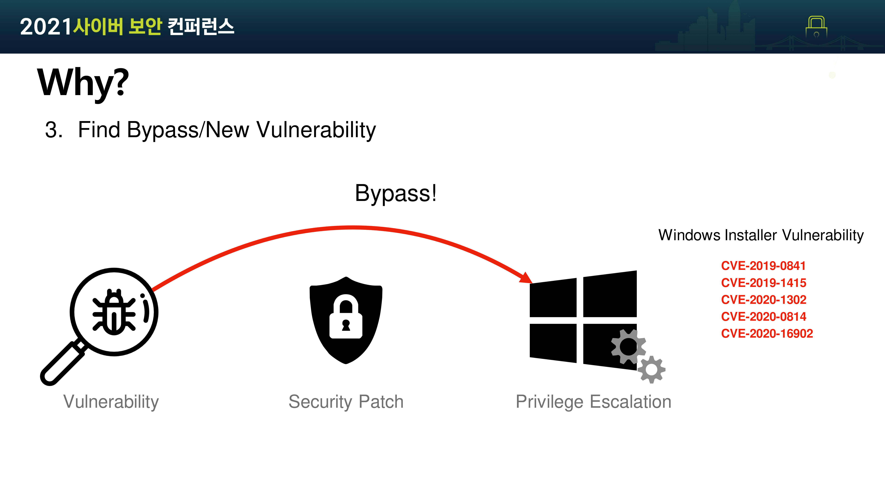
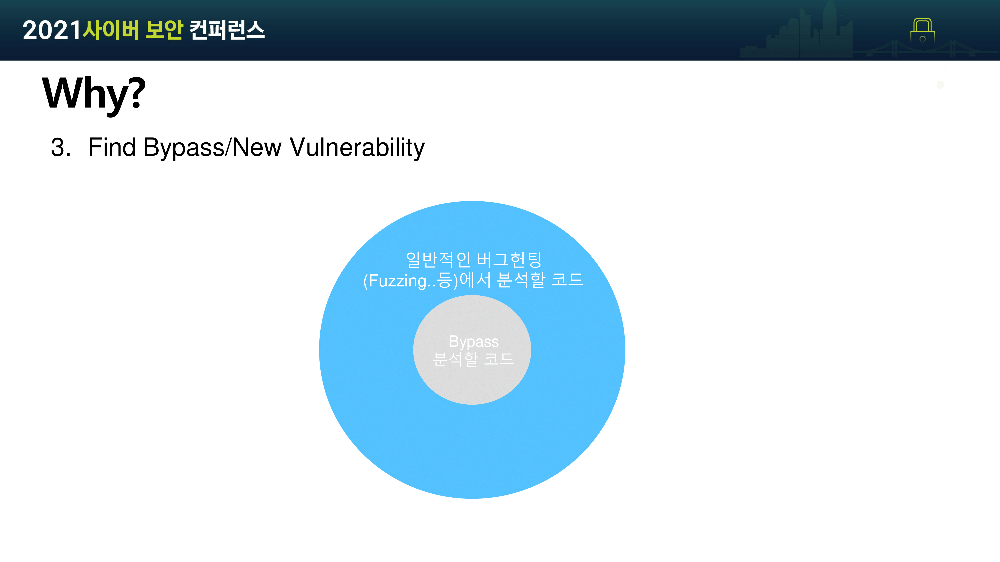

안녕하세요, 오늘은 2021 사이버 보안 컨퍼런스에서 발표한 발표자료를 들고 왔습니다. 

주제는 Windows 1-day patch를 binary diffing으로 분석하고 bypass 취약점을 찾자! 인데요, 예전에 올렸던 아래 연구글에서 했던 주제에 내용을 좀 더 추가해서 발표했습니다.

[[Research] Windows Patch Diffing 맛보기 Part 1](https://hackyboiz.github.io/2020/11/15/l0ch/windows-patch-diffing-part1/) 

[[Research] Windows Patch Diffing 맛보기 Part 2](https://hackyboiz.github.io/2020/11/29/l0ch/windows-patch-diffing-part2/) 

후기는 [[Daily-Life] 부산까지 가서 발표한 썰 푼다, 시원포럼 발표 후기](https://hackyboiz.github.io/2021/09/08/l0ch/securityone_forum_review/) 에서 보실 수 있습니다. ! 


제 소개는 간단하게 ㅎㅎ... 


발표에서 저희 팀에 대해서도 간단하게 소개했습니다. 블로그를 보시는 분들에게도 저희가 어떤 서비스를 하고 있는지 정확히 알려드리기 위해서 소개한 내용을 그대로 가져와봤습니다.

```
팀명인 Hackyboiz는 Hacking과 boiz라는 의미로 최신 해킹트렌트를 팔로업하며 공부하는 팀입니다.
저희는 현재 블로그와 뉴스레터를 운영중이며 업데이트되는 내용들을 페이스북과 인스타에 공유하고 있습니다. 

먼저 블로그는 2~3년정도  해킹을 공부하신 분들을 대상으로 아래와 같은 컨텐츠를 업로드하고 있습니다.

하루한줄 - 최근 이슈화되거나 공개된 취약점의 기술적인 정보를 짧게 정리한 글

해키피디아 - 보안과 컴퓨터를 공부하며 지나치기 쉬운 컴퓨터 지식들을 이해하기 쉽게 설명한 백과사전

연구 및 번역글 - 팀원들 개개인이 목표를 설정하고 공부 및 연구하는 내용을 업로드

해킹짹짹 뉴스레터는 매 주 월, 수, 금마다 해킹/보안 씬의 동향, 해킹기법 설명, 해커의 문화같이 해킹에 
관심이 있으시면 전문적인 지식 없이도 재밌게 읽을 수 있는 다양한 컨텐츠를 보내드리고 있습니다.
```

마지막으로 팀원 모집도 하고 있다는 이야기도 했었는데요, 팀원 모집은 현재 진행형이니 관심이 있으시다면 언제든 페이스북 메시지나 블로그 소개란의 이메일로 연락주세요!


목차는 다음과 같습니다.

- Windows의 업데이트와 Patch Tuesday
- binary diffing으로 Windows Patch 분석하기
- Windows의 Delta Patch
- 프린터 스풀러 서비스 취약점 CVE-2020-0986과 bypass 취약점 CVE-2021-1648 분석


Windows는 정기적으로 보안 패치를 포함한 업데이트를 진행하는데, 매 달 둘째 주 화요일에 진행된다고 해 Patch Tuesday라는 이름이 붙었습니다. Windows는 기능이 많은 만큼 버그도 많을 거고, 취약점은 그에 따라 당연히 많을 수밖에 없죠. 최근 몇 달간 Patch Tuesday 한 번에 패치되는 보안 취약점이 약 100개가 넘는다고 합니다.


오늘은 이 업데이트에 포함된 보안 취약점 패치를 Binary Diffing으로 분석해보겠습니다. 

여기서 의문점이 들 수 있는데, 굳이 제보되고 패치된 취약점을 분석하는 이유가 있을까요? 

여기에 대한 답변은 세 가지로 이야기할 수 있습니다.


첫 번째로 보안을 공부하는 분들이라면 알고 계시듯이, 취약점에 대한 정보를 얻고 공부하기 위해서입니다. 보통 취약점 유형을 워게임을 통해 공부하곤 합니다. 하지만 워게임 환경 상 취약점의 유형이 한정적일 수밖에 없죠. 그래서 리얼월드 분석 경험을 쌓기 위해 1-day를 분석합니다. 

두 번째로는 소프트웨어 벤더사들이 취약점 유형별 패치에 대한 참고자료로 사용하기 위해 1-day를 분석하기도 합니다.



마지막 세 번째는 오늘의 주제인 우회 취약점을 찾거나 아예 새로운 취약점을 찾는 것입니다. Windows 뿐만 아니라 다른 많은 소프트웨어 취약점의 역사를 보더라도 취약점에 대한 패치가 충분한 검증이 되지 않은 채로 배포된 경우가 많습니다. 이는 쉽게는 PoC를 살짝만 수정하는 것으로 우회가 가능한 경우도 있으며, 오늘 소개할 CVE-2020-0986과 bypass 취약점인 CVE-2021-1648 외에도 Windows Installer의 경우 CVE-2019-0841, CVE-2019-1415, CVE-2020-1302, CVE-2020-0814, CVE-2020-16902 등 5번이나 패치를 우회하는 사례도 있었던 만큼 취약점을 찾는 목적으로도 1-day를 분석할 수 있습니다.



이렇게 패치로 추가된 코드의 검증 미흡이나 추가된 코드 자체의 또 다른 취약점이 존재할 가능성이 있으며 이 부분을 중점으로 bypass를 찾는다면 일반적인 버그헌팅 방법에서 분석할 코드의 양보다 크게 줄어든다는 장점이 있습니다. 


1-day 취약점을 분석하기 위해서는 우선 취약점이 존재하는 버전의 바이너리를 구해야 합니다. 익스플로잇까지 하려면 환경도 구성해야 하고 패치 분석까지 하려면 패치된 버전도 따로 구해야겠네요.

여기서 문제가 생깁니다. 업데이트만 해도 많은데 Windows는 빌드나 아키텍처에 따라 버전이 또 나뉩니다.  구글링을 해서 찾아야 하나 싶어도 이 많은 버전 중 내가 원하는 취약점이 있는 버전이 없을 가능성이 높죠.


이럴 땐 Windows의 업데이트 패키지를 이용해 원하는 바이너리를 구하면 됩니다.


Windows는 모든 업데이트 파일이 Microsoft Update 카탈로그에 업로드되어 있습니다. 빌드와 릴리즈 날짜 정보로 취약점이 패치된 날짜와 환경에 맞는 업데이트 패키지를 다운로드할 수 있죠. 이러한 업데이트 패키지로 원하는 버전의 분석할 파일을 구할 수 있습니다.


패치를 적용해서 원하는 버전의 바이너리를 생성하기 위해서는 Windows의 업데이트 방식에 대해 먼저 이해해야 합니다. Windows는 델타 패치 방식으로 파일을 업데이트하는데, 델타 패치는 다음과 같은 특징이 있습니다.

- 업데이트 패키지에는 완전한 바이너리가 아닌 변경된 코드만 있는 differential 파일만 존재
- 기본 버전의 바이너리를 두고 변경된 내용만을 담고 있는 differnetial 파일을 기본 바이너리에 적용하면 해당 패치 버전으로 업데이트되는 방식
- 롤백과 패치는 반드시 기본 버전을 기준으로 이루어짐
    - 그림을 보면 기본 버전인 1 버전에서 버전 2 또는 버전 3으로 델타 패치가 가능하지만 버전 2와 버전 3 사이에는 불가능

이러한 델타 패치 방법은 롤백 등 관리가 비교적 용이하며  버전 업데이트 파일의 크기도 줄어 업데이트 시 네트워크 사용량을 절약할 수 있는 방법입니다.


MS의 PatchAPI 공식 문서에 설명되어 있는 델타 패치 과정입니다. 먼저 파일 F와 F`으로 Delta Compression Create 과정을 거쳐 differential 파일을 생성합니다. 이렇게 생성된 differential 파일은 F` 프라임 파일은 물론 이를 압축한 크기보다 훨씬 작아 효율적이며 델타 패치의 장점이라고 볼 수 있습니다. F` 파일을 다시 얻고자 할 때는 F 파일과 differential 파일을 이용해 Delta Compression Apply 과정을 거쳐서 F` 파일을 만들 수 있습니다.


분석할 바이너리를 구할 방법을 알아냈으니 Windows의 프린터 기능에서 발견된 취약점 CVE-2020-0986과 이에 대한 패치 우회인 CVE-2021-1648을 예시를 들어 분석해보겠습니다. 우선 패치 히스토리부터 조사해야 하겠죠. CVE-2020-0986은 제보된 이후 2020년 6월 시큐리티 업데이트를 통해 취약점을 완화하는 검증 함수를 추가했지만, 추가된 함수를 우회하는 CVE-2021-1648이 발견되었고 이후 2021년 1월에 패치로 이러한 bypass 취약점이 패치가 되었습니다.


CVE-2020-0986을 먼저 분석해보겠습니다. CVE-2020-0986은 프린터 스풀러 API에 존재하는 권한상승 취약점입니다. 취약점이 존재하는 splwow64 프로세스는 32bit 프로세스가 64bit 프린터 드라이버를 사용할 수 있도록 구현된 레거시 LPC(Local Procedure Call) 서버로 32bit process가 프린터 서비스를 사용하고 싶으면 splwow64 프로세스에 LPC 메시지를 보내고, splwow64 프로세스는 이 LPC 메시지를 프린터 드라이버에 전달합니다.


32bit 프로세스에서 프린터 작업을 요청하면 splwow64는 수신한 LPC 메시지를 `TLPC::ProcessRequest` 함수에서 처리합니다. `TLPC::ProcessRequest`는 수신한 LPC 메시지 중 빨간색 박스의 printer에 대한 opcode의 유효성을 검증하고 `gdi32full.dll`의 `GdiPrinterThunk` 함수로 전달한 뒤 호출합니다.


`Gdi32full.dll`의 `GdiPrinterThunk`는 전달받은 LPC에 포함된 옵코드에 따라 작업을 수행하는데, 일반적인 0~103까지의 옵코드가 있고 `gdi32full.dll` 내부에 특수한 옵코드들이 존재합니다. 이 중 `6d` 옵코드로 실행되는 `INDEX_DocumentEvent` 루틴에서 취약점이 발생합니다.

이후 `RtlDecodePointer` 함수를 호출해 전역 변수 `fpDocumentEvent`에 저장된 함수 포인터 값을 디코딩해 실행한 뒤 `memcpy` 함수를 호출하는데 이때 `memcpy`에 전달되는 매개변수는 LPC 메시지를 보낸 유저 프로세스에서 모두 제어할 수 있어 `write-what-where` 프리미티브가 됩니다. 이를 악용해 `fpDocumentEvent` 함수 포인터 값을 `LoadLibraryA`로 수정하면 원하는 라이브러리를 로드할 수 있습니다.

이렇게 되면 splwow64의 권한인 medium integrity로 코드 실행이 가능한 권한상승 익스플로잇이 가능합니다.

Internet Explorer의 경우 splwow64가 화이트리스트에 있기 때문에 해당 취약점을 트리거해 낮은 권한의 렌더링 엔진 프로세스의 권한을 medium integrity로 높일 수 있고 Internet Explorer의 브라우저 샌드박스 이스케이프가 가능합니다.


해당 취약점에 대한 패치는 2020년 6월에 릴리즈 되었으며 이런 패치 정보는 MS의 Security Response Center(MSRC)에서 확인할 수 있습니다.


패치 릴리즈 날짜와 같은 정보를 수집했으면 해당 날짜의 업데이트 패키지를 구해야겠죠. 제 Windows 환경은 2004 빌드니까 MS의 업데이트 카탈로그에서 2020년 6월 x64 2004 누적 업데이트 패키지를 검색해 다운로드할 수 있습니다.


이제 다운로드한 업데이트 패키지에서 파일들을 추출해야 하는데, `expand` 명령어를 사용해 msu 파일에서 Windows archive인 cab파일을 추출할 수 있습니다.


cab파일을 한번 더 추출하면 업데이트 파일들이 추출되는데요 업데이트 패키지 크기에 따라 다르지만 평균 10분에서 20분 정도 걸립니다. 추출된 파일은 약 12000개 정도 되네요.


tree 명령어로 추출한 파일들에 대해 좀 더 자세히 알아보도록 하겠습니다. gdi32full.dll을 검색하면 찾을 수 있는데, 업데이트 패키지의 `gdi32full.dll` 버전은 10.0.19041.329로 폴더 이름이나 패치 정보가 있는 manifest 파일에서 확인할 수 있습니다.

```sql
10.0.19041 까지는 Windows 빌드 버전이므로 같은 Windows 환경에서 진행해 생략하도록 하겠습니다.
```

329 버전의 하위 폴더에 f와 r 폴더가 있고, 각각에 `gdi32full.dll`이 있네요.

- f - forward differential 파일로 기본 버전의 바이너리를 명시된 버전으로 패치할 때 사용
- r - reverse differential 파일로 명시된 버전과 동일한 버전의 바이너리를 기본 버전으로 되돌릴 때, 다시 말해 롤백할 사용
- n - null differential 파일로 변경할 파일이 아닌 해당 업데이트에서 새로 추가될 파일이라는 의미이며 변경할 원본 파일이 존재하지 않으니 추가될 파일의 원본이 존재


업데이트 파일의 버전을 알아봤으니 디핑 분석할 현제 제 Windows 시스템의 `gdi32full.dll` 버전도 알아봐야겠죠. 현재 WIndows의 `gdi32full.dll` 버전은 264로, CVE-2020-0986 취약점이 존재하는 버전입니다.

사실 확실하게 하려면 329 업데이트 직전의 업데이트 패키지 추출을 통해 따로 구해야 하지만 제 Windows의 `gdi32full.dll`가 취약점이 존재하는 버전이기도 하고 329와 크게 버전 차이가 나지 않아 오늘은 이 264 버전과 패치한 329 버전의 `gdi32full.dll`을 Diffing 분석하도록 하겠습니다. ~~날먹~~


추출한 forward와 reverse differential을 적용하는 패치 시나리오는 그림과 같습니다. 제 Windows 환경에서 구할 수 있는 264 버전을 같은 264 버전의 reverse differential 파일로 델타 패치해 기본 1 버전의 바이너리를 생성합니다. 이후 업데이트 패키지에서 추출한 forward differential 파일로 다시 델타 패치를 하면 329 버전의 바이너리를 구할 수 있고 구한 두 개의 바이너리를 디핑 분석하면 됩니다.


다음은 델타 패치를 하는 스크립트를 짜는 것입니다. msdelta.dll의 ApplyDeltaB는 MS에서 공식적으로 지원하는 Delta Patch API입니다. 원본 데이터와 델타 데이터, 생성할 결과 데이터의 포인터를 전달하면 원본 데이터에 델타 데이터를 패치한 데이터를 결과 데이터에 씁니다. 


스크립트 중 패치를 적용하는 함수 `apply_patches`에서는 differential의 파일 시그니쳐와 CRC를 확인하고 패치를 `ApplyDeltaB`함수로 input 바이너리에 적용합니다. 


약 100줄 정도 되는 짧은 스크립트로 델타 패치를 적용할 수 있습니다.

```sql
from ctypes import (windll, wintypes, c_uint64, cast, POINTER, Union, c_ubyte, 
						LittleEndianStructure, byref, c_size_t)
import zlib
import sys
import base64
import hashlib
import argparse
import struct

# types and flags
DELTA_FLAG_TYPE             = c_uint64
DELTA_FLAG_NONE             = 0x00000000
DELTA_APPLY_FLAG_ALLOW_PA19 = 0x00000001

# struct
class DELTA_INPUT(LittleEndianStructure):
	class U1(Union):
		_fields_ = [('lpcStart', wintypes.LPVOID),
					('lpStart', wintypes.LPVOID)]
	_anonymous_ = ('u1',)
	_fields_ = [('u1', U1),
				('uSize', c_size_t),
				('Editable', wintypes.BOOL)]

class DELTA_OUTPUT(LittleEndianStructure):
	_fields_ = [('lpStart', wintypes.LPVOID),
				('uSize', c_size_t)]

ApplyDeltaB = windll.msdelta.ApplyDeltaB
ApplyDeltaB.argtypes = [DELTA_FLAG_TYPE, DELTA_INPUT, DELTA_INPUT,
                        POINTER(DELTA_OUTPUT)]
ApplyDeltaB.rettype = wintypes.BOOL
DeltaFree = windll.msdelta.DeltaFree
DeltaFree.argtypes = [wintypes.LPVOID]
DeltaFree.rettype = wintypes.BOOL
gle = windll.kernel32.GetLastError

def apply_patches(buf, buf_len, patch_path):
	with open(patch_path, 'rb') as p:
		patch = p.read()
	if patch[:2] != b"PA":
		patch_offset = patch.find(b"PA")
		if patch_offset != 4:
			raise Exception("Invalid Patch")

		# Check CRC
		crc = int.from_bytes(patch[:4], byteorder = "little")
		patch_contents = patch[4:]
		if zlib.crc32(patch_contents) != crc:
			raise Exception("CRC check failed")
	
	flag = DELTA_FLAG_NONE

	d_dest = DELTA_INPUT()
	d_src = DELTA_INPUT()

	d_out = DELTA_OUTPUT()

	d_src.lpcStart = buf
	d_src.uSize = buf_len
	d_src.Editable = False

	d_dest.lpcStart = cast(patch_contents, wintypes.LPVOID)
	d_dest.uSize = len(patch_contents)
	d_dest.Editable = False

	status = ApplyDeltaB(flag, d_src, d_dest, byref(d_out))

	if status == 0:
		raise Exception("Patch "+ patch_path + " failed with Error code "+str(gle()))

	return (d_out.lpStart, d_out.uSize)

if __name__ == '__main__':
	ap = argparse.ArgumentParser()
	mode = ap.add_mutually_exclusive_group(required=True)

	mode.add_argument("-i", "--input", help="revese/forward diff file path")
	mode.add_argument("-n", "--null", action="store_true", default=False, help="Create file from null diff")

	ap.add_argument("-o", "--output", required=True , help="write patched file")
	ap.add_argument("-p", "--patches", required=True, nargs='+', help="Patches path to apply")

	args = ap.parse_args()

	with open(args.input, 'rb') as r:
		inbuf = r.read()

	buf_len = len(inbuf)
	buf = cast(inbuf, wintypes.LPVOID) # cast to void * pointer
	alloc_list = []

	for patch in args.patches:
		buf, buf_len = apply_patches(buf, buf_len, patch)
		alloc_list.append(buf)

	output_buf = bytes((c_ubyte*buf_len).from_address(buf))

	with open(args.output, 'wb') as w:
		w.write(output_buf)

	for alloc in alloc_list:
		DeltaFree(alloc)

	hash = hashlib.sha256(output_buf)

	print(str(len(args.patches)) + " pathces successfully applied.")
	print("hash : " + base64.b64encode(hash.digest()).decode())
```


이제 스크립트를 사용해 패치를 하는데, 먼저 기본 버전의 바이너리부터 구합니다.

기본적으로 Windows는 업데이트 이후 `C:\Windows\WinSxS` 폴더에 differential 파일들을 백업하는데,  differential 파일의 크기가 작으니 업데이트할 때마다 백업할 수 있어 이후에 문제가 발생하면 다시 롤백하는 등 버전 관리가 용이한 델타 패치의 장점이라고 볼 수 있습니다.

현재 시스템의 `gdi32full.dll` 버전이 264니까 WinSxS 폴더에 있는 264 버전의 reverse differential 파일로 델타 패치하면 기본 버전의 gdi32full.dll을 구할 수 있습니다. 패치 스크립트에 input으로 264 버전의 `gdi32full.dll`을 주고 패치파일 input으로 264 버전의 reverse differntial 파일을 주면 델타 패치가 된 `gdi32full_1.dll`이 생성되죠. 생성된 바이너리의 버전을 파일 속성으로 확인해보면 1 버전으로 롤백된 것을 볼 수 있습니다.

또한 스크립트에서는 결과 파일의 해시도 출력해주는데, 업데이트 패키지의 manifest에서 각 버전의 해시값을 볼 수 있으니 비교해보면 정상 패치가 된 것을 확인할 수 있습니다.


방금 구한 1 버전의 `gdi32full_1.dll`을 아까 업데이트 패키지에서 추출한 329 버전의 forward differential 파일로 다시 스크립트를 통해 델타 패치를 합니다. 방법은 reverse differential과 차이가 없으니 동일하게 패치 스크립트를 사용해 패치를 진행해주면 최종적으로 329 버전의 `gdi32full_329.dll`을 구할 수 있습니다.


분석할 바이너리를 모두 구했으니 이 두 바이너리를 Diffing 해보도록 하겠습니다. Binary Diffing은 git diff를 생각하시면 이해가 쉽습니다. Git diff는 커밋 전과 커밋 후 소스코드의 변경점을 한눈에 알아볼 수 있게 해 줍니다. 이걸 그대로 바이너리에 적용시킨 것이 Binary Diffing입니다.


Binary Diffing은 2개 이상의 서로 다른 바이너리를 비교 분석하는 기술로 변경점이 존재하는 코드를 하이라이팅합니다. 어떤 코드가 추가 혹은 삭제되고 변경되었는지를 보여주며 대표적으로 BinDiff라는 IDA의 플러그인 기반 툴이 있습니다.


BinDiff는 ida database 기반으로 분석을 진행하기 때문에 BinDiff를 설치할 때 같이 설치되는 BinExport로 IDA에서 데이터베이스를 추출해야 합니다. 264 버전과 329 버전의 `gdi32full.dll` 데이터베이스를 각각 추출하고 BinDiff의 Primary Source와 Secondary Source에 각각 지정해 디핑 분석을 실행합니다.


디핑 결과창은 위와 같이 나오는데, Similarity는 비교하는 두 바이너리의 유사도를 함수별로 나타냅니다. 유사도가 높을수록 1에가까워지며 낮을수록 0에 가까워져 어떤 함수가 얼마나 변경되었는지를 보여줍니다. CVE-2020-0986에서 취약점이 존재했던 함수인 `GdiPrinterThunk`의 유사도가 0.6 인걸로 봐서 패치가 꽤 이루어진 것을 확인할 수 있네요. `GdiPrinterThunk`를 좀 더 자세히 보겠습니다.


왼쪽 primary가 패치 전 `gdi32full_264.dll`이고 오른쪽 secondary가 패치된 `gdi32full_329.dll`입니다.

빨간색 박스를 보시면 왼쪽에는 없는 회색 코드 블럭이 오른쪽에 있는 것을 확인할 수 있는데, 패치 전에는 없던 새로운 함수를 call 하는 것 같습니다.

bindiff에서 확인한 추가된 함수를 중점적으로 IDA로 자세히 분석해보겠습니다.


329버전의 opcode 6d 루틴입니다. 

먼저 `FindDriverForCookie` 함수가 추가된 것을 볼 수 있습니다. 해당 함수는 유효한 프린터 핸들 확인에 더해 이에 대한 쿠키가 있는지까지 확인하는 함수입니다.

또한 이전 패치 버전처럼 직접 주소 지정 방식이 아닌 포인터 오프셋을 계산해 LPC 메시지를 지정하는 방식으로 바뀌었으며 그에 따라 오프셋을 계산하는 `UMPDPointerFromOffset`과 `UMPDStringPointerFromOffset` 함수가 추가되었고 임의의 주소를 대상으로 지정할 수 없게 패치되었습니다. 그러나 `memcpy`에는 여전히 다른 검사가 추가되지 않아 추가된 함수만 우회하면 기존의 권한 상승이 가능합니다.


먼저 추가된 `FindDriverForCookie`는 전역 변수에 저장된 기존 프린터 드라이버의 핸들을 검사하는 데 더해 쿠키를 검사합니다.


`FindDriverForCookie`는 opcode 6A 루틴인 `INDEX_LoadDriver`를 이용해 우회가 가능합니다. Opcode 6A의 `bAddPrinterHandle` 함수는 전역 변수에 저장된 드라이버 힙에 프린터 핸들을 추가하는데, 이를 이용해 임의의 프린터 핸들을 추가할 수 있고 `FindDriverForCookie`와 `FindPrinterHandle`함수의 프린터 핸들 검사를 우회할 수 있습니다.


두 번째로 추가된 `UMPDPointerFromOffset` 및 `UMPDStringPointerFromOffset`입니다.  그런데.. 분석하다가 문제가 하나 생겼습니다. 제보된 취약점 보고서를 기준으로 한 이 버전에는 크기 검사가 `0x7FFFFFFF` 여서 bypass가 가능해야 하는데 막상 뜯어보니까 이미 취약점에 대한 패치가 된 상태였습니다..ㅜㅜ

그래서 CVE-2021-1649의 backporting이 된 게 아닐까 추측했습니다.

```sql
backporting이란 패치 시점에 이전 버전의 업데이트 배포에도 같이 적용되는 작업을 말합니다.
```

아마도 CVE-2021-1648 bypass 취약점 패치를 하면서 CVE-2020-0986 패치를 포함하는 업데이트 패키지를 수정해 배포한 것 같네요. 관련 자료도 찾아볼 수 없어서 이런 가능성도 있을 수 있겠구나 라는 추측이지만..


그래서 다른 취약점 보고서를 찾아가며 backporting 전 `UMPDPointerFromOffset` 함수의 일부를 찾을 수 있었습니다.

해당 함수는 매개변수로 전달된 포인터 오프셋이 `0x7fffffff`을 넘지 못하게 검사해 64bit 환경의 힙 및 기타 중요한 주소에 대한 접근을 하지 못하게 합니다.

그러나 Splwow64 서비스는 32bit 레거시 서비스로 splwow64에서 할당한 32bit 힙은 `0x7fffffff`보다 낮은 주소에 할당되며 주소를 leak 하고 leak한 힙 위치의 주소를 전달해도 검사를 통과할 수 있습니다. 이는 레거시 서비스인 것을 고려하지 않고 64bit 주소 체계를 기준으로 패치를 해 검사가 있으나마나 한 게 된 것이죠. 이렇게 추가된 검사 함수를 모두 bypass 하면 기존 `memcpy`의 write-what-where 프리미티브를 악용 가능합니다.


요약하면 다음과 같습니다.

- 1-day를 분석할 때 Windows의 업데이트 패키지와 Delta Patch로 분석할 바이너리를 쉽게 구할 수 있다.
- 취약점 완화 패치를 Diffing 분석을 이용해 변경점을 tracking 하고 우회 취약점을 찾을 수 있다.
    - 이는 시간과 노력을 절약할 수 있는 방법
- backporting 여부를 꼭 확인하자....

## Reference

[https://whereisk0shl.top/post/the_story_of_cve_2021_1648](https://whereisk0shl.top/post/the_story_of_cve_2021_1648)

[https://securelist.com/operation-powerfall-cve-2020-0986-and-variants/98329/](https://securelist.com/operation-powerfall-cve-2020-0986-and-variants/98329/)