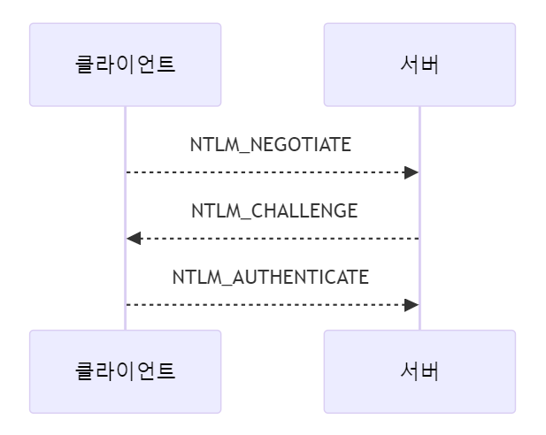
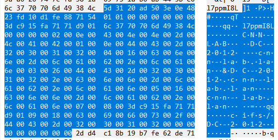
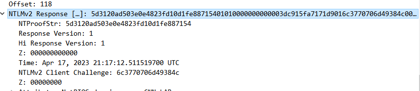
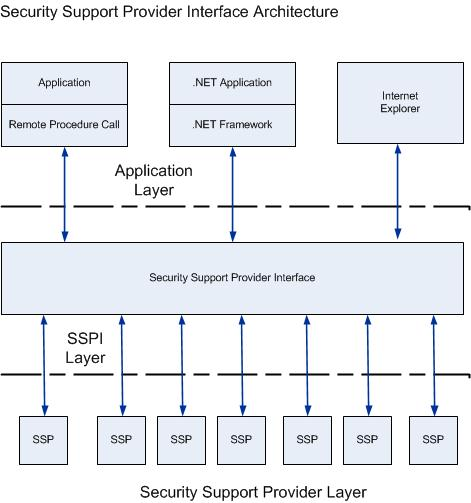
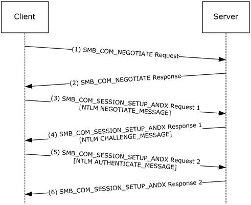
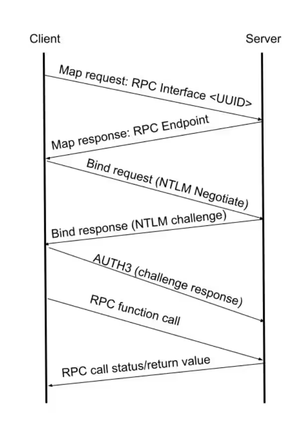
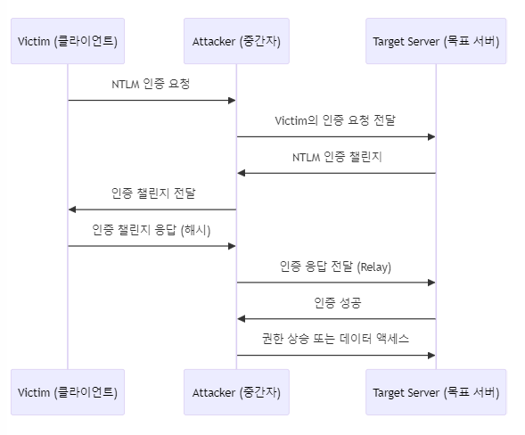

# Introduction

모의해킹 진단 업무를 수행하다 보면 Windows 환경에서의 침투 테스트 중 망에서 NTLM hash 를 획득하고 이를 측면 이용에 사용하는 흐름으로 침투가 이뤄지는 경우가 종종 있습니다. 침투 업무 진행에 집중하다보니 이런 인증 관련 개념을 좀 소홀히 한 감이 없잖아 있었는데요.

이번 기회에 Windows 인증 프로토콜인 NTLM 과 Kerberos 의 개념, 히스토리, 취약점 등에 대해서 차근차근 정리하며 시리즈로 연재를 해나가보고자 합니다.

Microsoft 는 올해 6월 NTLM 인증을 더이상 지원하지 않을 것이라고 발표했습니다. 작년 10월에 Windows 11 부터는 NTLM 을 사용하지 않겠다고 해둔터라 그리 놀라운 일은 아닙니다. Microsoft 가 NTLM 대신 사용을 권고한 인증 방식은 Kerberos 인증으로 티켓 방식의 인증 방식입니다.

NTLM 인증은 브루트포스나 Relay 공격 등에 구조적으로 취약하다고 알려져 있고 실제 침해사고들에서도 공격자들 행위가 비슷한 양상을 보이고 나아가 NTLM 인증 관련 취약점을 적극적으로 활용하기도 하지요.

Microsoft 는 위 이유를 포함해서 여러가지 사유로 더이상 NTLM 인증 지원을 하지 않는다고 선언한 것으로 보이네요. 하지만 온고지신이라는 말이 있듯이 옛것으로부터 새로운 지혜를 얻는 것 아니겠습니까?

NTLM 프로토콜의 구조와 인증 방식에 대해 알아보고 발생했던 취약점도 훑어보면서 인사이트를 얻는 시간을 가져봅시다.


# NTLM 이란


NTLM 은 사용자에게 인증, 무결성 및 기밀성을 제공하도록 설계된 MS 보안 프로토콜입니다. 옛날옛적 Microsoft LAN Manager (LM) 라는 제품에서 사용하던 인증 프로토콜의 후속 버전입니다.

NTLM 프로토콜은 2개의 hash 를 사용하는데요. 별도 salting 등이 되어있지 않아 확보한다면 그대로 인증이 가능합니다. 즉, NTLM hash 를 얻었다라는 것은 패스워드를 얻었다는 것과 같은 효과를 지닌다는 겁니다.

NTLM hash 는 NT hash 와 LM hash 로 나뉩니다.

- LM hash 는 패스워드 첫 14글자에 대해 DES 기반 암호화를 적용한 hash 이구요.
    - DES 키가 KGS!@#$% 라고 하네요..
- NT hash 는 password 를 utf-16 인코딩한 것을 MD4 한 hash 입니다.
    - DB 격인 NTDS.dit 또는 SAM 에 존재합니다.

두 hash 모두 128bit (16byte) 길이를 갖고 있고 : 를 기준으로 [LM hash]:[NT hash] 처럼 배치됩니다.

- LM hash 는 비활성화된 경우가 많아서 흔히 "aad3b435b51404eeaad3b435b51404ee" 로 고정되어 있습니다.

NTLM 은 challenge-response 방식의 인증 프로토콜로 인증을 요구하는 주체가 질문을 제공하고 인증을 받는 개체가 질문에 대한 답을 하는 방식입니다.

무작위의 Challenge 를 제공하면 특정한 방법으로 response 를 계산해서 넘기는 식으로 인증을 하며 NTLM 프로토콜 버전에 따라 Resposne 를 계산하는 방법이 다릅니다.


# NTLM 인증 과정

NTLM 인증 과정은 다음과 같습니다.

1. 클라이언트가 서버에 NTLM_NEGOTIATE 요청
2. 서버가 클라이언트에게 NTLM_CHALLENGE 전달 (challenge 값 제공)
3. 클라이언트에서 response 연산 후 서버로 NTLM_AUTHENTICATE 전달




위 그림의 과정 (NEGOTIATE, CHALLENGE, AUTHENTICATE) 을 수행할 때 메시지라는 형태로 데이터를 주고 받으며 각각 NEGOTIATE_MESSAGE, CHALLENGE_MESSAGE, AUTHENTICATE_MESSAGE 라고 칭합니다.


# NTLM 메시지

각 메시지들의 필드들을 정리해보자면 다음과 같습니다.

## NEGOTIATE_MESSAGE

- Signature (8바이트): `'N', 'T', 'L', 'M', 'S', 'S', 'P', '\0'`
- Message Type (4바이트): NEGOTIATE_MESSAGE 임을 나타냄 `0x00000001`
- Negotiate Flags (4바이트): 클라이언트가 지원하는 보안 기능을 나타내는 플래그입니다.
- Domain Name (가변 길이): 클라이언트의 도메인 이름 (Optional)
- Workstation Name (가변 길이): 클라이언트의 워크스테이션 이름 (Optional)
- Version (8바이트): NTLM 버전을 나타내는 필드 (Optional)
- Payload (가변 길이): 도메인 이름과 워크스테이션 이름


## CHALLENGE_MESSAGE

- Signature (8바이트): `'N', 'T', 'L', 'M', 'S', 'S', 'P', '\0'`
- Message Type (4바이트): CHALLENGE_MESSAGE 임을 나타냄 `0x00000002`
- Target Name (가변 길이): 서버의 도메인 이름 또는 컴퓨터 이름
- Negotiate Flags (4바이트): 서버가 선택한 보안 기능을 나타내는 플래그
- Server Challenge (8바이트): 서버가 생성한 Challenge 값
- Target Info (가변 길이): 서버에 대한 추가 정보(예: 도메인 이름, 컴퓨터 이름 등) (Optional)
- Version (8바이트): NTLM 버전을 나타내는 필드 (Optional)
- Payload (가변 길이): 도메인 이름과 워크스테이션 이름


## AUTHENTICATE_MESSAGE

- Signature (8바이트): `'N', 'T', 'L', 'M', 'S', 'S', 'P', '\0'`
- Message Type (4바이트): AUTHENTICATE_MESSAGE임을 나타냄 `0x00000003`
- LM/NT Challenge Response (가변 길이): 클라이언트가 생성한 LM 또는 NT Response
- Domain Name (가변 길이): 클라이언트의 도메인 이름
- User Name (가변 길이): 인증을 시도하는 사용자의 이름
- Workstation Name (가변 길이): 인증 요청을 보내는 클라이언트의 워크스테이션 이름
- Session Key (가변 길이): 세션 보안을 위해 사용되는 키 (Optional)
- Negotiate Flags (4바이트): 사용된 보안 기능을 나타내는 플래그
- Version (8바이트): NTLM 버전을 나타내는 필드 (Optional)
- MIC (16바이트): 메시지 무결성 코드 (Optional)
- Payload (가변 길이): 도메인 이름과 워크스테이션 이름, 세션키


# NTLM Response

위에서 NTLM 메시지 종류와 필드에 대해서 알아봤는데요. 거듭해서 NTLM 인증은 서버가 내려준 Challenge 값에 대한 Response 를 계산해서 넘기는 방식이라고 했습니다. 내친김에 NTLM 버전별로 다른 Response 계산 방식을 알아봅시다.


## NTLMv1 Response

v1의 경우 Response 는 다음처럼 계산됩니다.

1. 사용자 패스워드를 Unicode로 인코딩하고 MD4 해시를 생성합니다.
    - `NT_Hash=MD4(Unicode(Password))`
2. 생성된 NT 해시는 16바이트인데요. 여기에 0x00*5를 붙여서 21바이트로 패딩한 후 7바이트씩 세 개의 키로 분할합니다.
    - `NT_Hash_Padded=NT_Hash || 0x0000000000`
    - `K1=NT_Hash_Padded[0:7]`
    - `K2=NT_Hash_Padded[7:14]`
    - `K3=NT_Hash_Padded[14:21]`
3. K1, K2, K3 을 각각 DES 로 사용합니다. 
    - 각 키는 7바이트인데 패리티 비트를 추가해서 8바이트를 맞춥니다.)
4. 서버 챌린지를 각 DES Key 로 암호화하고 concat 한 결과가 NTLMv1 Response 입니다.
    - `Response1 = DES(K1, ServerChallenge)`
    - `Response2 = DES(K2, ServerChallenge)`
    - `Response3 = DES(K3, ServerChallenge)`
    - `NTLMv1 Response = Response1 || Response2 || Response3`


## NTLMv2 Response

NTLMv1 은 나름 구조가 간단한데요. v2 부터 머리가 좀 아파집니다. NTLMv2의 경우 HMAC-MD5 사용 및 클라이언트 챌린지 기반 값으로 nonce 를 지정해서 좀 더 크랙에 대한 내성을 확보했습니다.

1. NT 해시 NTLMv2 해시 생성 
    - `NT_Hash=MD4(Unicode(Password))`
    - `NTLMv2_Hash=HMAC-MD5(NT_Hash, Unicode(Uppercase(Username)||Domain))`
2. temp 변수 구성
    - **Responser version:**  **`0x01`** (1바이트).
    - **Hi Responserversion:**  **`0x01`** (1바이트).
    - **Z(6):** ’\x00’*6 6바이트
    - **Time:** Timestamp: 8바이트
    - **ClientChallenge:** 클라이언트에서 생성한 8바이트 랜덤 바이트
    - **Z(4):** ’\x00’*4
    - **ServerName:** 서버 이름
    - **Z(4):** ’\x00’*4
3. NtChallengeResponse 와 LmChallengeResponse 계산
    - `NtChallengeResponse = HMAC_MD5(NTLMv2_Hash, ServerChallenge + temp) + temp`
        - 여기서 `HMAC_MD5(NTLMv2_Hash, ServerChallenge + temp)` 부분을 NtProofStr 라고도 칭합니다.
    - `LmChallengeResponse = HMAC_MD5(NTLMv2_Hash, ServerChallenge + ClientChallenge) + ClientChallenge`
4. LmChallengeResponse 와 NtChallengeResponse 를 붙인 값이 NTLMv2 의 Response 입니다.
    - `NTLMv2 Response = LmChallengeResponse || LmChallengeResponse`

예시를 들어봅시다. 다음은 RPC 패킷에서 캡처된 NTLMv2 Response 값입니다. 저희가 위에서 다룬 필드들이 보이고 있는데요. wireshark 에서 잘 파싱해서 보여주고 있기 때문에 개별 설명은 생략하도록 하겠습니다.






NTLM(Part1)
# NTLM과 타 프로토콜과의 관계

NTLM은 SMB, HTTP 등 다양한 어플리케이션 계층 프로토콜에 붙여져서 사용될 수 있습니다. 신기하죠? 뿐만 아니라 Windows 내 여러 애플리케이션들이 NTLM 을 사용할 수 있게 기능을 제공하고 있습니다. 이게 어떻게 가능할까요?

GSSAPI (Generic Security Service API) 라는 인증, 보안 서비스를 응용 프로그램에 제공하는 인터페이스가 있습니다. Windows 에서는 GSSAPI를 구현한 SSPI (Security Support Provider Interface) 라는게 있는데요. 이 SSPI 에 NTLM Security Support Provider 가 구현되어 있어서 다양한 애플리케이션들이 결합되어서 NTLM 인증을 사용할 수 있습니다.



번외이지만 이 Security Support Provider 도 벡터 중에 하나로 쓰일 수 있어보이네요. 🙂

- https://msrc.microsoft.com/update-guide/vulnerability/CVE-2022-38043
- https://msrc.microsoft.com/update-guide/vulnerability/CVE-2022-24454


# NTLM over SMB

NTLM 인증을 사용하는 제일 흔한 네트워크 프로토콜이 SMB가 아닐까 싶습니다. SMB는 잘 아시다시피 파일을 공유하기 위한 프로토콜인데요. 이 프로토콜에 인증 기능을 붙이기 위해 NTLM 을 사용합니다.

아래 그림 상에서는 SMB NEGOTIATE 가 먼저 이뤄지고 그 뒤에 SMB_COM_SESSION_SETUP_ANDX 를 통해 NTLM NEGOTIATE, CHALLENGE, AUTHENTICATE 가 이뤄집니다.




특히, Windows 는 UNC PATH (`\\[IP]\path\to\file`) 를 사용해서 네트워크에 공유된 파일이나 폴더에 접근할 수 있습니다. 이 때 SMB 프로토콜이 사용되는데요. 만약 기본 인증 방식이 NTLM 이고 네트워크 너머로 UNC PATH를 삽입하여 강제로 공격자의 서버로 요청하게 만든다면 NTLMv2 Response 를 탈취할 수도 있습니다. 탈취된 NTLMv2 Response 는 주로 Relay 공격에 사용됩니다.


# NTLM over HTTP

HTTP 에서 NTLM 을 사용할때는 Request 와 Response 에 헤더에 붙여져서 사용됩니다. 다음은 HTTP 에서 NTLM Negotiate 를 하는 Request 입니다. 보시다시피 Authorization 헤더에 붙여져서 요청됩니다.

```
GET / HTTP/1.1
Host: 192.168.0.41:8080
Authorization: NTLM TlRMTVNTUAABAAAAMYCI4AAAAAAoAAAAAAAAACgAAAAAAAAAAAAAAA==
```

Response 에서는 WWW-Authenticate 라는 헤더에 NTLM Challenge 메시지가 추가되어 반환됩니다.

```
HTTP/1.1 401 Unauthorized
Date: Sat, 04 Jun 2022 02:19:43 GMT
Server: Apache
WWW-Authenticate: NTLM TlRMTVNTUAACAAAADAAMADgAAAA1gonilM550+1I+dYAAAAAAAAAAJIAkgBEAAAACgA5OAAAAA9EAE8ATQBBAEkATgACAAwARABPAE0AQQBJAE4AAQAMAEEAUABQAFMAMQA1AAQAGABkAG8AbQBhAGkAbgAuAGwAbwBjAGEAbAADACYAQQBQAFAAUwAxADUALgBkAG8AbQBhAGkAbgAuAGwAbwBjAGEAbAAFABgAZABvAG0AYQBpAG4ALgBsAG8AYwBhAGwABwAIAKFXn425d9gBAAAAAA==
Content-Length: 381
Content-Type: text/html; charset=iso-8859-1

<!DOCTYPE HTML PUBLIC "-//IETF//DTD HTML 2.0//EN">
<html><head>
<title>401 Unauthorized</title>
</head><body>
<h1>Unauthorized</h1>
<p>This server could not verify that you
are authorized to access the document
requested.  Either you supplied the wrong
credentials (e.g., bad password), or your
browser doesn't understand how to supply
the credentials required.</p>
</body></html>

```

만약 내부에서 NTLM 인증을 사용하는 기업의 HTTP 서비스가 외부로 노출되어 있으면 정보 획득 벡터로도 사용될 수 있습니다. 서버에서 주는 NTLM CHALLENGE 메시지에 도메인, 호스트 이름, 버전 등이 포함된다는거 기억하시나요? 이 점을 이용해서 초기 진입 시 유용한 정보를 얻을 가능성도 있습니다.


# NTLM over RPC

위에서 잠시 SSPI에 대해 언급할 때 그림에서 보셨을 것 같은데요. RPC 에서도 NTLM 인증을 사용할 수 있습니다. RPC UUID 매핑 이후 Bind request, Bind response 를 통하여 NEGOTIATE, CHALLENGE, AUTHENTICATE 를 수행합니다.



RPC 를 사용하기 전에 적절하게 인증이나 권한제어가 되어 있다면 괜찮겠지만, 임의로 RPC가 사용가능하면서도 RPC 함수에 경로가 들어가는 경우 UNC Path 를 전달해서 서버가 클라이언트 쪽으로 NTLM AUTH 를 시도하게끔 하는 강제 인증 공격도 존재합니다.

# NTLM Relay

NTLM 관련 공격과 취약점은 이 글 한 편에 다 정리할 수가 없을 정도로 많습니다. HotPotato, Printerbug, Petitpotam, DFSCoerce, ShadowCoerce, CVE-2024-8260, CVE-2024-38200 등등 많습니다. 이러한 공격들에서 공통적으로 사용되는 기법이 있습니다. 바로 NTLM Relay 인데요. 중간자 공격이랑 거의 유사합니다.

NTLM 를 획득한 경우에는 PTH (pass-the-hash) 를 써서 마치 패스워드를 알고 있는 듯이 사용할 수 있습니다만 NTLMv2 hash (a.k.a Net-NTLM hash) 를 얻어낸 경우에는 PTH가 불가능하고 Relay 를 해야 합니다. (또는 크랙을 시도 하는 방법이 있긴 합니다.)




NTLM Relay 를 할 때 사용되는 도구는 Responder, impacket 의 ntlmrelayx 가 있습니다.

Responder 도구를 써서 인증을 위한 fake 서버를 구성하구요. responder 로 받은 요청을 타겟 서버에 relay 할 때는 ntlmrelayx 를 사용합니다.


# 마치며

Windows 가 지원을 더이상 하지 않으려고 하는 NTLM 인증에 대해 알아봤습니다. 오랫동안 사용되어왔기도 하고 여러 프로토콜에 결합되어 사용될 수 있다는 점과 Windows 의 UNC Path 기능과 엮여서 다양한 공격 벡터가 발생하였던 인증 방식입니다. 다음 글에서는 이번에 다뤘던 개념 내용을 토대로 NTLM 관련 1-day 취약점 몇 종 분석해보는 시간을 가져보도록 하겠습니다. 읽어주셔서 감사합니다 🙂


# References

- https://learn.microsoft.com/en-us/windows/whats-new/deprecated-features-resources#ntlm
- https://learn.microsoft.com/en-us/openspecs/windows_protocols/ms-nlmp/b38c36ed-2804-4868-a9ff-8dd3182128e4
- https://davenport.sourceforge.net/ntlm.html
- https://web.archive.org/web/20030706050349/http://www.xfocus.net/articles/200305/smbrelay.html
- https://learn.microsoft.com/ko-kr/troubleshoot/windows-server/windows-security/ntlm-user-authentication
- https://www.silverfort.com/ko/blog/understanding-the-security-risks-of-ntlm/
- https://foxglovesecurity.com/2016/01/16/hot-potato/
- https://www.synacktiv.com/publications/relaying-kerberos-over-smb-using-krbrelayx
- https://www.bleepingcomputer.com/news/microsoft/microsoft-deprecates-windows-ntlm-authentication-protocol/
- https://en.wikipedia.org/wiki/NTLM
- https://googleprojectzero.blogspot.com/2021/10/using-kerberos-for-authentication-relay.html
- https://learn.microsoft.com/en-us/openspecs/windows_protocols/ms-kile/b4af186e-b2ff-43f9-b18e-eedb366abf13
- [https://www.레드팀.com/general-concepts/windows-authentication/ntlm](https://www.xn--hy1b43d247a.com/general-concepts/windows-authentication/ntlm)
- https://learn.microsoft.com/en-us/openspecs/windows_protocols/ms-nlmp/c083583f-1a8f-4afe-a742-6ee08ffeb8cf
- https://0xdf.gitlab.io/2019/01/13/getting-net-ntlm-hases-from-windows.html
- https://learn.microsoft.com/ko-kr/windows-server/security/windows-authentication/security-support-provider-interface-architecture
- https://en.wikipedia.org/wiki/Generic_Security_Services_Application_Program_Interface
- https://learn.microsoft.com/ko-kr/windows-server/security/windows-authentication/security-support-provider-interface-architecture#BKMK_NTLMSSP
- https://msrc.microsoft.com/update-guide/vulnerability/CVE-2022-38043
- https://blog.leakix.net/2022/03/bypassing-ntlm-auth-over-http/
- https://www.akamai.com/blog/security-research/winreg-relay-vulnerability
- [https://www.레드팀.com/credential-access/authentication-coercion](https://www.xn--hy1b43d247a.com/credential-access/authentication-coercion)
- https://github.com/p0dalirius/windows-coerced-authentication-methods
- https://github.com/fortra/impacket/blob/master/examples/ntlmrelayx.py
- https://github.com/lgandx/Responder
- https://learn.microsoft.com/ko-kr/windows-server/security/windows-authentication/security-support-provider-interface-architecture
- https://learn.microsoft.com/en-us/openspecs/windows_protocols/ms-nlmp/c083583f-1a8f-4afe-a742-6ee08ffeb8cf
- https://blog.leakix.net/2022/03/bypassing-ntlm-auth-over-http/
- https://blog.leakix.net/2022/03/bypassing-ntlm-auth-over-http/
- https://www.akamai.com/blog/security-research/winreg-relay-vulnerability
