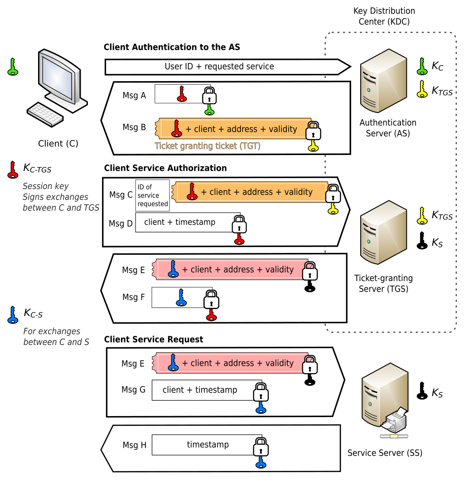
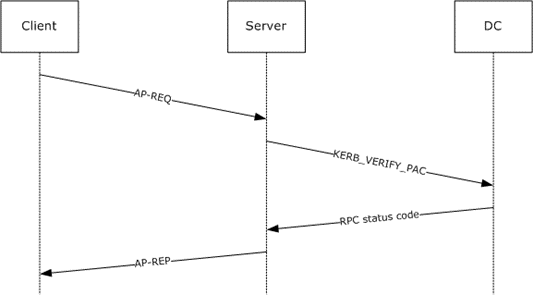

# Introduction

hello. Welcome back to the Windows Authentication Series. In Part 1 NTLM, I said that we would look at NTLM-related CVEs in Part 2. While it's good to cover NTLM-related CVEs, I thought it would be a good idea to cover the Kerberos authentication protocol, which is mainly used in Windows, first.

In this article, I'll show you how Kerberos works, how it's implemented in the Windows environment, and analyze some Kerberos-related attacks and CVE vulnerabilities.

# Kerberos Authentication

Kerberos is a ticket-based authentication protocol that allows users and services to authenticate each other without exposing the passwords themselves to the network by issuing tickets based on symmetric key cryptography through a KDC.

This authentication structure features the following elements

- Key Distribution Center (KDC): The key distribution center, a composite of the AS and TGS, provides authentication services and generates and distributes session keys.
- AS (Authentication Server): Authentication server, performs client authentication and issues TGTs to clients encrypted with the TGS's secret key.
- Ticket Granting Server (TGS): A ticket granting server that issues STs and session keys when a client sends a TGT to the TGS.
- TGT (Ticket Granting Ticket): A ticket granting ticket, which allows a ticket to be issued by the TGS.
- ST (Service Ticket): A ticket that allows you to use a service.
- SS (Service Server): The server that provides the service.

The Kerberos authentication process can be summarized as follows:

1. The client makes an authentication request to the AS.
2. the AS issues a TGT to the client.
    1. The TGT is encrypted with the secret key of the TGS.
    2. the AS and TGS typically share the same host as the KDC.
3. The client communicates the TGT and the ID of the service to be requested to the TGS.
4. the TGS issues an ST to the client.
The service the client is requesting access to must be registered with the TGS with a Service Principal Name (SPN).
5. The client forwards the ST to the server.
6. Perform the communication.

The above process is schematized in the following figure.

## Kerberos authentication on Windows

In the Windows Kerberos implementation, tickets include something called a Privilege Attribute Certificate (PAC). The PAC contains the user's group information and authorization data, among other things. The KDC signs this information to issue the ticket. When a ticket comes in, the service server looks at the PAC, checks the permissions, and either grants or denies access.

Now, in Windows, the Kerberos authentication process outlined above looks like this:

It's a bit of a headache, but let's go through it one by one.

**1) AS-REQ**

In an AS-REQ, the client requests a ticket with its identity from the KDC's authentication service. By Windows default, with preauthentication, the user sends the current time encrypted with their secret key (NTLM hash). The KDC decrypts this with the user's NTLM hash, which is stored in the domain controller (DC), to authenticate the user.

**2) AS-REP** 

If the verification in AS-REQ is successful, the client is issued a TGT and a session key (client-TGS) in the AS-REP response. The session key is encrypted with the user's NTLM hash, and the TGT is encrypted with the KDC's master key (the NTLM hash of the krbtgt account), so the client cannot decrypt the TGT.

**3) TGS-REQ** 

When a client needs access to a service server, it sends the TGT in a TGS-REQ message to the TGS in the KDC. The request also includes the SPN of the target service and the previously issued client-TGS session key.

**4) TGS-REP**

The KDC receives the TGS-REQ and verifies that the TGT is valid. The TGT is encrypted with the KDC's master key, so the KDC can decrypt it and verify it.

And if the user is authorized to access the requested service and there are no problems, it sends a TGS-REP response to the client.

This includes a session key (client-service server) and a service ticket (ST).

The service ticket is encrypted with the secret key of the service account (the NTLM hash of the service account), so only the **service** can decrypt and view it, the client does not know the contents. The client will keep this ST and use it to access the actual service.

**5) AP-REQ**

Finally, the client tries to connect by presenting the AP-REQ to the target server (service) with the service ticket. To prove its identity, the client also sends the authenticator (Authenticator, timestamp, etc.) encrypted with the service session key it received earlier.

The server sends a KERB_VERIFY_PAC message to the domain controller to validate the signature of the PAC in the service ticket. This PAC is protected by the KDC's signature, and the service verifies the integrity of the PAC when validating the ticket so that it can trust the user's authorization in the domain.

**6) AP-REP** 

The service server verifies the PAC of the service ticket presented by the client, and if the verification is successful, the server sends a response to the client in an AP-REP message to complete the session key negotiation. The client is then allowed to access the service.

---

As you can see from the description, Kerberos authentication on Windows is based on the fact that the secret key shared with each other is the user's NTLM hash, the authorization information, called the PAC, is contained in the ticket, and the PAC is signed by the KDC to ensure its integrity.

# Kerberos-related attacks

The Kerberos protocol itself is designed to be secure, but various attack techniques have been studied depending on the implementation settings and operating environment. Let's take a look at the most common attacks in the Windows Kerberos environment.

## Kerberoasting

Kerberoasting is an attack technique that uses a legitimate domain user account to request a Kerberos ticket for a **service account** and then cracks the encrypted information contained in the ticket to steal the service account's password.

Any user inside an AD domain can request a service ticket via TGS-REQ for an account with an SPN attribute, which means that an attacker can use this technique if they have already penetrated the domain.

The service ticket is encrypted with an NTLM hash, so if the crack is successful, the NTLM hash is obtained, which is no different than obtaining a password in a Windows environment.

## AS-REP Roasting

**AS-REP Roasting** is a technique similar to Kerberoasting, but targets users who have Kerberos Pre-Authentication disabled.

Pre-authentication is the process of verifying that the client knows the shared key before a TGT is issued.

If the option “Do not require Kerberos pre-authentication” is set in the AD account properties, TGTs are issued without pre-authentication, meaning that a password is not required to obtain a TGT.

The TGT is encrypted with the master key of the KDC, which is the NTLM hash of the krbtgt account, so if you successfully crack the TGT, you can take over the privileges of the krbtgt account.

## Silver Ticket

If you have the NTLM hash of a specific service account, you can use it to create another service ticket that manipulates the PAC.

Service tickets are originally issued by TGS, but it is possible to create service tickets without going through TGS.

The PAC in the service ticket is signed with two keys: the service account secret key and the krbtgt account secret key, but in some cases, only the service account secret key signature is verified.

For example, an account with the SeTcbPrivilege privilege is eligible for a Silver Ticket because only the service account secret key signature is verified.

## Golden Ticket

Once you have the NTLM hash of the krbtgt account, you can create a TGT. This TGT also contains a PAC, and while the Silver Ticket manipulated the PAC of the service ticket, the Golden Ticket manipulates the PAC of the TGT.

When the TGT with the manipulated PAC is delivered to the TGS, the service ticket is issued with the corresponding privilege, so it can be used to elevate to higher privileges, such as domain administrator.

# Kerberos-related vulnerabilities

The Kerberos protocol is very complex and it is difficult to introduce all the related features implemented in Windows. Therefore, let's take a look at a few CVEs to understand the details and the vulnerabilities that occurred.

## CVE-2020-17049

CVE-2020-17049 is a security vulnerability found in the Kerberos Delegation mechanism, known as a “Bronze Bit” attack.

Delegation is literally a delegation. For example, let's say a user authenticates to a web application, and the web application needs to access a database based on the user's permissions. There are several implementations of Kerberos Delegation to support this (Unconstrained Delegation, Constrained Delegation, Do Not Delegate, etc.)

The AllowedToDelegateTo property, which specifies the services that can be delegated to, is used to store information that a service A can delegate to another service B. This is called the Forwardable Flag in the service ticket.

The Forwardable Flag in a service ticket is a bit that indicates whether this ticket is relayable, and if Forwardable is 1, it means that the authorization can be delegated. So if the Kerberos Delegation option is Do Not Delegate or AllowedToDelegateTo is not defined, Forwardable is 0.

But the Forwardable bit is not protected by the KDC's signature, the service's signature, or anything else, so it can be tampered with.

At this point, do you have any idea what this CVE is?

If you manipulate the Forwardable Flag in a service ticket and send it to a service, you can force the service to delegate privileges even if it is not delegating privileges, which can lead to a privilege takeover.

In Windows, Kerberos Contained Delegation (MS-SFU) implements authorization delegation with the S4U2proxy protocol. If service A is delegated to service B, it is impossible to make a request to service B using only A's service ticket. You need to present the A service ticket to the KDC via S4U2proxy and get the B service ticket.

This is a vulnerability that can be exploited by setting the Forwardable flag to 1 to force delegation of authorization.

## CVE-2022-33647 & CVE-2022-33679

**CVE-2022-33647** and **CVE-2022-33679** are vulnerabilities discovered by James Forshaw of Google's Project Zero that allow the use of RC4 encryption during the Kerberos authentication process, which can be used to decrypt session keys and gain privileges using methods such as brute force. The vulnerability trigger forces the use of RC4 because Kerberos natively prefers AES-based encryption but supports the RC4-HMAC (MD4) method due to backward compatibility.

When a client passes an AS-REQ to a KDC, it can use an integer field called etype to specify the supported encryption algorithms. The server will check for supported ciphers and, if available, will use the cipher specified by the client.

The idea Forshaw used to exploit CVE-2022-33647 is amazing, let's take a look:

When a client authenticates, it typically sends a request to the KDC without a pre-authentication timestamp. The KDC then returns with an error code called KDC_ERR_PREAUTH_REQUIRED. This error response includes a list of required ciphers so that the client can perform the appropriate encryption. MITM intercepts the client's AS-REQ and returns an error, and includes information about RC4-MD4 in the error to force the client to use RC4-MD4. Relay the RC4-enabled AS-REQ to the KDC to receive the AS-REP.

Now, the attacker has the RC4-enabled AS-REQ and the encrypted session key and TGT contained in the AS-REP. The AS-REQ has a timestamped structure called PA-ENC-TS-ENC, and the AS-REP has an encrypted response structure called EncASRepPart.

RC4 does an XOR with the generated stream key, so if you know the ciphertext and the plaintext, you know the stream key. This is computable except when both sides are yellow in the above figure:

- The RC4-MD4 method generates and uses a 16-byte key, where only the first 5 bytes are random and the 11th byte is fixed at 0xAB.

The green markings are values we know or can compute because they are ASN.1 structures. We're lucky enough to have about 4 bytes of the session key overlap, so we can decrypt it, and 1 byte needs to be brute-forced. Bruteforcing can be done by requesting a service ticket from the KDC 256 times to get a legitimate service ticket.  This allows him to obtain the session key, decrypt the ticket, and take over the user's privileges.

The case of CVE-2022-33679 occurs when pre-authentication in Keberos is disabled. If an account has pre-authentication disabled, an attacker can send an AS-REQ request directly to the KDC for that account to request a TGT over RC4-MD4. Because pre-authentication is turned off, the KDC will return the RC4-encrypted TGT and session key via AS-REP even though the user has not proven their password.

To exploit this vulnerability, instead of obtaining the session key, we use oracle padding to append a null value to the back of the timestamp and obtain the key if the KDC responds with a valid response.

## CVE-2022-37966

CVE-2022-37966 is a vulnerability announced at Black Hat Europe 2022 that allows verification bypass via MD5 collision after PAC tampering when using the RC4_HMAC_MD5 algorithm, which was natively supported in Kerberos at the time.

There is no controllable field in the PAC that can be used to insert arbitrary bytes, but the LogonScript field can be used to insert a long UTF-16 string, which can be used to trigger an MD5 collision.

To exploit this vulnerability, you need to create a PAC with domain administrator privileges that has the same MD5 hash, which in our research took about 7 hours with HashClash. Once created, you can get domain administrator privileges, so it seems to be worth the time.

## CVE-2024-43639

CVE-2024-43639 is a vulnerability reported to ZDI, which is a Heap Overflow vulnerability due to Integer Overflow in KDC Proxy (kdcsvc).

Windows KDC Proxy is a Windows Server component that proxies Kerberos protocol messages over HTTP. It occurs in kpssvc.dll, which runs a service called kdcsvc.

I've been looking at Kerberos protocol logical bugs all the time, so it's kind of refreshing to see a memory corruption bug.

# **Conclusion**

We've covered how Kerberos works, the Windows implementation, and related attacks and vulnerabilities. Kerberos is a strong authentication protocol, but misconfigurations and implementation gaps can expose it to a variety of attacks and vulnerabilities. The topic for the next installment is still undecided, but we'll be back with something interesting. Thanks for reading 🙂

# References

- [https://en.wikipedia.org/wiki/Kerberos_(protocol)](https://en.wikipedia.org/wiki/Kerberos_(protocol))

- https://www.ibm.com/docs/ko/db2/11.5?topic=details-kerberos-authentication

- https://www.varonis.com/blog/kerberos-attack-silver-ticket

- https://learn.microsoft.com/en-us/openspecs/windows_protocols/ms-apds/1d1f2b0c-8e8a-4d2a-8665-508d04976f84

- https://learn.microsoft.com/ko-kr/openspecs/windows_protocols/ms-apds/a00d0b83-97e3-44ad-ba2d-1221d4f51a35#gt_26456104-0afb-4afe-a92e-ac160a9efdf8

- https://learn.microsoft.com/ko-kr/windows-server/security/credentials-protection-and-management/authentication-policies-and-authentication-policy-silos

- https://blog.sunggwanchoi.com/kor-keobeoroseuting-kerberoasting/

- https://www.hackthebox.com/blog/as-rep-roasting-detection

- https://www.microsoft.com/en-us/security/blog/2024/10/11/microsofts-guidance-to-help-mitigate-kerberoasting/

- https://googleprojectzero.blogspot.com/2022/10/rc4-is-still-considered-harmful.html

- https://syfuhs.net/a-bit-about-kerberos

- https://i.blackhat.com/EU-22/Thursday-Briefings/EU-22-Tervoort-Breaking-Kerberos-RC4-Cipher-and-Spoofing-Windows-PACs-wp.pdf

- https://www.thehacker.recipes/ad/movement/kerberos/

- https://en.hackndo.com/kerberos-silver-golden-tickets/

- https://www.netspi.com/blog/technical-blog/network-pentesting/cve-2020-17049-kerberos-bronze-bit-theory/

- https://learn.microsoft.com/en-us/openspecs/windows_protocols/ms-sfu/3bff5864-8135-400e-bdd9-33b552051d94

- https://learn.microsoft.com/en-us/windows-server/security/kerberos/kerberos-constrained-delegation-overview

- https://hackyboiz.github.io/2020/12/11/l0ch/2020-12-11/

- https://learn.microsoft.com/en-us/openspecs/windows_protocols/ms-kile/4ce3ddc0-aaaa-4a1b-b48b-62a07e906926

- https://www.zerodayinitiative.com/blog/2025/3/3/cve-2024-43639