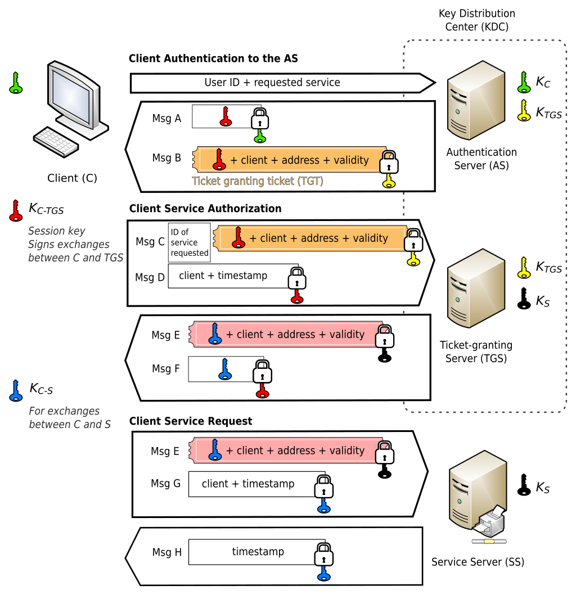
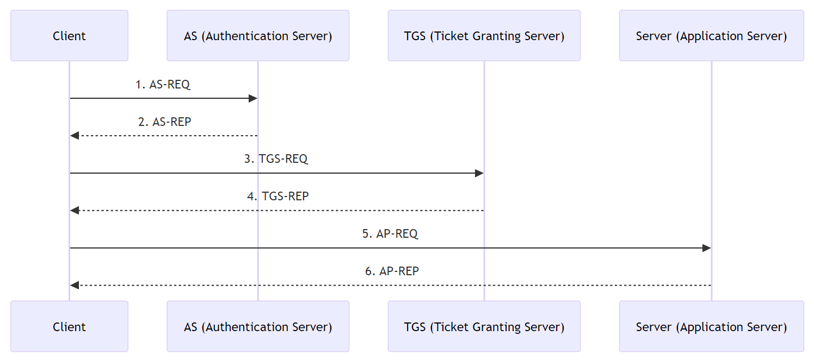
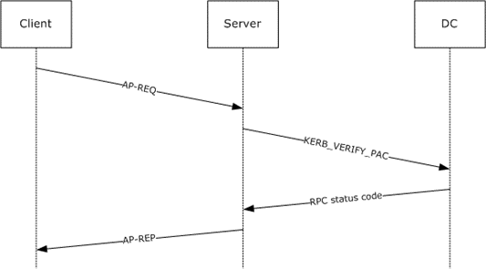
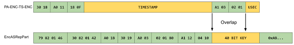

# Introduction

안녕하세요. Windows Authentication Series 로 다시 찾아뵙게 되었습니다. Part1 NTLM 때는 Part2 때 NTLM 관련 CVE 를 살펴볼 예정이라고 했었는데요. NTLM 관련 CVE를 다루는 것도 좋지만 Windows 에서 주로 사용되는 Kerberos 인증 프로토콜에 대해서 먼저 다뤄봐야겠다 싶어서 내용을 준비해봤습니다.

이 글에서는 Kerberos 의 기본적인 작동 원리부터 Windows 환경에서의 구현 방식, Kerberos 관련 공격과 관련 CVE 취약점 몇 종을 분석해보는 시간을 가져보도록 하겠습니다.

# Kerberos 인증

Kerberos 는 티켓 기반의 인증 프로토콜입니다. 이 프로토콜은 KDC 를 통해 대칭 키 암호화 기반의 티켓을 발급함으로써 패스워드 자체를 네트워크에 노출하지 않고도 사용자와 서비스가 상호 인증을 수행하게 해줍니다.

이 인증 구조에서는 다음과 같은 요소가 등장합니다.

- KDC (Key Distribution Center): 키 배포 센터, AS 와 TGS 를 묶은 요소로 인증 서비스 제공 및 세션키 생성, 분배를 수행합니다.
- AS (Authentication Server): 인증 서버, 클라이언트의 인증을 수행하고 클라이언트에게 TGS의 비밀키로 암호화된 TGT를 발급합니다.
- TGS (Ticket Granting Server): 티켓 부여 서버, 클라이언트가 TGT를 TGS 에 보내면 ST 와 세션키를 발급합니다.
- TGT (Ticket Granting Ticket): 티켓 부여 티켓, TGS 에서 티켓을 발급받을 수 있는 티켓입니다.
- ST (Service Ticket): 서비스를 이용할 수 있는 티켓입니다.
- SS (Service Server): 서비스를 제공하는 서버입니다.

Kerberos 인증 절차를 간단하게 정리하면 다음과 같습니다.

1. 클라이언트가 AS 에 인증 요청을 합니다.
2. AS 가 클라이언트에게 TGT 를 발급합니다.
    1. 이 때, TGT는 TGS 의 비밀키로 암호화 됩니다.
    2. AS, TGS 는 KDC로 일반적으로 같은 호스트를 공유합니다.
3. 클라이언트가  TGT 와 요청할 서비스의 ID 를 TGS 에 전달합니다.
4. TGS 가 클라이언트에게 ST 를 발급합니다.
    1. 이 때, 클라이언트가 접근 요청하는 서비스는 SPN (Service Principal Name) 으로 TGS에 등록되어 있어야 합니다.
5. 클라이언트가 ST를 서버에 전달합니다.
6. 통신을 수행합니다.

위 과정을 도식화한 그림은 다음과 같습니다.

## Windows에서의 Kerberos 인증

Windows Kerberos 구현에서는 티켓에 PAC (Privilege Attribute Certificate) 라는게 포함됩니다. PAC 는 사용자의 그룹 정보와 권한 데이터 등을 포함하는데요. KDC가 이 정보를 서명하여 티켓을 발급하게 됩니다. 서비스 서버는 티켓이 오면 PAC를 보고 권한을 확인하여 접근을 허용하거나 거부시킵니다.

자, Windows 에서는 위에서 대략적으로 설명한 Kerberos 인증 과정을 다음 그림처럼 진행하는데요. 

머리가 아프지만 하나하나 살펴보도록 하겠습니다.

**1) AS-REQ**

AS-REQ 에서는 클라이언트가 KDC 의 인증 서비스에 자신의 ID로 티켓을 요청합니다. Windows 기본 설정 상, 사전 인증을 통해 사용자가 현재 시각을 자신의 비밀키 (NTLM hash) 로 암호화하여 보냅니다. KDC는 DC(Domain Controller) 에 보관되어 있는 사용자의 NTLM hash 로 이를 복호화하여 사용자를 인증합니다.

**2) AS-REP** 

AS-REQ 에서 검증이 성공하면 AS-REP 응답으로 클라이언트에게 **TGT와 세션키(클라이언트-TGS)** 를 발급합니다. 세션키는 사용자의 NTLM hash로 암호화되며 TGT는 **KDC의 마스터 키 (krbtgt 계정의 NTLM hash)** 로 암호화 되어 있기에 클라이언트는 TGT를 복호화할 수는 없습니다.

**3) TGS-REQ** 

클라이언트가 서비스 서버에 접근이 필요할 때 TGT 를 TGS-REQ 메시지에 실어서 KDC의 TGS 에 보냅니다. 이 요청에는 대상 서비스의 SPN 과 앞서 발급된 클라이언트-TGS간 세션키도 포함합니다.

**4) TGS-REP** 

KDC는 TGS-REQ를 받아서 TGT가 유효한지 확인합니다. TGT 는 KDC 의 마스터키로 암호화 되어 있기에 KDC가 복호화 하여 검증할 수 있습니다. 

그리고 해당 사용자가 요청한 서비스에 접근 권한이 확인하고 문제가 없으면 TGS-REP 응답을 클라이언트에게 보냅니다. 

여기에는 **세션 키**(**클라이언트-서비스 서버**)와 **서비스 티켓(ST)**이 포함됩니다. 

서비스 티켓은 해당 서비스 계정의 비밀 키(서비스 계정의 NTLM hash)로 암호화되어 있으므로 **서비스만** 복호화 하여 열람할 수 있고 클라이언트는 내용을 알 수 없습니다. 클라이언트는 이 ST를 받아두었다가 실제 서비스에 접속할 때 사용하게 됩니다.

**5) AP-REQ**

최종적으로 클라이언트는 서비스 티켓을 들고 AP-REQ 를 대상 서버(서비스)에 제시하여 접속을 시도합니다. 이때 클라이언트는 자신의 신원을 증명하기 위해 앞서 받은 서비스 세션 키로 암호화한 인증자(Authenticator, 타임스탬프 등)도 함께 보냅니다.

서버는 도메인 컨트롤러에 KERB_VERIFY_PAC 메시지를 전송하여 서비스 티켓 내 PAC 의 서명 검증을 합니다. 이 PAC는 KDC의 서명으로 보호되며, 서비스는 티켓을 검증할 때 PAC의 무결성을 확인함으로써 사용자의 도메인 내 권한을 신뢰할 수 있습니다.

**6) AP-REP** 

서비스 서버에서는 클라이언트가 제시한 서비스 티켓의 PAC를 확인하고 검증이 성공하면 서버는 AP-REP 메시지로 클라이언트에게 응답을 보내 세션 키 협상을 완료시킵니다. 이후 클라이언트는 해당 서비스에 접근이 허용됩니다. 

---

설명에서 알 수 있듯이, Windows 에서의 Kerberos 인증은 서로 공유되는 암호키가 사용자의 NTLM hash 이며 PAC 라고 하는 권한 정보가 티켓에 담겨있고 PAC는 KDC가 서명하여 무결성을 확보합니다.

# Kerberos 관련 공격

Kerberos 프로토콜 자체는 안전하게 설계되었으나, 구현상 설정이나 운영 환경에 따라 다양한 공격 기법이 연구되어 왔습니다. Windows Kerberos 환경에서 주로 다뤄지는 공격 기법들에 대해서 알아봅시다.

## Kerberoasting

Kerberoasting 은 합법적인 도메인 사용자 계정으로 **서비스 계정**의 Kerberos 티켓을 요청한 후, 티켓에 포함된 암호화된 정보를 크랙하여 서비스 계정의 패스워드를 탈취하는 공격 기법입니다.

AD 도메인 안에 있는 사용자라면 SPN 속성이 있는 계정에 대해서 TGS-REQ 를 통해 서비스 티켓을 요청할 수 있습니다.  즉, 공격자가 도메인 내로 이미 침투한 상태에서 사용할 수 있는 기법이죠.

서비스 티켓은 NTLM hash 로 암호화되어 있기 때문에 크랙이 성공한다면 NTLM hash 를 알아내는 것이며 이 hash 를 얻었다는 것은 Windows 환경에서 패스워드를 얻어낸 것과 다름이 없습니다.

## AS-REP Roasting

**AS-REP Roasting**은 Kerberoasting과 유사하지만, **Kerberos Pre-Authentication이 비활성화**된 사용자를 표적으로 하는 기법입니다.

사전 인증은 TGT 가 발급되기 전에 사전에 공유된 key 를 클라이언트가 알고 있는지 확인하는 과정입니다.

AD 계정 속성 중 “Do not require Kerberos pre authentication” 이라는 옵션이 설정되어 있으면 사전 인증 없이 TGT 를 발급해줍니다. 그러니까, 패스워드 없이도 TGT를 발급받을 수 있다는 말입니다.

TGT 는 KDC의 마스터키 즉, krbtgt 계정의 NTLM hash 로 암호화되기 때문에 TGT 크랙에 성공한다면 krbtgt 계정의 권한을 탈취할 수 있게 되는 셈입니다. 

## Silver Ticket

만약 특정 서비스 계정의 NTLM hash 를 얻어낸 상황이라면 이를 이용해 PAC를 조작한 다른 서비스 티켓을 만들어낼 수 있습니다. 

서비스 티켓은 원래 TGS 에서 발급을 해주지만 TGS 를 통하지 않고도 서비스 티켓 생성이 가능합니다.

서비스 티켓 내 PAC 는 서비스 계정 비밀키와 krbtgt 계정 비밀키 2개로 서명이 되는데, 서비스 계정 비밀키 서명만 검증하는 경우가 있습니다.

대표적으로 SeTcbPrivilege 권한이 있는 경우가 그러한데요. 이 권한이 있는 계정은 서비스 계정 비밀키 서명만 검증하기 때문에 Silver Ticket 의 대상이 된다고 볼 수 있습니다.

## Golden Ticket

krbtgt 계정의 NTLM hash 를 얻어냈다면 TGT 생성이 가능합니다. 이 TGT 에도 PAC 가 포함되는데요. 앞서 Silver Ticket 은 서비스 티켓의 PAC를 조작했다면 Golden Ticket 은 TGT 의 PAC를 조작합니다.

조작된 PAC를 가진 TGT가 TGS 에 전달이 되면 해당 권한으로 서비스 티켓이 발급되기 때문에 이를 이용해서 도메인 어드민 등 더 높은 권한으로 상승할 수 있습니다.

# Kerberos 관련 취약점

Kerberos 프로토콜은 내용이 방대하고 Windows 에서 구현한 각종 관련 기능들을 모두 소개하는 것은 어렵습니다. 그렇기에 CVE 몇 종을 살펴보면서 어떤 세부 사항들이 있는지와 발생했던 취약점에 대해 알아보는 시간을 갖도록 하겠습니다.

## CVE-2020-17049

CVE-2020-17049는 Kerberos Delegation 메커니즘에서 발견된 보안 취약점으로, “Bronze Bit” 공격으로 알려져 있습니다. 

Delegtation 은 직역하면 위임인데요. 예를 들어서 사용자가 웹 애플리케이션에 인증을 하고, 웹 애플리케이션이 사용자 권한에 따라 데이터베이스에 접근해야할 때가 있다고 합시다. 이 때 웹 애플리케이션이 사용자 권한을 “위임” 받아서 요청을 해야하기 때문에 이를 지원하기 위한 Kerberos Delegation 이 여러 종 구현되어 있습니다. (Unconstrained Delegation, Constrained Delegation, 위임 하지 않음 등) 

위임이 가능한 서비스들을 지정하는 AllowedToDelegateTo 프로퍼티를 이용해 특정 서비스A가 다른 서비스B에 위임이 가능하다는 것을 정보를 저장하는 것이죠.

서비스 티켓에 있는 Forwardable Flag 는 이 티켓이 Relay 가 가능하느냐를 표기하는 비트인데요. Forwardable 이 1이라면 권한 위임이 가능하다는 말입니다. 그래서 앞서 Kerberos Delegation 옵션 중 위임 하지 않음 옵션이나, AllowedToDelegateTo 로 정의가 되어 있지 않을 경우 Forwardable이 0입니다.

그런데 Forwardable bit 는 KDC의 서명, 서비스의 서명 등으로 보호되어 있지 않아서 변조가 가능합니다.

이 쯤 오면 이 CVE가 어떤 취약점인지 감이 오시나요?

서비스 티켓에 있는Forwardable Flag 를 조작하여 서비스에 보내면 그 서비스가 권한 위임을 하고 있지 않더라도 강제로 권한 위임을 하게 되어 권한을 탈취할 수 있는 취약점입니다.

Windows 에서는 Kerberos Contrained Delegation (MS-SFU) 는 S4U2proxy 프로토콜로 권한 위임을 구현했는데요. 만약 서비스 A가 서비스 B로 권한 위임이 될 때 A 서비스 티켓만 가지고서는 서비스 B에 요청이 불가능합니다. S4U2proxy 를 통해 KDC에 A 서비스 티켓을 제시하고 B 서비스 티켓을 받습니다.

이렇게 Forwardable flag를 1로 설정하여 강제적으로 권한 위임을 유발하는 취약점이라고 볼 수 있겠습니다.

## CVE-2022-33647 & CVE-2022-33679

**CVE-2022-33647**과 **CVE-2022-33679**는 구글 Project Zero 의 James Forshaw 가 발견한 취약점으로, Kerberos 인증 과정 중 RC4 암호화 사용을 가능하도록 하여 브루트포스 등의 방법으로 세션키를 복호화 하고 권한을 탈취하는 취약점입니다. Kerberos 가 원래는 AES 기반 암호화를 선호하지만 하위 호환성 때문에 RC4-HMAC(MD4) 방식을 지원하기에 취약점 트리거에서는 RC4 를 강제로 사용하도록 합니다.

클라이언트가 AS-REQ 를 KDC에 전달할 때 etype 이라는 정수형 필드를 이용해서 지원 가능한 암호화 알고리즘을 지정할 수 있습니다. 서버는 이를 받고서 지원 가능한 암호화 알고리즘을 확인하고 사용 가능하다면 클라이언트가 제시한 암호화 알고리즘을 사용하게 됩니다. 

CVE-2022-33647 를 Exploit 하기 위해 Forshaw 형님이 사용한 아이디어가 놀라운데요. 한 번 살펴보겠습니다. 

클라이언트가 인증할 때 일반적으로 사전 인증 타임스탬프가 없는 요청을 KDC에 보냅니다. KDC는 그러면 KDC_ERR_PREAUTH_REQUIRED 라는 에러 코드를 포함해서 반환합니다. 이 오류 응답에서는 필요한 암호화 목록 등을 실어서 클라이언트가 적절하게 암호화를 수행할 수 있게 하는데요. MITM 을 통해 클라이언트의 AS-REQ 를 가로채고 에러를 반환하면서 에러에 RC4-MD4 에 대한 정보를 넣어 클라이언트가 RC4-MD4 를 사용하도록 합니다. RC4를 사용하는 AS-REQ 를 릴레이하여 KDC에 보내어 AS-REP 를 받습니다.

자 그러면, 공격자는 RC4를 사용하는 AS-REQ 와 AS-REP 에 포함된 암호화된 세션키와 TGT를 얻었습니다. AS-REQ 에는 PA-ENC-TS-ENC 라고 하는 타임스탬프를 지정하는 구조가 있고 AS-REP 는 EncASRepPart 라고 하는 암호화 응답 구조로 이뤄져 있습니다.

RC4 는 생성된 스트림 키로 XOR 을 하는 것이다 보니, 암호문과 평문을 알고 있으면 스트림 키를 알 수 있습니다. 위 그림에서 양 쪽이 노란색인 경우 제외하고 계산이 가능한 것이죠.

- RC4-MD4 방식은 16바이트의 키를 생성해서 사용하는데, 앞 5바이트만 랜덤이고 11바이트는 0xAB로 고정입니다.

초록색 표시는 ASN.1 구조이기에 알고 있거나 계산할 수 있는 값입니다. 운이 좋게도 세션키의 4바이트 정도가 overlap 되어 있기에 복호화가 가능하고 1바이트는 브루트포스를 해야합니다. 브루트포스는 KDC에 서비스 티켓을 256번 요청하여 정상 서비스 티켓을 발급 받는 것으로 할 수 있습니다.  이렇게 세션키를 얻어내고 티켓 복호화까지 하여 해당 사용자의 권한을 탈취할 수 있습니다.

CVE-2022-33679의 경우는 Keberos 의 사전 인증 (pre-authentication) 이 비활성화된 경우에 발생합니다. 사전 인증이 비활성화 된 계정이 있으면, 공격자가 해당 계정에 대해 직접 KDC에 AS-REQ 요청을 보내 RC4-MD4 방식의 TGT를 요청할 수 있습니다. 사전 인증이 꺼져 있기 때문에 KDC는 사용자가 비밀번호를 증명하지 않았는데도 KDC는 AS-REP를 를 통해 RC4 암호화된 TGT 와 세션키를 반환합니다.

이 취약점을 Exploit 할 때에는 세션키를 알아내는 대신에 오라클 패딩처럼 타임스탬프 뒤쪽으로 널 값을 붙여 나가 KDC에서 정상 응답을 하면 키를 얻어내는 방식을 사용합니다.

## CVE-2022-37966

CVE-2022-37966 은 2022 블랙햇 유럽에서 발표된 취약점으로 이때 당시 Kerberos 에서 기본적으로 지원되던 RC4_HMAC_MD5 알고리즘 사용 시 PAC 변조 후 MD5 콜리젼을 통해 검증을 우회하는 취약점입니다.

PAC 내에는 임의의 바이트열을 넣을만한, 컨트롤 가능한 필드가 없습니다. 하지만 LogonScript 필드를 쓰면 긴 길이의 UTF-16 문자열을 넣을 수 있어서 이를 이용해 MD5 콜리전을 유발시킬 수 있습니다.

이 취약점을 Exploit 하려면 동일한 MD5 hash 를 가지는 도메인 관리자 권한이 포함된 PAC를 만들어야 하는데요. 실제 연구에서도 HashClash로 약 7 시간 동안 소요되었다고 합니다. 한 번 만들어내면 도메인 관리자 권한을 얻을 수 있으니 시간을 투자할만 한 것 같네요. 

## CVE-2024-43639

CVE-2024-43639 는 ZDI 에 제보된 취약점으로, KDC Proxy (kdcsvc) 에서 발생한 Integer Overflow 에 의한 Heap Overflow 취약점입니다.

Windows KDC Proxy 는 Kerberos 프로토콜 메시지를 HTTP를 통해 프록시 해주는 Windows Server 구성요소 입니다. kdcsvc 라는 서비스를 실행시키는 kpssvc.dll 에서 발생합니다. 

계속 Kerberos 프로토콜 로지컬 버그만 보다가 메모리 커럽션 버그를 보니 반갑기도 하고 신기하기도 하네요.

# 마치며

Kerberos 작동 원리와 Windows 구현, 관련 공격과 취약점들까지 살펴봤습니다. Kerberos 는 강한 인증 프로토콜이지만 설정상의 오류나 구현상의 미비로 인해 다양한 공격과 취약점에 노출될 수 있습니다. 다음 글에서의 주제는 아직 미정이지만 재밌는 주제로 다시 찾아뵙겠습니다. 읽어주셔서 감사합니다 🙂

# References

- [https://en.wikipedia.org/wiki/Kerberos_(protocol)](https://en.wikipedia.org/wiki/Kerberos_(protocol))

- https://www.ibm.com/docs/ko/db2/11.5?topic=details-kerberos-authentication

- https://www.varonis.com/blog/kerberos-attack-silver-ticket

- https://learn.microsoft.com/en-us/openspecs/windows_protocols/ms-apds/1d1f2b0c-8e8a-4d2a-8665-508d04976f84

- https://learn.microsoft.com/ko-kr/openspecs/windows_protocols/ms-apds/a00d0b83-97e3-44ad-ba2d-1221d4f51a35#gt_26456104-0afb-4afe-a92e-ac160a9efdf8

- https://learn.microsoft.com/ko-kr/windows-server/security/credentials-protection-and-management/authentication-policies-and-authentication-policy-silos

- https://blog.sunggwanchoi.com/kor-keobeoroseuting-kerberoasting/

- https://www.hackthebox.com/blog/as-rep-roasting-detection

- https://www.microsoft.com/en-us/security/blog/2024/10/11/microsofts-guidance-to-help-mitigate-kerberoasting/

- https://googleprojectzero.blogspot.com/2022/10/rc4-is-still-considered-harmful.html

- https://syfuhs.net/a-bit-about-kerberos

- https://i.blackhat.com/EU-22/Thursday-Briefings/EU-22-Tervoort-Breaking-Kerberos-RC4-Cipher-and-Spoofing-Windows-PACs-wp.pdf

- https://www.thehacker.recipes/ad/movement/kerberos/

- https://en.hackndo.com/kerberos-silver-golden-tickets/

- https://www.netspi.com/blog/technical-blog/network-pentesting/cve-2020-17049-kerberos-bronze-bit-theory/

- https://learn.microsoft.com/en-us/openspecs/windows_protocols/ms-sfu/3bff5864-8135-400e-bdd9-33b552051d94

- https://learn.microsoft.com/en-us/windows-server/security/kerberos/kerberos-constrained-delegation-overview

- https://hackyboiz.github.io/2020/12/11/l0ch/2020-12-11/

- https://learn.microsoft.com/en-us/openspecs/windows_protocols/ms-kile/4ce3ddc0-aaaa-4a1b-b48b-62a07e906926

- https://www.zerodayinitiative.com/blog/2025/3/3/cve-2024-43639