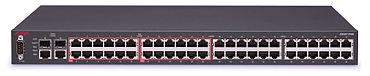

네트워크 스위치(Network Switch)는 네트워크 단위들을 연결하는 통신 장비로 허브보다 전송 속도가 개선된 장비입니다.



네트워크 스위치는 패킷을 어느 쪽으로 보내는지 정하는 역할을 합니다. 따라서 패킷을 전송할 때 어떠한 정보를 보고 판단을 하는 것인지에 따라 Layer가 구분됩니다.

OSI 7계층에 따라 L2, L3, L4, L7 스위치로 나뉘게 되며 아래와 같습니다.

- L2 스위치 MAC(MAC Table)를 보고 스위칭을 하는 것
- L3 스위치 IP 정보(Rounting Table)를 보고 스위칭을 하는 것
- L4 스위치 IP+Port(Session or Connection)를 보고 스위칭을 하는 것
  - L4 스위치에는 로드밸런싱(Load Balancing) 기능이 있습니다.

> 로드밸런싱이란 접속량이 증가하여 트래픽을 감당할 수 없을 때, 트래픽을 분산 시키는 기능입니다.


- L7 스위치 실제 App 데이터(Content)를 보고 스위칭을 하는 것
  - 예를 들어 HTTP 프로토콜을 파싱해서 어떤 URL에 접속하는지 확인이 가능합니다. 따라서 웹 방화벽, 보안 스위치 기능을 가지고 있습니다.

상위 레이어 스위치는 하위 레이어 스위치의 기능을 기본적으로 할 수 있습니다. (예시로 L4 스위치가 L3의 스위치 기능을 할 수 있습니다.)


아래의 예시는 L1 ~ L7 스위치까지 편하게 이해할 수 있는 예시입니다.

```
반장 = 스위치
반 친구들 = 디바이스(사용자)
```

**L1 스위치 / 더미 허브** 
브로드캐스트를 통하여 패킷 전달 → 반장이 맨 앞에서 큰소리로 정보를 전달하는 형태입니다.

**L2 스위치** 
MAC Table을 참조해서 개인적인 패킷 전달 → 반장이 한 명씩 귓속말로 정보를 전달하는 형태입니다.

**L3 스위치**  
Routing Table을 참조해서 패킷 전달 → 반장이 옆 반의 반장에게 정보를 전달하는 형태입니다. (옆 반의 반장은 해당하는 친구에게 정보를 전달합니다.)

**L4 스위치** 
로드밸런싱(부하 분산) 기능 → 반장이 A에게 일을 주다가 A가 힘들어 보이면 B에게도 일을 줍니다.

**L7 스위치**  
보안 기능 → A에게 악성코드가 가는 택배가 온다면 반장이 택배 확인 후 버립니다.

