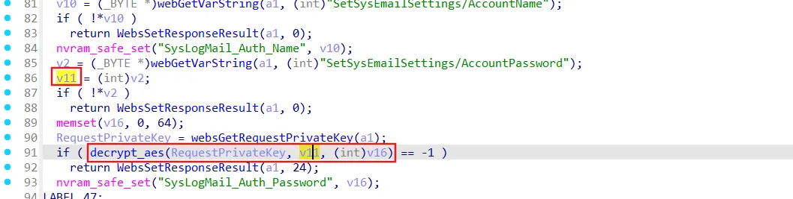
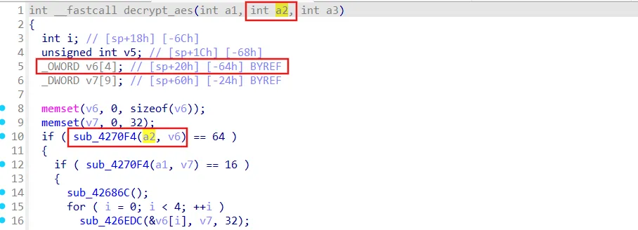
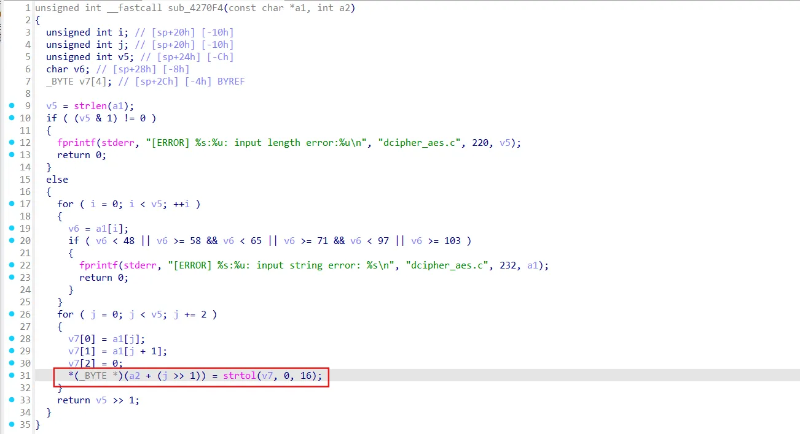
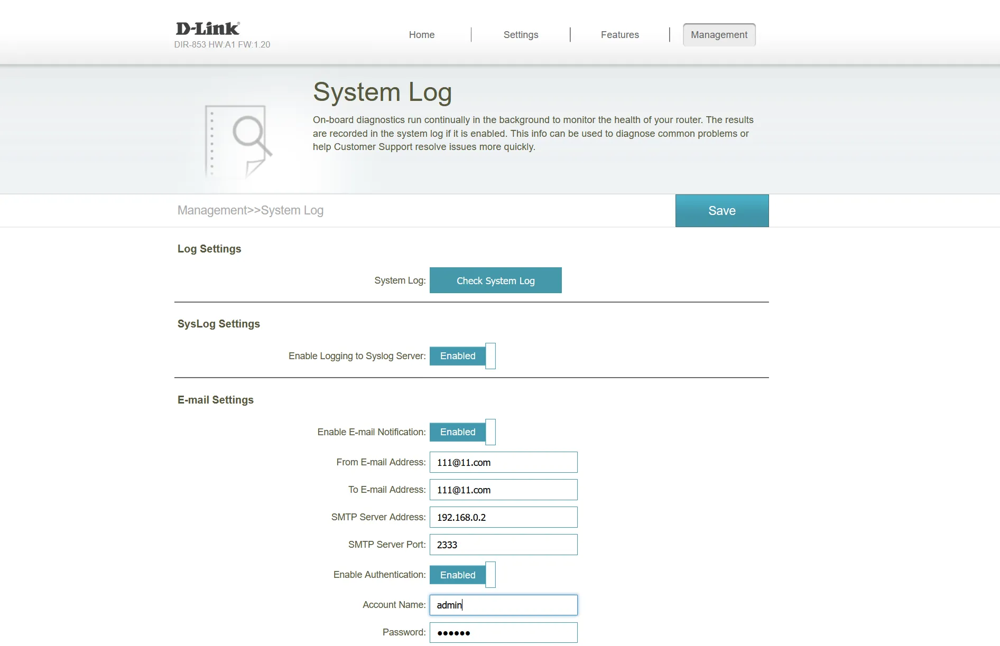
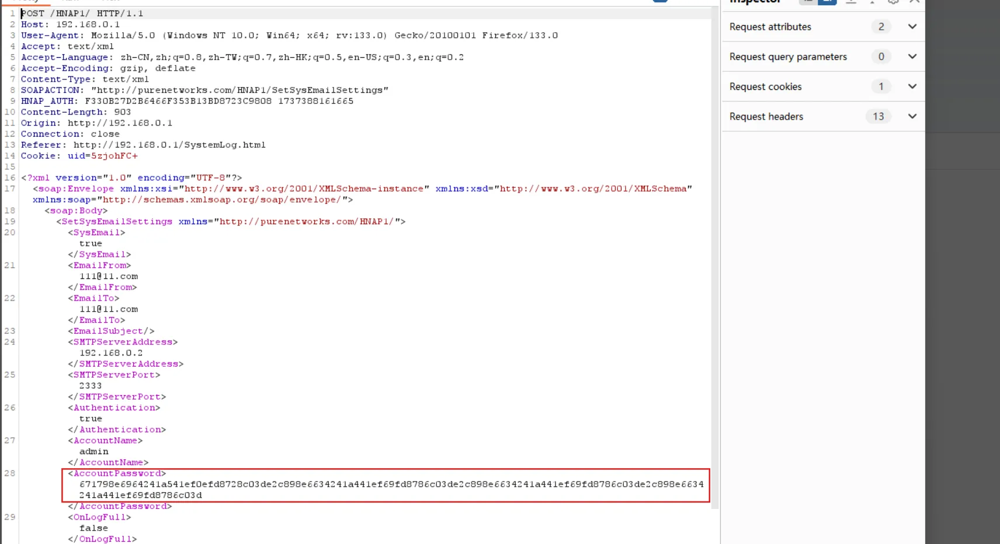
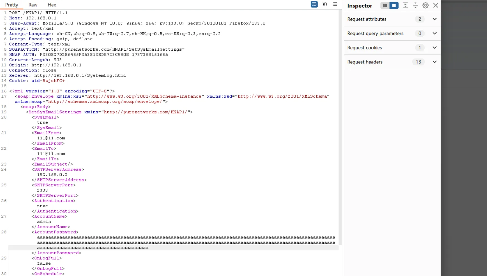
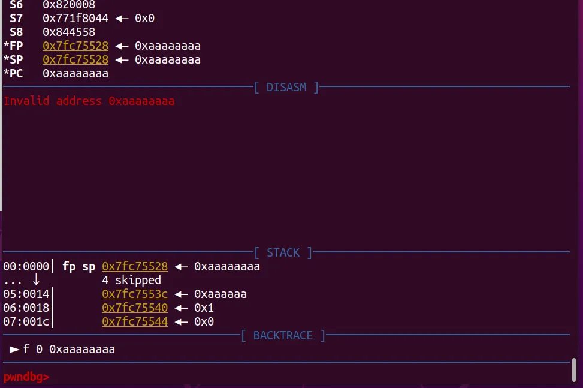

## URL

- https://dear-sunshine-ba5.notion.site/D-Link-DIR-853-4-1812386a664480feaf1ceab444b132b3

## Target

- Rev. A1 1.20b07 이하 버전

## Explain

D-Link DIR-853 A1 FW1.20B07 장비는 방화벽이 내장되어 있는 라우터입니다. 이 장비에서 stack-based buffer overflow로 인한 RCE가 발생하였습니다. 취약점은 `prog.cgi` 내부 `SetSysEmailSettings` 모듈 내 `AccountPassword` 파라미터에서 발생하였습니다.

HTTP 요청 필드 `AccountPassword`는 `decrypt_aes()`에 인자로 전달이 되고, `sub_4270F4()`의 인자로 전달 됩니다.

해당 인자 `a2`를 `v6`로 복사하는 루프가 존재하는데, 여기에 길이 제한 및 검증이 존재하지 않아 Buffer Overflow 취약점이 발생합니다.

PoC는 아래와 같습니다.

System Log 페이지에서 Password 값을 입력합니다.

해당 값을 확인해보면 `decrypt_aes()` 구문을 통해 `AccountPassword` 파라미터 값이 인코딩 되어 전달되는 것을 확인할 수 있습니다.

`AccountPassword` 파라미터 값을 변조하여 전송하면, `PC` 레지스터 값이 변조 되는 것을 확인 할 수 있습니다.

현재 해당 제품은 EOL/EOS 되었기 때문에 장비를 교체하는 것을 권장 드립니다.

## Reference

- https://nvd.nist.gov/vuln/detail/CVE-2024-57959
