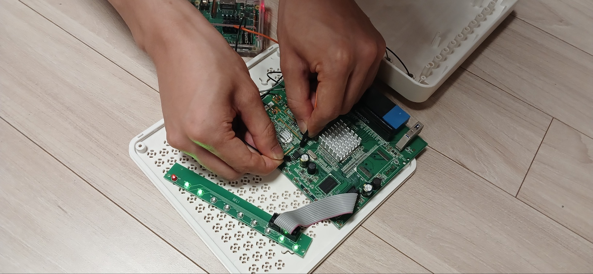
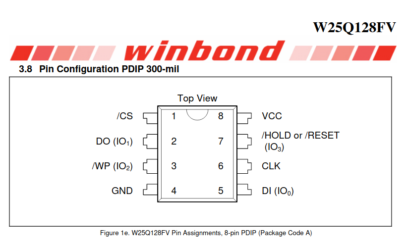
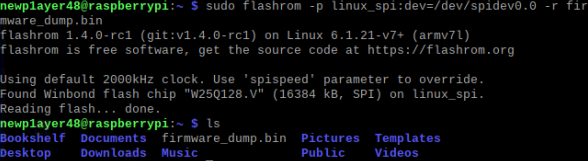

Hello! I'm `newp1ayer48`, and it's a pleasure to introduce myself! 🙇🏻


The start of IoT / Embedded hacking and its most crucial part is obtaining the firmware.

Firmware is essential because, with it, you can understand how the device operates, analyze the vectors where vulnerabilities may arise, and analyze the code.

There are several ways to obtain firmware, but here are some representative methods:

- Downloading firmware from official websites
- Sniffing firmware update packets
- Dumping firmware through debugging ports (UART, JTAG, etc.)
- Directly connecting to Flash Memory dumping the firmware

Flash memory is a chip typically used for storage purposes and is commonly found in IoT devices in an 8-pin form.

Since the firmware is ultimately stored in this Flash Memory chip, directly extracting the firmware from Flash Memory has the advantage of being a more reliable method.

Using the flashrom program, you can easily extract the firmware from Flash Memory.

However, this method can potentially damage the equipment and board, so you should proceed with caution. ⚠️

Because heat is applied directly to the board using tools like soldering irons or heat guns, there is a risk of damaging the chip or the board, and improper connections may lead to short circuits.

Due to these risks, you may end up damaging IoT/embedded equipment that was purchased for bug bounty purposes.

It’s somewhat like trying to extract a golden egg by cutting open a goose’s belly, only to kill the goose in the process… 🪦


If you need to extract firmware, it's best to try the other methods mentioned above before opting for a Flash memory dump.

The flow for performing a Flash memory dump using flashrom is as follows: 📝

1. Install flashrom on Raspberry Pi
2. Flash Memory Chip Off
3. Connect Flash Memory chip to Raspberry Pi
4. Flash memory dump

Here’s a list of the required equipment and tools: 💸

- Raspberry Pi (64 Bit)
- IC Test Hook Clip (SDK08)
- Heat Gun
- Jumper cables and breadboard

## 1. Installing flashrom

> [https://www.flashrom.org/](https://www.flashrom.org/)
> 

Flashrom is a development tool that allows you to flash data and images to flash chips.

It offers functions like detecting, reading, writing, verifying, and erasing, which makes it useful for embedded hacking to extract firmware from flash memory.

You need to install the necessary dependencies and use meson to install it on Raspberry Pi. 🍒

Prepare your Raspberry Pi in 64-bit mode for installation.

```bash
sudo apt-get install -y gcc meson ninja-build pkg-config python3-sphinx libcmocka-dev libpci-dev libusb-1.0-0-dev libftdi1-dev libjaylink-dev libssl-dev
git clone https://github.com/flashrom/flashrom
meson setup builddir
meson compile -C builddir
meson test -C builddir
meson install -C builddir
```

## 2. Flash Memory Chip Off

When extracting the chip with flashrom, performing the dump while the chip is still attached to the board may result in unsuccessful extraction. 👻

The reason varies depending on the equipment and board, but usually, the Raspberry Pi provides power to the entire board, which may introduce noise signals that could interfere with the extraction process.

The following image shows the Raspberry Pi's VCC and GND pins touching the corresponding pins on the Flash Memory chip, confirming that power is supplied to the board.



For this reason, it’s better to remove the chip from the board and connect only the chip.

Use a heat gun to melt the solder and remove the chip from the board.

Be cautious during this process as the risk of damaging the board is quite high.


## 3. Connecting the Flash Memory Chip to the Raspberry Pi

Typically, Flash memory used in low-power IoT and embedded devices is an 8-pin chip that uses SPI communication.

While the pin assignments may vary depending on the chip model and vendor, the function of the 8 pins is usually the same, so refer to the datasheet for the pinout.

The datasheet provides all the information for using and describing the chip, so make sure to consult it!



The roles of each of the 8 pins of Flash Memory are as follows: 📌

- **VCC**: Supplies power
- **GND**: Ground, provides reference voltage
- **SCLK (SCK, CLK)**: Serial Clock, synchronization signal
- **CS (SS)**: Chip Select, selects the device and chip
    - This pin is used to select a specific chip from multiple chips on the main MCU.
- **DI (SI)**: Data Input
    - Used to input data to Flash Memory.
- **DO (SO)**: Data Output
    - Used to output data from Flash Memory.
- **WP**: Write Protect
    - When this pin signal is activated, writing to the Flash Memory is disabled.
- **Hold**: Chip Pause
    - When this pin signal is activated, it pauses the operation of the Flash Memory.

Connect the Raspberry Pi's GPIO pins to the Flash Memory’s pins.

The VCC, Hold, and WP pins on the Flash Memory use the VCC power signal. Since Raspberry Pi’s GPIO pins lack enough VCC pins, it's more convenient to supply the VCC signal using a breadboard or similar method.


Use the IC Test Hook Clip to connect the pins and begin the extraction process.

The thinner the clip, the easier the connection, so it’s recommended to use a thin test clip.


## 4. Flash Memory Dump

Once everything is connected, execute the following command in the Raspberry Pi terminal to start the extraction process. 💉

```bash
# Check connection and check chip name
sudo flashrom -p linux_spi:dev=/dev/spidev0.0,spispeed=2000 -V

# extraction
sudo flashrom -p linux_spi:dev=/dev/spidev0.0 -r [filename]
sudo flashrom -p linux_spi:dev=/dev/spidev0.0 -c [Chipname] -r [filename]
```



If the chip is supported, flashrom will begin the extraction process immediately.

However, if the chip is not supported, you can check `flashchips.h` and `flashchips.c`. If the chip is not listed, you can add the chip manually and then build it for extraction.

Refer to the datasheet to add the chip information to the flashchips.c file.

```c
const struct flashchip flashchips[] = {

	/*
	 * .vendor		= Vendor name
	 * .name		= Chip name
	 * .bustype		= Supported flash bus types (Parallel, LPC...)
	 * .manufacture_id	= Manufacturer chip ID
	 * .model_id		= Model chip ID
	 * .total_size		= Total size in (binary) kbytes
	 * .page_size		= Page or eraseblock(?) size in bytes
	 * .tested		= Test status
	 * .probe		= Probe function
	 * .probe_timing	= Probe function delay
	 * .block_erasers[]	= Array of erase layouts and erase functions
	 * {
	 *	.eraseblocks[]	= Array of { blocksize, blockcount }
	 *	.block_erase	= Block erase function
	 * }
	 * .printlock		= Chip lock status function
	 * .unlock		= Chip unlock function
	 * .write		= Chip write function
	 * .read		= Chip read function
	 * .voltage		= Voltage range in millivolt
	 */

```

With this process, you can successfully dump the firmware stored in the chip!

After removing the Flash Memory chip, the device won't work until it’s reassembled…

But! Reassembly is simply the reverse of disassembly!

Once the Flash Memory chip is properly (!) re-soldered, the device will be usable again!

By extracting the firmware and restoring the device, you can have the best of both worlds! 🤥


Next, we will cover the commonly attempted UART/JTAG debugging port connections in embedded hacking!Thank you! 🙏🏻