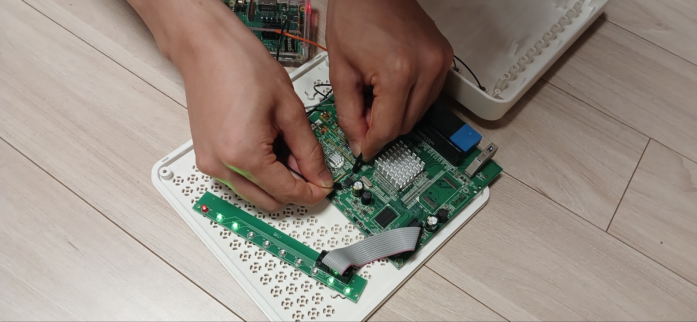
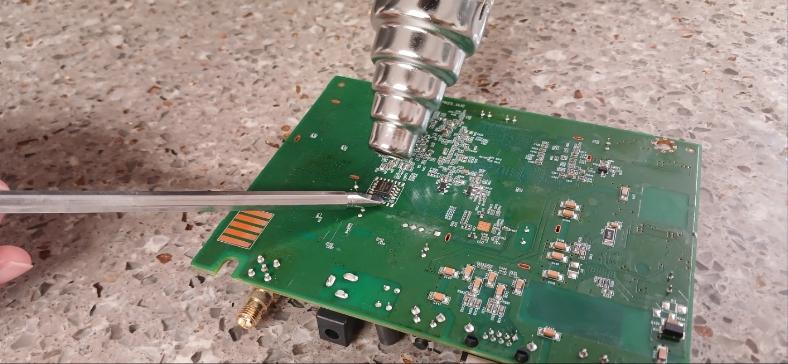
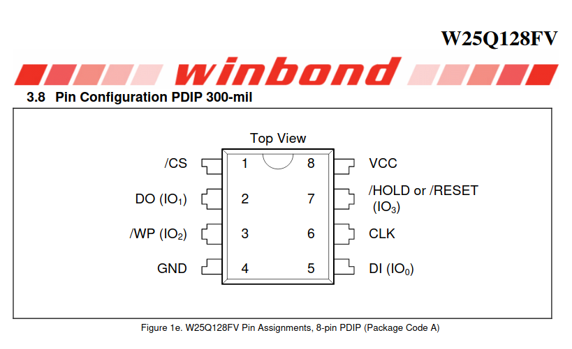
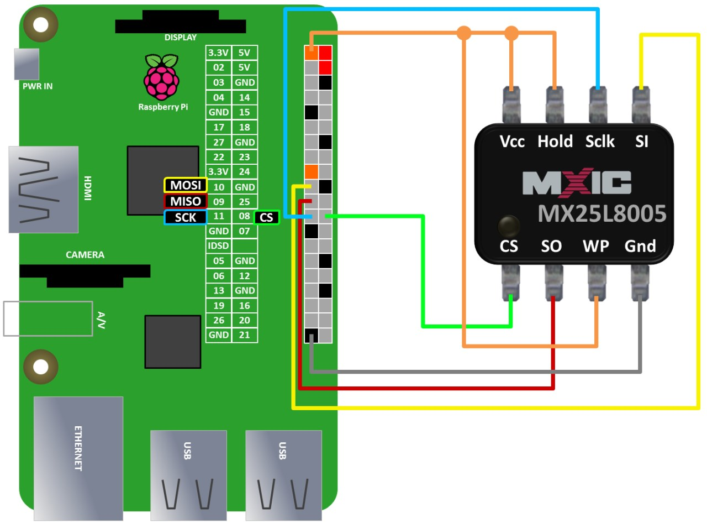
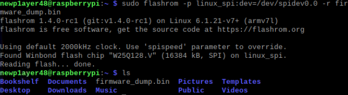
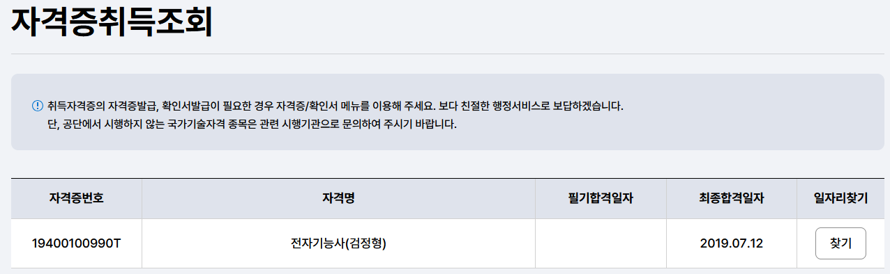

안녕하세요! 이번에 새로 인사 드리게 된 `newp1ayer48` 입니다! 🙇🏻


IoT / 임베디드 해킹의 시작이자, 가장 중요한 부분은 펌웨어를 획득하는 것입니다.

펌웨어가 있어야 장비의 동작을 이해하고 취약점이 발생하는 벡터와 코드를 분석할 수 있기 때문에 중요합니다.

펌웨어를 획득하는 방법은 여러가지가 존재하지만 대표적인 방법들을 아래처럼 정리할 수 있습니다.

- 공식 홈페이지 등에서 제공되는 펌웨어 다운로드
- 펌웨어 업데이트 패킷 스니핑
- 디버깅 포트(UART, JTAG 등) 연결을 통한 펌웨어 덤프
- Flash Memory에 직접 연결하여 펌웨어 덤프

Flash memory는 저장 목적으로 주로 사용되는 Chip으로 IoT 기기에서는 보통 8 pin 형태로 존재합니다.

펌웨어는 결국 이 Flash Memory라는 Chip에 들어 있기 때문에, Flash Memory에서 직접 펌웨어를 추출하는 것이 확실하다는 장점이 있습니다.

여기서 flashrom 프로그램을 이용하면 손쉽게 Flash Memory 내부의 펌웨어를 추출할 수 있습니다.

그러나 이 방법은 장비와 보드에 손상을 유발할 수 있는 방법이기에 주의하여 시도해야 합니다. ⚠️

인두기나 열풍기 등으로 보드에 직접 열을 가하기 때문에 칩이나 보드가 탈 수도 있고, 잘못된 연결이 이루어지면 합선의 위험도 있습니다.

이런 문제로 버그바운티를 위해 구입한 IoT/ 임베디드 장비를 망가뜨릴 수 있습니다.

마치 황금알을 꺼내기 위해 거위 배를 갈랐다가, 도리어 거위만 죽게 되어버리는 일과 비슷합니다… 🪦


펌웨어를 추출해야 한다면, 위에서 소개해드린 다른 방법들은 먼저 시도해보고 Flash memory dump를 하는 것이 바람직합니다.

flashrom을 이용한 Flash memory dump의 흐름은 아래와 같습니다. 📝

1. Raspberry Pi에 flashrom 설치
2. Flash Memory Chip Off
3. Flash memory chip과 Raspberry Pi 연결
4. Flash memory dump

필요한 장비와 도구의 목록은 다음과 같습니다. 💸

- Raspberry Pi (64 Bit)
- IC Test Hook Clip (SDK08)
- Heat Gun (열풍기)
- 점퍼 케이블 및 브레드보드

## 1. flashrom 설치

> [https://www.flashrom.org/](https://www.flashrom.org/)
> 

Flashrom은 flash chip에 데이터와 이미지를 플래시할 수 있는 개발 도구입니다.

detecting, reading, writing, verifying, erasing의 기능을 제공하기 때문에,

임베디드 해킹에서는 이 도구를 통해 flash memory 안에 있는 펌웨어를 역으로 추출할 수 있습니다.

관련 Dependency를 설치하고, meson으로 Raspberry Pi에서 설치를 진행합니다. 🍒

Raspberry Pi는 64 Bit로 설치하여 준비합니다.

```bash
sudo apt-get install -y gcc meson ninja-build pkg-config python3-sphinx libcmocka-dev libpci-dev libusb-1.0-0-dev libftdi1-dev libjaylink-dev libssl-dev
git clone https://github.com/flashrom/flashrom
meson setup builddir
meson compile -C builddir
meson test -C builddir
meson install -C builddir
```

## 2. Flash Memory Chip Off

flashrom으로 Chip을 추출할 때, Chip이 보드에 연결된 상태로 Dump를 진행하면, 추출이 원활하게 되지 않을 가능성이 높습니다. 👻

이유는 장비와 보드에 따라 다르겠지만, Raspberry Pi가 Chip으로 공급 되어야 할 전원이 보드 전체로 공급되어 보드에 노이즈 신호가 추출을 방해하거나 문제가 될 가능성이 높습니다.

아래는 Raspberry Pi의 VCC, GND 핀을 Flash Memory Chip에 해당 핀을 접촉하는 것 만으로 보드에 전원이 들어오는 것을 확인할 수 있는 사진입니다.



그렇기 때문에 보드에서 Chip Off를 하여 Chip만을 연결하는 것이 좋습니다.

열풍기를 이용하여 땜납을 녹이고 Chip Off를 실시합니다.

이 과정에서 보드가 망가질 위험이 매우 높기에, 주의해서 Chip Off를 합니다.



## 3. Flash memory chip과 Raspberry Pi 연결

보통 저전력 IoT 및 임베디드 장비에 들어가는 Flash memory는 SPI 통신을 사용하는 8 pin chip인 경우가 많습니다.

chip 모델과 vendor마다 각 pin의 세부 역할에 차이가 있을 수는 있지만, 대부분 8 pin의 역할은 같으므로 해당 칩의 Datasheet를 확보하여 Pin out을 확인합니다.

Datasheet에는 제조사가 해당 Chip의 설명과 사용을 위한 모든 정보를 적어 놨으니 꼭 확인합니다!



Flash Memory의 각 8 pin의 역할은 다음과 같습니다. 📌

- VCC: 전원을 공급
- GND: 접지, 기준 전압을 공급
- Sclk(SCK, CLK): 직렬 클럭, 동기화 신호
- CS(SS): Chip Select, 장치 및 Chip 선택
    - 메인 MCU에서 여러 Chip 중 특정 Chip을 선택할 때 사용되는 pin
- DI(SI): Data Input
    - Flash Memory로 데이터 입력
- DO(SO): Data Output
    - Flash Memory에서 데이터 출력
- WP: Write Protect, 쓰기 보호
    - 이 핀 신호가 활성화 된 경우 Flash memory로 쓰기 불가
- Hold: Chip 일시 정지
    - 이 핀 신호가 활성화 된 경우 Flash memory 동작이 멈춤

Raspberry Pi에 존재하는 GPIO 핀과 Flash Memory의 Pin을 연결합니다.

Flash Memory에서 사용하는 VCC, Hold, WP 핀은 VCC 전원을 사용하는 핀입니다.

Raspberry Pi GPIO 핀에는 VCC 핀이 부족하므로 브레드 보드 등으로 VCC 신호를 공급하는 것이 편합니다.



IC Test Hook Chip 장비를 이용해서 각 핀에 연결하고 추출을 진행합니다.

얇은 Clip일수록 연결이 쉽기에 얇은 Test Clip으로 준비하면 좋습니다.


## 4. Flash memory dump

연결이 완료되면 Raspberry Pi 터미널에서 아래 명령어를 통해서 추출을 진행합니다. 💉

```bash
# 연결 확인 및 Chip 명 확인
sudo flashrom -p linux_spi:dev=/dev/spidev0.0,spispeed=2000 -V

# 추출
sudo flashrom -p linux_spi:dev=/dev/spidev0.0 -r [저장파일명]
sudo flashrom -p linux_spi:dev=/dev/spidev0.0 -c [Chip명] -r [저장파일명]
```



flashrom은 지원하는 Chip인 경우 바로 추출이 진행됩니다.

그러나 지원하지 않는 Chip인 경우에는 `flashchips.h`, `flashchips.c`을 확인하고 존재하지 않는 경우, 직접 추가하여 빌드하면 추출이 가능합니다.

Datasheet를 참고하여 아래 flashchips.c 파일에 추가하려는 Chip의 정보를 기입합니다.

```c
const struct flashchip flashchips[] = {

	/*
	 * .vendor		= Vendor name
	 * .name		= Chip name
	 * .bustype		= Supported flash bus types (Parallel, LPC...)
	 * .manufacture_id	= Manufacturer chip ID
	 * .model_id		= Model chip ID
	 * .total_size		= Total size in (binary) kbytes
	 * .page_size		= Page or eraseblock(?) size in bytes
	 * .tested		= Test status
	 * .probe		= Probe function
	 * .probe_timing	= Probe function delay
	 * .block_erasers[]	= Array of erase layouts and erase functions
	 * {
	 *	.eraseblocks[]	= Array of { blocksize, blockcount }
	 *	.block_erase	= Block erase function
	 * }
	 * .printlock		= Chip lock status function
	 * .unlock		= Chip unlock function
	 * .write		= Chip write function
	 * .read		= Chip read function
	 * .voltage		= Voltage range in millivolt
	 */

```

위 과정으로 Flash memory dump를 실시하여 Chip 내에 존재하는 Firmware를 추출할 수 있습니다!

Flash Memory Chip off 이후에는 Chip이 떨어져 있기에 장비를 쓰지 못합니다…

하지만! 조립은 분해의 역순입니다!

Flash Memory Chip을 다시 잘(!) Resoldering하면 장비를 다시 사용할 수 있습니다!

펌웨어도 획득하고 장비도 다시 사용할 수 있는 두 마리 토끼를 모두 잡아봅시다! 🤥



다음에는 임베디드 해킹에서 자주 시도되는 UART/JTAG 디버깅 포트 연결에 대해서 다뤄보겠습니다!

감사합니다! 🙏🏻