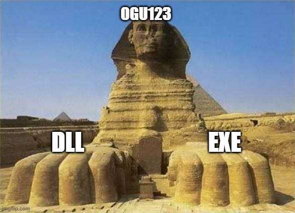

# Introduction

Hello, this is ogu123!

While writing Part1, I felt the wall to COM.. I was about to run away to another field, but then I heard “Why not find vulnerabilities in COM?” and came back to Part2...  LOL

So, Part 2 is about DCOM as it is utilized for Lateral Movement during Red Team or internal penetration testing!

It is said that the erroneous of invalid DCOM objects leads to RCE and LPE vulnerabilities, Have fun studying!

~~(Caution: Part2 is more theory than practice).~~


# DCOM

Like COM, the Distributed Component Object Model (DCOM) is a [Microsoft](https://learn.microsoft.com/en-us/openspecs/windows_protocols/ms-dcom/86b9cf84-df2e-4f0b-ac22-1b957627e1ca) technology that is described below.

> The Distributed Component Object Model (DCOM) Remote Protocol extends the Component Object Model (COM) over a network by providing facilities for creating and activating objects, and for managing object references, object lifetimes, and object interface queries.
> 

Yeah... there's a description, but it's encrypted…

DCOM is an extension of COM, a technology that allows you to use COM objects on a remote computer as if they were local!

For example, when a request for a COM object comes in from a remote client, the COM object is loaded into the server computer's memory, and the remote client can access and use it over the network!

Let's start by pointing out the differences between the invocation and activation types of COM, and then we'll check out DCOM!


# COM object request processing order

The request processing and activation of a COM object on Windows goes in the following order!

~~(Tip: It's easier to understand if you look at it like the picture below)~~


1. **Client Request**
    - A client calls a function, such as `CoCreateInstance` or `CoGetClassObject` with a CLSID or ProgID as an argument to request the interface pointer of a COM object.
    - The request is passed to the COM library (ole32.dll).
2. **Interacting with Service Control Manager (SCM)**
    - The COM library asks SCM to find the COM server (DLL or EXE) that corresponds to the requested CLSID or ProgID.
    - SCM checks the registry (`HKCR\\CLSID` or `HKCR\\ProgID`) to determine the location of the COM server associated with the requested CLSID or ProgID.
3. **Loading the COM Server**
    - SCM loads the identified COM server and creates an instance of Class Factory associated with the requested CLSID or ProgID.
        - The Class Factory is responsible for creating and initializing COM objects.
4. **Creating and Initializing COM Objects**
    - The Class Factory calls the `CreateInstance` method to create a COM object corresponding to the requested CLSID or ProgID.
    - The created COM object is initialized to provide the specific interface requested by the client.
5. **Return an interface pointer**
    - When Class Factory successfully creates a COM object, it returns an interface pointer to the COM library.
    - The COM library passes this pointer to the client.
    - The client uses the passed interface pointer to access the methods and properties of the generated COM object.


Yeah... if you read it slowly, it's not too difficult, but it looks complicated from a distance.

The reason why I mentioned the above process is because I didn't cover the COM calling process in Part 1, and the COM server is composed of DLL or EXE, and it is related to DCOM!

~~(Actually, I was going to say that in part 1, but it's no secret what I did now)~~


# Activation types for COM servers

Each COM server sets an activation method when it is registered in the registry, and that setting determines how the system loads and executes objects.

Take a deep breath and let's take a look at the three activation methods!

1. **In-Process (InprocServer32)**
    - This is the activation method used when the COM server is implemented as a DLL file.
    - It is loaded inside the client process and operates by sharing client memory space.
    - SCM returns the path to the DLL, loads it, and then requests the Class Factory to create objects.
2. **Out-of-Process / Local (LocalServer32)**
    - This is the activation method used when the COM server is implemented as an EXE file.
    - It runs in an independent process and has a different memory space than the client.
    - SCM runs the EXE, and the EXE registers itself with the Class Factory so that clients can access the Class Factory to create objects.
3. **Out-of-Process / Remote (DCOM)**
    - Remote here refers to COM over a network, or Distributed COM (DCOM), a technology for enabling or accessing COM objects on a remote computer.
    - The local SCM gets the Class Factory interface pointer from the SCM on the remote computer to make the object accessible over the network.

Just like the COM object request processing sequence earlier, take your time reading this...!

**Wait, here's the problem!**

Should the COM object that acts as the DCOM server be a DLL or an EXE?




The correct answer is I don't care! 

Typically, when we think of remote, we think of only EXE files because they run in a different address space than the client ~~(that's what I thought, actually)~~

However, DLL Surrogate allows you to implement DCOM objects as DLLs. 
DLLs are passive modules, they can't run on their own, so they need a Surrogate process to run them.

The Surrogate process is, of course, an EXE, right?


If you check the picture above, you can see that dllhost.exe acts as Windows' default DLL Surrogate. Additionally, you can see the COM server running on dllhost.exe.


# Out-of-Process Practice(MMC.exe)

Now, let's leave the theory behind for a moment and do a quick lab to see this in action.

In this lab, we'll determine the type of COM server activation by looking at a specific CLSID, create a real object, and see where it goes through ProcessHacker.


```
Get-ChildItem -Path "Registry::HKEY_LOCAL_MACHINE\SOFTWARE\Classes\CLSID\{49B2791A-B1AE-4C90-9B8E-E860BA07F889}"

```
Use the command above to see what activation type the COM server corresponding to your CLSID is registered with.


As a result of running the command, you can see the `LocalServer32` key, which means it is running as an Out-of-Process (EXE).

```
$comobj = [System.Activator]::CreateInstance([Type]::GetTypeFromCLSID("49B2791A-B1AE-4C90-9B8E-E860BA07F889"))

```

Let's use the above command to create a COM object for that CLSID and verify it with ProcessHacker.


When using Out-of-Process (LocalServer) COM or DCOM, client and server communication is handled by the RPCSS service running inside the svchost.exe process.

So, if you check the MMC.exe process properties, you will see `svchost.exe` as the Parent Process.

Practicing is easy, right? We think it's best to learn by doing, so Let's do the same!


# DCOM Concepts

Now, finally, the DCOM concept! It's not as complicated as the order in which COM requests are processed, or the types of activation, so it's a light read.

The main function of DCOM is a technology that enables COM objects to be activated and used on a remote computer.

The objects themselves run in memory on the remote computer, and the local computer accesses them over the network.

So where and how do you use DCOM?

DCOM is often used for Lateral Movement because of its ability to remotely execute COM objects. In the past, PowerShell Remoting was the primary method used, but more recently, the following DCOM objects have been utilized

- **ShellWindows**
- **ShellBrowserWindows**
- **MMC20.Application**
- **Excel.Application**
    - DDEInitiate
    - RegisterXLL
- **Outlook.Application**
    - CreateObject->Shell.Application
    - CreateObject->ScriptControl (office-32bit only)
- **Visio.InvisibleApp**
    - Addons
    - ExecuteLine
- **Word.Application**
    - RunAutoMacro


# Setting conditions for DCOM objects

In fact, in addition to CLSID and ProgID, COM has a value called AppID.

The [AppID](https://learn.microsoft.com/en-us/windows/win32/com/appid-key) contains various configuration information for instantiating COM objects and managing access rights,
It is used in association with one or more COM objects.

If a particular COM object does not have an AppID set for it, the remote computer will not be able to access it.

Therefore, in order to utilize DCOM, the CLSID must be associated with the appropriate AppID, and the AppID must have the appropriate permissions set!


To access DCOM objects remotely, the following permissions must be defined in the AppID!

- `AccessPermissions`: Permissions to access the object
- `LaunchPermissions`: Permissions to launch the object

The permissions in the figure above are applied to specific DCOM objects, but you can also set permissions for system-wide DCOM objects through Global Permissions.

Additionally, DCOM uses the Distributed Computing Environment Remote Procedure Call (DCE-RPC) protocol, which communicates over port 135 by default.

So, if DCOM isn't working, check your ports, then Global Permissions, then COM AppID... and so on!


# Find vulnerable COMs in a specific program

In the DCOM concept, we identified COM objects that exist in specific programs (Excel, Outlook ...).

So, we're going to cover how to find vulnerable COM objects in a specific program.

To find a vulnerable COM object, we need to satisfy the following three characteristics.
~~(7KCA64qUIE1jQWZlZSBTY2Fu66W8IO2DgOqyn+ycvOuhnCDtlojsirXri4jri6Qu)~~

1. COM objects installed by a specific program
2. Out-of-Process objects running with system privileges
3. interfaces accessible with user privileges

Let's check them out in turn!

```
Set-ComDatabase -Path ComDb_old.db -Database (Get-ComDatabase -PassThru)
```

A simple and clear way to find out which COM objects a particular program has installed is to take a snapshot before and after the installation and compare them!

Use the above command to collect the information of previously registered COM objects, back them up to a `ComDb_old.db` file, and install the target program!

```
$comDiff = Compare-ComDatabase `
    -Left (Get-ComDatabase -Path ComDb_old.db -PassThru) `
    -Right (Get-ComDatabase -PassThru) `
    -DiffMode RightOnly

```
Once the installation is complete, we collect the information of the re-registered COM objects and compare them to the snapshot taken in the previous step to find differences.

As a result, the `$comDiff` variable stores the information of the newly added COM objects!


```
$explorerId = (Get-Process -Name explorer).Id

$comsAsSystem = $comDiff.AppIDs.Values |
    Where-Object {
        $_.IsService -eq $true -or
        $_.RunAs -ieq "nt authority\system"
    }

```

Gets the ID of the Explorer process and filters only the newly added COM objects in `$comDiff` that are running with NT Authority\SYSTEM permissions or registered as a service.


```
$comsAsSystem |
Select-ComAccess -ProcessId $explorerId -Principal S-1-5-18

Name                           AppID                                IsService  HasPermission
----                           -----                                ---------  -------------
PerceptionSimulation           1b162a5b-b67a-4468-9613-c3f9765b353b True       True
42CBFAA7-A4A7-47BB-B422-BD1... 42cbfaa7-a4a7-47bb-b422-bd10e9d02700 True       True
Trusted Installer Service      752073a2-23f2-4396-85f0-8fdb879ed0ed True       True
Spectrum                       c0e1ce99-c981-44a2-ac4c-41036fac6593 True       True

```
Verify that the Explorer process (`$explorerId`) has access to COM objects running with SYSTEM privileges (`S-1-5-18`).

The command results show that it is running with System privileges and is accessible, but it cannot see the COM objects of the target program...

This means that the COM objects created by the target program are not registered as accessible (Launch and Access) under the `$explorerId` privilege.

But! Access here means both Launch and Access permissions, so if you check only Launch permissions (for example, if Access=0), you might see the target program's COM objects!


```
$comsAsSystem |
Select-ComAccess `
         -ProcessId $explorerId `
         -Principal S-1-5-18 `
         -LaunchAccess ActivateLocal, ExecuteLocal `
         -Access 0

Name                           AppID                                IsService  HasPermission
----                           -----                                ---------  -------------
000C101C-0000-0000-C000-000... 000c101c-0000-0000-c000-000000000046 True       False
PerceptionSimulation           1b162a5b-b67a-4468-9613-c3f9765b353b True       True
1FCBE96C-1697-43AF-9140-289... 1fcbe96c-1697-43af-9140-2897c7c69767 True       False
2781761E-28E2-4109-99FE-B9D... 2781761e-28e2-4109-99fe-b9d127c57afe True       False
Windows Security Health Ser... 2eb6d15c-5239-41cf-82fb-353d20b816cf True       True
42CBFAA7-A4A7-47BB-B422-BD1... 42cbfaa7-a4a7-47bb-b422-bd10e9d02700 True       True
4A0F9AA8-A71E-4CC3-891B-76C... 4a0f9aa8-a71e-4cc3-891b-76cac67e67c0 True       False
521FDB42-7130-4806-822A-FC5... 521fdb42-7130-4806-822a-fc5163fad983 True       False
534F5323-3569-4F42-919D-1E1... 534f5323-3569-4f42-919d-1e1cf93e5bf6 True       False
53A53FE9-0D1A-5CE1-A982-92E... 53a53fe9-0d1a-5ce1-a982-92eca1cb48bc True       False
63A53A38-004F-489B-BD61-96B... 63a53a38-004f-489b-bd61-96b5eefadc04 True       False
TieringEngineService           6df5bcf4-22e9-446d-8763-a2c7677ecf7d True       True
708860E0-F641-4611-8895-7D8... 708860e0-f641-4611-8895-7d867dd3675b True       False
McComponentHostService         727b5bd4-fae7-4ea7-98bd-20ac6bc25d89 True       False
Trusted Installer Service      752073a2-23f2-4396-85f0-8fdb879ed0ed True       True
8018F647-BF07-55BB-82BE-A2D... 8018f647-bf07-55bb-82be-a2d7049f7ce4 True       False
8A1D4361-2C08-4700-A351-3EA... 8a1d4361-2c08-4700-a351-3eaa9cbff5e4 True       False
8A2F4279-5AFC-549D-B352-F32... 8a2f4279-5afc-549d-b352-f32e6dbac9df True       False
WSearch                        9e175b9c-f52a-11d8-b9a5-505054503030 True       True
ServiceModule                  a6b716cb-028b-404d-b72c-50e153dd68da True       False
ABC01078-F197-4B0B-ADBC-CFE... abc01078-f197-4b0b-adbc-cfe684b39c82 True       False
Spectrum                       c0e1ce99-c981-44a2-ac4c-41036fac6593 True       True
ServiceModule                  cecddd22-2e72-4832-9606-a9b0e5e344b2 True       False

```

After checking only the Launch permission, I see a list of COM objects that is longer than before, including COM objects that seem to be related to the target program...!

From now on, we need to dynamically analyze why the target program COM object can be created but not used!

Because sometimes HasPermission becomes true when the object is created.

Since we know from Part 1 that COM objects have hidden methods, we can use recursive traversal to find the hidden methods in the object and dynamically analyze them!


# Conclusion

In this article, we've covered COM processing order, activation types, what qualifies as a DCOM object, and how to find vulnerable COM objects in a given program.

There's more COM than DCOM, but that's what you need to know to understand DCOM, and DCOM itself is relatively straightforward aside from the communication process (marshaling, proxy, stub).

Finally, we even saw how to find vulnerable COM objects in other programs that we didn't cover in Part 1, so in Part 3, we'll bring you tools and vulnerabilities related to COM objects!

Thank you for reading this long post


# Reference

- https://klezvirus.github.io/RedTeaming/LateralMovement/LateralMovementDCOM/

- https://www.221bluestreet.com/offensive-security/windows-components-object-model/demystifying-windows-component-object-model-com

- https://the-deniss.github.io/posts/2021/05/17/discovering-and-exploiting-mcafee-com-objects.html

- https://posts.specterops.io/lateral-movement-abuse-the-power-of-dcom-excel-application-3c016d0d9922