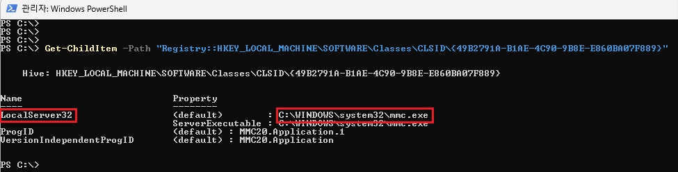
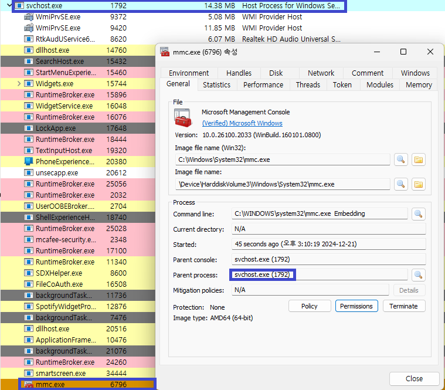

# Introduction

안녕하세요! ogu123입니다!!

Part1을 작성하면서 COM에 대한 벽을 느껴..? 다른 분야로 도망가려다 COM에서 취약점 찾아야지?라는 말에 솔깃해 Part2로 돌아왔습니다.. 하하

그래서! Part2는 Red Team이나 내부 침투 테스트 중 Lateral Movement에 활용하는 DCOM에 대해 알아보겠습니다!

잘못된 DCOM 객체가 존재할 경우 RCE, LPE 취약점으로 이어진다고 하니 신나게 공부하러 가보죠!

~~(주의 : Part2는 실습보다 이론이 많습니다.)~~


# DCOM

COM과 마찬가지로 DCOM(Distributed Component Object Model) 또한 [Microsoft 기술](https://learn.microsoft.com/ko-kr/openspecs/windows_protocols/ms-dcom/86b9cf84-df2e-4f0b-ac22-1b957627e1ca)로 아래와 같이 설명하고 있습니다.

> DCOM(분산 컴포넌트 객체 모델) 원격 프로토콜은 객체를 생성 및 활성화하고 객체 참조, 객체 수명 및 객체 인터페이스 쿼리를 관리하기 위한 기능을 제공함으로써 네트워크를 통해 COM(컴포넌트 객체 모델)을 확장합니다.
>


네… 역시 암호화가 되어 있네요…

쉽게! DCOM은 COM의 확장으로, 원격 컴퓨터에 있는 COM 객체를 마치 로컬에서 사용하는 것처럼 해주는 기술입니다!

예를 들어, 원격에 있는 클라이언트로부터 COM 객체 요청이 들어오면 서버 컴퓨터 메모리에 COM 객체를 로드하고, 원격 클라이언트가 네트워크를 통해 접근하여 사용하는 것입니다!

우선 COM의 호출과 활성화 유형에 따른 차이점을 짚고 DCOM을 확인해 보겠습니다!


# COM 객체 요청 처리 순서

Windows에서 COM 객체의 요청 처리 및 활성화 과정은 아래와 같은 순서로 진행됩니다!

~~(tip : 아래 그림과 같이 보면 이해가 쏙쏙 됩니다.)~~


1. **클라이언트 요청**
    - 클라이언트가 COM 객체의 인터페이스 포인터를 요청하기 위해 `CoCreateInstance`, `CoGetClassObject` 등의 함수를 CLSID 또는 ProgID를 인자로 호출합니다.
    - 해당 요청은 COM 라이브러리(ole32.dll)로 전달됩니다.
2. **SCM(Service Control Manager)와 상호작용**
    - COM 라이브러리는 SCM에게 요청된 CLSID 또는 ProgID에 해당하는 COM 서버(DLL 또는 EXE)를 찾아달라고 요청합니다.
    - SCM은 레지스트리(`HKCR\CLSID` 또는 `HKCR\ProgID`)를 확인하여, 요청된 CLSID 또는 ProgID와 연결된 COM 서버의 위치를 확인합니다.
3. **COM 서버 로드**
    - SCM은 확인된 COM 서버를 로드하고, 요청된 CLSID 또는 ProgID와 연결된 Class Factory의 인스턴스를 생성합니다.
        - Class Factory는 COM 객체를 생성하고 초기화하는 역할을 수행합니다.
4. **COM 객체 생성 및 초기화**
    - Class Factory는 `CreateInstance` 메서드를 호출하여 요청된 CLSID 또는 ProgID에 해당하는 COM 객체를 생성합니다.
    - 생성된 COM 객체는 클라이언트가 요청한 특정 인터페이스를 제공하기 위해 초기화됩니다.
5. **인터페이스 포인터 반환**
    - Class Factory가 COM 객체를 성공적으로 생성하면, 인터페이스 포인터를 COM 라이브러리에 반환합니다.
    - COM 라이브러리는 이 포인터를 클라이언트에게 전달합니다.
    - 클라이언트는 전달받은 인터페이스 포인터를 사용하여 생성된 COM 객체의 메서드와 속성에 접근할 수 있게 됩니다.


네… 천천히 읽다 보면 크게 어려운 부분이 없지만 멀리서 보면 복잡해 보이네요

위 과정을 말씀드린 이유는 Part1에서 COM 호출 과정을 안 다뤘기도 하고, COM 서버가 DLL 또는 EXE로 이루어져 있는데, 더 나아가면 DCOM과 연관이 되어있기 때문입니다!

~~(사실 part1에서 해당 내용을 말씀 드리려 했는데 지금 한 건 안 비밀입니다)~~


# COM 서버의 활성화 유형

각 COM 서버는 레지스트리에 등록될 때 활성화 방식을 설정하며, 해당 설정으로 시스템이 객체를 로드하고 실행하는 방식을 결정합니다. 

심호흡 한 번 하고 다음 세 가지 활성화 방식을 살펴보겠습니다!

1. **In-Process (InprocServer32)**
    - COM 서버가 DLL 파일로 구현된 경우 사용되는 활성화 방식입니다.
    - 클라이언트 프로세스 내부에 로드되어 클라이언트 메모리 공간을 공유하며 동작합니다.
    - SCM은 DLL의 경로를 반환하고, 해당 DLL을 로드한 후 Class Factory를 요청해 객체를 생성합니다.
2. **Out-of-Process / Local (LocalServer32)**
    - COM 서버가 EXE 파일로 구현된 경우 사용되는 활성화 방식입니다.
    - 독립적인 프로세스에서 실행되며, 클라이언트와 서로 다른 메모리 공간을 가집니다.
    - SCM은 EXE을 실행하고, EXE가 자체적으로 Class Factory를 등록해 클라이언트가 Class Factory에 접근하여 객체를 생성할 수 있게 됩니다.
3. **Out-of-Process / Remote (원격 COM, DCOM)**
    - 여기서 원격은 네트워크를 통한 COM, DCOM(Distributed COM)을 의미로, 원격 컴퓨터에 있는 COM 객체를 활성화하거나 접근하는 기술입니다.
    - 로컬 SCM은 원격 컴퓨터의 SCM에서 Class Factory 인터페이스 포인터를 가져와 네트워크를 통해 객체에 접근할 수 있도록 합니다.

앞서 COM 객체 요청 처리 순서와 마찬가지로 천천히 보시면 될 거 같습니다..!

**잠깐! 여기서 문제!**

DCOM 서버 역할을 하는 COM 객체는 DLL와 EXE 중 어떤 파일로 해야 할까요?


정답은 상관없다! 입니다. 

일반적으로 원격이라고 하면 클라이언트와 다른 주소 공간에서 실행되기 때문에 EXE 파일만 가능하다고 생각됩니다. ~~(사실 제가 그렇게 생각했습니다)~~

하지만, DLL Surrogate를 사용하면 DLL로 DCOM 객체를 구현할 수 있습니다. 
DLL은 수동적인 모듈로, 자체적으로 실행할 수 없기 때문에 이를 실행할 Surrogate 프로세스가 필요합니다.

Surrogate 프로세스는 당연히 EXE겠죠?


위 그림을 확인하면, dllhost.exe가 Windows의 기본 DLL Surrogate 역할을 수행한다는 것을 알 수 있습니다. 추가로 dllhost.exe에서 실행되는 COM 서버 또한 확인할 수 있네요.


# Out-of-Process 실습(MMC.exe)

이제 이론은 잠시 뒤로하고, 간단한 실습을 통해 실제 동작 과정을 확인해 보겠습니다.

이번 실습에서는 특정 CLSID를 확인하여 COM 서버 활성화 유형을 파악하고, 실제 객체를 생성한 뒤 ProcessHacker를 통해 어디서 동작하는지 살펴보겠습니다.


```
Get-ChildItem -Path "Registry::HKEY_LOCAL_MACHINE\SOFTWARE\Classes\CLSID\{49B2791A-B1AE-4C90-9B8E-E860BA07F889}"

```
위 명령어를 통해 CLSID에 해당하는 COM 서버가 어떤 활성화 유형으로 등록되어 있는지 확인합니다.



명령 실행 결과 `LocalServer32` 키를 확인할 수 있는데, 이는 Out-of-Process(EXE)로 동작함을 뜻합니다.

```
$comobj = [System.Activator]::CreateInstance([Type]::GetTypeFromCLSID("49B2791A-B1AE-4C90-9B8E-E860BA07F889"))

```

위 명령어를 통해 해당 CLSID의 COM 객체를 생성 후 ProcessHacker를 통해 확인해 보겠습니다.



Out-of-Process(LocalServer) COM 또는 DCOM을 사용하는 경우 클라이언트와 서버 통신은 svchost.exe 프로세스 내부에서 실행되는 RPCSS 서비스를 통해 통신을 처리합니다.

따라서, MMC.exe 프로세스 속성을 확인하면, Parent Process로 `svchost.exe`를 확인할 수 있습니다.

실습은 간단하죠..? 사실 눈으로 확인하면서 공부하는 게 가장 좋다고 생각해 여러분들도 따라 해보세용!


# DCOM 개념

이제 드디어 DCOM 개념입니다! COM 요청 처리 순서, 활성화 유형처럼 복잡하지 않으니 가볍게 읽으시면 됩니다.

DCOM의 주요 기능은 원격 컴퓨터에서 COM 객체를 활성화하고 사용할 수 있도록 지원하는 기술입니다.

객체 자체는 원격 컴퓨터의 메모리에서 실행되며, 로컬 컴퓨터는 네트워크를 통해 객체에 접근합니다.

그럼 DCOM은 어디에서 어떻게 활용할까요?

DCOM은 원격으로 COM 객체를 실행할 수 있는 특성을 통해 Lateral Movement에 자주 사용된다고 합니다. 과거에는 PowerShell Remoting을 주로 사용했지만, 최근에는 아래와 같은 DCOM 객체들이 활용됩니다.

- **ShellWindows**
- **ShellBrowserWindows**
- **MMC20.Application**
- **Excel.Application**
    - DDEInitiate
    - RegisterXLL
- **Outlook.Application**
    - CreateObject->Shell.Application
    - CreateObject->ScriptControl (office-32bit only)
- **Visio.InvisibleApp**
    - Addons
    - ExecuteLine
- **Word.Application**
    - RunAutoMacro


# DCOM 객체의 설정 조건

사실 COM에는 CLSID와 ProgID 외에도 AppID라는 값이 존재합니다.

[AppID](https://learn.microsoft.com/ko-kr/windows/win32/com/appid-key)는 COM 객체를 인스턴스화하고 접근 권한을 관리하기 위한 각종 구성 정보가 포함되어 있으며,
하나 이상의 COM 객체와 연결되어 사용됩니다.

만약 특정 COM 객체에 AppID가 설정되어 있지 않다면, 원격 컴퓨터에서 해당 객체에 접근할 수 없습니다.

따라서 DCOM을 활용하려면 CLSID가 적절한 AppID와 연결되고, AppID에 적절한 권한이 설정되어야 합니다!


원격에서 DCOM 객체에 접근하려면, AppID에 다음 권한이 정의되어야 합니다!

- `AccessPermissions`: 객체 접근 권한
- `LaunchPermissions`: 객체 실행 권한

위 그림의 권한은 특정 DCOM 객체에만 적용된 것이고 Global Permissions를 통해 시스템 전체 DCOM 객체에 대한 권한을 설정할 수도 있습니다.

추가로 DCOM은 DCE-RPC(Distributed Computing Environment Remote Procedure Call) 프로토콜을 사용하며, 기본적으로 135번 포트를 통해 통신합니다. 

따라서, DCOM이 동작하지 않으면 포트 확인, Global Permissions, COM AppID… 순으로 확인하시면 됩니다!


# 특정 프로그램에서 취약한 COM 찾기

DCOM 개념에서 특정 프로그램(Excel, Outlook …)에 존재하는 COM 객체를 확인했습니다.

저희 이런 COM 객체 있어요~ Lateral Movement 할 때 사용하세요~ 는 당연히 아니기 때문에, 이번에는 특정 프로그램에서 취약한 COM 객체 찾는 방법을 다뤄보려고 합니다.

취약한 COM 객체를 찾기 위해서 다음 세 가지 특징을 만족해야 합니다.
~~(7KCA64qUIE1jQWZlZSBTY2Fu66W8IO2DgOqyn+ycvOuhnCDtlojsirXri4jri6Qu)~~

1. 특정 프로그램에 의해 설치된 COM 객체
2. 시스템 권한으로 실행되는 Out-of-Process 객체
3. 사용자 권한으로 접근 가능한 인터페이스

그럼 차례대로 확인해 보겠습니다!

```
Set-ComDatabase -Path ComDb_old.db -Database (Get-ComDatabase -PassThru)
```

특정 프로그램이 설치한 COM 객체를 찾는 간단하고 명확한 방법은 설치 전과 후의 스냅샷을 통해 비교하는 것입니다!

위 명령어를 통해 기존에 등록된 COM 객체 정보를 수집하여 `ComDb_old.db` 파일로 백업 후 타겟 프로그램을 설치합니다!

```
$comDiff = Compare-ComDatabase `
    -Left (Get-ComDatabase -Path ComDb_old.db -PassThru) `
    -Right (Get-ComDatabase -PassThru) `
    -DiffMode RightOnly

```
설치가 완료되면 다시 등록된 COM 객체 정보를 수집하고, 이전 단계에서 수집한 스냅샷과 비교해 차이점을 찾습니다.

그 결과 `$comDiff` 변수에는 새로 추가된 COM 객체들의 정보가 저장됩니다!


```
$explorerId = (Get-Process -Name explorer).Id

$comsAsSystem = $comDiff.AppIDs.Values |
    Where-Object {
        $_.IsService -eq $true -or
        $_.RunAs -ieq "nt authority\system"
    }

```

Explorer 프로세스의 ID를 가져오고, `$comDiff`에 새로 추가된 COM 객체 중 NT Authority\SYSTEM 권한으로 실행되거나 서비스로 등록된 객체만 필터링합니다.


```
$comsAsSystem |
Select-ComAccess -ProcessId $explorerId -Principal S-1-5-18

Name                           AppID                                IsService  HasPermission
----                           -----                                ---------  -------------
PerceptionSimulation           1b162a5b-b67a-4468-9613-c3f9765b353b True       True
42CBFAA7-A4A7-47BB-B422-BD1... 42cbfaa7-a4a7-47bb-b422-bd10e9d02700 True       True
Trusted Installer Service      752073a2-23f2-4396-85f0-8fdb879ed0ed True       True
Spectrum                       c0e1ce99-c981-44a2-ac4c-41036fac6593 True       True

```

Explorer 프로세스(`$explorerId`)가 SYSTEM 권한(`S-1-5-18`)으로 실행되는 COM 객체들에 접근 가능한지 확인합니다.

명령어 결과를 확인하면, System 권한으로 동작하고 접근 가능하지만 타겟 프로그램의 COM 객체는 확인할 수 없습니다…

이 말은 타겟 프로그램이 만든 COM 객체가 `$explorerId` 권한에서 접근(Launch 및 Access) 가능한 상태로 등록되지 않았다는 것을 뜻합니다.

하지만! 여기서 Access는 Launch 및 Access 권한을 모두 포함하는 의미로 만약, Launch 권한만 확인할 경우(Access=0인 경우 등) 타겟 프로그램의 COM 객체가 나올 수도 있습니다!


```
$comsAsSystem |
Select-ComAccess `
         -ProcessId $explorerId `
         -Principal S-1-5-18 `
         -LaunchAccess ActivateLocal, ExecuteLocal `
         -Access 0

Name                           AppID                                IsService  HasPermission
----                           -----                                ---------  -------------
000C101C-0000-0000-C000-000... 000c101c-0000-0000-c000-000000000046 True       False
PerceptionSimulation           1b162a5b-b67a-4468-9613-c3f9765b353b True       True
1FCBE96C-1697-43AF-9140-289... 1fcbe96c-1697-43af-9140-2897c7c69767 True       False
2781761E-28E2-4109-99FE-B9D... 2781761e-28e2-4109-99fe-b9d127c57afe True       False
Windows Security Health Ser... 2eb6d15c-5239-41cf-82fb-353d20b816cf True       True
42CBFAA7-A4A7-47BB-B422-BD1... 42cbfaa7-a4a7-47bb-b422-bd10e9d02700 True       True
4A0F9AA8-A71E-4CC3-891B-76C... 4a0f9aa8-a71e-4cc3-891b-76cac67e67c0 True       False
521FDB42-7130-4806-822A-FC5... 521fdb42-7130-4806-822a-fc5163fad983 True       False
534F5323-3569-4F42-919D-1E1... 534f5323-3569-4f42-919d-1e1cf93e5bf6 True       False
53A53FE9-0D1A-5CE1-A982-92E... 53a53fe9-0d1a-5ce1-a982-92eca1cb48bc True       False
63A53A38-004F-489B-BD61-96B... 63a53a38-004f-489b-bd61-96b5eefadc04 True       False
TieringEngineService           6df5bcf4-22e9-446d-8763-a2c7677ecf7d True       True
708860E0-F641-4611-8895-7D8... 708860e0-f641-4611-8895-7d867dd3675b True       False
McComponentHostService         727b5bd4-fae7-4ea7-98bd-20ac6bc25d89 True       False
Trusted Installer Service      752073a2-23f2-4396-85f0-8fdb879ed0ed True       True
8018F647-BF07-55BB-82BE-A2D... 8018f647-bf07-55bb-82be-a2d7049f7ce4 True       False
8A1D4361-2C08-4700-A351-3EA... 8a1d4361-2c08-4700-a351-3eaa9cbff5e4 True       False
8A2F4279-5AFC-549D-B352-F32... 8a2f4279-5afc-549d-b352-f32e6dbac9df True       False
WSearch                        9e175b9c-f52a-11d8-b9a5-505054503030 True       True
ServiceModule                  a6b716cb-028b-404d-b72c-50e153dd68da True       False
ABC01078-F197-4B0B-ADBC-CFE... abc01078-f197-4b0b-adbc-cfe684b39c82 True       False
Spectrum                       c0e1ce99-c981-44a2-ac4c-41036fac6593 True       True
ServiceModule                  cecddd22-2e72-4832-9606-a9b0e5e344b2 True       False

```

Launch 권한만 확인한 결과, 이전보다 더 많은 COM 객체 목록이 나타나며, 그중에는 타겟 프로그램과 관련된 것으로 보이는 COM 객체가 포함되어 있습니다..!

이후로는 타겟 프로그램 COM 객체가 생성은 가능하지만 왜? 사용은 못 하는지 동적분석을 해야 합니다!

막상 객체를 생성하면, HasPermission이 True가 되는 경우가 있기 때문이죠.

저희는 Part1을 통해, COM 객체의 숨겨진 메소드가 있다는 것을 알고 있기 때문에, 재귀적 탐색으로 객체 안의 숨겨진 메소드를 찾으면서 동적 분석을 하시면 됩니다!


# 마치며

이번 글을 통해 COM 처리 순서, 활성화 유형, DCOM 객체가 되기 위한 조건과 특정 프로그램에서 취약한 COM 객체를 찾는 방법에 대해 알아보았습니다.

DCOM보다 COM 내용이 많지만, DCOM을 이해하려면 짚고 넘어가야 할 부분이고 DCOM 자체가 통신 과정(marshaling, proxy, stub)을 제외하면 비교적 어렵지 않습니다.

마지막으로 Part 1에서 다루지 않았던 다른 프로그램에서 취약한 COM 객체를 찾는 방법까지 확인했으니, Part 3에서는 COM 객체와 관련된 도구와 취약점을 들고 오도록 하겠습니다!

긴 글 읽어주셔서 감사합니당 ㅎㅎ


# Reference

- https://klezvirus.github.io/RedTeaming/LateralMovement/LateralMovementDCOM/

- https://www.221bluestreet.com/offensive-security/windows-components-object-model/demystifying-windows-component-object-model-com

- https://the-deniss.github.io/posts/2021/05/17/discovering-and-exploiting-mcafee-com-objects.html

- https://posts.specterops.io/lateral-movement-abuse-the-power-of-dcom-excel-application-3c016d0d9922