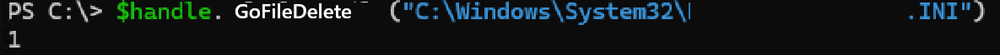

### Introduction

Hello, this is ogu123!!!

In Part3, we'll look at Cross Session Activation, which occurs when a COM object is set to Interactive User, and continue with [Part2](https://hackyboiz.github.io/2024/12/22/ogu123/COM_Object_part2/ko/) finding vulnerable COMs in a specific program!

This time, there won't be much theory, so you can relax, and let's get to work!

### COM Security

COM objects can use COM Security to control object creation, access, permissions, and more.

Among the many settings for COM Security, Application Identity determines which account permissions the COM object uses when it runs.

When you check the properties of a particular DCOM object in Component Services, you see that it is set to Interactive User.

In this context, Interactive User is a setting that runs the COM object with the privileges of the currently logged in user.

This is because COM objects that are capable of cross-session activation must be set to Interactive User.

To better understand this, let's first look at the concept of Windows Session Isolation.

### Windows Session Isolation

In Windows XP and Windows Server 2003 and earlier, when a user first logged in, both the user application and Windows services ran in Session 0.

Attackers exploited this to target service processes with high privileges and interact with user applications to gain elevation of privilege.

To address this issue, the following security policies have been in place since Windows 7

1. logged-in users are assigned different sessions (1, 2, 3...) sequentially
2. services running in session 0 are restricted from interacting with user sessions.

This resulted in complete separation of sessions, so services could not directly interact with user applications running in other sessions.

However... Cross-Session Activation can occur here if a COM object set to Interactive User exists.

### Cross-Session Activation

Cross-Session Activation is a technique for literally activating a COM object across sessions.

In addition to the interactive user, the following conditions must be met to create a cross-session COM object through the Session Moniker.

- INTERACTIVE exists in the Start and Activate COM Object permission
- Existence of appropriate permissions in the process Access Security (Authenticated Users, ...)

> Source : [Windows File Explorer EoP (CVE-2024-38100)](https://decoder.cloud/2024/08/02/the-fake-potato/)
> 

CVE-2024-38100 is an EoP vulnerability due to COM Cross-Session Activation because the DCOM object in Explorer (Hight IL) satisfies all the conditions for Cross-Session Activation and contains a ShellExecute method.

Although MS claimed that cross-session activation is only possible for Interactive User, it was found that SYSTEM can also be cross-session activated through [Chrome Updater EoP (CVE-2024-7023)](https://issues.chromium.org/issues/341803763).

### Finding Cross Session Activation COMs

How do you find COM objects that you can leverage for cross-session activation?

First, you can use PowerShell to filter all registered COM objects to “Interactive User” and find them one by one, checking if they fulfill the conditions mentioned above.

My recommendation is to use the [COMThanasia Tool](https://github.com/CICADA8-Research/COMThanasia), which is much more convenient because you can see RunAs, AppIDs, CLSIDs, etc. at a glance.

### Find vulnerable COMs in a specific program

Now let's continue with Part 2 and look for vulnerable COM objects in antivirus programs!

After checking only the Launch permission, we found Name(A), which appears to be related to the target program.

The corresponding AppID (xxxxxxxx-xxxx-xxxx-xxxx-xxxx-xxxx-xxxxxxxxxxxx) object says that it is not available, which is a static analysis, so we recommend that you recheck it after creating the object.

We looked for CLSIDs using the AppID (xxxxxxxx-xxxx-xxxx-xxxx-xxxx-xxxxxxxxxxxx) and found two CLSIDs.

- xxxxxxxx-xxxx-xxxx-AAAA-AAAAAAAAAAAA (File Handler)
- xxxxxxxx-xxxx-xxxx-BBBB-BBBBBBBBBBBB

First, I checked the xxxxxxxx-xxxx-xxxx-AAAA-AAAAAAAAAAAA (File Handler) CLSID via [OleView.Net](http://oleview.net/), and got lucky and found the IDispatch interface and Typelib!

With trepidation, I looked into Typelib and found several file-related methods within the File Handler interface.

Of these, the GoFileDelete method was my first thought of a File Delete vulnerability.

To summarize, we have verified that the CLSID (xxxxxxxx-xxxx-xxxx-AAAA-AAAAAAAAAAAAAA) is a COM object that exists within TARGET.exe and that the Integrity Level (IL) of TARGET.exe is System.

Finally, we should have checked the Application Identity value of the COM object, but Thinking I had already found the zero-day, I used the GoFileDelete method without checking.

I tried to delete notepad.exe inside the System32 folder via the GoFileDelete method, but it failed...

Frustrated, I moved on, thinking at the time that the Application Identity value was The Launching User.

While writing the articles, I remembered that I hadn't checked the Application Identity, so I checked it and it was SYSTEM?!

I thought about why the GoFileDelete method failed and came up with the following guess.

- Before deleting a file, we filter out files in protected directories like C:\Windows, C:\windows\system32, C:\Program Files, etc.
- Blacklist file extensions like .exe, .dll, .db, etc. to filter them out

After applying GoFileDelete to all the files in the System32 folder, we see that we can't delete files like exe, dll, db, but we can delete ini, chm files, etc.

So... all that's left is to check with the IDA to see exactly which files the GoFileDelete method can delete! (I will...)

### Conclusion

In this article, we looked at the Cross Session Activation technique and how we almost found a File Delete vulnerability in COM inside AntiVirus...!

Now, let's analyze with IDA and find the File Delete vulnerability, or if that doesn't work, let's try to piece it together and find a COM zero-day because there are other methods related to files. (I wonder why there is no Execute method...)

Thank you for reading this long post.

### Reference

- https://www.tiraniddo.dev/2018/09/finding-interactive-user-com-objects_9.html

- https://blog.compass-security.com/2024/10/com-cross-session-activation/

- https://note-ing.tistory.com/65