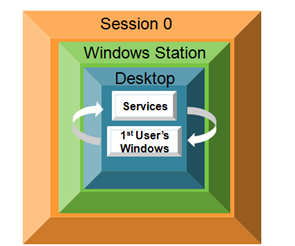
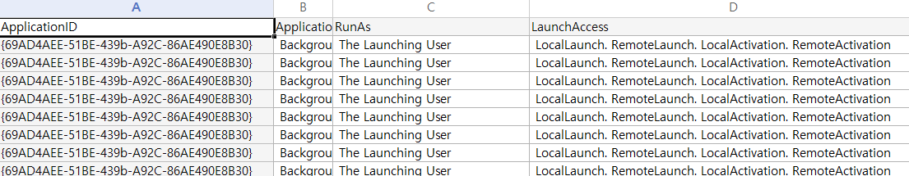

### Introduction

안녕하세요! ogu123입니다!! 

Part3는 COM 객체가 Interactive User로 설정되었을 때, 발생하는 Cross Session Activation를 살펴보고 [Part2](https://hackyboiz.github.io/2024/12/22/ogu123/COM_Object_part2/ko/) 특정 프로그램에서 취약한 COM 찾기를 이어 가도록 하겠습니다!

이번에는 이론이 많이 없어 편하게 보시면 될 거 같습니다! 그럼 신나게 공부하러 가보죠!

### COM Security

COM 객체는 COM Security을 통해 객체 생성, 접근, 권한 등을 제어할 수 있습니다.

COM Security을 위한 여러 설정 중 Application Identity는 COM 객체가 실행될 때 사용할 계정 권한을 결정합니다.

구성 요소 서비스에서 특정 DCOM 객체의 속성을 확인한 결과, 해당 객체는 Interactive User(대화형 사용자)로 설정된 것을 확인할 수 있습니다.

여기서 Interactive User란, 현재 로그인한 사용자의 권한으로 COM 객체를 실행하는 설정입니다.

Cross-Session Activation이 가능한 COM 객체는 Interactive User로 설정되어야 하기 때문에 

이를 더 잘 이해하기 위해, Windows Session Isolation 개념을 먼저 살펴보겠습니다.

### Windows Session Isolation

Windows XP 및 Windows Server 2003 이하 버전에서는 사용자가 처음 로그인하면, 유저 애플리케이션과 Windows 서비스가 모두 Session 0에서 실행되었습니다.

공격자들은 이를 악용하여 높은 권한을 가진 서비스 프로세스를 타겟으로, 유저 애플리케이션과 상호작용함으로써 권한 상승을 시도했습니다.

이 문제를 해결하기 위해 Windows 7 이후 다음과 같은 보안 정책이 적용되었습니다.

1. 로그인한 사용자는 각기 다른 세션(1, 2, 3...)을 순차적으로 할당
2. 세션 0에서 실행되는 서비스는 사용자 세션과 상호작용(interact) 할 수 없도록 제한

이로 인해 세션이 완전히 분리되면서, 서비스는 다른 세션에서 실행되는 사용자 애플리케이션과 직접 상호작용할 수 없게 되었습니다.

그런데.. 여기서 Interactive User로 설정된 COM 객체가 존재할 경우 Cross-Session Activation이 발생할 수 있습니다.

### Cross-Session Activation

Cross-Session Activation은 말 그대도 세션 간 COM 객체를 활성화하는 기법입니다.

이를 만족하기 위해서는 interactive user 말고도 아래와 같은 조건을 만족해야 Session Moniker를 통해 세션 간 COM 객체를 생성할 수 있습니다. 

- COM 객체의 시작 및 활성화 권한에 INTERACTIVE 존재
- 프로세스 Access Security에 적절한 권한 존재(Authenticated Users, …)

> 출처 : [Windows File Explorer EoP(CVE-2024-38100)](https://decoder.cloud/2024/08/02/the-fake-potato/)
> 

CVE-2024-38100은 Explorer(Hight IL) 내에 DCOM 객체가 Cross-Session Activation 조건을 모두 만족하고, ShellExecute 메소드가 포함되어 있어 COM Cross-Session Activation으로 인한 EoP 취약점이 발생했습니다.

MS에서는 Cross-Session Activation이 Interactive User에서만 가능하다고 했지만, [Chrome Updater EoP(CVE-2024-7023)](https://issues.chromium.org/issues/341803763)를 통해 SYSTEM도 Cross-Session Activation 가능한 것으로 밝혀졌습니다.

### Cross Session Activation COM 찾기

Cross Session Activation에 활용할 수 있는 COM 객체는 어떻게 찾을까요?

먼저 PowerShell을 사용하면 등록된 모든 COM 객체에서 "Interactive User"로 필터링하고, 앞서 여러 조건들을 만족하는지 하나하나 확인하면서 찾을 수 있습니다.

제가 추천하는 방법은 [COMThanasia Tool](https://github.com/CICADA8-Research/COMThanasia)를 사용하는 것입니다. 그림처럼 RunAs, AppID, CLSID 등의 정보를 한눈에 확인할 수 있어 훨씬 편리합니다.

### 특정 프로그램에서 취약한 COM 찾기

이제 Part2를 이어서 Antivirus 프로그램에서 취약한 COM 객체를 찾아보겠습니다!

Launch 권한만 확인한 결과, 타겟 프로그램과 관련된 것으로 보이는 Name(A)를 확인했습니다.

해당 AppID(xxxxxxxx-xxxx-xxxx-xxxx-xxxxxxxxxxxx) 객체는 사용은 불가능하다고 나오는데, 정적 분석 결과이므로 객체를 생성 후 다시 확인하는 것이 좋습니다.

AppID(xxxxxxxx-xxxx-xxxx-xxxx-xxxxxxxxxxxx)를 사용하는 CLSID을 찾은 결과, 두 개의 CLSID를 확인했습니다.

- xxxxxxxx-xxxx-xxxx-AAAA-AAAAAAAAAAAA (File Handler)
- xxxxxxxx-xxxx-xxxx-BBBB-BBBBBBBBBBBB

먼저 OleView.Net를 통해 xxxxxxxx-xxxx-xxxx-AAAA-AAAAAAAAAAAA (File Handler) CLSID를 확인한 결과, 운이 좋게 IDispatch 인터페이스와 Typelib를 확인했습니다!

떨리는 마음으로 Typelib를 살펴본 결과, File Handler 인터페이스 내에 여러 파일 관련 메소드를 확인할 수 있었습니다.

그중 GoFileDelete 메소드를 통해 File Delete 취약점을 먼저 생각했습니다.

지금까지 내용을 정리하면, CLSID(xxxxxxxx-xxxx-xxxx-AAAA-AAAAAAAAAAAA)는 TARGET.exe 내에 존재하는 COM 객체이고, TARGET.exe의 IL(Integrity Level)이 System 임을 확인했습니다.

마지막으로 COM 객체의 Application Identity 값을 확인해야 하지만, 이미 제로데이를 찾았다는 생각에 확인을 안 하고 바로 GoFileDelete 메소드를 사용했습니다.

GoFileDelete 메소드를 통해 System32 폴더 안에 notepad.exe 삭제하려 했지만 실패해서…

좌절하며 그 당시에는 Application Identity 값이 The Launching User라고만 생각 후 넘어갔습니다. 하하

연구글을 쓰면서, Application Identity 확인을 안 했던 게 생각나서 확인한 결과 SYSTEM이였습니다?!

그럼 왜? GoFileDelete 메소드가 실패했지 생각해 본 결과 아래와 같이 추측했습니다.

1. File Delete 하기 전, C:\Windows, C:\windows\system32, C:\Program Files와 같이 보호된 디렉터리 내에 파일은 필터링은 한다
2. .exe, .dll, .db 등 파일 확장자명을 블랙리스트로 넣어서 필터링한다

System32 폴더에 있는 모든 파일에 GoFileDelete 한 결과 exe, dll, db와 같은 파일은 삭제하지 못하지만 ini, chm 파일 등은 삭제 가능하다는 것을 확인했습니다.

그럼… 이제 남은 건 IDA를 통해 정확히 GoFileDelete 메소드가 어떤 파일을 삭제 가능한지 확인을 해야 합니다! (하겠습니다…)

### 마치며

이번 글을 통해 Cross Session Activation 개념과 AntiVirus 내에 COM에서 File Delete 취약점을 찾을 뻔한 내용을 살펴보았습니다…!

이제 IDA로 분석 후 File Delete 취약점을 찾거나 정 안된다면, 파일 관련 다른 메소드도 있기 때문에 잘 엮어서 COM 제로데이를 들고 오도록 하겠습니다. (나는 왜 Execute 메소드가 없지..)

긴 글 읽어주셔서 감사합니당 ㅎㅎ

### 참고

- https://www.tiraniddo.dev/2018/09/finding-interactive-user-com-objects_9.html

- https://blog.compass-security.com/2024/10/com-cross-session-activation/

- https://note-ing.tistory.com/65