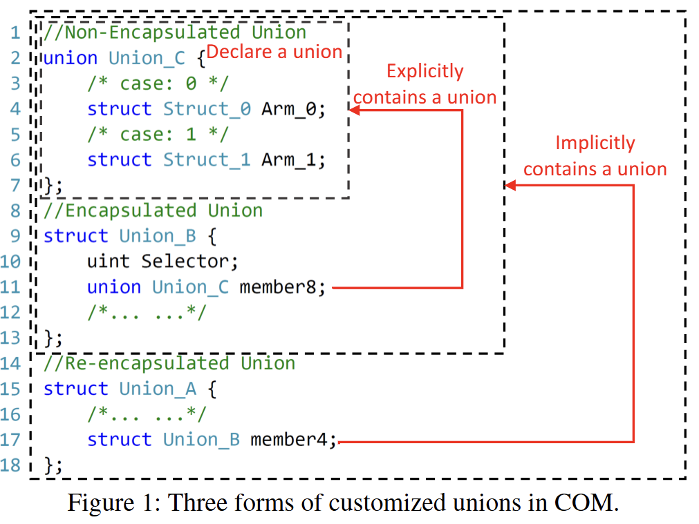
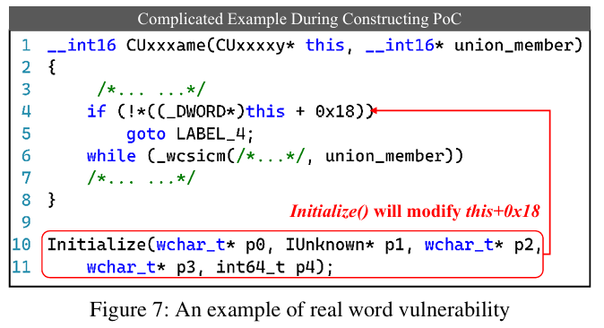

## Introduction

Hello! It's ogu123, back on COM after a long time!

I was busy with other things, but I wanted to find a vulnerability on COM and wrap things up, so I'm back..!

Today I've prepared a [paper review on COM](https://www.usenix.org/conference/usenixsecurity23/presentation/zhang-yuxing). It mentions that using union variables in a COM server can lead to type confusion? Let's take a closer look!

## Background

>reference: Struct VS Union (Introduction to Unions in C - Youtube) 
>

First, a union is a user-defined type where all member variables share the same memory location!

Looking at the picture above makes it easy to understand, right? As shown in the picture , member variables declared within a union share a single memory space, so a union can only store one member variable at a time!

So why use a union instead of a struct? Since a union allocates memory based on the size of its largest member variable, it can be useful when memory is limited!

COM is a technology introduced in 1993. To conserve memory for past system performance, COM developers reportedly used unions extensively instead of structs.

Even now, 30 years later, COM remains the foundation for core Microsoft technologies like OLE, ActiveX, and Windows Shell. However, the paper states that the union type confusion problem persists from past COM development.

Therefore, this paper proposes COMFUSION to detect union type confusion in COM.

First, to find union type confusion in COM, the paper researched how unions are presented in COM and the conventions under which they are used.

In Windows 10 (versions 1803 and 21H2) and Windows 11 (version 21H2), after exploring and collecting all custom structures in COM that are connected to or directly/indirectly referenced by unions via MS COM code and documentation, it was determined that the general union declaration form was defined as shown above.

Figure 1 illustrates the three representative union forms in COM.

1. Non-encapsulated Union
    - The basic form where only the union is used alone
2. Encapsulated Union
    - Enclosing the union within a struct or class and adding a selector member variable
3. Re-encapsulated Union
    - A form where an encapsulated union is included as a struct member; viewing only the struct reveals no direct use of the union, but it exists indirectly

Here, the Selector member variable serves as a selector to determine the type of a union variable before using its value!

Looking at the figure above, you can see that 34–35% of the custom structures are unions. You can also see that the three union types examined earlier are used in combination.

Then, let's examine a simple example in Figure 3 to see how union type confusion can occur.

First, the union MetaInfo consists of a string pointer and an integer member. In the main function, the value of user.info.name is printed using a for loop. At this point, the type value of UserInfo, which acts as the discriminator, should be checked first. However, without this step, the integer value is used as a string pointer, causing type confusion.

Over 50% of COM's custom unions use both pointer and non-pointer members together, which can lead to potential issues like those shown in Figure 3.

Suppose a client can send values from the users array to the server via a specific COM interface. In this case, the client performs marshaling to convert the calling COM interface and arguments according to IDL (Interface Definition Language) rules before transmitting the data.

The server receiving the marshaled data obtains the original data through unmarshaling, enabling execution on the server side. Here, we will explore IDL and marshaling.

First, IDL is a language that defines the interfaces and functions possessed by a COM server, as shown in the figure above. Since IDL itself is a language, it is compiled using the MIDL compiler created by Microsoft to generate .dil files. This process yields header files, type libraries, and files for Proxy and Stub, enabling continued COM development.

Earlier, we mentioned that marshaling follows IDL rules. Therefore, while the client must adhere to IDL rules when sending data to the server, if the server fails to properly validate the data (such as argument values) received from the client, COM type confusion occurs, as shown in Figure 3.

Simply put, marshaling does all the work, but if the server side doesn't do its part, it's all for naught.

## Design of COMFUSION

Now let's examine the workflow of the COMFUSION tool, which explores type confusion vulnerabilities in numerous COM binaries within Windows, as shown in Figure 3!

The goal of COMFUSION is to efficiently and accurately detect union type confusion in COM binaries! Let's look at it step by step!

### 1. Extracting COM Objects

First, obtain all CLSIDs and their corresponding COM binaries from the Windows registry using the path below.

- HKEY_CLASSES_ROOT/CLSID/$CLSID/InprocServer32
- HKEY_CLASSES_ROOT/CLSID/$CLSID/LocalServer32

It is said that you can recover the MIDL file by analyzing the marshaling rules of the COM object using oleviewdotnet.

Finally, each interface can be accessed via a pointer with a specific interface pointer identifier (IPID). Since all IPIDs are organized in a table called the IPIDTable within the COM server process's memory space, it is also possible to parse the IPIDTable using oleviewdotnet and calculate the offset of each interface function table after the COM server has started.

### 2. Exploring Union Declarations

To detect union type confusion, information is required about the variable acting as a discriminator, valid discriminator values, and union members; however, this information can be obtained from the previously recovered MIDL file.

Algorithm1 is used to analyze the relationships between user-defined structures declared in MIDL files.

A simplified overview of Algorithm1 involves creating all structs and unions within the MIDL file as nodes in a graph. If structure `u` contains another structure `v` as a variable or pointer, an edge is created from `u` to `v`.

It then assigns labels based on the previously discussed Non-encapsulated Union, encapsulated Union, etc., and identifies the discriminator according to the union type... ← We will examine this content immediately below.

As a result of Algorithm1, a DAG (Directed Acyclic Graph) is constructed as shown in Figure 5 below.

When examining the DAG, you'll see System Defined Union - VARIANT. VARIANT functions similarly to a union, but internally, the data type is specified in a field called vt. Therefore, just as you must first check the discriminator value to use a union correctly, you must also check the VARIANT→ vt value before using the data in a VARIANT.

In union type confusion, finding the discriminator of a union variable is crucial. This paper categorizes them based on the union form as follows

1. Encapsulated Union
    - Variables located immediately before the union declaration are recognized as discriminators
2. System Defined Union
    - The vt member variable of VARIANT is recognized as a discriminator
3. Re-encapsulated Union
    - As shown in Figure 6, if a VARIANT type exists in Struct_20, the discriminator for Struct_20 is recognized as Member10→vt

When recognizing a discriminator, it is important to know the values that discriminator can hold. For VARIANT, I referred to the MS documentation, and for other union types, I used the case list for the union variable, which was commented out in the recovered MIDL file.

Figure 6 shows an example of a recovered MIDL file. Theoretically, union type confusion checks should be performed for all functions using union variables, but... analyzing every function in the COM binary to find union variables is inefficient. There are simply too many...

Therefore, COMFUSION only checks functions that are directly or indirectly called by interface functions using union variables as arguments, as declared in the MIDL file. Function arguments are designated as taint sources, and CONFUSION distinguishes between union member taint and discriminant taint during analysis.

Referring to Figure 6, each function argument has the [IN], [OUT], or [IN, OUT] attribute. Only [IN] and [IN, OUT] attributes, where an attacker can send data, are subject to Taint Source Filtering.

Additionally, COMFUSION utilizes Angr to set specific variables as tainted. It then tracks whether these tainted variables flow into other variables or memory at the instruction level. [For more details on Angr, please refer to the blog!](https://hackyboiz.github.io/2021/07/10/j0ker/angr_part1/)

### 3. Locate Union Variables

Algorithm 2 demonstrates how COMFUSION finds union variables step by step.

First, as seen in MAIN, COMFUSION uses DFS (Depth-First Search) when exploring execution paths. For interface functions with multiple union arguments, COMFUSION taints only one argument at a time.

One complex situation during analysis is handling function calls. COMFUSION addresses this by processing functions in the following four scenarios

1. Summarized functions
    - Functions like `memcpy` and `strcpy` update the taint map by applying predefined rules without analyzing their internal code.
2. Internal functions
    - Functions implemented within the analyzed binary. The analysis enters these functions, tracks taint, and updates the taint map.
3. External functions
    - Functions implemented outside the analyzed binary. These functions are skipped and not analyzed. It is assumed that taint disappears at this point.
4. Address-taken functions
    - Functions whose call address is determined at runtime. These are skipped due to their high complexity.

Additionally, COMFUSION has set the following thresholds to address three potential issues that may arise during binary analysis:

1. LOOP_THOLD (infinite loop prevention): 2
2. CALL_THOLD (function recursion/depth issues): 5
3. TOTAL_THOLD (analysis time): 10,000

### 4. Identify Union Type Confusion

Union type confusion occurs when a union variable is used and its discriminator can represent multiple types. In other words, it arises when there is uncertainty about the specific type of data stored within.

Previously, we discussed how taint propagation identifies the origin of data. By converting variables and discriminators into symbolic representations through symbolic execution, we can analyze all possible program paths to determine which variables are discriminators and which are union variables.

Therefore, before program execution, we must define which variables should be treated symbolically. While we only want to compute the discriminator value of the union, all arguments are symbolized because other arguments of the interface function also influence the program execution flow.

Symbolic execution can also encounter issues like infinite loops, recursion, or concurrency problems during execution. However, these can be addressed using mechanisms like LOOP_THOLD and CALL_THOLD. It is assumed that all code executes on a single thread, allowing concurrency issues to be ignored. Additionally, COMFUSION checks whether a discriminator can take multiple values whenever a new execution path arises. If it can only take one value, that path is pruned.

COMFUSION states that when tracking union variables, tracking is primarily done in three ways:

1. When used as a function argument
2. When used as an address, like a pointer
3. When used in arithmetic and comparison operations

If a memory address or operand is confirmed to be tainted from a union variable, COMFUSION calculates all possible values the union's discriminator could hold. If it can hold one or more values, COMFUSION determines that union type confusion exists and reports it.

Based on information obtained through COMFUSION analysis (vulnerability location, union members, discriminators, etc.), we directly write a PoC to reproduce the bug. However, when the arguments of the interface function are complex, we resolve it through fuzzing.

The goal in Figure 7 is to make an `if` statement false within the `CUxxxame` function, thereby executing the `while` loop. Here, it was known that the `Initialize()` function modifies the value at `this + 0x18`, but fuzzing is used because the function arguments are complex. Specifically, they set a breakpoint on the `ret` instruction in the `Initialize()` function. If the value at the address `this + 0x18` is non-zero, they consider this an indication that they have found a suitable argument value capable of executing the vulnerable code.

The current version of fuzzing requires manually writing the harness, but the goal is to develop a more automated solution in the future.

## Evaluation

COMFUSION was developed using Python, PowerShell, C++, and other languages, and also utilized external tools (OleViewDotNet, Angr, Cppcheck, TitanEngine).

Testing on Windows 10 (1809, 21H2) and Windows 11 (21H2) identified approximately 1,800 sensitive functions out of about 2 million total functions. The 411 sensitive functions discovered on Windows 11 were significantly fewer. This is attributed to compatibility issues where oleviewdotnet failed to properly recognize union types on Windows 11 or classified `VARIANT` as `FC_USER_MARSHAL`, preventing the efficient identification of necessary functions.

Next, it shows how accurately COMFUSION identifies type confusion. On Windows 10 (1809, 21H2), nearly half were false positives, and on Windows 11, over 70% were false positives.

Analysis of the cause of the high false positives revealed that when COMFUSION analyzes functions implemented in external libraries, it uses a strategy that checks only four arguments because it does not know the exact number of arguments. If the actual function uses fewer than four arguments, COMFUSION incorrectly recognizes the data stored in the remaining registers as invalid union members.

The paper classified the discovered union type confusions into CoP and CoNP. Among the 19 CoPs identified, 5 triggered LPE, while the rest triggered DoS. Although false positives were high, the COMFUSION tool proved effective as it efficiently filtered sensitive functions.

## Conclusion

Through this paper, I learned that improper use of unions in COM servers can lead to type confusion. While I didn't fully grasp the entire paper, it gave me a fresh perspective on finding vulnerabilities in COM and prompted me to revisit concepts like marshaling and IDL.

Reading this paper made me realize that even just the introduction of a paper in a field you're interested in can be incredibly helpful.

Thank you for reading this long post.
