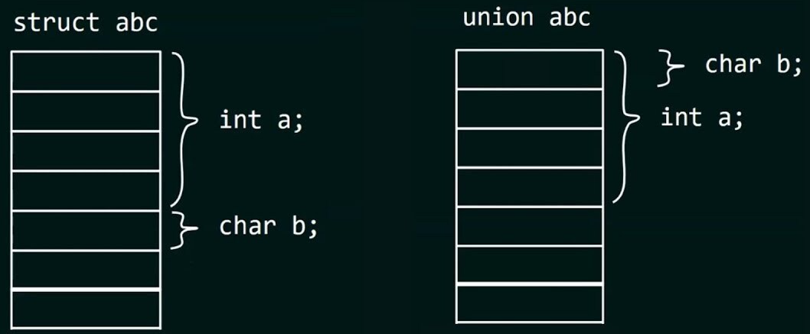
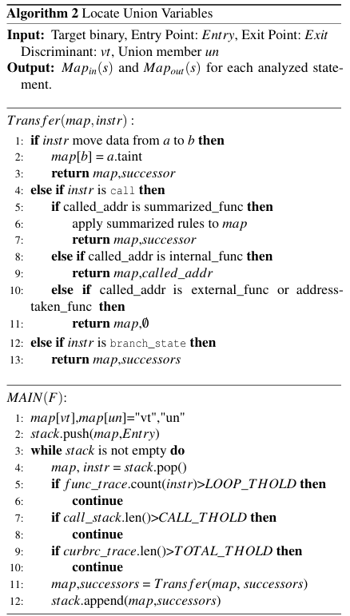

## Introduction

안녕하세요! 오랜만에 COM으로 돌아온 ogu123입니다!

다른 것들을 하다가 COM에서 취약점을 찾고 마무리를 짓고 싶어서 다시 돌아오게 되었습니다..!

오늘은 [COM에 대한 논문 리뷰](https://www.usenix.org/conference/usenixsecurity23/presentation/zhang-yuxing)를 준비했습니다. COM 서버에서 union 변수를 사용할 때 type confusion이 발생할 수 있다고 하는데요? 구체적 살펴보도록 하겠습니다! ~~(대학생 때 쓴 제 논문이랑 비교가 안되는…)~~

## Background

>출처: Struct VS Union (Introduction to Unions in C - Youtube) 
>

우선 union은 모든 멤버 변수가 동일한 메모리 위치를 공유하는 사용자 정의 형식입니다!

위 그림을 보면 쉽게 이해할 수 있는데요? 그림과 같이 union 내에 선언된 멤버 변수는 하나의 메모리 공간을 공유하기 때문에 union은 하나의 멤버 변수만 저장할 수 있습니다!

그럼 struct 쓰지 굳이 union을 쓰는 이유는 뭘까요? union은 size가 가장 큰 멤버 변수의 size로 메모리를 할당받기 때문에 메모리가 제한된 경우 유용하게 사용될 수 있습니다!

COM은 1993년부터 도입한 기술로 과거 시스템 성능상 메모리를 절약하기 위해 COM 개발자분들은 struct 대신 union을 많이 사용했다고 합니다. 

30년이 지난 지금도 COM은 OLE, ActiveX, Windows Shell 등 MS에 핵심 기술의 기반이지만 과거 COM 개발 시 union type confusion 문제는 남아있다고 논문에서 말했습니다.

따라서 해당 논문에서는 COM에서 union type confusion을 탐지하는 COMFUSION을 제시했습니다.

우선 COM에서 union type confusion을 찾기 위해서는 COM에서 union이 어떻게 제시되고 어떤 관행으로 사용되는지 연구했다고 합니다.

Windows 10 (버전 1803 및 21H2) 및 Windows 11 (버전 21H2)에서 MS COM 코드와 문서를 통해 union과 연결되거나 직/간접적으로 참조하는 COM의 모든 사용자 정의 구조체를 탐색하고 수집한 결과, 위와 같이 일반적인 union 선언 형태을 정의했다고 합니다.

Figure1은 COM의 세 가지 대표적인 union 형태를 나타냅니다.

1. Non-encapsulated Union
    - union만 단독으로 사용하는 기본적인 형태
2. encapsulated Union
    - union을 struct나 class 안에 포함시키고 Selector 멤버 변수 추가
3. re-encapsulated Union
    - encapsulated Union을 구조체 멤버로 포함한 형태, 구조체만 보면 Union을 사용하는지 알 수 없지만 간접적으로 Union이 있는 상태

여기서 Selector 멤버 변수는 판별자 역할로 union 변수 값을 사용하기 전 해당 union 변수의 타입을 확인할 때 사용하는 값입니다!

위 그림을 확인하면 사용자 정의 구조체 중 34~35%가 union인 것을 알 수 있습니다. 그리고 앞서 살펴본 세 가지 union 형태가 연결되어 사용된다는 것을 알 수 있습니다.

그러면 union type confusion이 어떻게 발생할 수 있는지 간단한 예시를 Figure 3에서 확인해 보도록 하겠습니다.

먼저 union인 MetaInfo는 문자열 포인터와 정수 멤버를 구성하고 있고 main 함수에서 for 문을 통해 user.info.name 값을 출력합니다. 이때 판별자 역할을 하는 UserInfo의 type 값을 먼저 확인해야 하지만 이 과정 없이 정수 값을 문자열 포인터로 사용해 type confusion이 발생합니다.

COM의 사용자 정의 union의 50% 이상이 포인터와 비포인터 멤버를 같이 사용하기 때문에 Figure 3와 같은 잠재적인 문제가 있을 수 있다고 합니다.

만약, 클라이언트가 users 배열의 값을 특정 COM 인터페이스를 통해 서버로 보낼 수 있다고 가정해 보겠습니다. 이때 클라이언트는 호출하는 COM 인터페이스와 인자를 IDL(Interface Definition Language) 규칙에 따라 변환하는 마샬링을 수행 후 데이터를 전송합니다.

마샬링된 데이터를 전달받은 서버는 언마샬링을 통해 원본 데이터를 얻어 서버 측에서 실행할 수 있게 되는데 여기서 IDL과 마샬링에 대해 알아보도록 하겠습니다.

먼저 IDL은 위 그림과 같이 COM 서버가 가진 인터페이스와 함수들을 정의하는 언어입니다. IDL 자체는 언어이므로 MS가 만든 MIDL 컴파일러를 통해 .dil 파일을 컴파일 후 헤더 파일, 타입 라이브러리, Proxy와 Stub을 위한 파일 등을 얻어 COM 개발을 이어서 할 수 있게 되는 것입니다.

앞서 마샬링은 IDL 규칙을 따른다고 했습니다. 따라서, 클라이언트는 서버로 보내는 과정에서 IDL 규칙에 따를 수밖에 없지만 이를 전달받은 서버 측에서 클라이언트가 보낸 데이터(인자 값 등)를 제대로 검증하지 않아 Figure 3와 같은 COM type confusion이 발생하는 것입니다. 

쉽게 마샬링이 다 해주는데 서버 측에서 안 하면 말짱 도루묵이라는 거죠 ㅎㅎ

## Design of COMFUSION

그럼 이제 Windows 내에 존재하는 많은 COM 바이너리에서 Figure 3와 같이 type confusion 취약점을 탐색하는 COMFUSION 도구의 워크플로우를 살펴보도록 하겠습니다!

COMFUSION에 목표는 COM 바이너리에서 union type confusion을 효율적이고 정확하게 탐지하는 것이라고 합니다! 단계별로 살펴보죠!

### 1. Extracting COM Objects

먼저 Windows 레지스트리에서 아래 경로를 참고해 모든 CLSID와 해당 COM 바이너리를 얻습니다.

- HKEY_CLASSES_ROOT/CLSID/$CLSID/InprocServer32
- HKEY_CLASSES_ROOT/CLSID/$CLSID/LocalServer32

이후 oleviewdotnet를 통해 COM 객체의 마샬링 규칙을 분석하여 MIDL 파일을 복구할 수 있다고 합니다.

마지막으로 각 인터페이스는 특정 interface pointer identifier(IPID)를 가진 포인터를 통해 접근할 수 있는데 모든 IPID는 COM 서버 프로세스의 메모리 공간에 있는 IPIDTable이라는 테이블에 구성이 되기 때문에 이 또한 oleviewdotnet을 통해 IPIDTable을 파싱하고 COM 서버가 시작된 후 각 인터페이스 함수 테이블의 오프셋을 계산할 수 있다고 합니다.

### 2. Exploring Union Declarations

union type confusion을 찾기 위해서는 판별자 역할을 하는 변수, 유효한 판별자 값, union 멤버 등에 대한 정보들이 필요하지만 앞서 복구된 MIDL 파일에서 해당 정보들을 얻을 수 있습니다.

Algorithm1은 MIDL 파일에 선언된 사용자 정의 구조체들 사이의 관계를 분석하기 위해 사용된다고 합니다. 

Algorithm1을 간단하게 살펴보면 MIDL 파일 내의 모든 struct와 union을 그래프의 노드로 생성하고 구조체 `u`가 다른 구초제 `v`를 변수나 포인터로 포함하고 있으면 `u`에서 `v`로 edge를 생성합니다.

그리고 앞서 살펴본 Non-encapsulated Union, encapsulated Union …에 따라 라벨링을 부여하고 union 형태에 따라 판별자를 확인 … ← 이 내용은 바로 아래서 살펴보도록 하겠습니다.

일단 Algorithm1에 결과로 아래 Figure 5와 같이 DAG(Directed Acyclic Graph)가 구축됩니다.

DAG를 확인하면 System Defined Union - VARIANT이 보이는데 VARIANT는 union과 같은 역할을 하지만 내부적으로 vt라는 필드에 데이터의 타입이 명시됩니다. 따라서 union을 올바르게 사용하기 위해 판별자 값을 먼저 확인하듯 VARIANT도 VARIANT→ vt 값을 확인 후 데이터를 사용해야 합니다.

union type confusion에서는 union 변수의 판별자를 찾는 것이 중요한데 본 논문에서는 아래와 같이 union 형태에 따라 구분했다고 합니다.

1. encapsulated Union
    - union이 선언된 바로 직전에 위치한 변수가 판별자로 인식
2. System Defined Union
    - VARIANT의 vt 멤버 변수를 판별자로 인식
3. re-encapsulated Union
    - Figure 6에서 살펴보면 Struct_20에 VARIANT 타입이 존재하면 Struct_20의 판별자는 Member10→vt를 판별자로 인식

판별자를 인식하면 해당 판별자가 가질 수 있는 값을 아는 것이 중요한데 VARIANT의 경우 MS 문서를 참고했고 그 외의 union 형태들은 복구된 MIDL 파일에서 union 변수의 case 목록이 주석으로 되어있어 사용했다고 합니다.

Figure 6는 복구된 MIDL 파일의 예시입니다. 이론상 union 변수를 사용하는 모든 함수에 대해 union type confusion 검사를 해야 하지만… COM 바이너리의 모든 함수를 분석해 union 변수를 찾는 것은 비효율적입니다. 무수히 많기 때문…

따라서 COMFUSION은 MILD 파일에 선언된 대로 union 변수를 인자로 사용하는 인터페이스 함수에 직간접적으로 호출되는 함수들만 검사한다고 합니다. 함수 인자를 taint source로 지정하고 CONFUSION은 분석 중에 union member taint와 discriminant taint를 구별한다고 합니다.

Figure 6을 확인하면 함수의 각 인자는 [IN], [OUT], [IN, OUT] 속성을 가집니다. 공격자가 데이터를 보낼 수 있는 [IN], [IN, OUT]만을 Taint Source Filtration로 합니다.

추가로 COMFUSION은 Angr을 활용해 특정 변수를 taint로 설정 후 명령어 수준에서 taint 변수가 다른 변수나 메모리로 추적할 수 있다고 합니다. [여기서 Angr에 대한 자세한 내용은 블로그를 참고해 주세요!](https://hackyboiz.github.io/2021/07/10/j0ker/angr_part1/)

### 3. Locate Union Variables

Algorithm 2는 COMFUSION이 union 변수를 단계별로 찾는 방법을 보여줍니다.

먼저 MAIN에서 볼 수 있듯 COMFUSION은 실행 경로를 탐색할 때 DFS(Depth-first Search)을 사용하고 여러 union 인자를 사용하는 인터페이스 함수의 경우, COMFUSION은 한 번에 하나의 인자만 taint 시킵니다.

분석 중 복잡한 상황 중 하나는 함수 호출을 처리하는 것이고 COMFUSION은 이를 해결하고자 함수를 아래 네 가지 상황으로 처리한다고 합니다.

1. summarized functions
    - `memcpy`, `strcpy`와 같은 함수들로 내부 코드를 분석하지 않고 미리 정의된 규칙을 적용해 taint map를 업데이트합니다.
2. internal functions
    - 분석 중인 바이너리 내부에 구현되어 있는 함수로 내부에 들어가서 taint를 추적 후 taint map을 업데이트합니다.
3. external functions
    - 분석 중인 바이너리 외부에 구현되어 있는 함수로 해당 함수들은 건너뛰고 분석하지 않습니다. 그리고 taint가 해당 부분에서 사라진다고 가정합니다.
4. address-taken functions
    - 런타임에 호출 주소가 결정되는 함수들로 복잡성이 높기에 건너뜁니다.

추가로 COMFUSION은 바이너리를 분석할 때 발생할 수 있는 세 가지 문제를 해결하기 위해 아래 와 같이 임계값을 설정했다고 합니다.

1. LOOP_THOLD(무한 루프 방지) : 2
2. CALL_THOLD(함수 재귀/depth 문제) : 5
3. TOTAL_THOLD(분석 시간) : 10,000

### 4. Identify Union Type Confusion

union type confusion이 발생하는 이유는 union 변수가 사용될 때, 해당 판별자가 여러 개의 type를 가질 때 발생합니다. 즉, 어떤 타입의 데이터가 들어가 있는지 확신할 수 없는 상황이죠

앞서 Taint propagation을 통해 어디서 온 데이터인지 확인하고 symbolic execution을 통해 변수와 판별자를 symbolic으로 변환 후 프로그램의 가능한 모든 경로를 분석하며 어떤 변수가 판별자이고, union 변수인지 판단할 수 있다고 합니다.

따라서, 프로그램 실행 전 어떤 변수를 symbolic으로 처리해야 하는지 정의해야 하는데 union의 판별자 값만 계산하고 싶지만, 인터페이스 함수의 다른 인자들도 프로그램 실행 흐름에 영향을 주기 때문에 모든 인자를 symboilc 화한다고 합니다.

symbolic execution 또한 실행 중 무한 루프, 재귀, 동시성 문제 발생할 수 있지만 앞서 LOOP_THOLD, CALL_THOLD 등으로 해결할 수 있고 모든 코드가 단일 스레드에서 실행된다고 가정해 동시성 문제를 무시하기로 했다고 합니다. 추가로 COMFUSION은 새로운 실행 경로가 생길 때마다 판별자가 여러 값을 가질 수 있는지 검사하고 오직 하나의 값만 가질 수 있다면, 해당 경로는 가지치기 한다고 합니다.

COMFUSION은 union 변수를 추적할 때 크게 세 가지로 범위로 추적한다고 합니다.

1. 함수의 인자로 사용되는 경우
2. 포인터처럼 주소로 사용되는 경우
3. 산술 및 비교 연산에 사용되는 경우

만약 메모리 주소나 피연산자가 union 변수로부터 tainted된 것으로 확인되면, COMFUSION은 해당 union의 판별자가 가질 수 있는 모든 값을 계산하고 하나 이상의 값을 가질 수 있다면 union type confusion이 존재한다고 판단해 이를 보고한다고 합니다.

COMFUSION 분석으로 얻은 정보(취약점 위치, union 멤버, 판별자 등)를 바탕으로 직접 PoC를 작성해 버그를 재현하지만 인터페이스 함수의 인자가 복잡한 경우 퍼징을 통해 해결한다고 합니다.

Figure 7의 목표는 `CUxxxame` 함수내에 if 문을 false로 만들어 while 문을 실행하는 것입니다. 이때, `Initialize()` 함수가 `this + 0x18`의 값을 변경한다는 것을 알았지만 함수 인자가 복잡해 퍼징을 사용한다고 합니다. 구체적으로 `Initialize()` 함수의 ret에 break point를 설정하고 `this + 0x18` 주소의 값이 0이 아닌지 확인되면, 취약한 코드를 실행할 수 있는 적절한 인자 값을 찾았다고 판단합니다.

현재 버전의 퍼징은 직접 harness를 작성해야 하지만 추후 더 자동화된 솔루션으로 개발하는 것이 목표라고 합니다.

## Evaluation

COMFUSION은 python, powershell, c++ 등으로 개발되었으며 외부 도구들(OleViewDotNet, Angr, Cppcheck, TitanEngine)도 활용했습니다.

Windows 10(1809, 21H2)과 Windows 11(21H2)에서 테스트 한 결과, 약 200만 개의 함수 중 민감한 함수는 1,800개로 추릴 수 있었습니다. Windows 11에서 발견된 민감한 함수는 411개로 현저히 적은데 이는 oleviewdotnet이 windows 11에서 union type을 제대로 인식하지 못하거나 `VARIANT`를 `FC_USER_MARSHAL`로 분류하는 등에 호환성 문제를 일으켜 필요한 함수들을 효율적으로 찾아낼 수 없었다고 합니다.

다음으로 COMFUSION이 얼마나 정확하게 type confusion을 식별하는지 나타냅니다. Windows 10(1809, 21H2)에서는 절반 가까이 False Positives이 나타났고 Windows 11은 70% 이상 False Positives가 나타난 것을 확인할 수 있습니다.

높은 False Positives가 나온 원인을 분석한 결과 COMFUSION이 외부 라이브러리에 구현된 함수를 분석할 때, 정확한 인자 개수를 알지 못해 네 개의 인자만 검사하는 전략을 사용했습니다. 이때, 실제 함수가 네 개 미만의 인자를 사용한다면, COMFUSION은 나머지 레지스터에 저장된 데이터를 잘못된 union 멤버로 인식하는 문제가 있었다고 합니다.

논문에서는 발견된 union type confusion를 CoP와 CoNP로 분류했고 총 19개의 CoP 중 LPE 5개와 나머지는 DoS를 트리거 했습니다. False Positives가 높지만 효율적으로 민감한 함수들을 필터링할 수 있어 COMFUSION 도구가 효과적이었다고 합니다.

## 마무리

논문을 통해 COM Server에서 union을 잘못 사용하면 type confusion이 발생할 수 있다는 것을 알았고 논문에 대해 전부 이해는 못 했지만 COM에서 취약점을 찾을 때 새로운 관점과 마샬링, IDL 등등 COM에 대한 내용을 다시 짚을 수 있었습니다 ㅎㅎ

평소 관심 있는 분야의 논문에서 Introduction만 읽어도 엄청 도움이 될 거 같다고 이번 논문을 보면서 생각했습니다.

긴 글 읽어주셔서 감사합니당 ㅎㅎ
