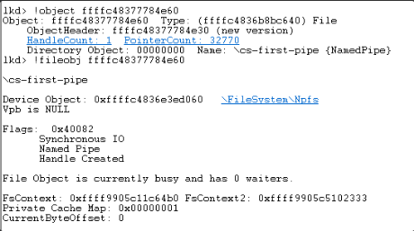

## Introduction

Hi, this is ogu123!!!

Today we're going to talk about Windows Named Pipes!

Until now, IPC is a way to communicate between processes~ ← I've known about it in a vague way...

This time, we're going to learn more about Named Pipe, one of the many IPCs!

~~(What Tungx9 Sahur is holding is a Pipe.)~~


## Windows IPC

First, let's talk about Inter Process Communication (IPC), which is a method that allows processes to communicate with each other!

Below are the different IPC methods used by Windows.

- Shared Memory
- Mail Slot
- Component Object Model (COM)
- Pipe

Here I was wondering, why do we need to communicate between processes and what are the advantages?


First, processes are created individually, as shown in the image above, so they don't have access to each other! This is called an **Independent Process**.

However, in complex situations, processes need to exchange state values or data with each other! Let's explain this with a simple example.


Let's say you're downloading a file in a web browser! The browser has two processes running: one that displays the download progress on the screen, as shown in the figure, and one that downloads the actual file data.

The download process needs to send progress information to the screen process, such as “**Now 70% downloaded!**” so that the user can see the progress bar, and the screen process needs to tell the download process “**You pressed the stop button!**” so that the download stops.

When processes communicate with each other by sending and receiving state values or data, as in the example above, they are called co-operating processes, and the advantages of doing so are that they can share resources to work more efficiently, and parallel processing makes programs run faster and more efficiently.

However, it increases system complexity and requires thorough design as it can introduce vulnerabilities and synchronization issues when reading/writing data.

## Windows IPC Pipe

Now that we've covered what IPC is and why we use it, let's take a look at the different Windows IPC techniques and learn about Pipe.

First of all, there are two types of pipes: Anonymous Pipes and Named Pipes. The literal translation is an unnamed pipe and a named pipe... which makes no sense at all, but let's see what we mean by names first!


For Anonymous and named pipes, think of **name as the address of the pipe**!

If the pipe has an address, other processes or remote processes can access it, and conversely, if it doesn't have an address, other processes can't access it!

Excuse me? Pipe is one of the IPCs, but how does it make sense that other processes can't access it... ← We'll explain this in the Anonymous Pipe section later on lol.

So what does the address of a pipe refer to? It depends on the local pipe and the remote pipe, but for the remote pipe, we use the **computer name** to identify the PC on the network. You can find your computer name in your system properties, as shown above!

To summarize, we already knew that Named Pipes have no limitations on the range of communication (remote, local) due to the existence of a pipe address, and Anonymous Pipes have no limitations on the range of communication (remote, local), which we'll take a closer look at just below!

### Anonymous Pipe


First, Anonymous Pipes are **one-way** in nature. When a Pipe is created via the `CreatePipe` function below, it returns a handle (hReadPipe, hWritePipe) for two processes to do their respective operations (Read/Write), since it is a one-way communication.

```cpp
BOOL CreatePipe(
  [out]          PHANDLE               hReadPipe,
  [out]          PHANDLE               hWritePipe,
  [in, optional] LPSECURITY_ATTRIBUTES lpPipeAttributes,
  [in]           DWORD                 nSize
);
```

When you said above that Anonymous Pipes are not accessible to other processes, what do you mean by “**two processes return handles (hReadPipe, hWritePipe) for each to do their own operations (Read/Write)**”...? The bottom line is that Anonymous Pipes are used to communicate between processes in a parent-child relationship!

```cpp
BOOL CreateProcess(
  [in, optional]      LPCSTR                lpApplicationName,
  [in, out, optional] LPSTR                 lpCommandLine,
  [in, optional]      LPSECURITY_ATTRIBUTES lpProcessAttributes,
  [in, optional]      LPSECURITY_ATTRIBUTES lpThreadAttributes,
  [in]                BOOL                  bInheritHandles,
  [in]                DWORD                 dwCreationFlags,
  [in, optional]      LPVOID                lpEnvironment,
  [in, optional]      LPCSTR                lpCurrentDirectory,
  [in]                LPSTARTUPINFOA        lpStartupInfo,
  [out]               LPPROCESS_INFORMATION lpProcessInformation
);
```

Create a Pipe with the `CreatePipe` function in the parent process and create a child process by setting the value of the `CreateProcess` function bInheritHandles argument to True.

This allows the parent process handle table to be inherited and used by the child process, so it can communicate with the Anonymous Pipe. The communication here uses the `ReadFile` and `WriteFile` functions.

If we wanted to have two-way communication, we could create two pipes, right?

Organizing an Anonymous Pipe means that other processes can't access it because it doesn't have a name, but child processes can access it through handle table inheritance, so Anonymous Pipe can be used for parent-child process communication.

### Named Pipe


Named Pipes are bi-directional in nature. The server is the one who creates the pipe, and the client is the one who uses the created pipe. Let's take a look at the functions that are important when using Named Pipes!

Check out the image above and the code below for a better understanding!

```cpp
hPipe = HANDLE CreateNamedPipe(
  [in]           LPCSTR                lpName,
  [in]           DWORD                 dwOpenMode,
  [in]           DWORD                 dwPipeMode,
  [in]           DWORD                 nMaxInstances,
  [in]           DWORD                 nOutBufferSize,
  [in]           DWORD                 nInBufferSize,
  [in]           DWORD                 nDefaultTimeOut,
  [in, optional] LPSECURITY_ATTRIBUTES lpSecurityAttributes
);
```

First, we create a Pipe on the server with the `CreateNamedPipe` function. This is a two-way communication, so it returns a single handle to the server.

Here, the **lpName** argument is the name of the Pipe being created, which can also be set to Half-Duplex (server → client, server ← client) via the **dwOpenMode** argument.

The **nMaxInstances** argument is the number of Pipe instances that will be created. If the value is 3, then up to 3 Pipes with the same name can be created and thus connected to a total of 3 clients.


PipeList allows you to see the named pipes in your system.

If a Pipe with a Max Instances value of 1 receives requests from multiple clients, they will be associated with one Pipe and the remaining clients will be put into a waiting state. The amount of time the clients wait can be set by the **nDefaultTimeOut** argument.

```cpp
ConnectNamedPipe(hPipe, NULL);
```

After creating a Pipe on the server, the `ConnectNamedPipe` function puts the Pipe in a **connect-waiting state** so that it can be accessed by other processes, both remote and local. Think of it as exposing the Pipe to the outside world!

```cpp
HANDLE CreateFile(
  [in]           LPCSTR                lpFileName,
  [in]           DWORD                 dwDesiredAccess,
  [in]           DWORD                 dwShareMode,
  [in, optional] LPSECURITY_ATTRIBUTES lpSecurityAttributes,
  [in]           DWORD                 dwCreationDisposition,
  [in]           DWORD                 dwFlagsAndAttributes,
  [in, optional] HANDLE                hTemplateFile
);
```

Now, on the client, insert the server Named Pipe you want to connect to in the **lpFileName** argument, run the `CreateFile` function, and you will be able to communicate with the Named Pipe. Communication uses the `ReadFile`, `WriteFile` functions just like Anonymous Pipe.

```cpp
BOOL WaitNamedPipe(
  [in] LPCSTR lpNamedPipeName,
  [in] DWORD  nTimeOut
);
```

If a client sends a request for a Pipe connection via the `CreateFile` function, but the server Pipe instance is full, the `WaitNamedPipe` function can wait for the value of the **nTimeOut** argument.

If the **nTimeOut** argument is set to the default value, the `CreateNamedPipe` function will wait as long as the **nDefaultTimeOut** value.

So far, we've seen what the names mean for Anonymous and Named Pipes, and how to create and use them in code. I think you should have no problem understanding the Windows Pipe code if you know the functions above!

## Windows Named pipe

Now let's dive into Named Pipes in earnest!



Pipes created using the `CreatePipe` or `CreateNamedPipe` functions are created in the kernel area and behave like a kind of shared memory. Windows treats this shared memory as a File Object, which is why you can see in the figure above that the Pipe is a File Object.

Therefore, when you send or receive data through a Pipe, you are using file-specific APIs like `ReadFile` or `WriteFile`.

In the case of Named Pipes, remote and local processes can connect through the name of the Pipe. Here's a look at the basic structure of a Pipe name.

```cpp
\\ServerName\pipe\PipeName
```

- Server-side: `\\\\.\\pipe\\ogu123`
    - Since the server is creating the pipe on its own machine, you can use a .(dot) in the server name and the name of the pipe being created (`ogu123`) as the lpName argument to the `CreateNamedPipe` function.
- Client side: `\\\\.\\pipe\\ogu123` or `\\\\ComputerName\\pipe\\ogu123`
    - If the pipe you want to connect to exists on the local machine, use `\\\\.\\pipe\\ogu123`
    - If the pipe you want to connect to exists on the remote computer, use `\\\\ComputerName\\pipe\\ogu123`


So far, we've checked the location of the Pipe in memory and looked at the Pipe name structure.

If we create a Pipe on the server side via `\\\\.\\pipe\\ogu123`, let's see where the `ogu123` Pipe is actually created.


NamedPipeServer.exe creates the `ogu123` Pipe. If we check the NamedPipeServer.exe process handle with Process Explorer, we can see that it has a Named Pipe handle named `ogu123`, as shown above.

The strange thing here is that we created the Pipe at the path `\\\\.\\pipe\\ogu123`, but it was actually created at `\\Device\\NamedPipe\\ogu123`.


This can be seen by looking at the WinObj and seeing that `\\\\.\\pipe` is symlinked to the path `\\Device\\NamedPipe`, which creates the Pipe `\\Device\\NamedPipe\\ogu123`.

## Find Named pipe vulnerabilities

Now let's dive into the process of finding vulnerabilities in Named Pipes!

We'll cover two exercises, the first to find them using Process Explorer, accesschk, IDA, etc. and the second to exploit them using the Client Impersonation technique!

For the first lab, I used the code from [link](https://github.com/VerSprite/research/tree/master/projects/cpp/VulnerableApps/WindowsPipes) with some minor modifications.


First, enable the handle option in Process Explorer, and then check the handle value of the target process running with elevated privileges.


You can see that the target process (NamedPipeServer.exe) is running as administrator and that the ogu123 Pipe exists.


You can now check the DACLs of all Named Pipes under \\.\pipe\ with accesschk's `accesschk.exe \\pipe\\` command.

In the figure above, we can see that the ogu123 Pipe has RW permissions for the Everyone group, which means that the target process Named Pipe can be connected to and read/written by normal users.


Now we just need to find the server-side Named Pipe creation part through IDA and find the point in the process of communicating with the client that will trigger the LPE.

First, you can find the server-side Named Pipe creation part by using IDA Imports or string search to find the functions shown above (including `CreateNamedPipeW()`).


We see that the target process uses the `CreateNamedPipeW` function, and if we follow where it uses that function, we see that the


You can see where to create the ogu123 Pipe. Now, after creating the Pipe, all you need to do is read the connected client messages on the server side and look for vectors that might trigger the LPE vulnerability! Simple, right?

### Client Impersonation Techniques

The Client Impersonation technique is a way for the server to obtain client authorization to perform LPE once it is connected to the client.

First, the server must obtain client authorization to perform impersonation, which is stored in the Access Token. The Access Token needs to be able to control “**what the server can do with my information**”, which is where the Impersonation Level comes in.

| SECURITY_IMPERSONATION_LEVEL | Description |
| --- | --- |
| `SecurityAnonymous` | The server cannot impersonate or identify the client. |
| `SecurityIdentification` | The server can get the identity and privileges of the client, but cannot impersonate the client. |
| `SecurityImpersonation` | The server can impersonate the client’s security context on the local system. |
| `SecurityDelegation` | The server can impersonate the client’s security context on remote systems. |

There are two types of access tokens: primary tokens and impersonation tokens, which we'll describe as processes and threads!

In Windows, every process has an Access Token, where the process token uses the Primary Token and does not change until the process is terminated.

A thread can have two values, a Primary Token and an Impersonation Token, and it shares the Primary Token value of the process.

A thread can use the Access Token of another account instead of the Primary Token when it is created, and the token it uses is the Impersonation Token! This means that the thread always references the Primary Token and only has an Impersonation Token when it is in impersonation.

```cpp
CreateFile(
    L"Local pipe path or remote pipe path",
    GENERIC_READ | GENERIC_WRITE,
    0,
    NULL,
    OPEN_EXISTING,
    SECURITY_SQOS_PRESENT | SECURITY_IMPERSONATION, // or SECURITY_DELEGATION
    NULL
);
```

Let's take a closer look at the LPE method with Client Impersonation!

When the target service or program calls `CreateFile()`, instead of the normal file path, it connects to the attacker's Named Pipe! The 6th argument of the `CreateFile()` function must have the value SECURITY_SQOS_PRESENT | SECURITY_IMPERSONATION or SECURITY_DELEGATION as shown above.

For remote pipes, SECURITY_IMPERSONATION is said to be enforced even if only SECURITY_SQOS_PRESENT is present.

```cpp
// Create a server named pipe
serverPipe = CreateNamedPipe(
    pipeName,           // name of our pipe, must be in the form of \\.\pipe\<NAME>
    PIPE_ACCESS_DUPLEX, // The rest of the parameters don't really matter
    PIPE_TYPE_MESSAGE,	// as all you want is impersonate the client...
    1,		// 
    2048,	// 
    2048,	// 
    0,		// 
    NULL	// This should ne NULL so every client can connect
);
// wait for pipe connections
BOOL bPipeConnected = ConnectNamedPipe(serverPipe, NULL);
// Impersonate client
BOOL bImpersonated = ImpersonateNamedPipeClient(serverPipe);
// if successful open Thread token - your current thread token is now the client's token
BOOL bSuccess = OpenThreadToken(GetCurrentThread(), TOKEN_ALL_ACCESS, FALSE, &hToken);
// now you got the client token saved in hToken and you can safeyl revert back to self
bSuccess = RevertToSelf();
// Now duplicate the client's token to get a Primary token
bSuccess = DuplicateTokenEx(hToken,
    TOKEN_ALL_ACCESS,
    NULL,
    SecurityImpersonation,
    TokenPrimary,
    &hDuppedToken
);
// If that succeeds you got a Primary token as hDuppedToken and you can create a proccess with that token
CreateProcessWithTokenW(hDuppedToken, LOGON_WITH_PROFILE, command, NULL, CREATE_NEW_CONSOLE, NULL, NULL, &si, &pi);
```

Once the target client is connected to the attacker's Named Pipe server, the server can LPE with client privileges via the above code. Let's take a look at the main functions.

- `ImpersonateNamedPipeClient()` : Applies the client Impersonation Token to the server thread. The Impersonation Token used is the token for applying the client's Primary Token to the thread.
- `RetrieveToSelf()`: Terminates the Impersonation. It must be executed before the `CreateProcessWithTokenW()` function is called to avoid errors.
- `DuplicateTokenEx()` : Duplicates the client Impersonation Token obtained earlier as the Primary Token for use in the process.
- `CreateProcessWithTokenW()` : Creates a process with client privileges through the Primary Token token. → LPE occurs!

## **Conclusion**

In this article, we took a deep dive into Windows IPC and Named Pipes! Writing this article reminded me that there are a lot of Windows Attack Vectors out there.

Thanks for reading this long post!

## **Reference**

- 윈도우 시스템 프로그래밍
- 뇌를 자극하는 윈도우즈 시스템 프로그래밍
- https://www.baeldung.com/cs/pipes-vs-sockets
- https://www.codeproject.com/Articles/13724/Windows-IPC
- https://versprite.com/vs-labs/microsoft-windows-pipes-intro/
- https://versprite.com/vs-labs/vulnerable-named-pipe-application/
- https://csandker.io/2021/01/10/Offensive-Windows-IPC-1-NamedPipes.html