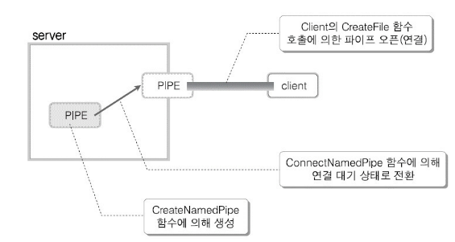
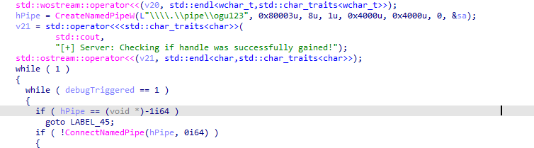

## Introduction

안녕하세요! ogu123입니다!!

오늘은 Windows Named Pipe에 대한 내용을 가져왔습니다!

그동안 IPC는 프로세스 간 통신을 할 수 있게 해주는 방법이다~ ← 이렇게 두루뭉술하게 알고 있었는데요.. 

이번 기회에 제대로 알아보고자 여러 IPC 중 Named Pipe에 대해 준비했습니다!

~~(퉁x9 사후루가 들고 있는 건 Pipe입니다.)~~


## Windows IPC

먼저 IPC(Inter Process Communication)란, 프로세스들이 서로 통신을 할 수 있게 해주는 방법입니다!

아래는 Windows에서 사용하는 다양한 IPC 방법들입니다.

- 공유 메모리(Shared Memory)
- Mail Slot
- COM(Component Object Model)
- Pipe

여기서 저는 프로세스들 간에 통신을 왜? 해야 하고, 어떤 장점이 있을까 궁금했는데요?


먼저 프로세스는 위 그림처럼 개별적으로 생성되어 프로세스들끼리 서로 접근할 수 없습니다! 이를 **독립 프로세스(Independent Process)**라고 합니다.

하지만, 복잡한 상황에서는 프로세스의 상태 값이나 데이터를 서로 주고받아야 하는데요! 이를 간단한 예시로 설명하겠습니다.


여러분이 웹 브라우저에서 파일을 다운로드 받고 있는 상황으로 가정하겠습니다! 이때, 브라우저는 그림과 같이 다운로드 진행 상황을 화면에 보여주는 프로세스와 실제 파일 데이터를 다운 받는 프로세스가 동작 중 일 겁니다.

다운로드 프로세스는 “**지금 70% 다운로드했어!**”같은 진행 정보를 화면 프로세스에 보내야 유저가 진행 바를 확인할 수 있고, 또 화면 프로세스는 “**유저가 정지 버튼 눌렀어!**”라고 다운로드 프로세스에 알려주면 다운로드가 멈추게 됩니다.

위 예시와 같이 프로세스 간 상태 값이나 데이터를 주고받는 프로세스를 **협력 프로세스(Co-operating Process)**라고 하고 프로세스 간 통신을 할 경우, 자원 공유로 작업 효율성이 높아지고, 병렬 처리를 통해 프로그램이 더 빠르고 효율적으로 실행된다는 장점이 있습니다.

하지만, 시스템 복잡도가 증가하며, 데이터 Read/Write 시 취약점과 동기화 문제가 발생할 수 있으므로 철저한 설계가 필요합니다.

## Windows IPC Pipe

위에서 IPC가 무엇이고 왜 사용하지는 살펴보았으니 이제 다양한 Windows IPC 기법 중 Pipe에 대해 알아보겠습니다.

먼저 Pipe는 Anonymous Pipe와 Named Pipe 두 종류가 있습니다. 직역하면 이름 없는 파이프와 이름 있는 파이프인데… 전혀 감이 안 오지만 여기서 이름이 뜻하는 게 무엇인지 먼저 살펴보겠습니다!


이름 없는 파이프와 이름있는 파이프에서 **이름은 파이프의 주소**라고 생각하시면 됩니다! 

파이프의 주소가 있을 경우 다른 프로세스나 원격 프로세스가 접근할 수 있고 반대로 주소가 없으면 다른 프로세스들이 접근하지 못하게 됩니다! 

저기요? Pipe는 IPC 중 하나인데 다른 프로세스에서 접근을 못한다니 이게 말이 됩니까..? ← 이 부분은 바로 뒤 Anonymous Pipe에서 풀도록 하겠습니다 ㅎㅎ

그럼 파이프의 주소는 무엇을 말하는 걸까요? 로컬 Pipe와 원격 Pipe에 따라 달라지는 부분이 있지만 원격 Pipe에 경우 네트워크 상에서 PC를 구분할 수 있는 **컴퓨터 이름**을 사용합니다. 위 그림과 같이 시스템 속성에서 컴퓨터 이름을 확인할 수 있습니다!

정리하자면 Named Pipe는 파이프 주소가 존재하기 때문에 통신 범위(원격, 로컬)에 제한이 없다는 것을 미리 알 수 있었고, Anonymous Pipe는 바로 아래에서 자세히 살펴보도록 하겠습니다!

### Anonymous Pipe


먼저 Anonymous Pipe는 **단방향** 특성을 띄고 있습니다. 아래 `CreatePipe` 함수를 통해 Pipe가 생성되면 단방향 통신이므로 두 개의 프로세스가 각자 작업(Read/Write)를 하기 위한 핸들(hReadPipe, hWritePipe)을 각각 리턴합니다.

```cpp
BOOL CreatePipe(
  [out]          PHANDLE               hReadPipe,
  [out]          PHANDLE               hWritePipe,
  [in, optional] LPSECURITY_ATTRIBUTES lpPipeAttributes,
  [in]           DWORD                 nSize
);
```

아니! 위에서 Anonymous Pipe는 다른 프로세스에서 접근 못한다고 했는데 “**두 개의 프로세스가 각자 작업(Read/Write)를 하기 위한 핸들(hReadPipe, hWritePipe)을 리턴합니다.**”가 무슨 말입니까…? 결론부터 말씀드리면 Anonymous Pipe는 **부모-자식 관계에 있는 프로세스 간 통신하는 데 사용**됩니다!

```cpp
BOOL CreateProcess(
  [in, optional]      LPCSTR                lpApplicationName,
  [in, out, optional] LPSTR                 lpCommandLine,
  [in, optional]      LPSECURITY_ATTRIBUTES lpProcessAttributes,
  [in, optional]      LPSECURITY_ATTRIBUTES lpThreadAttributes,
  [in]                BOOL                  bInheritHandles,
  [in]                DWORD                 dwCreationFlags,
  [in, optional]      LPVOID                lpEnvironment,
  [in, optional]      LPCSTR                lpCurrentDirectory,
  [in]                LPSTARTUPINFOA        lpStartupInfo,
  [out]               LPPROCESS_INFORMATION lpProcessInformation
);
```

부모 프로세스에서 `CreatePipe`함수를 통해 Pipe를 생성하고 `CreateProcess` 함수 bInheritHandles 인자 값을 True로 설정해 자식 프로세스를 생성합니다.

이렇게 되면 부모 프로세스 핸들 테이블을 자식 프로세스에서 상속받아 사용할 수 있기 때문에 Anonymous Pipe로 통신할 수 있게 됩니다. 여기서 통신은 `ReadFile`, `WriteFile` 함수를 사용합니다.

만약, 양방향 통신을 하고 싶다면 파이프를 두 개를 생성하면 되겠죠?

Anonymous Pipe를 정리하면 Pipe에 이름이 없기 때문에 다른 프로세스에서 접근하지 못하지만 자식 프로세스는 핸들 테이블 상속을 통해 Pipe에 접근할 수 있어 Anonymous Pipe는 부모-자식 프로세스 간 통신에 활용합니다.

### Named Pipe



Named Pipe는 **양방향** 특성을 띄고 있습니다. 우선 Pipe를 생성하는 쪽을 서버, 생성된 Pipe를 사용하는 쪽을 클라이언트라고 하며 Named Pipe를 사용할 때 중요한 함수을 살펴보며 이해해 보도록 하겠습니다!

위 그림과 아래 코드들을 같이 확인하시면 이해하기 수월하실 겁니다!

```cpp
hPipe = HANDLE CreateNamedPipe(
  [in]           LPCSTR                lpName,
  [in]           DWORD                 dwOpenMode,
  [in]           DWORD                 dwPipeMode,
  [in]           DWORD                 nMaxInstances,
  [in]           DWORD                 nOutBufferSize,
  [in]           DWORD                 nInBufferSize,
  [in]           DWORD                 nDefaultTimeOut,
  [in, optional] LPSECURITY_ATTRIBUTES lpSecurityAttributes
);
```

먼저 서버에서 `CreateNamedPipe` 함수를 통해 Pipe를 생성합니다. 이때 양방향 통신이므로 한 개의 핸들을 서버에게 반환합니다.

여기서 **lpName** 인자가 생성되는 Pipe의 이름이고, **dwOpenMode** 인자를 통해 Half-Duplex (서버 → 클라인트, 서버 ← 클라이언트)로도 설정할 수도 있습니다.

**nMaxInstances** 인자는 생성되는 Pipe 인스턴스 개수입니다. 만약 해당 값이 3일 경우, 같은 이름의 Pipe가 3개까지 생성될 수 있고 따라서 총 3명의 클라이언트와 연결될 수 있습니다.


PipeList을 사용하면 시스템 내에 Named Pipe을 확인할 수 있습니다. 

만약, Max Instances 값이 1로 설정된 Pipe에 여러 클라이언트의 요청이 들어올 경우 하나의 Pipe와 연결되고 남은 클라이언트는 대기 상태가 됩니다. 이때, 클라이언트가 대기하는 시간은 **nDefaultTimeOut** 인자로 설정할 수 있습니다.

```cpp
ConnectNamedPipe(hPipe, NULL);
```

서버에서 Pipe 생성 후 `ConnectNamedPipe`함수를 통해 Pipe를 **원격, 로컬에 있는 다른  프로세스에서 접근할 수 있도록 연결 대기 상태**로 전환합니다. Pipe를 외부에 노출시킨다고 생각하시면 됩니다!

```cpp
HANDLE CreateFile(
  [in]           LPCSTR                lpFileName,
  [in]           DWORD                 dwDesiredAccess,
  [in]           DWORD                 dwShareMode,
  [in, optional] LPSECURITY_ATTRIBUTES lpSecurityAttributes,
  [in]           DWORD                 dwCreationDisposition,
  [in]           DWORD                 dwFlagsAndAttributes,
  [in, optional] HANDLE                hTemplateFile
);
```

이제 클라이언트에서 **lpFileName** 인자에 연결하고 싶은 서버 Named Pipe 넣고 `CreateFile` 함수를 실행하면 Named Pipe로 통신할 수 있게 됩니다. 통신은 Anonymous Pipe와 마찬가지로 `ReadFile`, `WriteFile` 함수를 사용합니다.

```cpp
BOOL WaitNamedPipe(
  [in] LPCSTR lpNamedPipeName,
  [in] DWORD  nTimeOut
);
```

만약 클라이언트에서 `CreateFile` 함수를 통해 Pipe 연결 요청을 보냈지만, 서버 Pipe 인스턴스가 전부 사용 중이라면 `WaitNamedPipe` 함수를 통해 **nTimeOut** 인자 값만큼 대기할 수 있습니다.

이때 **nTimeOut** 인자가 default 값으로 설정할 경우, `CreateNamedPipe` 함수 **nDefaultTimeOut** 값만큼 대기하게 됩니다.

지금까지 Anonymous Pipe와 Named Pipe에서 이름이 무엇을 뜻하고, 각 Pipe의 생성과 사용을 코드로써 확인을 했습니다. 위에 있는 함수들만 아셔도 Windows Pipe 코드들을 이해하는데 문제없다고 생각합니다!

## Windows Named pipe

이제 본격적으로 Named Pipe에 대해 알아보도록 하겠습니다!


`CreatePipe`나 `CreateNamedPipe` 함수를 사용해 생성된 파이프는 커널 영역에 만들어지며, 일종의 **공유 메모리**처럼 동작합니다. Windows는 이러한 공유 메모리를 File Object로 취급하기 때문에, 위 그림에서 Pipe가 File Object라는 것을 알 수 있습니다.  

따라서, 파이프를 통해 데이터를 주고받을 때는 `ReadFile`이나 `WriteFile` 같은 파일 관련 API를 사용하는 것입니다.

Named Pipe의 경우 Pipe 이름을 통해서 원격, 로컬 프로세스가 연결할 수 있었습니다. 이때 Pipe 이름 기본 구조를 살펴보면 아래와 같습니다.

```cpp
\\서버이름\pipe\파이프이름
```

- 서버 측: `\\.\pipe\ogu123`
    - 서버는 본인 컴퓨터에서 Pipe를 생성하기 때문에 서버 이름에 .(dot)을 사용하고 생성되는 파이프 이름(`ogu123`)을 넣고 `CreateNamedPipe` 함수 lpName 인자로 사용하면 됩니다.
- 클라이언트 측: `\\.\pipe\ogu123` or `\\ComputerName\pipe\ogu123`
    - 연결하고 싶은 Pipe가 로컬 컴퓨터에 존재하면 `\\.\pipe\ogu123`
    - 연결하고 싶은 Pipe가 원격 컴퓨터에 존재하면 `\\ComputerName\pipe\ogu123`


지금까지 메모리에서 Pipe 위치를 확인하고 Pipe 이름 구조를 살펴보았습니다. 

만약, 서버 측에서 `\\.\pipe\ogu123`를 통해 Pipe를 생성한다면 `ogu123` Pipe는 실제로 어느 경로에 생성되는지 확인해 보겠습니다.


NamedPipeServer.exe는 `ogu123` Pipe를 생성합니다. Process Explorer로 NamedPipeServer.exe 프로세스 핸들을 확인하면 위와 같이 `ogu123` 이름의 Named Pipe 핸들을 가진 것을 알 수 있습니다.

여기서 이상한 점은 `\\.\pipe\ogu123` 경로에 Pipe를 생성했지만, 실제로는`\Device\NamedPipe\ogu123`에 Pipe가 생성되었습니다.


이는 WinObj로 살펴보면 `\\.\pipe`가 `\Device\NamedPipe`경로에 심볼릭 링크가 걸려있기 때문에 `\Device\NamedPipe\ogu123` Pipe가 생성된다는 것을 알 수 있습니다.

## Named pipe 취약점 찾아보기

이제 본격적으로 Named Pipe에서 취약점을 찾는 과정을 살펴보도록 하겠습니다!

첫 번째로 Process Explorer, accesschk, IDA 등을 통해 찾아보고 두 번째는 Client Impersonation 기법을 통해 익스플로잇 하는 방법을 다뤄보겠습니다!

첫 번째 실습은 [링크](https://github.com/VerSprite/research/tree/master/projects/cpp/VulnerableApps/WindowsPipes)에 있는 코드를 살짝 수정해서 사용했습니다.


먼저 Process Explorer에서 핸들 옵션을 활성화한 다음, 높은 권한으로 실행되는 타겟 프로세스의 핸들 값을 확인합니다.


타겟 프로세스(NamedPipeServer.exe)가 관리자 권한으로 실행되고 있고 ogu123 Pipe가 존재하는 것을 확인할 수 있습니다.


이제 accesschk의 `accesschk.exe \pipe\` 명령어를 통해 \\.\pipe\ 아래의 모든 Named Pipe의 DACL을 확인할 수 있습니다.

위 그림에서 ogu123 Pipe는 Everyone 그룹이 RW 권한을 가지고 있습니다. 즉, 타겟 프로세스 Named Pipe에 일반 사용자가 연결하고 Read/write가 가능하다는 것을 알 수 있습니다.


이제 IDA를 통해 서버 측 Named Pipe 생성 부분을 찾고 클라이언트와 통신하는 과정에서 LPE를 트리거 할만포인트를 찾으면 됩니다.

먼저 서버 측 Named Pipe 생성 부분은 위 그림 함수들(`CreateNamedPipeW()`포함)을 IDA Imports나 문자열 검색으로 찾으면 됩니다.


타겟 프로세스에서 `CreateNamedPipeW` 함수를 사용하는 것을 확인했고 해당 함수를 사용하는 곳을 따라가면



ogu123 Pipe를 생성하는 곳을 확인할 수 있습니다. 이제 Pipe 생성 후 서버 측에서 연결된 클라이언트 메시지를 read 하고 LPE 취약점을 트리거 할만한 벡터를 찾으면 됩니다! 간단하죠? ㅎㅎ

### Client Impersonation 기법

Client Impersonation 기법은 서버가 클라이언트와 연결이 되면 클라이언트 권한을 얻어 LPE를 하는 방법입니다. 

우선 서버가 Impersonation을 하기 위해 클라이언트 권한을 얻어야 하는데 이는 Access Token에 저장되어 있습니다. 이때 Access Token에 “**서버가 내 정보를 어디까지 쓸 수 있는지**” 제어할 수 있어야 하는데 이를 위해 Impersonation Level이 등장했습니다.

| Impersonation Level | 설명 |
| --- | --- |
| `SecurityAnonymous` | 서버는 클라이언트의 신원을 알 수도, Impersonation 할 수도 없음 |
| `SecurityIdentification` | 서버는 클라이언트의 신원과 권한 정보를 확인할 수만 있고, Impersonation은 못 함 |
| `SecurityImpersonation` | 서버는 로컬 시스템에서 클라이언트 권한으로 Impersonation 할 수 있음 |
| `SecurityDelegation` | 서버는 원격 시스템까지 포함해 클라이언트처럼 Impersonation 할 수 있음 |

Access Token은 Primary Token와 Impersonation Token 두 가지가 존재하는 데 이를 프로세스와 스레드로 설명하겠습니다!

Windows에서 모든 프로세스는 Access Token을 가지고 있고 이때, 프로세스 토큰은 Primary Token을 사용하며 프로세스가 종료될 때까지 변하지 않습니다.

스레드는 Primary Token와 Impersonation Token 두 가지 값을 가질 수 있고, Primary Token은 프로세스의 Primary Token 값을 공유합니다.

스레드는 생성될 당시에 Primary Token 대신 다른 계정의 Access Token을 사용할 수 있는데 이때 사용하는 토큰이 Impersonation Token입니다! 즉 스레드는 Primary Token을 항상 참조하고 Impersonation 중일 때만 Impersonation Token 가집니다.


```cpp
CreateFile(
    L"로컬 Pipe 경로 or 원격 Pipe 경로",
    GENERIC_READ | GENERIC_WRITE,
    0,
    NULL,
    OPEN_EXISTING,
    SECURITY_SQOS_PRESENT | SECURITY_IMPERSONATION, // 또는 SECURITY_DELEGATION
    NULL
);
```

그럼 이제 Client Impersonation으로 LPE 방법을 자세히 살펴보겠습니다!

타겟 서비스나 프로그램이 `CreateFile()`를 할 때, 일반 파일 경로 대신에 공격자 Named Pipe에 연결하면 됩니다! 이때 `CreateFile()` 함수 6번째 인자 값이 위와 같이 SECURITY_SQOS_PRESENT | SECURITY_IMPERSONATION or SECURITY_DELEGATION 값을 가져야 합니다.

원격 Pipe의 경우 SECURITY_SQOS_PRESENT 값만 있을 경우에도 SECURITY_IMPERSONATION이 적용된다고 합니다.

```cpp
// Create a server named pipe
serverPipe = CreateNamedPipe(
    pipeName,           // name of our pipe, must be in the form of \\.\pipe\<NAME>
    PIPE_ACCESS_DUPLEX, // The rest of the parameters don't really matter
    PIPE_TYPE_MESSAGE,	// as all you want is impersonate the client...
    1,		// 
    2048,	// 
    2048,	// 
    0,		// 
    NULL	// This should ne NULL so every client can connect
);
// wait for pipe connections
BOOL bPipeConnected = ConnectNamedPipe(serverPipe, NULL);
// Impersonate client
BOOL bImpersonated = ImpersonateNamedPipeClient(serverPipe);
// if successful open Thread token - your current thread token is now the client's token
BOOL bSuccess = OpenThreadToken(GetCurrentThread(), TOKEN_ALL_ACCESS, FALSE, &hToken);
// now you got the client token saved in hToken and you can safeyl revert back to self
bSuccess = RevertToSelf();
// Now duplicate the client's token to get a Primary token
bSuccess = DuplicateTokenEx(hToken,
    TOKEN_ALL_ACCESS,
    NULL,
    SecurityImpersonation,
    TokenPrimary,
    &hDuppedToken
);
// If that succeeds you got a Primary token as hDuppedToken and you can create a proccess with that token
CreateProcessWithTokenW(hDuppedToken, LOGON_WITH_PROFILE, command, NULL, CREATE_NEW_CONSOLE, NULL, NULL, &si, &pi);
```

타겟 클라이언트와 공격자 Named Pipe 서버가 연결되면 서버는 위 코드를 통해서 클라이언트 권한으로 LPE가 가능합니다. 주요한 함수들만 살펴보도록 하겠습니다.

- `ImpersonateNamedPipeClient()` : 클라이언트 Impersonation Token을 통해 서버 스레드에 적용합니다. 이때, 사용한 Impersonation Token은 클라이언트의 Primary Token을 스레드에 적용하기 위한 토큰입니다.
- `RevertToSelf()` : Impersonation을 종료합니다. `CreateProcessWithTokenW()` 함수 호출전에  이뤄져야 에러가 발생 안 한다고 합니다.
- `DuplicateTokenEx()` : 앞서 얻은 클라이언트 Impersonation Token을 프로세스에 사용하기 위한 Primary Token으로 복제합니다.
- `CreateProcessWithTokenW()` : Primary Token 토큰을 통해 클라이언트 권한으로 프로세스를 생성합니다. → LPE 발생!

## 마무리

이번 글을 통해 Windows IPC와 Named Pipe에 대해 깊게 살펴보았습니다! 글을 작성하면서 Windows Attack Vector는 진짜 많구나를 다시 한번 알 수 있었습니다..

긴 글 읽어주셔서 감사합니당 ㅎㅎ

## **Reference**

- 윈도우 시스템 프로그래밍
- 뇌를 자극하는 윈도우즈 시스템 프로그래밍
- https://www.baeldung.com/cs/pipes-vs-sockets
- https://www.codeproject.com/Articles/13724/Windows-IPC
- https://versprite.com/vs-labs/microsoft-windows-pipes-intro/
- https://versprite.com/vs-labs/vulnerable-named-pipe-application/
- https://csandker.io/2021/01/10/Offensive-Windows-IPC-1-NamedPipes.html