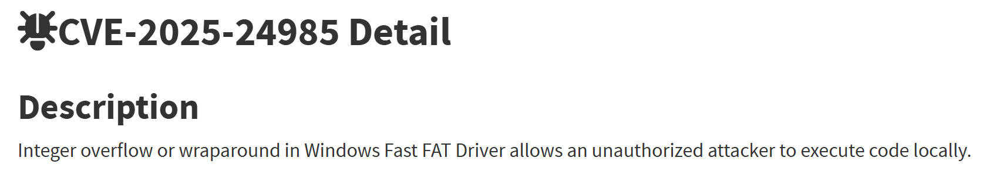
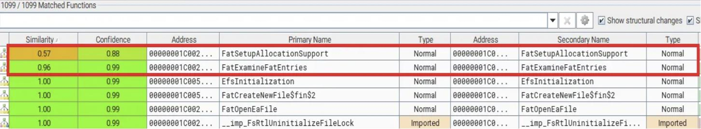
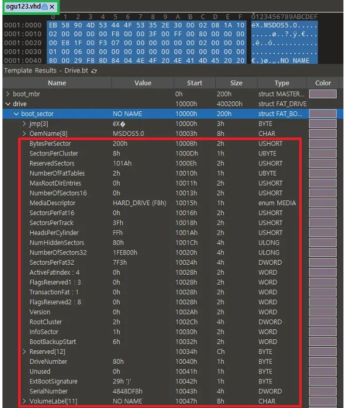
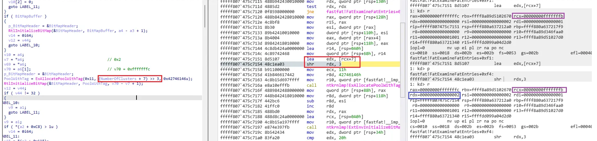
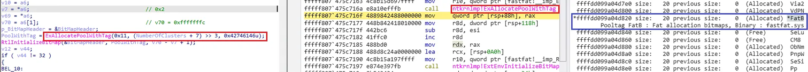

## Introduction


Hello, this is ogu123!

I've been studying 1-day vulnerabilities through the publicly available resources, and I wanted to write my first vulnerability analysis post, so I prepared this one ~~(I don't know if I'll do it in the future, lol)~~

I tried to write the analysis process in detail, and there is also a BSOD PoC, so I recommend you to practice it!

So let's get started!




- https://nvd.nist.gov/vuln/detail/CVE-2025-24985

Once we look at the vulnerability in NVD, we can see that it's an RCE vulnerability due to an Integer overflow in the Windows Fast FAT file system driver.

Now that we have a hint that it's an Integer overflow, let's start diffing!

## Analytics environment

- Windows 10 version 22H2 19045.5854 for x64-based Systems education
    - Version before the vulnerability was patched: fastfat.sys 10.0.19041.5438 (KB5051974)
    - Version after vulnerability patch: fastfat.sys 10.0.19041.5607 (KB5053606)

## Patch Analysis - Before vs After



Looking at the bindiff results, we can see that the `FatSetupAllocationSupport()` and `FatExamineFatEntries()` functions have changed after the patch. ~~(That's only two changes ^^)~~

Let's compare the pre- and post-patch binaries to see what code changes were made to each function!

### FatSetupAllocationSupport()


Above is the patched `FatSetupAllocationSupport()` function, which has been changed to the following.

- Added code to validate for overflow before performing the operation in the red else statement.

### FatExamineFatEntries()


The above is the patched `FatExamineFatEntries()` function, which has been changed to the following.

- If the if statement is true, the value *(a2 + 0x15C) is used as the value of the v47 variable and code has been added to validate
overflow on the v47 variable value.
- If the value of V47 + 7 does not overflow, it is then used as the value for the `ExAllocatePoolWithTag()` function Size.

The function call flow is `FatSetupAllocationSupport()` → `FatExamineFatEntries()`, so we'll analyze the pre-patch binary `FatSetupAllocationSupport()` function from the top-down, but we'll focus on the following points in each function!

- `FatSetupAllocationSupport()`
    - Values used in operations
- `FatExamineFatEntries()`
    - Conditions in an if statement
    - Value *(a2 + 0x15C)

## Vulnerability analysis


First, to analyze the `FatSetupAllocationSupport()` function, we created a random vhd file as shown below!

- File Name: ogu123.vhd
- Disk size: 1 GB
- Disk format: VHD
- Disk type: Fixed size
- Partition format: MBR
- Partition System: FAT32

Before analyzing, you can refer to the following article to learn how to set up kernel debugging! (shout out L0ch!)

- https://hackyboiz.github.io/2021/05/30/l0ch/windows-driver/


After setting up Kernel debugging, we can set a break point in the `FatSetupAllocationSupport()` function and mount the ogu123.vhd file we created earlier, and we can start analyzing!

After analyzing, we see the value inside the else statement as shown above.

In the previously patched binary, code was added to check for overflows before computing, so we checked the vhd file thinking that it was a value that the user could control.



I checked the vhd file and found that the else statement is using a value that exists within drive - boot_sector!

The tip here is to set it to Drive and not VHD in 010 editor Templates so you can see the picture above.


Match the values in the vhd file to the variables to see what it looks like. ~~(It's colorful)~~

- V15 = (NumberOfSector32 - NumberOfFatTables * SectorsPerFat32 - ReservedSectors) /
SectorsPerCluster

If you look at the operation, you can see that it's counting the number of clusters on a FAT file system!

To summarize so far, after the patch, we saw that in the `FatSetupAllocationSupport()` function, code was added to validate the value used in the cluster count computation for overflow, and although not shown in the figure, it stores the number of clusters in ***(a2 + 0x15C)**.

Later, in the `FatExamineFatEntries()` function, in order to use **the number of clusters (*(a2 + 0x15C))** as the size value in the `ExAllocatePoolWithTag()` function, we first need to make sure that the if (*(a2 + 0xC8) <= 1u) statement is true, so let's trace the value *(a2 + 0xC8)!


After analyzing, we found that the if (*(a2 + 0xC8) <= 1u) inside the `FatExamineFatEntries()` function is checked first in the `FatSetupAllocationSupport()` function.

In order for the if ((a2 + 0xC8) <= 1u) statement to be true, we need to use the v35 variable in the if((a2 + 0x168) ... v34 >
0x10000) statement or go into the else statement.

In this case, the value of (a2 + 0x168) must be 0x20 to enter the cluster computation process and since the v34 variable is the number of clusters ((a2 + 0x15c)), we controlled the value of *(a2 + 0xC8) with the v35 variable.

Once I modified the **cluster count to a value of 0xFFFFFFFB**, I went through the process below to make it true in the if (*(a2 + 0xC8) <= 1u) statement.

- v35 = (0xFFFFFFFB + 0xFFFF) = 0xFFFA
- (*(a2 + 0xC8) = 0xFFFA >> 0x10 = 0


After modifying the vhd file as above, the cluster count will have a value of 0xFFFFFFFB after the following operation.

- V15 = (NumberOfSector32 - NumberOfFatTables * SectorsPerFat32 - ReservedSectors) /
SectorsPerCluster
- **0xFFFFFFFB** = ( 0xFFFFFFFF - 0x2 * 0x80000000 - 0x4 ) / 0x1


When you run the modified vhd file, you can see that the overflow within if(*(a2 + 0x168) ... v34 > 0x10000) causes the value of *(a2 + 0xC8) to be zero, making the if statement true and using the NumberOfClusters (0xfffffffb) as the value of the NumberOfClusters variable.



Then, while computing the value of Size in the `ExAllocatePoolWithTag()` function, (NumberOfClusters +7), an overflow occurs, resulting in the value of rdx to be 0x2, and the value of Size finally becomes 0x0 when computing >> 3.



This shows the block information of the memory pool page after running the `ExAllocatePoolWithTag()` function.

You can see that even if the Size value of the `ExAllocatePoolWithTag()` function is 0x0, a Size of 0x20 is allocated to the paged pool.


The allocated region is then initialized as a bitmap with the `RtlInitializeBitMap()` function.

You can see that the `ExAllocatePoolWithTag()` and `RtlInitializeBitMap()` functions map one bit per cluster.

```cpp
while(1){ 
  [...]   
    if ( !v29 && v32 )                          // free -> used 
    { 
      v38 = v7 - v30; 
      if ( v14 ) 
      { 
        *v14 += v38; 
        v10[2] += v38; 
        v17 = v45; 
      } 
      if ( p_BitMapHeader ) 
      { 
        RtlClearBits(p_BitMapHeader, v30 - v69, v38); 
        v17 = v45; 
        v32 = v68; 
        v28 = 0; 
      } 
      v29 = 1; 
      v48 = 1; 
      v30 = v7; 
      v51 = v7; 
    } 
    if ( v29 == 1 && !v32 )                     // used -> free 
    { 
      if ( p_BitMapHeader ) 
      { 
        RtlSetBits(p_BitMapHeader, v30 - v69, v7 - v30); 
        v17 = v45; 
        v28 = 0; 
      } 
      v29 = v28; 
      v48 = v28; 
      v30 = v7; 
      v51 = v7; 
    } 
  [...]   
}
```

After the bitmap initialization, the while statement above detects the change of state of the cluster (free -> used, used ->free) within the vhd file and writes it to the bitmap.

We modify the bitmap using the `RtlClearBits()` and `RtlSetBits()` functions, and we can see that this manages the cluster allocation status.

The while statement runs as many times as the number of clusters (0xfffffffb) to write the bitmap data, Since the bitmap size allocated via the `ExAllocatePoolWithTag()` function is 0x20, the allocated pool area exceeds, causing a kernel pool overflow.

## BSOD Triggers

<iframe width="560" height="315" src="https://www.youtube.com/embed/6ppD0oRZhXU?si=NEvYSd5jf0NMaObw" title="YouTube video player" frameborder="0" allow="accelerometer; autoplay; clipboard-write; encrypted-media; gyroscope; picture-in-picture; web-share" referrerpolicy="strict-origin-when-cross-origin" allowfullscreen></iframe>

If you run the vhd file with the cluster count 0xfffffffb, you can see that the while statement causes an Access Violation due to a kernel pool overflow, resulting in a BSOD. ~~(I had a hard time editing the video…^^)~~

Earlier, we said that the cluster's state change (free -> used, used ->free) is recorded in the bitmap. Yes! Since the user can also control the cluster's state, it is possible to write arbitrary data to the bitmap.

## Exploit


Here we are starting over with the `ExAllocatePoolWithTag()` function to analyze the while statement that records the bitmap data.


Size value overflowed and was allocated to address ffff990e`b8a58c50 by 0x20.


This part is the process of calculating the offset of the clusters present in the VHD file within the while statement.

Since the while statement checks the status information of cluster 2 first, the FAT offset (in FAT32) of the cluster 2 entry can be obtained by the following operation.

- FAT Entry Offset = BytesPerSector x ReservedSectors + (cluster number × 4)
- FAT Entry Offset = 0x200 X 0x4 + ( 0x2 X 0x4 ) = 0x808


If we add the FAT Entry Offset to the Partition Start Offset (0x10000), we get the vhd file 0x10808 offset.
The 0x10808 offset will be the offset of cluster number 2, which is the first cluster we check for status information in the while statement.

The bitmap area (ffff990eb8a58c50) allocated earlier with the `ExAllocatePoolWithTag()` function, where 1 bit indicates the status of cluster 1.
If the 4-byte value of the cluster in the vhd file is 0x00000000, we consider it free and write the corresponding bit in the bitmap to 0x0, and if it is 0x11111111, we consider it used and write it to 0x1.

So, when we processed 8 cluster values in the while statement, we modified the bitmap to have a value of 0x41, starting with cluster state value 2, as shown above.


With the modified vhd file, the while statement works like this

- Currently processed cluster state used, previous cluster state free
    - Write bits to 0x0 for the number of previously free clusters
- Currently processed cluster state FREE, previous cluster state USED
    - Write bit as 0x1 for the number of clusters previously used

So, since the modified vhd file is 0100 0001, we can see that 0x41 is written.

Now that we have proof of writing arbitrary data to the kernel pool area,...we can spray the kernel structures that are allocated in the paged pool and blah blah blah and trigger an RCE!

## Conclusion

I learned a lot about kernel drive analysis, delta patching, etc. while writing this research article, and I think the most memorable part was studying kernel paged pool to try full exploit!

If... I succeed in full exploit, I'll be back with the next article!

Thank you for reading this long post!

