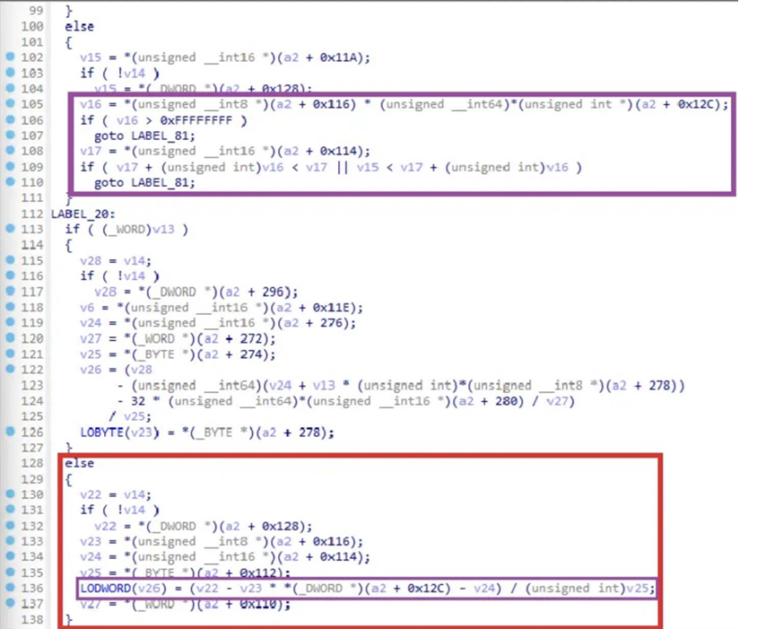
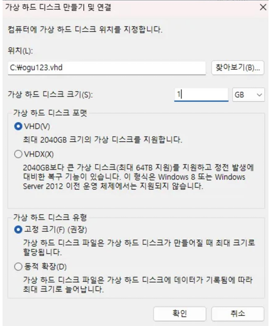
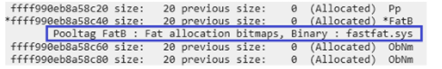
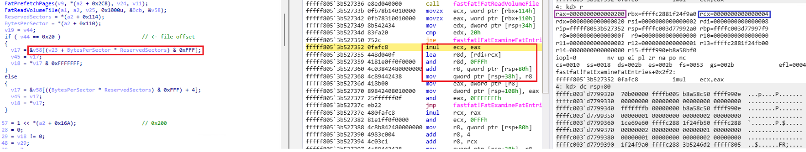

## Introduction


> 미안하다 이거 보여주려고 어그로끌었다.. ogu123 CVE-2025-24985 분석 ㄹㅇ 실화냐? […]
> 

안녕하세요! ogu123입니다!

그동안 공개되어 있는 자료를 통해 1-day 취약점 공부하며 제가 첫 번째로 취약점 분석글을 작성하고 싶다는 생각이 들어 이번 연구글을 준비했습니다! ~~(앞으로도 할지는 모르겠습니다. ㅎㅎ)~~

분석 과정을 자세히 작성하려고 했고 BSOD PoC도 있기 때문에 실습해 보시는 것도 추천드립니다!

그럼 시작하겠습니다!


- https://nvd.nist.gov/vuln/detail/CVE-2025-24985

일단 NVD에서 해당 취약점을 살펴보면 Windows Fast FAT 파일 시스템 드라이버에서 발생한 Integer overflow로 인한 RCE 취약점이라는 것을 알 수 있습니다.

일단 Integer overflow라는 힌트를 얻었고 본격적으로 diffing을 시작해 보겠습니다!

## 분석 환경

- Windows 10 version 22H2 19045.5854 for x64-based Systems education
    - 취약점 패치 이전 버전: fastfat.sys 10.0.19041.5438 (KB5051974)
    - 취약점 패치 이후 버전: fastfat.sys 10.0.19041.5607 (KB5053606)

## 패치 분석


bindiff 결과를 살펴보면 패치 후 `FatSetupAllocationSupport()`, `FatExamineFatEntries()` 함수가 변경되었다는 것을 알 수 있습니다. ~~(두 개밖에 변경이 안되었네요 휴~)~~

그럼 패치 전/후 바이너리를 비교해 각 함수에 어떤 코드 변경점이 있는지 확인해 보겠습니다!

### FatSetupAllocationSupport()



위는 패치가 적용된 `FatSetupAllocationSupport()` 함수로 아래와 같이 변경되었습니다.

- 빨간색 else 문에서 연산을 수행하기 전 overflow를 검증하는 코드가 추가되었습니다.

### FatExamineFatEntries()


위는 패치가 적용된 `FatExamineFatEntries()` 함수로 아래와 같이 변경되었습니다.

- if 문이 true일 경우, *(a2 + 0x15C) 값을 v47 변수 값으로 사용하고 v47 변수 값에 overflow를 검증하는 코드가 추가되었습니다.
- 이후 V47 + 7 값에서 overflow가 발생하지 않는다면 `ExAllocatePoolWithTag()` 함수 Size 값으로 사용됩니다.

함수 호출 과정은 `FatSetupAllocationSupport()` →  `FatExamineFatEntries()`이므로 패치 전 바이너리 `FatSetupAllocationSupport()` 함수부터 Top-down으로 분석하되 각 함수에서 아래 내용을 위주로 살펴보겠습니다!

- `FatSetupAllocationSupport()`
    - 연산에 사용되는 값
- `FatExamineFatEntries()`
    - if 문의 조건
    - *(a2 + 0x15C) 값

## 취약점 분석



먼저 `FatSetupAllocationSupport()` 함수를 분석하기 위해 아래와 같이 임의의 vhd 파일을 생성했습니다!

- 파일명: ogu123.vhd
- 디스크 크기: 1GB
- 디스크 포맷: VHD
- 디스크 유형: 고정 크기
- 파티션 형식: MBR
- 파티션 시스템: FAT32

분석 전, Kernel 디버깅 세팅 과정은 아래 연구글을 참고하시면 됩니다!(샤라웃 L0ch)

- https://hackyboiz.github.io/2021/05/30/l0ch/windows-driver/


Kernel 디버깅 세팅 후 `FatSetupAllocationSupport()` 함수에 break point를 걸고 앞서 생성한 ogu123.vhd 파일을 마운트 시키면 분석을 시작할 수 있습니다!

분석 결과 else 문내에 값을 위와 같이 확인했습니다.

앞서 패치된 바이너리에서는 연산하기 전 overflow를 검증하는 코드가 추가되었기 때문에 유저가 컨트롤할 수 있는 값이라는 생각으로 vhd 파일을 확인했습니다.


vhd 파일 확인한 결과 drive - boot_sector 내에 존재하는 값을 else 문에서 사용하는 것을 확인했습니다..!

여기서 tip은 010 editor Templates에서 VHD가 아닌 Drive로 설정하셔야 위 그림을 확인할 수 있습니다.


vhd 파일에 있는 값을 변수에 매칭 시켜 확인해 위 그림과 같습니다. ~~(알록달록하네요 ㅎㅎ)~~

- V15 = (NumberOfSector32 - NumberOfFatTables * SectorsPerFat32 - ReservedSectors) /
SectorsPerCluster

연산을 보면 FAT 파일 시스템에서 클러스터 수를 계산하는 과정이라는 것을 알 수 있습니다!

지금까지 내용을 정리하면 패치 후 `FatSetupAllocationSupport()` 함수에서 클러스터 수 연산에 사용되는 값에 overflow를 검증하는 코드가 추가되었고, 그림에는 없지만 클러스터 수를 *(a2 + 0x15C)에 저장한다는 것을 확인했습니다.

이후 `FatExamineFatEntries()` 함수에서 `ExAllocatePoolWithTag()` 함수 size 값으로 클러스터 수(*(a2 + 0x15C))를 사용하기 위해서는 먼저 if (*(a2 + 0xC8) <= 1u) 문에서 true가 되어야 하므로 *(a2 + 0xC8) 값을 추적해 보겠습니다!


분석 결과 `FatExamineFatEntries()` 함수 내에 있는 if (*(a2 + 0xC8) <= 1u)을 `FatSetupAllocationSupport()` 함수에서 먼저 확인한다는 것을 알았습니다.

if (*(a2 + 0xC8) <= 1u) 문이 true가 되기 위해서는 if(*(a2 + 0x168) … v34 > 0x10000) 문에서 v35 변수를 사용하거나 else 문에 들어가야 합니다.

이때, 클러스터 연산 과정에 들어가기 위해서 *(a2 + 0x168) 값이 0x20이어야만 하고, v34 변수는 클러스터 수(*(a2 + 0x15c))이기 때문에 *(a2 + 0xC8) 값을 v35 변수로 컨트롤했습니다.

**클러스터 수를 0xFFFFFFFB 값**으로 수정하면 아래 과정을 거쳐 if (*(a2 + 0xC8) <= 1u) 문에서 true가 되도록 했습니다.

- v35 = (0xFFFFFFFB + 0xFFFF) = 0xFFFA
- (*(a2 + 0xC8) = 0xFFFA >> 0x10 = 0


vhd 파일을 위와 같이 수정하면, 아래 연산을 거쳐 **클러스터 수가 0xFFFFFFFB 값**을 가지게 됩니다.

- V15 = (NumberOfSector32 - NumberOfFatTables * SectorsPerFat32 - ReservedSectors) /
SectorsPerCluster
- **0xFFFFFFFB** = ( 0xFFFFFFFF - 0x2 * 0x80000000 - 0x4 ) / 0x1


수정된 vhd 파일을 실행하면 if(*(a2 + 0x168) … v34 > 0x10000) 내에서 overflow로 인해 *(a2 + 0xC8) 값이 0 이되어 if 문이 true로, 클러스터 수(0xfffffffb)를 NumberOfClusters 변수 값으로 사용하는 것을 확인할 수 있습니다.


이후 `ExAllocatePoolWithTag()` 함수 Size 값을 연산하는 과정으로 (NumberOfClusters + 7) 연산 시 overflow가 발생해 rdx 값이 0x2가 되고 >> 3 연산 시 최종적으로 Size 값은 0x0이 됩니다.


`ExAllocatePoolWithTag()` 함수 실행 후 메모리 pool 페이지의 블록 정보를 확인한 모습입니다.
`ExAllocatePoolWithTag()` 함수의 Size 값이 0x0 이여도 0x20만큼의 Size가 paged pool에 할당되는 것을 확인할 수 있습니다.


이후 할당한 영역은 `RtlInitializeBitMap()` 함수를 통해 비트맵으로 초기화됩니다.

`ExAllocatePoolWithTag()` 와 `RtlInitializeBitMap()` 함수를 통해 클러스터 1개당 1비트씩 매핑하는 과정임을 알 수 있습니다.

```cpp
while(1){ 
  [...]   
    if ( !v29 && v32 )                          // free -> used 
    { 
      v38 = v7 - v30; 
      if ( v14 ) 
      { 
        *v14 += v38; 
        v10[2] += v38; 
        v17 = v45; 
      } 
      if ( p_BitMapHeader ) 
      { 
        RtlClearBits(p_BitMapHeader, v30 - v69, v38); 
        v17 = v45; 
        v32 = v68; 
        v28 = 0; 
      } 
      v29 = 1; 
      v48 = 1; 
      v30 = v7; 
      v51 = v7; 
    } 
    if ( v29 == 1 && !v32 )                     // used -> free 
    { 
      if ( p_BitMapHeader ) 
      { 
        RtlSetBits(p_BitMapHeader, v30 - v69, v7 - v30); 
        v17 = v45; 
        v28 = 0; 
      } 
      v29 = v28; 
      v48 = v28; 
      v30 = v7; 
      v51 = v7; 
    } 
  [...]   
}
```

비트맵 초기화 이후 위 while 문에서 vhd 파일 내에 클러스터의 상태 변화(free -> used, used -> free)를 탐지하여 비트맵에 기록합니다. 

`RtlClearBits()`와 `RtlSetBits()` 함수를 사용해 비트맵을 수정하며, 이를 통해 클러스터 할당 상태를 관리한다는 것을 알 수 있습니다.

이때 while 문은 클러스터 수(0xfffffffb) 만큼 실행되면서 비트맵 데이터를 write 하는데, `ExAllocatePoolWithTag()` 함수를 통해 할당된 비트맵 크기가 0x20이므로 할당된 pool 영역을 넘어 Kernel pool overflow가 발생합니다.

## BSOD 트리거

<iframe width="560" height="315" src="https://www.youtube.com/embed/6ppD0oRZhXU?si=NEvYSd5jf0NMaObw" title="YouTube video player" frameborder="0" allow="accelerometer; autoplay; clipboard-write; encrypted-media; gyroscope; picture-in-picture; web-share" referrerpolicy="strict-origin-when-cross-origin" allowfullscreen></iframe>

클러스터 수가 0xfffffffb인 vhd 파일을 실행할 경우, while 문에서 Kernel pool overflow로 인해 Access Violation이 발생해 BSOD가 터지는 걸 확인할 수 있습니다. ~~(영상 편집하느라 힘들었습니다..)~~

앞서 클러스터의 상태 변화(free -> used, used ->free)를 비트맵에 기록한다고 했습니다. 그렇다면! 유저가 클러스터의 상태도 컨트롤할 수 있기 때문에 비트맵에 임의의 데이터 write가 가능합니다.

## Exploit


비트맵 데이터를 기록하는 while 문을 분석하기 위해 `ExAllocatePoolWithTag()` 함수부터 다시 시작한 모습입니다.



Size 값 overflow로 인해 0x20만큼 ffff990e`b8a58c50 주소에 할당되었습니다.



해당 부분은 while 문 내에서 vhd 파일에 존재하는 클러스터의 offset을 계산하는 과정입니다.

while 문에서는 2번 클러스터의 상태 정보부터 확인하기 때문에, 2번 클러스터 엔트리의 FAT Offset (FAT32 기준)은 아래 연산을 통해 구할 수 있습니다.

- FAT Entry Offset = BytesPerSector x ReservedSectors + (클러스터 번호 × 4)
- FAT Entry Offset = 0x200 X 0x4 + ( 0x2 X 0x4 ) = 0x808


Partition Start Offset(0x10000)에 FAT Entry Offset을 더하면, vhd 파일 0x10808 offset를 얻을 수 있습니다. 0x10808 offset은 while 문에서 첫 번째로 상태 정보를 확인하는 2번 클러스터의 offset이 됩니다.

앞서 `ExAllocatePoolWithTag()` 함수로 할당된 비트맵 영역(ffff990e`b8a58c50)은 1 bit가 1 클러스터의 상태를 나타냅니다. vhd 파일에서 클러스터의 4바이트 값이 0x00000000이면 free로 간주하여 비트맵의 해당 bit를 0x0으로, 0x11111111이면 used로 간주하여 0x1로 write 합니다.

따라서, while 문에서 8개의 클러스터 값을 처리했을 때, 비트맵이 0x41 값을 가지도록 위 그림과 같이 2번 클러스터 상태 값부터 차례대로 수정했습니다.


수정된 vhd 파일을 통해 while 문은 아래와 같이 동작합니다.

- 현재 처리되는 클러스터 상태 used, 이전 클러스터 상태 free
    - 이전에 free된 클러스터 개수만큼 bit를 0x0으로 기록
- 현재 처리되는 클러스터 상태 free, 이전 클러스터 상태 used
    - 이전에 used된 클러스터 개수만큼 bit를 0x1으로 기록

따라서, 수정된 vhd 파일은 0100 0001이므로 0x41이 write 되는 것을 확인할 수 있습니다.

Kernel pool 영역에 임의의 데이터 write 증명이 되었으니.. 이제 paged pool에 할당되는 Kernel 구조체를 spray 해서 이러쿵 저러쿵하면 RCE를 트리거 할 수 있습니다! ~~(아몰랑 도망가~)~~

## 마무리

이번 연구글을 작성하면서 커널 드라이브 분석, 델타 패치 등등 많은 것을 배울 수 있었고 특히 풀익스를 해보려고 kernel paged pool 공부를 한 게 가장 기억에 남는 거 같습니다 ㅎㅎ

만약… 풀익스에 성공한다면 다음 연구글로 돌아오도록 하겠습니다!

긴 글 읽어주셔서 감사합니다!

