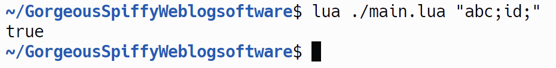
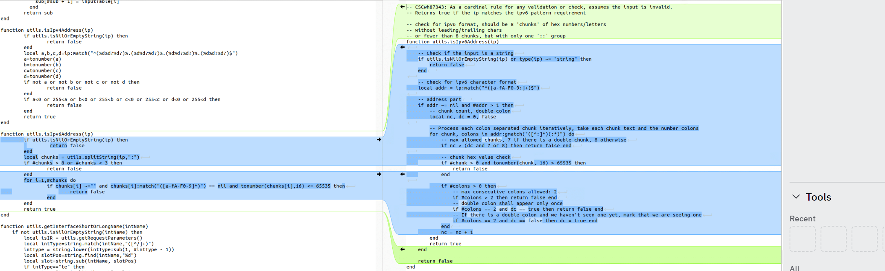

## URL

[Analysis of Unauthenticated Command Execution Vulnerability in Cisco IOS XE System WebUI](https://paper.seebug.org/3073/)

## Target

- Cisco IOS XE Software < 17.9.4a

## Explain

CVE-2023-20273은 Cisco 라우터 및 특정 스위치에서 사용되는 IOS XE Software의 운영체제에서 발견된 취약점으로 Web UI 기능이 활성화된 모든 장비에 영향을 미칩니다.

취약점은 IPv6 주소 필터링 부분에서 부족한 검증으로 인해 command injection 취약점이 발생했습니다.


```
function utils.isIpv6Address(ip)
    if utils.isNilOrEmptyString(ip) then
                 return false
        end
        local chunks = utils.splitString(ip,":")
        if #chunks > 8 or #chunks < 3 then
                return false
        end
        for i=1,#chunks do
                if chunks[i] ~="" and chunks[i]:match("([a-fA-F0-9]*)") == nil and tonumber(chunks[i],16) <= 65535 then
                        return false
                end
        end
        return true
end
```
`isIpv6Address` 함수에는 인자값(`ip`)이 유효한 IPv6 주소인지 다양한 검증을 통해 확인합니다.
취약점은 정규식인 `chunks[i]:match("([a-fA-F0-9]*)")` 코드에서 발생했습니다.

해당 정규식에서 끝 문자에 대한 제한이 없어 앞 부분이 정규식과 일치하면 해당 검증을 우회할 수 있습니다.


```
/* main.lua */

local arg1 = arg[1]
local isValid = arg1:match("([a-fA-F0-9]*)") ~= nil
print(isValid)
```


테스트 결과, `abc;id;` 문자열이 정규식 패턴과 일치하여 `true` 가 출력되었습니다.

이를 이용하여 조작된 `ip`를 통해 총 세가지 파일(`snortcheck.lua`, `softwareMgmt.lua`, `softwareUpgrade.lua` )에서 command injection이 발생할 수 있습니다.



해당 패치는 정규식을 `ip:match("^([a-fA-F0-9:]+)$")`로 수정하여 문자열의 처음부터(`^`) 끝(`\$`)까지 16진수 문자로만 이루어져 있는지 검사하도록 변경되었습니다.


## Reference

- [Cisco Security Advisory](https://sec.cloudapps.cisco.com/security/center/content/CiscoSecurityAdvisory/cisco-sa-iosxe-webui-privesc-j22SaA4z)
- [Theori Security Assessment](https://blog.theori.io/2023-h2-hot-security-issue-case-ec54369d1886)