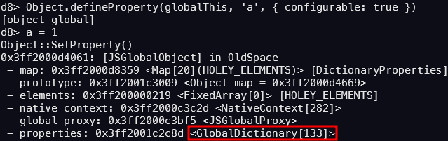
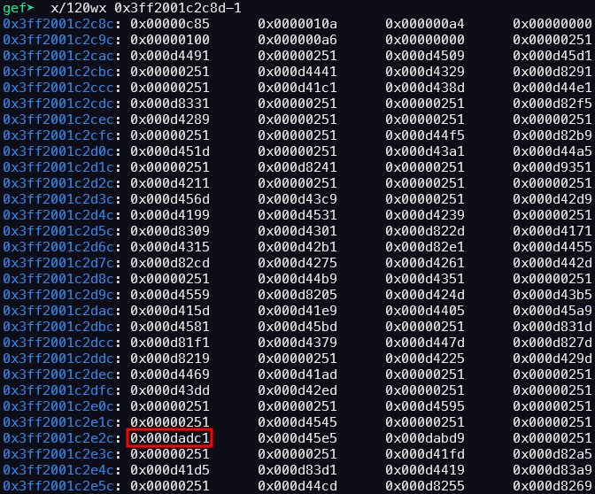
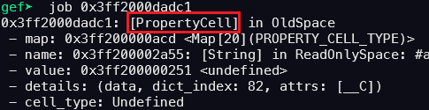
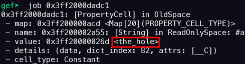

## URL

[Google Chrome Vulnerability: CVE-2023-2033 Type Confusion in V8](https://bugs.chromium.org/p/chromium/issues/detail?id=1432210)

## Target

- Chrome < 112.0.5615.121

## Explain

CVE-2023-2033은 Chrome 브라우저에서 사용되는 V8 엔진의 `type confusion` 취약점으로, 2022년에 발견된 CVE-2022-1096, CVE-2022-1364, CVE-2022-3723, CVE-2022-4262와 유사한 특징을 가지고 있습니다.


[패치](https://chromium.googlesource.com/v8/v8/+/fa81078cca6964def7a3833704e0dba7b05065d8%5E%21/)를 분석해 보면, `JSGlobalProxy`가 `Error.captureStackTrace()`의 인자로 전달될 경우 **undefined**를 반환하도록 변경되었습니다.

패치 이전에는 `JSGlobalProxy`가 `Error.captureStackTrace()`의 인자로 전달될 경우 `JSGlobalObject`에 **stack**과 **error_stack_symbol** 두 개의 속성이 추가되어 취약점이 발생했습니다.



JSGlobalObject는 속성들을 GlobalDictionary 형식으로 관리하며, 각 속성은 PropertyCell의 형태로 저장됩니다.



위는 **GlobalDictionary**에서 속성들에 **PropertyCell**의 주소입니다.

포인터 압축으로 인해, `JSGlobalObject`의 `a` 속성 실제 **PropertyCell**의 주소는 `0x3ff2000dadc1`입니다.



JSGlobalObject의  a 속성을 삭제하면 GlobalDictionary에서 해당 PropertyCell의 주소는 삭제되지만, PropertyCell 자체는 메모리에 남아 있고, value만 the_hole로 변경됩니다.



delete a를 통해 value 값이 the_hole로 변경되었음을 확인할 수 있습니다.


```
/* v8/src/compiler/js-native-context-specialization.cc */

        value = effect = graph()->NewNode(
            simplified()->LoadField(ForPropertyCellValue(
                representation, property_cell_value_type, map, name)),
            jsgraph()->Constant(property_cell, broker()), effect, control);
```
v8 엔진의 최적화를 담당하는 **Turbofan**은 함수를 컴파일할 때, 전역 변수(`JSGlobalObject`의 속성)에 접근을 `JSNativeContextSpecialization::ReduceGlobalAccess()`에서 처리합니다.

이때, 만약 `cell_type` 이 `kMutable`이라면 **PropertyCell**의 주소를 상수(`HeapConstant`)로 처리하고, 이 주소를 통해 **value**에 직접 접근하도록 최적화됩니다.

따라서, `Error.captureStackTrace()`의 인자로 `JSGlobalProxy`를 전달하여 `JSGlobalObject` 속성에 **stack**과 **error_stack_symbol** 추가한 뒤, **stack**의 **value**를 1에서 {}로 바꾸어 `type confusion`을 일으키면 `cell_type` 이 `kMutable` 이 되고, **Turbofan**에 의해 최적화된 뒤 **stack** 속성을 삭제하면 **stack**의 **value**는 `the_hole`로 변합니다. 

이후, 변수 **stack**에 접근하여 `the_hole`를 얻어내어 이를 이용하면 취약점을 발생시킬 수 있습니다.

해당 취약점은 공격자가 제작한 악성 HTML 페이지에 타겟이 엑세스하는 경우 원격 코드 실행이 트리거됩니다.

## Reference

- [CVE-2023-2033](https://cwresearchlab.co.kr/entry/CVE-2023-2033-JIT-optimisation-issue)