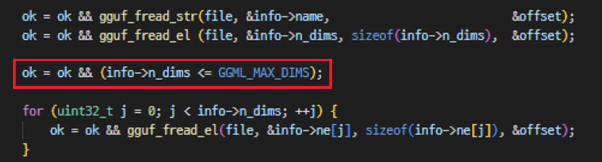

## URL

https://talosintelligence.com/vulnerability_reports/TALOS-2024-1914

## Target

- llama.cpp 18c2e17 커밋

## Explain

대규모 언어 모델 LLama에서 Heap Buffer Overflow 취약점이 발견되었습니다.

취약점은 LLM 모델을 저장하는 gguf 파일을 파싱 하는 `gguf_init_from_file` 함수에서 발생했습니다.

```
struct gguf_context * gguf_init_from_file(const char * fname, struct gguf_init_params params) {
    FILE * file = fopen(fname, "rb");
    if (!file) {
        return NULL;
    }
    [...]
    
    struct gguf_context * ctx = GGML_ALIGNED_MALLOC(sizeof(struct gguf_context));

    // read the header
    {
        [...]

        ctx->kv    = NULL;
        ctx->infos = NULL;
        ctx->data  = NULL;

        ok = ok && gguf_fread_el(file, &ctx->header.version,   sizeof(ctx->header.version),   &offset);
        ok = ok && gguf_fread_el(file, &ctx->header.n_tensors, sizeof(ctx->header.n_tensors), &offset);
        ok = ok && gguf_fread_el(file, &ctx->header.n_kv,      sizeof(ctx->header.n_kv),      &offset);

        [...]
    }

    // read the tensor infos
    {
        ctx->infos = malloc(ctx->header.n_tensors * sizeof(struct gguf_tensor_info));

        for (uint64_t i = 0; i < ctx->header.n_tensors; ++i) {
            struct gguf_tensor_info * info = &ctx->infos[i];

            for (int j = 0; j < GGML_MAX_DIMS; ++j) {
                 info->ne[j] = 1;
            }

            ok = ok && gguf_fread_str(file, &info->name,                          &offset);
            ok = ok && gguf_fread_el (file, &info->n_dims, sizeof(info->n_dims),  &offset);
            for (uint32_t j = 0; j < info->n_dims; ++j) {
                 ok = ok && gguf_fread_el(file, &info->ne[j], sizeof(info->ne[j]), &offset);
            }
            ok = ok && gguf_fread_el (file, &info->type,   sizeof(info->type),    &offset);
            ok = ok && gguf_fread_el (file, &info->offset, sizeof(info->offset),  &offset);
            [...]
        }
        [...]
    }
    [...]
}
```

`gguf_init_from_file` 함수는 gguf 파일을 읽어 해당 파일의 내용으로 `gguf_context` 구조체를 초기화합니다.

gguf 파일은 Header, Tensor Info, Tensor Data 세 부분으로 나뉘며, 취약점은 Tensor Info를 파싱 하는 과정에서 발생했습니다.

```
ctx->infos = malloc(ctx->header.n_tensors * sizeof(struct gguf_tensor_info));
```

Tensor Info 파싱 코드를 확인하면,  gguf 파일에서 읽은 `ctx->header.n_tensors` 값에 따라 `gguf_tensor_info` 구조체 배열의 메모리가 할당됩니다. 

```
for (uint64_t i = 0; i < ctx->header.n_tensors; ++i) {

	 struct gguf_tensor_info * info = &ctx->infos[i];
	 for (int j = 0; j < GGML_MAX_DIMS; ++j) {
	     info->ne[j] = 1;
	 }
}
```

`gguf_tensor_info` 구조체 배열을 가리키는 `info` 포인터를 통해 `info->ne` 배열은 모두 1로 초기화됩니다.

```
ok = ok && gguf_fread_str(file, &info->name, &offset);
ok = ok && gguf_fread_el(file, &info->n_dims, sizeof(info->n_dims), &offset);
for (uint32_t j = 0; j < info->n_dims; ++j) {
    ok = ok && gguf_fread_el(file, &info->ne[j], sizeof(info->ne[j]), &offset);
}
```

gguf 파일에서 읽은 `info->n_dims` 값만큼 반복문을 통해 데이터를 읽어와 `info->ne` 배열에 넣습니다. 

만약, `uint32_t` 자료형인 `info->n_dims` 값으로 음수를 전달하면 integer underflow가 발생해 `info->ne` 배열의 범위를 넘어 Heap Buffer Overflow을 트리거 할 수 있습니다.

따라서, 공격자는 `info->n_dims` 값을 `GGML_MAX_DIMS` 값보다 크게 설정한 gguf 파일을 통해 임의의 코드를 실행할 수 있습니다.



해당 취약점은 `info->n_dims` 값을 검증하는 코드가 추가되어 패치 되었습니다.

## Reference

- https://github.com/ally-petitt/CVE-2024-27632?tab=readme-ov-file