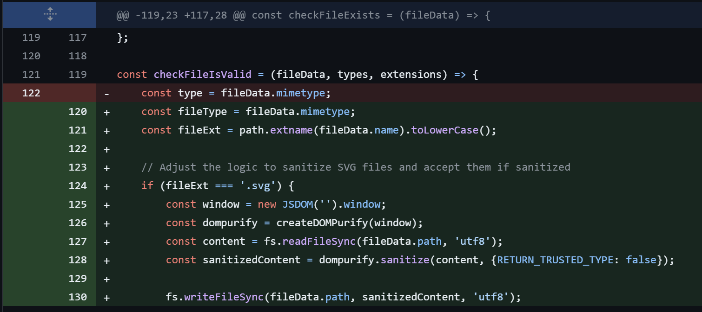

## URL

https://rhinosecuritylabs.com/research/cve-2024-23724-ghost-cms-stored-xss/

## Target

- Ghost CMS <= 5.76.0

## Explain

Apple, Mozilla, Open AI에서 사용하는 오픈 소스 블로깅 플랫폼 Ghost에서 Stored XSS 취약점이 발견되었습니다.

취약점은 사용자가 SVG 파일을 업로드할 때 파일 내용을 검증하지 않아 발생했습니다.


Ghost CMS는 사용자 프로필 이미지로 SVG 파일을 사용합니다. SVG는 XML 기반 이미지 파일로, JavaScript 코드를 포함할 수 있습니다.

따라서, 공격자는 SVG 파일 내에 악의적인 JavaScript 코드를 삽입하고, 다른 사용자가 이미지를 접근할 때 코드가 실행되는 방식으로 공격을 할 수 있습니다.

```
<?xml version="1.0" standalone="no"?>
<!DOCTYPE svg PUBLIC "-//W3C//DTD SVG 1.1//EN" "http://www.w3.org/Graphics/SVG/1.1/DTD/svg11.dtd">
<svg version="1.1" baseProfile="full" xmlns="http://www.w3.org/2000/svg">
   <rect width="300" height="100" style="fill:rgb(0,0,255);stroke-width:3;stroke:rgb(0,0,0)" />
   <script type="text/javascript">
      alert(document.domain);
   </script>
</svg>
```

공격자 이미지 파일에 접근할 경우 SGV 파일에 JavaScript 코드가 실행되는 것을 확인할 수 있습니다.


[PoC](https://github.com/RhinoSecurityLabs/CVEs/blame/master/CVE-2024-23724/boilerplate.svg)를 통해 가장 낮은 권한인 Contributors에서 Owner 권한을 탈취할 수 있습니다.

Owner는 결제 정보에 접근 가능하며 삭제할 수 없는 계정으로, 여러 Administrators 중 한 명만 Owner 권한을 가질 수 있습니다.

공격자는 Owner에게 프로필 URL을 전달함으로써, Contributors에서 Administrators 권한을 얻은 뒤, 최종적으로 Owner 권한까지 탈취할 수 있습니다.


해당 취약점은 벤더 측에서 인정하지 않아 공식적인 패치를 제공하지 않지만, 취약점 제보자가 DOMPurify 라이브러리를 통해 SVG 파일 내용을 검증하는 코드가 추가하여 패치했습니다.

## Reference

- [CVE-2024-23724 patch](https://github.com/TryGhost/Ghost/pull/19646/files)