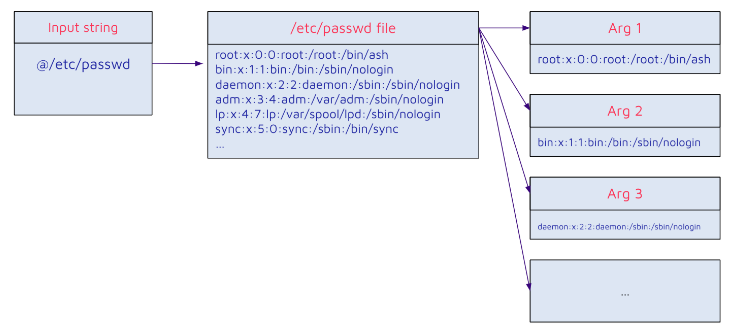
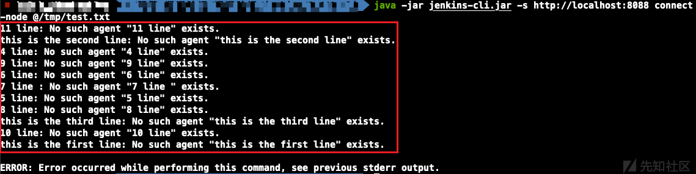

## URL

[Uncovering Critical Security Vulnerabilities in Jenkins](https://www.sonarsource.com/blog/excessive-expansion-uncovering-critical-security-vulnerabilities-in-jenkins/)

## Target

- Jenkins versions ≤ 2.441
- Jenkins LTS versions ≤ 2.426.2

## Explain

소프트웨어 개발에 사용되는 Jenkins에서 임의의 파일을 읽을 수 있는 취약점이 발견되었습니다.

취약점은 jenkins CLI 명령어에 사용된 인자를 파싱 하는 과정에서 발생합니다.

```
public void parseArgument(String... args) throws CmdLineException {
    Utilities.checkNonNull(args, name:"args");
    String[] expandedArgs = args;    // expandedArgs : ["@/etc/passwd"]
    if (this.parserProperties.getAtSyntax()) {
         expandedArgs = this.expandAtFiles(args);  // args: ["@/etc/passwd"]
    }
```
`parseArgument` 함수를 통해 CLI 명령어에 사용된 인자를 파싱 합니다.

기본적으로 `getAtSyntax`는 true로 설정되어 있어 `expandAtFiles` 함수가 이어서 실행됩니다.

```
private String[] expandAtFiles(String args[]) throws CmdLineException {
    List<String> result = new ArrayList<String>();
    for (String arg : args) {
        if (arg.startsWith("@")) {
            File file = new File(arg.substring(1));
            if (!file.exists())
                throw new CmdLineException(this,Messages.NO_SUCH_FILE,file.getPath());
            try {
                result.addAll(readAllLines(file));
            } catch (IOException ex) {
                throw new CmdLineException(this, "Failed to parse "+file,ex);
            }
        } else {
            result.add(arg);
        }
    }
    return result.toArray(new String[result.size()]);
}
```
`expandAtFiles` 함수는 인자가 `@`로 시작하는지 확인하고, `@` 이후 경로에 있는 파일 내용을 읽은 후 각각의 줄은 새로운 인자로 확장합니다.

이를 그림으로 표현하면 아래와 같습니다.


따라서, 공격자가 jenkins CLI 명령어를 통해 `expandAtFiles` 함수를 호출하고 인자를 제어할 수 있다면, 임의의 파일을 읽을 수 있는 취약점이 발생합니다.

```
@Extension
public class ConnectNodeCommand extends CLICommand {
  @Argument(
            metaVar = "NAME",
            usage = "Agent name, or empty string for built-in node; comma-separated list is supported",
            required = true,
            multiValued = true
  ) 
```
`connect-node`는 Jenkins 서버에 있는 노드를 연결하는 CLI 명령어입니다.

연결하는 노드명을 인자에서 받아오고 연결에 실패할 경우 에러 메시지를 출력합니다.

이때, 에러 메시지에는 해당 노드명이 포함되기 때문에 공격자가 파일의 내용을 노드명으로 구성한다면 임의의 파일 읽기 취약점을 트리거 할 수 있습니다.


`/tmp/test.txt` 파일 각각의 줄이 노드명으로 해석되고 연결에 실패하여 파일 내용을 확인할 수 있습니다.

따라서, 공격자는 취약점을 통해 /etc/passwd, /etc/shadow, SSH keys와 같은 서버에 저장된 민감한 파일을 읽을 수 있습니다.
```
+  public static boolean ALLOW_AT_SYNTAX = SystemProperties.getBoolean(CLICommand.class.getName() + ".allowAtSyntax");
//...
-    return new CmdLineParser(this);
+    ParserProperties properties = ParserProperties.defaults().withAtSyntax(ALLOW_AT_SYNTAX);
+    return new CmdLineParser(this, properties);
```
해당 취약점은 expandAtFiles 기능을 비활성화하는 것으로 패치되었습니다.


## Reference

- [CVE-2024-23897](https://xz.aliyun.com/t/13507?time__1311=mqmxnQiQi%3DDQ0%3DKDs%3DOScK%3Dq7KG%3DqztC4D&alichlgref=https%3A%2F%2Fwww.google.com%2F)